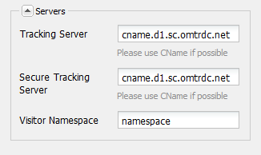

# Verbinding maken met Adobe Analytics en frameworks maken {#connecting-to-adobe-analytics-and-creating-frameworks}

Als u webgegevens van uw AEM-pagina&#39;s wilt bijhouden in Adobe Analytics, maakt u een configuratie voor Adobe Analytics-Cloud Servicen en een Adobe Analytics-framework:

* **Adobe Analytics-configuratie:** De informatie over uw Adobe Analytics-account. Met de Adobe Analytics-configuratie kan AEM verbinding maken met Adobe Analytics. Maak een Adobe Analytics-configuratie voor elk account dat u gebruikt.
* **Adobe Analytics Framework:** Een set toewijzingen tussen eigenschappen van Adobe Analytics-rapportsuite en CQ-variabelen. Gebruik een framework om te configureren hoe uw websitegegevens uw Adobe Analytics-rapporten vullen. Frameworks zijn gekoppeld aan een Adobe Analytics-configuratie. U kunt veelvoudige kaders voor elke configuratie tot stand brengen.

Wanneer u een webpagina aan een framework koppelt, wordt de webpagina en de onderliggende pagina van die pagina bijgehouden. Paginaweergaven kunnen vervolgens worden opgehaald uit Adobe Analytics en worden weergegeven in de Sites-console.

## Vereisten {#prerequisites}

### Adobe Analytics-account {#adobe-analytics-account}

Als u AEM-gegevens wilt bijhouden in Adobe Analytics, moet u over een geldige Adobe Marketing Cloud beschikken voor een Adobe Analytics-account.

De Adobe Analytics-account moet:

* beschikken over **beheerdersrechten**
* Ben toegewezen aan de de gebruikersgroep van de Toegang **van de Dienst van het** Web.

>[!CAUTION]
>
>Het opgeven van **beheerdersrechten** (in Adobe Analytics) is niet voldoende om een gebruiker in staat te stellen verbinding te maken met AEM en Adobe Analytics. De rekening moet de voorrechten van de Toegang **van de** Dienst van het Web ook hebben.

Voordat u verdergaat, moet u ervoor zorgen dat u zich bij Adobe Analytics kunt aanmelden. Via:

* [https://marketing.adobe.com](https://marketing.adobe.com)

* [https://sc.omniture.com/login/](https://sc.omniture.com/login/)

### AEM configureren voor gebruik van uw Adobe Analytics-datacenters {#configuring-aem-to-use-your-adobe-analytics-data-centers}

Adobe Analytics- [datacenters](https://developer.omniture.com/en_US/content_page/concepts-terminology/c-how-is-data-stored) verzamelen, verwerken en opslaan de gegevens die aan uw Adobe Analytics-rapportsuite zijn gekoppeld. U moet AEM configureren om het datacenter te gebruiken dat als host fungeert voor uw Adobe Analytics-rapportsuite. In de volgende tabel staan de beschikbare datacenters en de bijbehorende URL.

| Datacenter | URL |
|---|---|
| San Jose | https://api.omniture.com/admin/1.4/rest/ |
| Dallas | https://api2.omniture.com/admin/1.4/rest/ |
| Londen | https://api3.omniture.com/admin/1.4/rest/ |
| Singapore | https://api4.omniture.com/admin/1.4/rest/ |
| Oregon | https://api5.omniture.com/admin/1.4/rest/ |

AEM gebruikt standaard het datacenter van San Jose (https://api.omniture.com/admin/1.4/rest/).

Met de [webconsole configureert u de OSGi-bundel](/help/sites-deploying/configuring-osgi.md#osgi-configuration-with-the-web-console) **Adobe AEM Analytics HTTP Client**. Voeg de URL **van het** datacenter toe voor het datacenter dat fungeert als host voor een rapportenpakket waarvoor uw AEM-pagina&#39;s gegevens verzamelen.

1. Open de webconsole in uw webbrowser. ([https://localhost:4502/system/console/configMgr](https://localhost:4502/system/console/configMgr))
1. Ga uw geloofsbrieven in om tot de console toegang te hebben.

   >[!NOTE]
   >
   >Neem contact op met de sitebeheerder om te weten te komen of u toegang hebt tot deze console.

1. Selecteer het Configuration-item genaamd **Adobe AEM Analytics HTTP Client**.
1. Als u de URL voor een datacenter wilt toevoegen, drukt u op + naast de lijst URL&#39;s van **datacenter** en typt u de URL in het vak.

1. Als u een URL uit de lijst wilt verwijderen, klikt u op de knop - naast de URL.
1. Klik op Opslaan.

## De verbinding met Adobe Analytics configureren {#configuring-the-connection-to-adobe-analytics}

>[!CAUTION]
>
>Vanwege beveiligingswijzigingen in de Adobe Analytics API is het niet langer mogelijk de versie van de Activity Map te gebruiken die in AEM is opgenomen.
>
>De [ActivityMap-plug-in van Adobe Analytics](https://docs.adobe.com/content/help/en/analytics/analyze/activity-map/getting-started/get-started-users/activitymap-install.html) moet nu worden gebruikt.

## Configureren voor de Activity Map {#configuring-for-the-activity-map}

>[!CAUTION]
>
>Vanwege beveiligingswijzigingen in de Adobe Analytics API is het niet langer mogelijk de versie van de Activity Map te gebruiken die in AEM is opgenomen.
>
>De [ActivityMap-plug-in van Adobe Analytics](https://docs.adobe.com/content/help/en/analytics/analyze/activity-map/getting-started/get-started-users/activitymap-install.html) moet nu worden gebruikt.

## Een Adobe Analytics-framework maken {#creating-a-adobe-analytics-framework}

Voor identiteitskaart van de Reeks van het Rapport (RSID) die u gebruikt, kunt u controleren welke serverinstanties (auteur, publiceert, of allebei) gegevens aan de Reeks van het Rapport bijdragen:

* **Alles**: De informatie van zowel de auteur als de publicatieinstantie vult de Reeks van het Rapport.
* **Auteur**: Alleen informatie van de auteur wordt in de rapportsuite ingevuld.
* **Publiceren**: Alleen informatie uit de publicatieversie wordt in de rapportsuite ingevuld.

>[!NOTE]
>
>Wanneer u het type serverinstantie selecteert, worden aanroepen niet beperkt tot Adobe Analytics, maar wordt alleen gecontroleerd welke aanroepen de RSID bevatten.
>
>Bijvoorbeeld, wordt een kader gevormd om de *driemaandelijkse rapportreeks* te gebruiken en de auteur is de geselecteerde serverinstantie. Wanneer de pagina&#39;s samen met het kader worden gepubliceerd, worden de vraag nog gemaakt aan Adobe Analytics, nochtans bevatten deze vraag niet RSID. Slechts omvatten de vraag van de auteursinstantie RSID.

1. Gebruikend **Navigatie**, uitgezochte **Hulpmiddelen**, **Cloud Servicen**, dan **Verouderde Cloud Servicen**.
1. Blader naar **Adobe Analytics** en selecteer **Configuraties** tonen.
1. Klik op de koppeling **[+]** naast de configuratie van Adobe Analytics.

1. In het dialoogvenster **Kader** maken:

   * Geef een **titel** op.
   * U kunt optioneel de **naam** opgeven voor het knooppunt dat de frameworkgegevens in de opslagplaats opslaat.
   * Adobe **Analytics Framework selecteren**
   Klik op **Maken**.

   Het framework wordt geopend voor bewerking.

1. Klik in de sectie **Rapporten** van de zijpod (rechterkant van het hoofddeelvenster) op Item **** toevoegen. Vervolgens gebruikt u de vervolgkeuzelijst om de rapportsuite-id (bijvoorbeeld `geometrixxauth`) te selecteren waarmee het framework werkt.

   >[!NOTE]
   >
   >De zoeker naar inhoud aan de linkerkant wordt gevuld met Adobe Analytics-variabelen (SiteCatalyst-variabelen) wanneer u een rapportsuite-id selecteert.

1. Gebruik vervolgens de keuzelijst Modus **** Uitvoeren (naast de rapportsuite-id) om de serverinstanties te selecteren die u informatie naar de rapportsuite wilt verzenden.

   

1. Als u het framework beschikbaar wilt maken op de publicatie-instantie van uw site, klikt u op het tabblad **Pagina** van sidekick op Framework **activeren.**

### Serverinstellingen configureren voor Adobe Analytics {#configuring-server-settings-for-adobe-analytics}

Met het raamsysteem kunt u de serverinstellingen in elk Adobe Analytics-framework wijzigen.

>[!CAUTION]
>
>Deze instellingen bepalen waar en hoe uw gegevens worden verzonden. Het is dus van essentieel belang dat u *niet met deze instellingen* knoeit en dat uw Adobe Analytics-vertegenwoordiger deze instellingen instelt.

Begin door het paneel te openen. Druk op de pijl-omlaag naast **Servers**:

* **Trackingserver**

   * bevat de URL waarmee Adobe Analytics-aanroepen worden verzonden

      * cname - wordt standaard ingesteld op de *bedrijfsnaam van de Adobe Analytics-account*
      * d1 - komt overeen met het datacenter waarnaar de informatie wordt verzonden (kan d1, d2 of d3 zijn)
      * sc.omtr dc.net - domeinnaam

* **Secure Tracking Server**

   * Bevat dezelfde segmenten als de trackingserver
   * Dit wordt gebruikt voor het verzenden van gegevens van beveiligde pagina&#39;s (https://)

* **Naamruimte van bezoeker**

   * De naamruimte bepaalt het eerste deel van de URL voor bijhouden.
   * Als u bijvoorbeeld de naamruimte wijzigt in **CNAME** , lijken de aanroepen naar Adobe Analytics op **CNAME.d1.omtr dc.net** in plaats van op de standaard.

## Een pagina koppelen aan een Adobe Analytics Framework {#associating-a-page-with-a-adobe-analytics-framework}

Wanneer een pagina is gekoppeld aan een Adobe Analytics-framework, verzendt de pagina gegevens naar Adobe Analytics wanneer de pagina wordt geladen. Variabelen die op de pagina worden ingevuld, worden toegewezen aan en opgehaald uit Adobe Analytics-variabelen in het framework. Paginaweergaven worden bijvoorbeeld opgehaald uit Adobe Analytics.

Afstammingen van de pagina nemen de koppeling met het framework over. Wanneer u bijvoorbeeld de hoofdpagina van uw site aan een framework koppelt, worden alle pagina&#39;s van de site aan het framework gekoppeld.

1. Selecteer in de **Sites** -console de pagina die u wilt instellen met tekstspatiëring.
1. Open de **[Pagina-eigenschappen](/help/sites-authoring/editing-page-properties.md)**, rechtstreeks vanuit de console of de pagina-editor.
1. Open het tabblad* Cloud Servicen**.

1. Gebruik de keuzelijst Configuratie **** toevoegen om **Adobe Analytics** te selecteren uit de beschikbare opties. Als er overerving is, moet u die uitschakelen voordat de kiezer beschikbaar wordt.

1. De keuzelijst voor **Adobe Analytics** wordt toegevoegd aan de beschikbare opties. Gebruik deze optie om de vereiste frameworkconfiguratie te selecteren.

1. Selecteer **Opslaan en sluiten**.
1. **[Publiceer](/help/sites-authoring/publishing-pages.md)**de pagina om de pagina en alle aangesloten configuraties/bestanden te activeren.
1. De laatste stap bestaat uit het bezoeken van de pagina op de publicatie-instantie en het zoeken naar een trefwoord (bijvoorbeeld een augmentor) met de component **Zoeken** .
1. Vervolgens kunt u de aanroepen naar Adobe Analytics controleren met een geschikt programma. bijvoorbeeld [Adobe Experience Cloud Debugger](https://docs.adobe.com/content/help/en/debugger/using/experience-cloud-debugger.html).
1. Gebruikend het verstrekte voorbeeld, zou de vraag de ingevoerde waarde (d.w.z. augplant) in eVar7 moeten bevatten en de gebeurtenislijst zou event3 moeten bevatten.

### Paginaweergaven {#page-views}

Wanneer een pagina is gekoppeld aan een Adobe Analytics-framework, kan het aantal paginaweergaven worden weergegeven in de lijstweergave van de Sites-console.

Zie Analytics-gegevens [van pagina](/help/sites-authoring/page-analytics-using.md) bekijken voor meer informatie.

### Het Interval van de Invoer vormen {#configuring-the-import-interval}

Configureer de juiste instantie van de **Adobe AEM Managed Polling Configuration** -service:

* **Interval opiniepeiling**:
Het interval, in seconden, waarmee de service paginaweergavegegevens ophaalt uit Adobe Analytics.
Het standaardinterval is 43200000 ms (12 uur).

* **Inschakelen**:
Schakel de service in of uit. Standaard is de service ingeschakeld.

Om deze dienst te vormen OSGi, kunt u of de [Console](/help/sites-deploying/configuring-osgi.md#osgi-configuration-with-the-web-console) van het Web of een knoop [osgiConfig in de bewaarplaats](/help/sites-deploying/configuring-osgi.md#osgi-configuration-in-the-repository) (de dienst PID is `com.day.cq.polling.importer.impl.ManagedPollConfigImpl`) gebruiken.

## Adobe Analytics-configuraties en/of frameworks bewerken {#editing-adobe-analytics-configurations-and-or-frameworks}

Ga net als bij het maken van een Adobe Analytics-configuratie of -framework naar het scherm (verouderde) **Cloud Servicen** . Selecteer **Configuraties** tonen en klik op de koppeling naar de specifieke configuratie die u wilt bijwerken.

Wanneer u een Adobe Analytics-configuratie bewerkt, moet u ook op de knop **Bewerken** drukken op de configuratiepagina zelf om het dialoogvenster Component **** bewerken te openen.

## Adobe Analytics-frameworks verwijderen {#deleting-adobe-analytics-frameworks}

Als u een Adobe Analytics-framework wilt verwijderen, [opent u het eerst voor bewerking](#editing-adobe-analytics-configurations-and-or-frameworks).

Selecteer vervolgens Framework **** verwijderen op het tabblad **Pagina** van het hulpwerkgebied.

