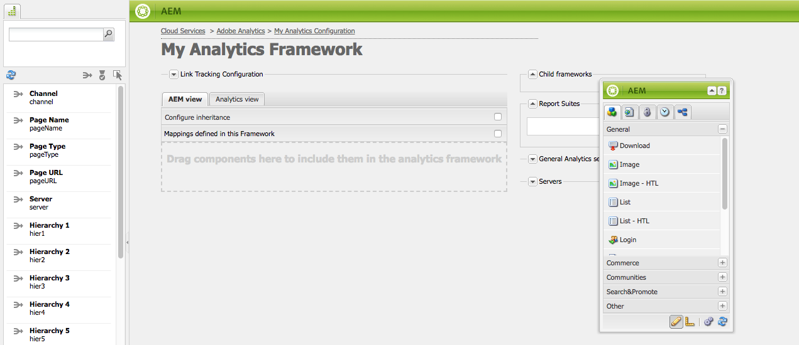

# Componentgegevens toewijzen aan Adobe Analytics-eigenschappen{#mapping-component-data-with-adobe-analytics-properties}

Voeg componenten toe aan het framework die de gegevens verzamelen die naar Adobe Analytics moeten worden verzonden. Componenten die zijn ontworpen om analysegegevens te verzamelen slaan de gegevens op in de juiste **CQ-variabele**. Wanneer u een dergelijke component aan een kader toevoegt, toont het kader de lijst van CQ variabelen zodat u elk aan de aangewezen **variabele Analytics** kunt.

Wanneer de **AEM weergave** is geopend, worden de variabelen Analytics weergegeven in de zoekfunctie.

U kunt veelvoudige variabelen van de Analyse met het zelfde **CQ veranderlijke** in kaart brengen.

De toegewezen gegevens worden naar Adobe Analytics verzonden wanneer de pagina wordt geladen en aan de volgende voorwaarden wordt voldaan:

* De pagina is gekoppeld aan het framework.
* De pagina gebruikt de componenten die aan het framework zijn toegevoegd.

Gebruik de volgende procedure om CQ-componentvariabelen toe te wijzen aan Adobe Analytics-rapporteigenschappen.

1. In **AEM mening**, sleep een het volgen component van hulp op het kader. Sleep bijvoorbeeld de component **Page** uit de categorie **Algemeen**.

   

   Er zijn verschillende standaardcomponentgroepen: **Algemeen**, **Handel**, **Communities**, **Search&amp;Promote** en **Overige**. Uw AEM instantie kan worden gevormd om verschillende groepen en componenten te tonen.

1. Als u Adobe Analytics-variabelen wilt toewijzen met variabelen die in de component zijn gedefinieerd, sleept u een **Analysevariabele** van de inhoudzoeker naar een veld op de volgende component. Sleep bijvoorbeeld `Page Name (pageName)` naar `pagedata.title`.

   

   >[!NOTE]
   >
   >De de Reeks identiteitskaart van het Rapport (RSID) die voor het kader wordt geselecteerd bepaalt de variabelen van Adobe Analytics die in de inhoudszoeker verschijnen.

1. Herhaal de vorige twee stappen voor andere componenten en variabelen.

   >[!NOTE]
   >
   >U kunt meerdere analytische variabelen toewijzen (bijvoorbeeld `props`, `eVars`, `events`) naar dezelfde CQ-variabele (bijvoorbeeld `pagedata.title`)

   >[!CAUTION]
   >
   >Het wordt ten zeerste aanbevolen:
   >    
   >    * `eVars` en  `props` worden toegewezen aan CQ-variabelen die beginnen met of  `pagedata.X` of  `eventdata.X`
      >    
      >    
   * overwegende dat gebeurtenissen moeten worden toegewezen aan variabelen die beginnen met `eventdata.events.X`

1. Als u het framework beschikbaar wilt maken op de publicatie-instantie van uw site, opent u het tabblad **Pagina** van sidekick en klikt u op **Framework activeren.**

## Toewijzing van productgerelateerde variabelen {#mapping-product-related-variables}

AEM gebruikt een conventie voor de naamgeving van productgerelateerde variabelen en gebeurtenissen die moeten worden toegewezen aan Adobe Analytics-productgerelateerde eigenschappen:

| CQ-variabele | Analysevariabele | Beschrijving |
|---|---|---|
| `product.category` | `product.category` (conversievariabele) | De productcategorie. |
| `product.sku` | `product.sku` (conversievariabele) | De sku van het product. |
| `product.quantity` | `product.quantity` (conversievariabele) | Het aantal producten dat wordt aangeschaft. |
| `product.price` | `product.price` (conversievariabele) | De productprijs. |
| `product.events.<eventName>` | De succesgebeurtenis(sen) die aan het product in uw rapport moeten worden gekoppeld. | `product.events` is het voorvoegsel voor gebeurtenissen met de naam  *eventName.* |
| `product.evars.<eVarName>` | De conversievariabele(n) ( `eVar`) die aan het product moet worden gekoppeld. | `product.evars` is het voorvoegsel voor eVar-variabelen met de naam  *eVarName.* |

Verschillende AEM Commerce-componenten gebruiken deze variabelenamen.

>[!NOTE]
>
>Wijs de eigenschap Adobe Analytics Products niet toe aan een CQ-variabele. Het configureren van productgerelateerde toewijzingen, zoals beschreven in de tabel, is in feite gelijk aan het toewijzen van de variabele Producten.

### Rapporten op Adobe Analytics {#checking-reports-on-adobe-analytics} controleren

1. Meld u aan bij de Adobe Analytics-website met dezelfde gegevens die aan AEM zijn verstrekt.
1. Zorg ervoor RSID wordt geselecteerd die in de vorige stappen wordt gebruikt.
1. Selecteer **Aangepaste conversie** in **Rapporten** (aan de linkerkant van de pagina), vervolgens **Aangepaste conversie 1-10** en selecteer de variabele die overeenkomt met `eVar7`

1. Afhankelijk van de versie van Adobe Analytics die u gebruikt, moet u gemiddeld 45 minuten wachten tot het rapport met de gebruikte zoekterm wordt bijgewerkt; bijv. aubergine in het voorbeeld

## De Inhoudszoeker (cf#) gebruiken met Adobe Analytics-frameworks {#using-the-content-finder-cf-with-adobe-analytics-frameworks}

Wanneer u in eerste instantie een Adobe Analytics-framework opent, bevat de zoekfunctie voor inhoud vooraf gedefinieerde variabelen voor Analytics onder:

* Verkeer
* Conversie
* Gebeurtenissen

Wanneer RSID wordt geselecteerd worden alle variabelen die tot dat RSID behoren toegevoegd aan de lijst.\
`cf#` is nodig om de variabelen van de Analyse aan de variabelen toe te wijzen CQ aanwezig op de verschillende volgende componenten. Zie Een framework instellen voor basistracking.

Afhankelijk van de weergave die voor het framework is geselecteerd, wordt de zoeker van de inhoud gevuld met variabelen voor Analytics (in AEM weergave) of CQ-variabelen (in de weergave Analytics).

De lijst kan op de volgende manieren worden gemanipuleerd:

1. Wanneer in **AEM mening**, kan de lijst afhankelijk van welk veranderlijke type worden gefiltreerd gebruikend de 3 filterknopen wordt geselecteerd:

   * Als *geen knoop* wordt geselecteerd, toont de lijst de volledige lijst.
   * Als **Traffic** wordt geselecteerd, zal de lijst slechts de variabelen tonen die tot de sectie van het Verkeer behoren.
   * Als de knop **Conversie** is geselecteerd, worden in de lijst alleen de variabelen weergegeven die tot de sectie Conversie behoren.
   * Als de knop **Gebeurtenissen** is geselecteerd, worden in de lijst alleen de variabelen weergegeven die tot de sectie Gebeurtenissen behoren.

   >[!NOTE]
   >
   >Er kan slechts één filterknop tegelijk actief zijn.

   >[!NOTE]
   >
   >Search&amp;Promote-variabelen behoren ook tot de sectie Conversie.

   1. De lijst bevat ook een zoekfunctie waarmee de elementen worden gefilterd op basis van de tekst die in het zoekveld is ingevoerd.
   1. Als een filteroptie wordt geactiveerd terwijl u naar elementen in de lijst zoekt, worden de weergegeven resultaten ook gefilterd op basis van de actieve knop.
   1. De lijst kan op elk moment opnieuw worden geladen met de knop met de strijkpijlen.
   1. Als veelvoudige RSIDs op het kader wordt geselecteerd, zullen alle variabelen in de lijst worden getoond gebruikend alle etiketten die binnen geselecteerde RSIDs worden gebruikt.

1. In de weergave Adobe Analytics worden alle CQ-variabelen weergegeven die horen bij de volgende componenten die in de CQ-weergave zijn gesleept.

   * Als de **Download component** bijvoorbeeld *slechts één gesleept* is in de CQ-weergave (met twee variabele *eventdata.downloadLink* en *eventData.events.startDownload*), ziet de Content Finder er als volgt uit bij het schakelen naar de Adobe Analytics-weergave:

   

   * De variabelen kunnen op om het even welke variabele van Adobe Analytics worden gesleept die tot of één van de drie veranderlijke secties (**Verkeer**, **Omzetting** en **Gebeurtenissen**) behoren.

   * Wanneer u een nieuwe traceringscomponent naar het framework sleept in de CQ-weergave, worden de CQ-variabelen die bij de component horen automatisch toegevoegd aan de Content Finder (cf#) in de Adobe Analytics-weergave.
   >[!NOTE]
   >
   >Er kan slechts één CQ-variabele tegelijk aan een Adobe Analytics-variabele worden toegewezen

## De AEM- en analyseweergave {#using-aem-view-and-analytics-view} gebruiken

Op elk gewenst moment kunnen gebruikers schakelen tussen twee manieren om de Adobe Analytics-toewijzingen te bekijken op een frameworkpagina. De twee weergaven bieden een beter overzicht van de toewijzingen binnen het kader, vanuit twee verschillende perspectieven.

### Weergave AEM {#aem-view}

Als u de bovenstaande afbeelding als voorbeeld neemt, heeft de **AEM weergave** de volgende eigenschappen:

1. Dit is de standaardweergave wanneer het framework wordt geopend.
1. Linkerkant: de zoeker van de inhoud (cf#) wordt gevuld met Adobe Analytics-variabelen op basis van de geselecteerde RSID(&#39;s).
1. Tabkoppen (**AEM weergave** en **Analyseweergave**): Gebruik deze om tussen de twee weergaven te schakelen.

1. **AEM weergave**:

   1. Als het framework componenten bevat die zijn overgeërfd van het bovenliggende element, worden deze hier vermeld, samen met de variabelen die aan de componenten zijn toegewezen.

      1. Overerfde componenten zijn vergrendeld.
      1. Als u een overgeërfde component wilt ontgrendelen, dubbelklikt u op het hangslot naast de naam van de component.
      1. Als u de overerving wilt herstellen, moet u de ontgrendelde component verwijderen. waarna de vergrendelde status weer wordt hersteld.
   1. **Sleep componenten hier naartoe om ze op te nemen in het analyseframework**: Componenten kunnen van de Sidetrap worden gesleept en hier neergezet.
   1. U kunt alle componenten vinden die momenteel in het analytische framework zijn opgenomen:

      1. Als u een component wilt toevoegen, sleept u een component van het tabblad Componenten van het zijpaneel
      1. Als u een component en alle bijbehorende toewijzingen wilt verwijderen, selecteert u Verwijderen in het contextmenu van de component en accepteert u de verwijdering in het bevestigingsdialoogvenster.
      1. Onthoud dat een component alleen kan worden verwijderd uit het framework waarin de component is gemaakt en niet in de traditionele zin kan worden verwijderd uit onderliggende frameworks (ze kunnen alleen worden overschreven).

### Analyseweergave {#analytics-view}

1. Deze weergave is toegankelijk door over te schakelen op het tabblad **Analyseweergave** in het framework.
1. Linkerkant: De Inhoudszoeker (cf#) wordt gevuld met CQ-variabelen op basis van de componenten die in de CQ-weergave naar het framework zijn gesleept.
1. Tabkoppen (**AEM weergave** en **Analyseweergave**): Gebruik deze om tussen de twee weergaven te schakelen.

1. In de drie tabellen (Verkeer, Conversie, Gebeurtenis) worden alle beschikbare Adobe Analytics-variabelen vermeld. behoren tot de geselecteerde RSID(&#39;s). De hier getoonde toewijzingen moeten gelijk zijn aan die in de AEM weergave:

   * **Verkeer**:

      * Verkeersvariabele ( `prop1`) toegewezen aan een CQ-variabele ( `eventdata.downloadLink`)

      * Wanneer er naast de component een Padlock staat, betekent dit dat deze wordt overgeërfd van een bovenliggend framework en dus niet kan worden bewerkt
   * **Conversie**:

      * Conversievariabele ( `eVar1`) toegewezen aan een CQ-variabele ( `pagedata.title`)

      * Conversievariabele ( `eVar3`) die aan een gealigneerde uitdrukking javascript wordt in kaart gebracht door op het CQ veranderlijke gebied te dubbelklikken en de code manueel in te gaan
   * **Gebeurtenis**:

      * Gebeurtenisvariabele ( `event1`) die is toegewezen aan een CQ-gebeurtenis ( `eventdata.events.pageView`)

>[!NOTE]
>
>De CQ-variabele kolom van een tabel kan ook inline worden ingevuld door te dubbelklikken op het veld en er tekst aan toe te voegen. Deze velden accepteren javascript als invoer.
>
>* Bijvoorbeeld naast `prop3` kunt u toevoegen
>* `'`* `Adobe:'+pagedata.title+':'+pagedata.sitesection`\
   >  om de *titel* van een pagina die is samengevoegd met de *sitesection* te verzenden met behulp van *:* (dubbelepunt) en vooraf ingesteld met *Adobe* als `prop3`

>

>[!CAUTION]
>
>Er kan slechts één CQ-variabele op elk moment aan een Adobe Analytics-variabele worden toegewezen.

