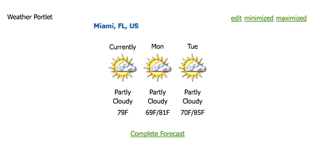

# AEM en portlets{#aem-portals-and-portlets}

In dit document wordt het volgende beschreven:

* AEM Portal-architectuur
* Beheer en configuratie van AEM als portaal
* AEM gebruiken als portaal
* Inhoud in een portlet installeren, configureren en weergeven (bijvoorbeeld een webserver)

## AEM Portal-architectuur {#aem-portal-architecture}

AEM portaalarchitectuur bevat definities van portalen en portlets.

### Wat is een portaal? {#what-is-a-portal}

Een portal is een webtoepassing die verpersoonlijking, één aanmelding, integratie van inhoud uit verschillende bronnen en de presentatielaag van informatiesystemen host.

U kunt JSR 286-Volgzame portlets in AEM in werking stellen. Met de portletcomponent kunt u een portlet op de pagina insluiten. Zie [Het AEM inhoudsportfolio beheren](#administeringthecqcontentportlet).

### Wat is een portlet? {#what-is-a-portlet}

Portlets zijn webonderdelen die worden geïmplementeerd in een container en die dynamische inhoud genereren. De portletinterface wordt verpakt en opgesteld als .war dossier binnen van een portletcontainer. Als u AEM als portaal in werking stelt, hebt u het portlet .war dossier nodig om portlet in werking te stellen.

Om AEM inhoud te vormen om in een portaal te verschijnen, zie [Het installeren, het Vormen, en het Gebruiken van AEM in portlet](#installingconfiguringandusingcqinaportlet).

### AEM Portal Director {#aem-portal-director}

>[!CAUTION]
>
>De AEM Portal Director is vanaf AEM 6.4 verouderd. Zie [Verouderde en verwijderde functies](https://helpx.adobe.com/experience-manager/6-4/release-notes/deprecated-removed-features.html).

## Het AEM inhoudsportfolio beheren {#administering-the-aem-content-portlet}

Met de AEM-inhoudsporlet kunt u AEM inhoud in een portal weergeven. De portlet is beschikbaar op `/crx-quickstart/opt/portal`en kan op verschillende manieren worden aangepast. Bijvoorbeeld, kunt u SSO/Authentificatie behandeling aanpassen door uw eigen authentificatieservice op te stellen die de vereiste authentificatieinformatie voor AEM produceren om het standaardgedrag te beschrijven. De plug-ins gebruiken een gedefinieerde API waarmee u uw eigen functionaliteit kunt toevoegen door de plug-in te bouwen op basis van de API. De insteekmodule kan in de lopende portlet worden opgesteld. Om correct te functioneren, vereist het een configuratie van de AEM auteur en publiceer instantie samen met de inhoudspad om bij opstarten te tonen.

Sommige configuraties kunnen door portletvoorkeur en anderen door OSGi de dienstconfiguraties worden veranderd. U wijzigt deze configuraties met **config** bestanden of de OSGi-webconsole.

### Voorkeuren Portlet {#portlet-preferences}

Porlet-voorkeuren kunnen tijdens de implementatie op de portalserver worden geconfigureerd of door het **WEB-INF/portlet.xml** bestand voordat de portlet-webtoepassing wordt geïmplementeerd. Het bestand portlet.xml ziet er standaard als volgt uit:

```xml
<?xml version="1.0" encoding="UTF-8"?>
<portlet-app xmlns="https://java.sun.com/xml/ns/portlet/portlet-app_1_0.xsd"
             xmlns:xsi="https://www.w3.org/2001/XMLSchema-instance"
             xsi:schemaLocation="https://java.sun.com/xml/ns/portlet/portlet-app_1_0.xsd /opt/SUNWps/dtd/portlet.xsd"
             version="1.0">
   <portlet>
      <portlet-name>RSSWeatherPortlet</portlet-name>
      <portlet-class>org.jboss.portlet.weather.WeatherPortlet</portlet-class>
      <init-param>
         <name>default_zipcode</name>
         <value>05673</value>
      </init-param>
      <init-param>
         <name>RSS_XSL</name>
         <value>/WEB-INF/Rss.xsl</value>
      </init-param>
      <init-param>
         <name>base_url</name>
         <value>https://xml.weather.yahoo.com/forecastrss?p=</value>
      </init-param>
      <expiration-cache>180</expiration-cache>
      <supports>
         <mime-type>text/html</mime-type>
         <portlet-mode>VIEW</portlet-mode>
         <portlet-mode>EDIT</portlet-mode>
      </supports>
      <portlet-info>
         <title>Weather Portlet</title>
      </portlet-info>
      <portlet-preferences>
         <preference>
            <name>expires</name>
            <value>180</value>
         </preference>
         <preference>
            <name>RssXml</name>
            <value>https://xml.weather.yahoo.com/forecastrss?p=33145</value>
            <read-only>false</read-only>
         </preference>
      </portlet-preferences>
   </portlet>
</portlet-app>
```

De portlet kan met de volgende voorkeur worden gevormd:

<table>
 <tbody>
  <tr>
   <td>startPath</td>
   <td><p>Dit is het beginpad van de portlet: het definieert de inhoud die in eerste instantie wordt weergegeven.</p> <p><strong>Belangrijk</strong>: Als portlet wordt gevormd om met AEM auteur te verbinden en instanties te publiceren die op een contextweg verschillend van lopen<strong> /</strong>, moet u de kracht inschakelen <strong>CQUrlInfo</strong> in de HTML Library Manager-configuratie van deze AEM-instanties (bijvoorbeeld via Felix Webconsole) of bewerkingen werken niet en wordt het dialoogvenster met voorkeuren niet weergegeven.</p> </td>
  </tr>
  <tr>
   <td>htmlSelector</td>
   <td>De kiezer die aan elke URL wordt toegevoegd. Standaard is dit <strong>portlet</strong>, dus alle aanvragen naar HTML-pagina's gebruiken URL's die eindigen in <strong>.portlet.html.</strong> Hierdoor kunnen aangepaste scripts in AEM worden gebruikt voor portletrendering.</td>
  </tr>
  <tr>
   <td>addCssToPortalHeader</td>
   <td><p>Standaard worden CSS-bestanden die vanaf AEM op de pagina HTML staan, opgenomen in de portlet. Als u deze optie uitschakelt, worden de standaard CSS-bestanden uitgesloten.</p> <p>Als deze optie is ingeschakeld, worden de CSS-bestanden aan de kop van de HTML-pagina toegevoegd of in de HTML-pagina ingesloten, afhankelijk van het gedrag van de portal.</p> </td>
  </tr>
  <tr>
   <td>includeToolbar</td>
   <td>Standaard wordt een werkbalk weergegeven in de inhoudsportlet voor beheerfuncties. Als u deze optie uitschakelt, wordt er geen werkbalk weergegeven.</td>
  </tr>
  <tr>
   <td>urlParameterNames</td>
   <td><p>Lijst met alternatieve URL-parameternamen die de nieuwe inhoud-URL kunnen bevatten die voor de portlet moet worden weergegeven. De lijst wordt van boven naar beneden verwerkt, de eerste parameter die een waarde bevat wordt gebruikt. Als er geen URL wordt gevonden, wordt de standaard-URL-parameter gebruikt. De opgegeven URL wordt ongewijzigd gebruikt.</p> <p>Deze instelling is per geïmplementeerde portlet - het is ook nodig om wereldwijd enkele URL-parameters in de OSGi-configuratie voor de "Day Portal Director Portlet Bridge" te configureren.</p> </td>
  </tr>
  <tr>
   <td>preferentDialog</td>
   <td>Pad naar het dialoogvenster Voorkeuren in AEM - als dit leeg blijft, wordt het dialoogvenster met ingebouwde voorkeuren gebruikt. Dit is standaard /libs/portal/content/prefs.html.</td>
  </tr>
  <tr>
   <td>initialRedirect</td>
   <td>Door gebrek, portlet voert een javascript omleiding van de volledige portalpagina op de eerste aanroeping uit. Dit moet het belemmering en dalingsscenario van moderne poortservers steunen. Bij de productie is deze omleiding zelden nodig en kan deze dus worden uitgeschakeld wanneer deze voorkeur wordt ingesteld op <em>false</em>.</td>
  </tr>
 </tbody>
</table>

#### OSGi-webconsole {#osgi-web-console}

Ervan uitgaande dat de poortserver wordt uitgevoerd op de host localhost, wordt poort 8080 en wordt de AEM portlet-webtoepassing gemonteerd in de webtoepassingscontext *cqportlet*, is de URL voor de webconsole `https://localhost:8080/cqportlet/cqbridge/system/console`. De standaardgebruiker en het standaardwachtwoord zijn **admin**.

Open de **Configuraties** en selecteert u **Configuratie CQ-server voor poortmap**. Hier geeft u de basis-URL op voor de auteur en de publicatie-instantie. Deze procedure wordt beschreven in [De portlet configureren](#configuring-the-portlet).

>[!NOTE]
>
>De OSGi Webconsole is slechts bedoeld voor het veranderen van configuraties tijdens ontwikkeling (of het testen). Zorg ervoor om verzoeken aan de console voor productiesystemen te blokkeren.

### Configuraties leveren {#providing-configurations}

Om geautomatiseerde plaatsingen en configuratielevering te steunen, heeft AEM inhoudsplet ingebouwde configuratiesteun die probeert om configuraties van klassenpad te lezen die aan de portlettoepassing wordt verstrekt.

Bij het opstarten, het systeembezit **com.day.cq.portet.config** wordt gelezen om de huidige omgeving te detecteren. Gewoonlijk is de waarde van deze eigenschap iets als **dev**, **prod**, **test**, enzovoort. Als er geen omgeving is ingesteld, worden er geen configuraties gelezen.

Als een milieu wordt geplaatst, wordt een configuratiedossier gezocht in classpath bij* ***com/day/cq/portlet/{env}.config** waar **env** wordt vervangen door de werkelijke waarde voor het milieu. In dit bestand moeten alle configuratiebestanden voor deze omgeving worden vermeld. Deze bestanden worden gezocht op basis van de locatie van het configuratiebestand. Als het bestand bijvoorbeeld een regel bevat `my.service.xml,` dit bestand wordt gelezen vanuit het klassepad op `com/day/cq/portlet/my.service.config.` De naam van het bestand bestaat uit de persistentie-id van de service, gevolgd door **.config**. In het vorige voorbeeld is de persistentie-id **my.service**. De indeling van het configuratiebestand is de indeling die wordt gebruikt door het installatieprogramma van Apache Sling OSGi.

Dit betekent, voor elke milieu, een overeenkomstig config dossier moet worden toegevoegd. Een configuratie die op alle milieu&#39;s zou moeten worden toegepast moet in al deze dossiers worden ingegaan - als het enkel voor één enkele milieu is, is het enkel ingegaan in dat dossier. Dit mechanisme zorgt voor volledige controle over welke configuratie in welk milieu wordt gelezen.

Het is mogelijk om een andere systeemeigenschap te gebruiken om de omgeving te detecteren. De eigenschap system opgeven **com.day.cq.portet.configproperty** met de naam van de systeemeigenschap die moet worden gebruikt in plaats van **com.day.cq.portet.config**.

#### Validatie in cache plaatsen en in cache plaatsen {#caching-and-caching-invalidation}

portlet, in zijn standaardconfiguratie, geheime voorgeheugens de reacties het van AEM WCM in een user-specific geheime voorgeheugen ontvangt. De caches moeten ongeldig worden gemaakt wanneer er wijzigingen optreden in de inhoud van de publicatie-instantie. Voor dit doel, in AEM WCM moet een replicatieagent op de auteursinstantie worden gevormd. De cache kan ook handmatig worden leeggemaakt. In dit deel worden beide procedures beschreven.

portlet kan met zijn eigen geheime voorgeheugen worden gevormd, zodat de inhoud in portlet vertoningen zonder toegang tot AEM te vereisen. Het portaal is beschikbaar als inhoud in /libs/portal/director. Als u toegang wilt tot de inhoud, start u een AEM instantie en downloadt u het bestand via CRXDE Lite of Webdav vanaf die locatie.

U kunt deze bundel bij uitvoering implementeren of toevoegen aan de portlet-webtoepassing op `WEB-INF/lib/resources/bundles` vóór de implementatie.

Nadat het geheime voorgeheugen wordt opgesteld, plaatst portlet inhoud van publicatieinstantie in het voorgeheugen. De portletcache kan ongeldig worden gemaakt door een dispatcher uit AEM te spoelen. Om portlet te vormen om zijn eigen geheime voorgeheugen te gebruiken:

1. Vorm een replicatieagent in auteur die de poortserver richt.
1. Ervan uitgaande dat de poortserver op de host wordt uitgevoerd **localhost**, **poort 8080 **en de AEM portlet webtoepassing wordt in de context gemonteerd **cqportlet**, is de URL om de cache leeg te maken `https://localhost:8080/cqportlet/cqbridge/cqpcache?Path=$(path)`. Gebruik GET als methode.
   **Opmerking:** In plaats van een aanvraagparameter te gebruiken, kunt u een http-header met de naam verzenden **Pad**.

#### Het spoelen van het Geheime voorgeheugen via de Agent van de Replicatie {#flushing-the-cache-via-replication-agent}

Enkel als de normale berichtcher ongeldigverklaring, kan een replicatieagent worden gevormd om het portletgeheime voorgeheugen van de portlet van het portaal AEM te richten. Nadat u de replicatieagent vormt, spoelt elke regelmatige paginasactivering het poortgeheime voorgeheugen.

Als u verscheidene poortknopen in werking stelt die portlet van de AEM in werking stellen, moet u een agent voor elke knoop tot stand brengen zoals die in deze procedure wordt beschreven.

Om een replicatieagent voor het portaal te vormen:

1. Meld u aan bij de auteur.
1. Klik op het tabblad Websites op de knop *Gereedschappen* tab.
1. Klikken **Nieuwe pagina..** in de replicatieagenten **Nieuw...** -menu.

   

1. In *Sjabloon*, selecteert u *Replication Agent*, en ga een naam voor de agent in. Klikken *Maken*.

   

1. Dubbelklik op de replicatieagent die u hebt gemaakt. Het toont ongeldig aangezien het nog niet is gevormd.

   

1. Klikken **Bewerken.**
1. In de **Instellingen** selecteert u de **Ingeschakeld** selectievakje, selecteren **Dispatcher Flush** als serialization type, en ga een retry onderbreking (bijvoorbeeld, 60000) in.

   

1. Klik op de knop **Vervoer** tab.
1. In de **URI** voert u de spoelURI (URL) van de portlet in. De URI heeft de volgende notatie:

   ```xml
   https://<wps-host>:<port>/<wps-context>/<cq5-portlet-context>/cqbridge/cqpcache
   ```

   

1. Klik op de knop **Uitgebreid** tab.

   

1. In de **HTTP-methode** veld, type **GET**.
1. In de **HTTP-headers** veld, klikken **+** om een nieuw item en type toe te voegen **Pad: {path}**.
1. Klik indien nodig op de knop **Proxy** en ga volmachtsinformatie aan de agent in.
1. Klikken **OK** om de wijzigingen op te slaan.
1. Als u de verbinding wilt testen, klikt u op de knop **Verbinding testen** koppeling. Een logboekbericht verschijnt dat erop wijst of de replicatietest succesvol was. Bijvoorbeeld:

   

#### De portletcache handmatig leegmaken {#manually-flushing-the-portlet-cache}

U kunt de portletgeheime voorgeheugen manueel leegmaken door tot zelfde URL toegang te hebben die voor de replicatieagent wordt gevormd. Zie [Cache leegmaken](#flushing-the-cache-via-replication-agent) voor de vorm van de URL. Daarnaast moet de URL worden uitgebreid met de URL-parameter Path=&lt;path> om aan te geven wat moet worden leeggemaakt.

Bijvoorbeeld:

`https://10.0.20.99:10040/wps/PA_CQ5_Portlet/cqbridge/cqpcache?Path=*` Maakt de volledige cache leeg. `https://10.0.20.99:10040/wps/PA_CQ5_Portlet/cqbridge/cqpcache?Path=/content/mypage/xyz` flushes `/content/mypage/xyz` uit de cache.

### Poortbeveiliging {#portal-security}

Het portaal is het mechanisme voor rijverificatie. U kunt zich AEM of met een technische gebruiker, de poortgebruiker, een groep, etc. aanmelden. portlet heeft geen toegang tot het wachtwoord voor de gebruiker in het portaal, zodat als portlet niet alle geloofsbrieven kent om met succes een gebruiker aan te melden, moet een oplossing SSO worden gebruikt. In dit geval stuurt de AEM portlet alle vereiste informatie door naar AEM, die deze informatie vervolgens doorgeeft aan de onderliggende AEM dataopslag. Dit gedrag is pluggable en kan worden aangepast.

### Verificatie bij publicatie {#authentication-on-publish}

Deze sectie beschrijft de beschikbare authentificatiemodi portlet kan gebruiken in het communiceren met de onderliggende AEM instanties WCM.

Standaard wordt er geen gebruikersinformatie verzonden naar de publicatie-instantie van AEM; de inhoud wordt altijd weergegeven als de anonieme gebruiker. Als gebruikersspecifieke informatie van AEM moet worden afgeleverd of als gebruikersverificatie voor publicatie is vereist, moet dit worden ingeschakeld.

#### Toegang tot de configuratie van de portlet-verificatie {#accessing-the-portlet-s-authentication-configuration}

De configuratieopties van de authentificatie die portlet in AEM instanties WCM gebruikt zijn beschikbaar in de console van het Web (configuratie OSGi).

>[!NOTE]
>
>Wanneer het werken met AEM, zijn er verscheidene methodes om de configuratiemontages voor de diensten OSGi (console of bewaarplaatsknooppunten) te beheren.
>
>Zie [OSGi configureren](/help/sites-deploying/configuring-osgi.md) voor volledige informatie.

Om tot de de authentificatieconfiguratie van portlet toegang te hebben:

1. Heb toegang tot de console van het Web bij volgende URL:

   `https://localhost:8080/cqportlet/cqbridge/system/console`

   Bijvoorbeeld in de standaardconfiguratie:

   `https://wps-host:10040/wps/PA_CQ5_Portlet/cqbridge/system/console`

1. Log in bij de webconsole. De standaardreferenties zijn `admin/admin`.
1. Selecteer in de console **Configuratie**.
1. In de **Configuratie** selecteert u een bepaalde service die u wilt configureren. De diensten worden geleverd door de portlet in het kader van OSGi.

   | Servicenaam | Beschrijving |
   |---|---|
   | Day Portal Director Authenticator | Vorm welke authentificatiemodus voor AEM instanties WCM wordt gebruikt. Afhankelijk van de geselecteerde modus kan een technische gebruiker of de naam van het SSO-cookie worden opgegeven. Ook, kan de authentificatie voor AEM WCM publicatieinstanties worden toegelaten. |
   | Dagportaal Director-bestandcache | Vorm de parameters van hoe portlet reacties in het voorgeheugen onderbrengt het van AEM instanties WCM ontvangt. |
   | Day Portal Director HTTP Client Service | Vorm hoe portlet via HTTP met onderliggende AEM instanties WCM verbindt. U kunt bijvoorbeeld een proxyserver opgeven. |
   | Dagportaal Director Locale Handler | Vorm welke scènes portlet steunt. Verzoeken om AEM instanties WCM zijn gebaseerd op de gebruikersscène; bijvoorbeeld de taal *German *zou verzoeken `/content/geometrixx/de/`... |
   | Day Portal Director Privilege Manager | Vorm of portlet de Websites tabel zou moeten testen die op de momenteel het programma geopende gebruiker wordt gebaseerd. |
   | Day Portal Director Toolbar Renderer | Pas de rendering van de portletwerkbalk aan. |

1. Bovendien kunt u de console van het Web en de registrerendienst vormen. Bijvoorbeeld, kunt u de admin geloofsbrieven voor de console van het Web veranderen door de verbinding van de Console van de Console van het Beheer van Apache te klikken Felix OSGi.

#### Technische gebruikersmodus {#technical-user-mode}

In standaardwijze, worden alle verzoeken die door portlet voor de AEM WCM auteursinstantie worden uitgegeven voor authentiek verklaard gebruikend de zelfde technische gebruiker, ongeacht de huidige poortgebruiker. De modus Technische gebruiker is standaard ingeschakeld. U laat/maakt deze wijze in het respectieve configuratiescherm in toe OSGi beheersconsole:

De opgegeven technische gebruiker moet aanwezig zijn op de AEM instantie van de WCM-auteur en op de publicatie-instantie als **Verifiëren bij publiceren** is ingeschakeld. Zorg ervoor dat u de gebruikers voldoende toegangsrechten geeft voor ontwerpwerkzaamheden.

#### SSO {#sso}

De portlet steunt SSO met AEM uit de doos. De authentificatordienst kan worden gevormd om SSO te gebruiken en de huidige poortgebruiker met formaat over te brengen **Basis** als een cookie met de naam `cqpsso` tot AEM. AEM zou moeten worden gevormd om de de authentificatiemanager van SSO voor weg te gebruiken /. De cookienaam moet ook hier worden gevormd.

De `crx-quickstart/repository/repository.xml` AEM opslagplaats moet dienovereenkomstig worden geconfigureerd:

```xml
<LoginModule class="com.day.crx.security.authentication.CRXLoginModule">
  ...
  <param name="trust_credentials_attribute" value="TrustedInfo"/>
  <param name="anonymous_principal" value="anonymous"/>
</LoginModule>
```

#### SSO-verificatiemodus {#sso-authentication-mode}

portlet kan voor AEM WCM voor authentiek verklaren gebruikend het Enige Sign On (SSO) regeling. In deze modus wordt de gebruiker die momenteel is aangemeld bij de portal doorgestuurd naar AEM WCM in de vorm van een SSO-cookie. Als de wijze SSO wordt gebruikt, moeten alle poortgebruikers met toegang tot AEM portlet aan de onderliggende AEM instanties WCM bekend zijn, meestal in de vorm van AEM WCM die met LDAP worden verbonden, of door de gebruikers manueel te hebben gecreeerd vooraf. Alvorens SSO in portlet toe te laten, de onderliggende AEM de auteursinstantie van WCM (en publiceer instantie) als **Verifiëren bij publiceren** wordt toegelaten) moet worden gevormd om op SSO-Gebaseerde verzoeken goed te keuren.

Om portlet te vormen om de de authentificatiemodus van SSO te gebruiken, voltooi de volgende stappen (die in detail in de volgende secties worden beschreven):

* Schakel AEM WCM-opslagplaats in om vertrouwde referenties te accepteren.
* SSO-verificatie inschakelen in de AEM WCM.
* Schakel SSO-verificatie in de AEM portlet in.

#### De opslagplaats van AEM WCM inschakelen om vertrouwde referenties te accepteren {#enabling-aem-wcm-s-repository-to-accept-trusted-credentials}

Voordat SSO voor AEM WCM kan worden ingeschakeld, moet de onderliggende opslagplaats worden geconfigureerd om de vertrouwde referenties te accepteren die door AEM WCM worden verstrekt. Hiertoe configureert u AEM repository.xml.

1. Open het volgende bestand in het bestandssysteem waarop AEM WCM is geïnstalleerd:

   `//crx-quickstart/repository/repository.xml`

1. Zoek in het XML-bestand de vermelding voor de **LoginModule** en voeg het Trust_credentials_attribute aan zijn configuratie toe:

   ```xml
   <LoginModule class="com.day.crx.security.authentication.CRXLoginModule">
     ...
     <param name="trust_credentials_attribute" value="TrustedInfo"/>
     <param name="anonymous_principal" value="anonymous"/>
   </LoginModule>
   ```

1. Start AEM WCM opnieuw om de wijzigingen van kracht te laten worden.

#### SSO-verificatie inschakelen in de AEM WCM {#enabling-sso-authentication-in-the-aem-wcm}

Om SSO in AEM WCM toe te laten, heb toegang tot de relevante configuratieingang in Apache Felix Web Management Console (OSGi) van AEM WCM:

1. Open de console via de URI op https://&lt;aem-host>:&lt;port>/system/console.
1. Selecteer SSO-verificatiehandler in het menu Configuration. In dit voorbeeld, keurt de manager SSO verzoeken SSO voor alle wegen goed die op het koekje worden gebaseerd dat door AEM portlet wordt verstrekt. Uw configuratie kan variëren.

   | Pad | / | Laat manager SSO voor alle verzoeken toe |
   |---|---|---|
   | Cookie-namen | cqpsso | Naam van het koekje dat door portlet wordt verstrekt zoals die in de console OSGi van portlet wordt gevormd. |

1. Klikken **Opslaan** SSO inschakelen. SSO is nu de primaire authentificatieregeling.

Voor elk verzoek AEM WCM ontvangt, eerst wordt de op SSO-Gebaseerde authentificatie geprobeerd. Bij mislukking, wordt een fallback aan het gebruikelijke basisauthentificatieschema uitgevoerd. Als zodanig blijven normale verbindingen met AEM WCM zonder SSO mogelijk.

#### SSO-verificatie inschakelen in een AEM portfolio {#enabling-sso-authentication-in-a-aem-portlet}

Opdat de onderliggende AEM instantie WCM SSO- verzoeken goedkeurt, moet portlet de authentificatiemodus worden geschakeld **Technisch** tot **SSO**.

SSO-verificatie inschakelen in een AEM portlet:

1. Open de console via de URI op https://&lt;aem-host>:&lt;port>/system/console.
1. Selecteer in het menu Configuratie de optie Day Portal Director Authenticator in de lijst met beschikbare configuraties.
1. Selecteer SSO in Modus. Laat de andere parameters hun standaardwaarden ongewijzigd.

   

1. Klik sparen om SSO voor portlet toe te laten.

   Voor testdoeleinden, heb toegang tot portlet met de administratieve gebruiker van uw portaal, nadat u de zelfde gebruiker in AEM WCM met beheerdervoorrechten creeert.

Na het uitvoeren van deze procedure, worden de verzoeken voor authentiek verklaard gebruikend SSO. Een typisch fragment van de mededeling van HTTP openbaart de aanwezigheid van de volgende SSO en Portlet specifieke kopballen:

```xml
C-12-#001898 -> [GET /mynet/en/_jcr_content/par/textimage/image.img.png HTTP/1.1 ]
C-12-#001963 -> [cq5:locale: en ]
C-12-#001979 -> [cq5:used-locale: en ]
C-12-#002000 -> [cq5:locales: en,en_US ]
C-12-#002023 -> [cqp:user: wpadmin ]
C-12-#002042 -> [cqp:portal: IBM WebSphere Portal/6.1 ]
C-12-#002080 -> [cqp:windowid: 7_CGAH47L000CE302V2KFNOG0084 ]
C-12-#002124 -> [cqp:windowstate: normal ]
C-12-#002149 -> [cqp:portletmode: view ]
C-12-#002172 -> [User-Agent: Jakarta Commons-HttpClient/3.1 ]
C-12-#002216 -> [Host: 10.0.0.68:4502 ]
C-12-#002238 -> [Cookie: $Version=0; cqpsso=Basic+d3BhZG1pbg%3D%3D ]
C-12-#002289 -> [ ]
```

### Pinverificatie inschakelen {#enabling-pin-authentication}

Als u niet de standaard gealigneerde het uitgeven eigenschappen van AEM inhoudsporlet gebruikt, maar het auteursende en beleidsdeel van portlet buiten het portaal direct in de AEM auteursinstantie wilt, zou u de authentificatie van de SPELD moeten toelaten. U moet ook de configuratie van de beheersknopen veranderen.

Voor het openen van de pagina voor websitebeheer of het bewerken van een pagina vanuit de portlet gebruikt het AEM-inhoudsporlet de nieuwe pinverificatie. Door gebrek, wordt de speldauthentificatie onbruikbaar gemaakt, daarom moeten de volgende configuratieveranderingen in AEM worden aangebracht:

1. Schakel vertrouwde verificatie in AEM in door de vertrouwde informatie toe te voegen in het bestand repository.xml:

   ```xml
   <LoginModule class="com.day.crx.security.authentication.CRXLoginModule">
     ...
     <param name="trust_credentials_attribute" value="TrustedInfo"/>
   </LoginModule>
   ```

1. In de OSGi configuratieconsole, door gebrek dat in https://localhost:4502/system/console/configMgr wordt gevestigd, selecteer **CQ PIN-verificatiehandler** in het keuzemenu.
1. Bewerk de **URL-hoofdpad** parameter die alleen de enkele waarde moet bevatten **/**.

### Rechten {#privileges}

Sommige functies van de portlet worden beschermd door voorrechten. De huidige gebruiker moet over dit voorrecht beschikken om toegang te krijgen tot deze functie. Er zijn de volgende vooraf gedefinieerde rechten:

* &quot;toolbar&quot;: Dit is het algemene voorrecht om de toolbar in portlet te zien/te gebruiken.
* &quot;prefs&quot; : Als de gebruiker over dit recht beschikt, mag de gebruiker de voorkeuren van de portlet zien/wijzigen.
* &quot;cq-signer:edit&quot;: met dit recht kan de gebruiker de bewerkingsweergave van de inhoud aanroepen.
* &quot;cq-maker:preview&quot;: met deze bevoegdheid mag de gebruiker de voorvertoning bekijken.
* &quot;cq-signer:site-admin&quot; : met deze bevoegdheid mag de gebruiker de site-beheerder openen binnen AEM.

De beste benadering om de voorrechten te beheren is poortrollen te gebruiken en rollen toe te wijzen aan deze voorrechten. Dit kan door een configuratie worden gedaan OSGi. De &quot;Dag Portal Director Privilege Manager&quot;kan met een reeks rollen voor elk voorrecht worden gevormd. Als de gebruiker één van de rollen heeft, heeft de gebruiker het overeenkomstige voorrecht.

Bovendien is het mogelijk om deze rol te bepalen gebaseerd toegang op een per portlet instantiebasis. Het voorkeurendialoogvenster van de portlet bevat een invoerveld voor elk van de bovenstaande bevoegdheden. Voor elk voorrecht kan een komma-gescheiden lijst van portletrollen worden gevormd. Als een waarde wordt gevormd, treedt dit de globale configuratie van de dienst &quot;van de Manager van de Bevoegdheden van het Dagportaal Director van de Voorrechten&quot;met voeten en het zou kunnen worden vereist om de zelfde rollen van dit globale plaatsen toe te voegen aangezien de rollen niet worden samengevoegd! Als geen waarde wordt gespecificeerd, wordt de globale configuratie gebruikt.

### De toepassing AEM portlet aanpassen {#customizing-the-aem-portlet-application}

De verstrekte AEM portlet toepassing begint een container OSGi binnen de Webtoepassing enkel zoals AEM. Deze architectuur laat u alle voordelen van OSGi gebruiken:

* Eenvoudig bij te werken en uit te breiden
* Verstrekt hete updates van portlet zonder enige interactie van de portalserver
* Eenvoudig de portlet aan te passen

### Werkbalkknoppen {#toolbar-buttons}

De werkbalk en de bijbehorende knoppen kunnen worden geconfigureerd en aangepast. U kunt uw eigen knoppen aan de werkbalk toevoegen of bepalen welke knoppen in welke modus worden weergegeven. Elke knoop is de dienst OSGi configureerbaar door een configuratie OSGi.

De OSGi Webconsole maakt een lijst van alle knoopconfiguraties op de **Configuratie** tab. Voor elke knop kunt u bepalen in welke modus deze knop wordt weergegeven. Hiermee kunt u een knop uitschakelen door bijvoorbeeld alle modi te verwijderen.

Standaard gebruikt de AEM inhoudsportlet de inline bewerkingsfunctionaliteit. Als u echter liever wilt overschakelen naar de AEM-auteur voor bewerking, schakelt u de optie **Knop SiteAdmin** en de **Knop ContentFinder**, maar schakel de **Knop Bewerken**. In dit geval, zorg ervoor om de authentificatie van de SPELD in AEM correct te vormen.

De de toolbarlay-out van portlet kan worden aangepast door een bundel door de Console van het Web van portlet te installeren Felix, die douane CSS/HTML bij een vooraf bepaalde plaats bevat.

#### Bundelstructuur {#bundle-structure}

Hier volgt een voorbeeld van een bundelstructuur:

```xml
$ jar tvf target/toolbarlayout-0.0.1-SNAPSHOT.jar | awk '{print $8}'
META-INF/
META-INF/MANIFEST.MF
/com/day/cq/portlet/toolbar/layout/
/com/day/cq/portlet/toolbar/layout/author.gif
/com/day/cq/portlet/toolbar/layout/back.gif
/com/day/cq/portlet/toolbar/layout/button.html
/com/day/cq/portlet/toolbar/layout/edit.gif
/com/day/cq/portlet/toolbar/layout/manage.html
/com/day/cq/portlet/toolbar/layout/publish.html
/com/day/cq/portlet/toolbar/layout/refresh.gif
/com/day/cq/portlet/toolbar/layout/siteadmin.gif
/com/day/cq/portlet/toolbar/layout/toolbar.css
```

De map META-INF bevat het bestand MANIFEST.MF dat OSGi nodig heeft om het als een bundel te identificeren. Het ziet er als volgt uit:

```xml
Manifest-Version: 1.0
Built-By: djaeggi
Created-By: Apache Maven Bundle Plugin
Import-Package: com.day.cq.portlet.toolbar.layout
Bnd-LastModified: 1234178347159
Export-Package: com.day.cq.portlet.toolbar.layout
Bundle-Version: 0.0.1.SNAPSHOT
Bundle-Name: Company CQ5 Portal Director Portlet Toolbar Layout
Bundle-Description: This bundle provides a custom layout for the CQ5 P
 ortal Director Portlet Toolbar.
Build-Jdk: 1.5.0_16
Bundle-ManifestVersion: 2
Bundle-SymbolicName: com.day.cq.portlet.company.toolbarlayout
Tool: Bnd-0.0.255
```

Het feit dat de HTML/CSS/images zich in de map /com/day/cq/portlet/toolbar/layout bevinden, wordt door de portlet voorgeschreven en kan niet worden gewijzigd. Langs dezelfde regels moeten de headers Import-Package en Export-Package in MANIFEST.MF ook /com/day/cq/portlet/toolbar/layout worden genoemd. De Bundle-SymbolicName moet een unieke, volledig gekwalificeerde pakketnaam zijn.

U kunt het bouwen gebruikend een hulpmiddel zoals gemaakt of manueel creeert zulk een jar dossier met de relevante kopbalreeks zoals aangetoond in deze sectie.

#### Weergaven van de Portlet-werkbalk {#portlet-toolbar-views}

De werkbalk van de portlet heeft eigenlijk twee weergavestaten. Elke weergave en de bijbehorende knoppen kunnen worden aangepast met een respectievelijke HTML-bestand.

#### Weergave publiceren {#publish-view}

De publicatieweergave heeft slechts één knop waarmee de werkbalk wordt verplaatst naar de weergave Beheren. De publicatieweergave wordt vertegenwoordigd door het bestand publish.html in [vorige bundel](/help/sites-deploying/configuring-osgi.md#bundles). In de HTML kunt u de volgende plaatsaanduidingen gebruiken, die door de portlet worden vervangen met de respectievelijke inhoud wanneer deze wordt weergegeven:

#### Plaatsaanduidingen voor weergave publiceren {#publish-view-placeholders}

| Tekenreeks voor plaatsaanduiding | Beschrijving |
|---|---|
| {buttonManage} | Placeholder wordt vervangen door **Beheren** knoop, die de portletstaat in de beheersstaat schakelt. |

#### Weergave beheren {#manage-view}

De beheerweergave heeft vier knoppen: Bewerken, tabblad Websites, Vernieuwen en Vorige. De beheerde mening wordt vertegenwoordigd door het manage.html- dossier in [vorige bundel](/help/sites-deploying/configuring-osgi.md#bundles). In de HTML kunt u de volgende plaatsaanduidingen gebruiken, die door de portlet worden vervangen met de respectievelijke inhoud wanneer deze wordt weergegeven:

#### Plaatsaanduidingen weergeven beheren {#manage-view-placeholders}

| Tekenreeks voor plaatsaanduiding | Beschrijving |
|---|---|
| {buttonEdit} | Placeholder wordt vervangen door **Bewerken** Deze knop opent een nieuw venster met de huidige pagina in AEM bewerkingsmodus. |
| {buttonWebsites, tabblad} | Plaatsaanduiding, vervangen door een knop waarmee het tabblad Websites van AEM WCM wordt geopend. |
| {buttonRefresh} | Hiermee vernieuwt u de huidige weergave. |
| {buttonBack} | Schakelt portlet terug in publiceer mening. |

#### Knoppen {#buttons}

De knopen, op welke mening zij verschijnen, gebruiken de zelfde gemeenschappelijke HTML, die in button.html wordt bepaald.

In de HTML kunt u de volgende plaatsaanduidingen gebruiken, die door de portlet worden vervangen met de respectievelijke inhoud wanneer deze wordt weergegeven:

#### Weergaveknoppen beheren en publiceren {#manage-and-publish-view-buttons}

| Tekenreeks voor plaatsaanduiding | Beschrijving |
|---|---|
| {name} | Naam van de knop, bijvoorbeeld **auteur, back, refresh**, enzovoort. |
| {id} | CSS-id van de knop. |
| {url} | URL voor het doel van de knop. |
| {text} | Label van de knop. |
| {onclick} | JavaScript **onclick** function (contains {url}). |

Voorbeeld van een bestand button.html:

```xml
<div class="cqp_button">

 <a href="#" onclick="{onclick}">

 

 </a>
</div>
```

#### Een aangepaste indeling installeren {#installing-a-custom-layout}

Als u een aangepaste indeling wilt installeren, opent u de OSGI Web-console **Bundles **section van de portlet en uploadt u de bundel.

#### Pakketten {#packages}

Als u pakketten voor uw installatie moet uploaden of maken, raadpleegt u Package Manager in de AEM documentatie voor gedetailleerde instructies.

### Koppelingsverwerking {#link-handling}

Alle koppelingen worden herschreven zodat ze binnen de poortcontext kunnen werken. Standaard worden koppelingen met renderparameters gebruikt. De Portal Director HTML Rewriter kan worden geconfigureerd voor het gebruik van handelingskoppelingen.

U kunt ook aanvullende aanvraagparameters definiëren die moeten worden opgevraagd voor het inhoudspad dat moet worden weergegeven. Dit is bijvoorbeeld handig als er een koppeling van buitenaf naar specifieke inhoud bestaat.

Daarnaast kan de Portal Director HTML Rewriter worden geconfigureerd met een lijst met reguliere expressies die zijn gedefinieerd, zodat koppelingen niet kunnen worden herschreven. Als u bijvoorbeeld relatieve koppelingen naar externe systemen hebt, moet u deze toevoegen aan deze uitsluitingslijst.

### Lokalisatie {#localization}

De portlet voor AEM inhoud heeft een ingebouwde lokalisatiefunctie, die ervoor zorgt dat de inhoud van AEM in de juiste taal is.

Dit gebeurt in twee stappen:

1. De taaldetector van de poortmap detecteert de landinstelling van de poortgebruiker door de landinstelling van het portaal op te halen. Deze dienst moet met de lijst van beschikbare talen in AEM worden gevormd.
1. De portaalversie van Director-handlers voor de landinstelling handelt de lokalisatie van het huidige verzoek af. Het pad van de gevraagde inhoud is bijvoorbeeld `/content/geometrixx/en/company.html`en volgens de configuratie worden de **en** met de werkelijke landinstelling van de gebruiker.

De portaalhandler voor Director-landinstellingen kan worden geconfigureerd met de paden om te controleren op informatie over landinstellingen. Dit omvat gewoonlijk alles onder `/content` en met de positie van de landinstellingsinformatie in het pad. Standaard volgt de landinstellingshandler de aanbevolen procedure voor het structureren van meertalige sites in AEM.

Als er op uw site geen strenge regel voor de verwerking van de landinstellingsgegevens in het pad is, is het mogelijk om de landinstellingshandler te vervangen door uw eigen implementatie.

### Optionele OSGi-services {#optional-osgi-services}

De facultatieve diensten OSGi kunnen worden uitgevoerd om diverse delen van portlet aan te passen. Elke service komt overeen met een Java-interface. Deze interface kan door een bundel in portlet worden uitgevoerd en worden opgesteld.

<table>
 <tbody>
  <tr>
   <td>RequestTracker</td>
   <td>De aanvraagtracker wordt op de hoogte gesteld wanneer de inhoud door de portlet wordt weergegeven. Zo kunt u de oproepen van de portlet volgen.</td>
  </tr>
  <tr>
   <td>InvocationContextListener</td>
   <td>Listener die aan het begin en einde van elke aanvraag aan portlet wordt aangeroepen. De listener kan worden gebruikt om informatie voor de huidige aanvraag te wijzigen of toe te voegen.<br /> </td>
  </tr>
  <tr>
   <td>ErrorHandler</td>
   <td>Aangepaste fouthandler voor fouten tijdens de renderfase.</td>
  </tr>
  <tr>
   <td>HttpProcessor</td>
   <td>Deze service kan worden gebruikt om informatie toe te voegen aan elke http-aanroep naar AEM.</td>
  </tr>
  <tr>
   <td>PortletAction</td>
   <td>Voeg een eigen actie aan portlet toe - deze actie kan door een portlet actieverbinding worden aangehaald.</td>
  </tr>
  <tr>
   <td>PortletDecoratorService</td>
   <td>Deze dienst kan worden gebruikt om de inhoud van portlet te versieren.</td>
  </tr>
  <tr>
   <td>ResourceProvider</td>
   <td>Voeg uw eigen middelleverancier toe om wat middel door een portletmiddelverbinding aan de cliënt te leveren.</td>
  </tr>
  <tr>
   <td>TextMapper</td>
   <td>Hiermee kunt u procesbestanden HTML, CSS en JavaScript posten.</td>
  </tr>
  <tr>
   <td>ToolbarButton</td>
   <td>Voeg uw eigen knop toe aan de werkbalk.</td>
  </tr>
  <tr>
   <td>UrlMapper</td>
   <td>Voeg de dienst toe om een douanetoewijzing of het herschrijven van toe te passen.</td>
  </tr>
  <tr>
   <td>UserInfoProvider</td>
   <td>Voeg uw eigen informatie over de gebruiker toe. Deze dienst kan worden gebruikt om informatie van het portaal aan portlet te krijgen.</td>
  </tr>
 </tbody>
</table>

#### Standaardservices vervangen {#replacing-default-services}

De volgende services hebben een standaardimplementatie in de inhoudsportlet (met een bijbehorende Java-interface). Om aan te passen, moet een bundel die de nieuwe de dienstimplementatie bevat in de portlettoepassing worden opgesteld.

Wanneer het uitvoeren van een dergelijke dienst, zorg ervoor om **service.ranking** eigenschap van de dienst tot een positieve waarde. De standaardimplementatie gebruikt rangschikking*** 0* en portlet gebruikt de dienst met het hoogste rangschikken.

| **Naam** | **Beschrijving** | **Standaardgedrag** |
|---|---|---|
| Authenticator | Verstrekt de authentificatieinformatie aan AEM | Gebruikt een configureerbare technische gebruiker voor zowel auteur als publiceert. Of SSO kan worden gebruikt. |
| HTMLRewriter | Hiermee herschrijft u koppelingen en afbeeldingen | Herschrijft AEM verbindingen aan poortverbindingen, kan door een UrlMapper en een TextMapper worden uitgebreid |
| HttpClientService | Verwerkt alle http-verbindingen | Standaardimplementatie |
| LocaleHandler | De informatie over de landinstelling verwerken | Hiermee herschrijft u een koppeling naar de inhoud ten opzichte van de landinstelling. |
| LocaleDetector | Detecteert de landinstelling van de gebruiker. | Gebruikt de landinstelling die door het portaal wordt opgegeven. |
| PrivilegeManager | Controleert gebruikersrechten | Controleert de toegang tot de instantie van de auteur als de gebruiker inhoud mag uitgeven |
| ToolbarRenderer | Hiermee wordt de werkbalk weergegeven | Hiermee wordt een werkbalkfunctionaliteit toegevoegd |

### Portlet-gebeurtenissen {#portlet-events}

De portlet API (JSR-286) specificeert portlet gebeurtenissen. De AEM inhoudsporlet heeft een geïntegreerde brug, die portletgebeurtenissen voor AEM portlet als OSGi gebeurtenissen verspreidt - dit maakt behandeling van portlet gebeurtenissen pluggable.

Als u specifieke gebeurtenissen wilt behandelen, verklaar deze als ontvangende gebeurtenissen in de plaatsingsbeschrijver (of vorm het door uw portalserver) en voer de dienst OSGi uit die de interface EventHandler (zie specificatie OSGi EventAdmin) verklaren.

Wanneer een portlet gebeurtenis voorkomt, wordt een specifieke gebeurtenis OSGi verzonden die uw manager aanhaalt. De manager krijgt alle contextinformatie en kan de status van portlet dienovereenkomstig bijwerken of nieuwe gebeurtenissen verzenden. In feite, binnen de handvatmethode kan alle functionaliteit van de portlet gebeurtenisfase worden gebruikt.

## AEM gebruiken als portaal {#using-aem-as-a-portal}

Gebruik de component Portlet om portletvensters aan AEM pagina&#39;s toe te voegen. Met gedeelde bibliotheken die u op de toepassingsserver installeert, kan de Portlet-component de geïmplementeerde portlet-toepassingen detecteren.

Als u AEM als portal wilt gebruiken, voert u de volgende taken uit:

1. Installeer de component Portlet en de gedeelde bibliotheken.
1. Voeg de Portlet-component toe aan de Sidekick.
1. Vorm en stel de Webtoepassing op die portlets bevat die u in de Poortcomponent wilt verschijnen.
1. Voeg de Portlet-component aan een pagina toe en selecteer de portlet die u wilt weergeven.

>[!NOTE]
>
>U kunt de portletcomponent gebruiken slechts wanneer AEM als Webtoepassing wordt opgesteld. ([Zie AEM installeren met een toepassingsserver](/help/sites-deploying/application-server-install.md).)

### De portletcomponent installeren {#installing-the-portlet-component}

Het AEM QuickStart JAR-bestand bevat de portlet-componentbestanden. Als u de bestanden wilt ophalen (cq-portlet-components.zip), kunt u de QuickStart uitvoeren of de inhoud extraheren.

1. Execute or extract the contents of the Quickstart JAR file, and locate the cq-portlet-components.zip file corresponding:

   * QuickStart uitvoeren: crx-quickstart/opt/portal
   * QuickStart-inhoud uitpakken: statisch/opt/portaal

1. Open Package Manager van de CQ5 auteurinstantie die aan de toepassingsserver wordt opgesteld. (https://*appserverhost*:*poort*/cq5auteur/crx/packmgr)

1. Pakketbeheer gebruiken voor [Uploaden en installeren](/help/sites-administering/package-manager.md#uploading-packages-from-your-file-system) het pakket cq-portlets-components.zip.

   Het pakket installeert cq-portlet-director-sharedlibs-x.x.x.jar in de /libs/portal/director omslag in de bewaarplaats.

1. Kopieer cq-portlet-director-sharedlibs-x.x.x.jar naar uw vaste schijf. U kunt het bestand op alle mogelijke manieren ophalen, bijvoorbeeld met FileVault of een WebDAV-client.
1. Verplaats het bestand cq-portlet-director-sharedlibs.x.x.x.jar naar de gedeelde bibliotheekmap van uw toepassingsserver, zodat de klassen beschikbaar zijn voor de implementatie van portlet-toepassingen.

### De Portlet-component toevoegen aan de Sidekick {#adding-the-portlet-component-to-sidekick}

Voeg de portletcomponent aan het paragraafsysteem toe zodat het aan auteurs beschikbaar is.

1. Klik in Sidekick op het liniaalpictogram om de ontwerpmodus te activeren.
1. Naast de `Design of par` kop boven de eerste alinea, klikt u op **Bewerken**.

1. In de **Algemeen** Selecteer de componentcategorie, schakel het selectievakje naast de Portlet-component in en klik op OK.


### Uw portlettoepassingen configureren en implementeren {#configuring-and-deploying-your-portlet-applications}

Implementeer de portlets naar de webcontainer van de toepassingsserver, zodat deze beschikbaar zijn voor de Portal-component. Voordat u de portlettoepassing implementeert, moet u de toepassing zo configureren dat deze de AEM portletcontainer servlet laadt. Met deze configuratie heeft de component Portlet toegang tot de portlets.

1. Extraheer de inhoud van het WAR-bestand van de portlettoepassing.

   **Tip:** De jar xf *nameOfApp*.war bevel haalt de dossiers uit.

1. Open het bestand web.xml in een teksteditor.
1. Voeg de volgende servlet-configuratie toe in het web-app-element:

   ```xml
   <servlet>
           <servlet-name>slingportal</servlet-name>
           <servlet-class>org.apache.sling.portal.container.api.ContainerServlet</servlet-class>
           <load-on-startup>1</load-on-startup>
   </servlet>
   <servlet-mapping>
           <servlet-name>slingportal</servlet-name>
           <url-pattern>/SlingPortletInvoker</url-pattern>
   </servlet-mapping>
   ```

1. Sla het bestand web.xml op en pak het WAR-bestand opnieuw in.

   **Tip:** De `jar cvf nameofapp.war *` voegt de inhoud van de huidige map toe aan het bestand nameApp.war.

1. Implementeer de portlettoepassing op de toepassingsserver. Raadpleeg de documentatie bij de toepassingsserver voor meer informatie.

### portlets toevoegen aan uw AEM pagina {#adding-portlets-to-your-aem-page}

Met de component Portal kunt u een portletvenster toevoegen aan uw webpagina. Gebruik de componenteigenschappen om portlet aan vertoning te specificeren.

1. Sleep op de webpagina de **Portlet** van de groep Algemeen in Sidekick naar de pagina.

   >[!NOTE]
   >
   >Nadat u de component naar de pagina hebt gesleept, laadt u de pagina opnieuw om ervoor te zorgen dat deze correct werkt.

1. Dubbelklik op de component om de eigenschappen Portlet te openen.
1. In de **Portlet-entiteit** selecteert u de portlet in de lijst.
1. Schakel het selectievakje **Titelbalk verbergen ** in of uit, afhankelijk van de vraag of u de titelbalk van de portlet wilt zien.
1. In de **Portlet-venster** Voer desgewenst een unieke Portlet Window ID in.

   >[!NOTE]
   >
   >Als u dezelfde portlet meerdere keren op dezelfde pagina wilt gebruiken, geeft u elke portlet een andere venster-id.

1. Klikken **OK**. De portlet wordt weergegeven op de AEM pagina.

   

## Installeren, configureren en AEM gebruiken in een portlet {#installing-configuring-and-using-aem-in-a-portlet}

Om toegang te krijgen tot inhoud die wordt geleverd door AEM WCM, moet de portalserver worden uitgerust met de AEM Portal Director Portlet. U doet dit door portlet te installeren, te vormen en toe te voegen aan de portlet pagina door de stappen te gebruiken die in deze sectie worden verstrekt.

Standaard maakt de portlet verbinding met de publicatieinstantie op localhost:4503 en met de auteurinstantie op localhost:4502. Deze waarden kunnen tijdens plaatsing van portlet worden veranderd. De poortdirecteur is beschikbaar als inhoud in de bewaarplaats onder /libs/portaal/folder. Download het oorlogsbestand van de toepassing voordat u het gebruikt.

### Het oorlogsbestand downloaden {#downloading-the-war-file}

1. Navigeer met Webdav of CRXDE Lite naar /libs/portal/director.

1. Downloaden *cq-portlet-webapp.war*.

>[!NOTE]
>
>Bij deze procedures wordt het Websphere-portaal als voorbeeld gebruikt, hoewel deze zo algemeen mogelijk zijn; de procedures variëren voor andere webportalen. Hoewel de stappen in wezen identiek zijn voor alle webportalen, moet u de stappen voor uw specifieke webportaal opnieuw gebruiken.

#### De portlet installeren {#installing-the-portlet}

De portlet installeren:

1. Meld u aan bij het portaal met beheerdersrechten.
1. Navigeer naar het gedeelte Portlet Management van uw webportal.
1. Klik op Installeren en blader naar de AEM portlet-toepassing (cq-portlet-webapp.war) die u hebt gedownload en voer andere belangrijke informatie over de portlet in.

   Voor andere essentiële portletinformatie, kunt u of de gebreken goedkeuren of de waarden veranderen. Als u de standaardwaarden accepteert, is portlet beschikbaar op https://&lt;wps-host>:&lt;port>/wps/PA_CQ5_Portlet. De OSGi-beheerconsole die door de portlet wordt geleverd, is beschikbaar op https://&lt;wps-host>:&lt;port>/wps/ PA_CQ5_Portlet/cqbridge/system/console (standaardgebruikersnaam/standaardwachtwoord is admin/admin).

1. Zorg ervoor dat de portlettoepassing automatisch begint door die optie of controledoos te selecteren en uw veranderingen te bewaren. Er verschijnt een bericht dat de installatie is gelukt.

#### De portlet configureren {#configuring-the-portlet}

Nadat u portlet installeert, moet u het vormen zodat het URLs van de onderliggende AEM (auteur en publiceer) kent. U kunt ook andere opties configureren.

Om portlet te vormen:

1. Navigeer in het beheervenster Portal van de toepassingsserver naar portletbeheer, waar alle portlets worden vermeld en selecteer de portlet van AEM Portal Director.
1. Vorm portlet, zonodig. U moet bijvoorbeeld mogelijk de URL voor de auteur wijzigen en instanties publiceren en de URL voor het beginpad. Standaardconfiguraties worden beschreven in [Voorkeuren Portlet](/help/sites-administering/aem-as-portal.md#portlet-preferences).

   >[!NOTE]
   >
   >Als portlet wordt gevormd om met AEM auteur te verbinden en instanties te publiceren die op een contextweg verschillend van lopen **/**, moet u de kracht inschakelen **CQUrlInfo** in de HTML Library Manager-configuratie van deze AEM-instanties (bijvoorbeeld via Felix Webconsole) of bewerkingen werken niet en wordt het dialoogvenster met voorkeuren niet weergegeven.

1. Sla de configuratiewijzigingen op in de toepassingsserver.

1. Navigeer naar de OSGI-beheerconsole voor de portlet. De standaardlocatie is `https://<wps-host>:<port>/wps/PA_CQ5_Portlet/cqbridge/system/console/configMgr`. De standaardgebruikersnaam/het standaardwachtwoord is **beheerder/beheerder**.

1. Selecteer de **Dagportaal Director CQ-serverconfiguratie** de volgende waarden configureren en bewerken:

   * **Basis-URL van auteur**: De basis-URL voor de AEM-auteurinstantie.
   * **Basis-URL publiceren**: De basis-URL voor de AEM-publicatie-instantie.
   * **Auteur wordt gebruikt als Publish**: Wordt de instantie van de auteur gebruikt als een instantie publish (voor ontwikkeling)?

   

1. Klikken **Opslaan**. U kunt nu portlet aan portlet aan portlet pagina&#39;s toevoegen en het portaal gebruiken.

### Inhoud-URL&#39;s {#content-urls}

Wanneer inhoud van AEM wordt gevraagd, gebruikt portlet de huidige vertoningswijze (publiceren of auteur) en de huidige weg om een volledige URL samen te stellen. Met de standaardwaarden is de eerste URL `https://localhost:4503/content/geometrixx/en.portlet.html`. De waarde van `htmlSelector` wordt automatisch toegevoegd aan de URL vóór de extensie.

Als portlet op de hulpwijze en `appendHelpViewModeAsSelector` wordt geselecteerd, dan `help` ook de kiezer wordt toegevoegd, bijvoorbeeld `https://localhost:4503/content/geometrixx/en.portlet.html.help`. Als het portletvenster wordt gemaximaliseerd en `appendMaxWindowStateAsSelector` is geselecteerd, wordt de kiezer ook toegevoegd, bijvoorbeeld `https://localhost:4503/content/geometrixx/en.portlet.max.help`.

De kiezers kunnen in AEM worden geëvalueerd en een andere sjabloon kan voor verschillende kiezers worden gebruikt.

### Een URL-toewijzing voor inhoud in AEM gebruiken {#using-a-content-url-map-in-aem}

Doorgaans wijst het beginpad rechtstreeks naar de inhoud in AEM. Als u beginpaden echter in AEM wilt behouden in plaats van in de portletvoorkeuren, kunt u het beginpad naar een inhoudskaart in AEM plaatsen, zoals `/var/portlets`. In dit geval, kan een manuscript dat in AEM loopt de voorgelegde informatie van portlet gebruiken om te beslissen welke url de begin URL is. Het zou een omleiding aan correcte URL moeten uitgeven.

#### De portlet toevoegen aan de portaalpagina {#adding-the-portlet-to-the-portal-page}

De portlet toevoegen aan de portlet-pagina:

1. Zorg ervoor dat u zich in het beheervenster van uw toepassingsserver bevindt en navigeer naar de locatie waar u pagina&#39;s beheert. (in WebSphere 6.1 klikt u bijvoorbeeld op **Pagina&#39;s beheren**).
1. Selecteer de naam van de portlet en selecteer dan een bestaande pagina of creeer een pagina.
1. Bewerk de pagina-indeling.
1. Selecteer portlet en voeg het aan een container toe.
1. Sla uw wijzigingen op.

#### De portlet gebruiken {#using-the-portlet}

De pagina openen die u aan de portlet hebt toegevoegd:

1. In het de verpersoonlijkingsmenu van portlet, vorm portlet aangezien u het in het portaal vormde.
1. Open de configuratie (portlet toont publicatiebegin URL die in de configuratie van portlet wordt gevormd) en maak zonodig uitgeeft, dan sparen hen.
