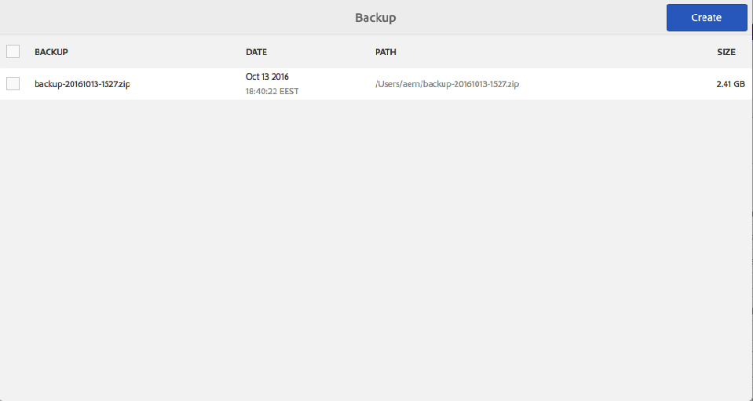

# Back-up en herstel{#backup-and-restore}

Er zijn twee manieren om back-ups te maken van opslagplaats-inhoud in AEM:

* U kunt een externe back-up van de opslagplaats maken en deze op een veilige locatie opslaan. Als de repository wordt afgebroken, kunt u deze terugzetten naar de vorige status.
* U kunt interne versies van de inhoud van de opslagplaats maken. Deze versies worden samen met de inhoud opgeslagen in de opslagplaats, zodat u snel knooppunten en bomen kunt herstellen die u hebt gewijzigd of verwijderd.

## Algemeen {#general}

De hier beschreven aanpak is van toepassing op systeemback-up en -herstel.

Als u een back-up moet maken van een kleine hoeveelheid inhoud die verloren gaat en/of deze moet herstellen, is het niet noodzakelijk dat het systeem wordt hersteld:

* U kunt de gegevens van een ander systeem ophalen via een pakket
* of u herstelt de back-up op een tijdelijk systeem, maakt een inhoudspakket en implementeert dit op het systeem, waar deze inhoud ontbreekt.

Zie [Back-up van pakketten](/help/sites-administering/backup-and-restore.md#package-backup) hieronder voor meer informatie.

## Timing {#timing}

Voer geen back-up uit parallel aan de afvalophaling van de datastore, omdat dit de resultaten van beide processen kan beschadigen.

## Offline back-up {#offline-backup}

U kunt altijd een offline back-up maken. Dit vereist een onderbreking van AEM, maar kan in termen van vereiste tijd in vergelijking met een online steun behoorlijk efficiënt zijn.

In de meeste gevallen gebruikt u een momentopname van het bestandssysteem om op dat moment een alleen-lezen kopie van de opslag te maken. Voer de volgende stappen uit om een offline back-up te maken:

* de toepassing stoppen
* een back-up van een momentopname maken
* de toepassing starten

Aangezien de momentopnamesteun gewoonlijk slechts een paar seconden neemt, is de volledige onderbreking minder dan een paar minuten.

## Onlineback-up {#online-backup}

Deze back-upmethode maakt een back-up van de gehele opslagplaats, inclusief alle toepassingen die erin worden geïmplementeerd, zoals AEM. De back-up bestaat uit inhoud, versiegeschiedenis, configuratie, software, hotfixes, aangepaste toepassingen, logbestanden, zoekindexen enzovoort. Als u zich het groeperen gebruikt en als de gedeelde omslag een subdirectory van `crx-quickstart` (of fysiek, of het gebruiken van een softlink) is, wordt de gedeelde folder ook gesteund.

U kunt de volledige opslagplaats (en alle toepassingen) later herstellen.

Deze methode werkt als een &quot;hot&quot; of &quot;online&quot; back-up, zodat deze kan worden uitgevoerd terwijl de opslagplaats actief is. Daarom is de opslagplaats bruikbaar terwijl de back-up wordt uitgevoerd. Deze methode werkt voor de standaardinstellingen, gebaseerd op Tar-opslag, repository&#39;s.

Bij het maken van een back-up hebt u de volgende opties:

* Back-up maken op een directory met AEM geïntegreerde back-upprogramma.
* Back-ups maken van een map met behulp van een bestandssysteemmomentopname

In elk geval maakt de back-up een afbeelding (of opname) van de opslagplaats. Vervolgens moet de back-upagent van het systeem ervoor zorgen dat dit image daadwerkelijk wordt overgebracht naar een speciaal back-upsysteem (tapestation).

>[!NOTE]
>
>Als AEM functie voor online back-up wordt gebruikt op een AEM instantie met een aangepaste binlobstore-configuratie, wordt aangeraden het pad van de datastore te configureren zodat deze zich buiten de map &quot; `crx-quickstart`&quot; bevindt en afzonderlijk een back-up van de datastore te maken.

>[!CAUTION]
>
>Bij de online back-up wordt alleen een back-up van het bestandssysteem gemaakt. Als u de inhoud van de opslagplaats en/of de gegevensopslagbestanden in een database opslaat, moet van die database een aparte back-up worden gemaakt. Als u AEM gebruikt met MongoDB, zie documentatie over hoe te om [inheemse reservehulpmiddelen MongoDB ](https://docs.mongodb.org/manual/tutorial/backup-with-mongodump/) te gebruiken.

### AEM online back-up {#aem-online-backup}

Met een online back-up van uw opslagplaats kunt u back-upbestanden maken, downloaden en verwijderen. Het is een &quot;hot&quot; of &quot;online&quot; back-upfunctie, die dus kan worden uitgevoerd terwijl de opslagplaats normaal wordt gebruikt in de lees-schrijfmodus.

>[!CAUTION]
>
>Voer AEM Online back-up niet tegelijk uit met [Verzameling van afval van datastore](/help/sites-administering/data-store-garbage-collection.md) of [Revision Cleanup](/help/sites-deploying/revision-cleanup.md#how-to-run-offline-revision-cleanup). Dit heeft een negatief effect op de systeemprestaties.

Wanneer u een back-up start, kunt u een **Doelpad** en/of een **Vertraging** opgeven.

**DoelpadDe** back-upbestanden worden meestal opgeslagen in de bovenliggende map van de map waarin het JAR-bestand (.jar) voor quickstart wordt opgeslagen. Bijvoorbeeld, als u het AEM jar dossier onder /InstallationKits/AEM wordt gevestigd, dan zal de steun onder /InstallationKits worden geproduceerd. U kunt ook een doel opgeven op de gewenste locatie.

Als **TargetPath** een folder is, wordt het beeld van de bewaarplaats gecreeerd in deze folder. Als dezelfde map meerdere malen (of altijd) wordt gebruikt voor het opslaan van een back-up,

* Gewijzigde bestanden in de opslagplaats worden dienovereenkomstig gewijzigd in het TargetPath-bestand
* verwijderde bestanden in de gegevensopslagruimte worden verwijderd in het TargetPath-bestand
* gemaakte bestanden in de repository worden gemaakt in het TargetPath

>[!NOTE]
>
>Als **TargetPath** is ingesteld op bestandsnaam met de extensie **.zip**, wordt van de opslagplaats een back-up gemaakt in een tijdelijke map en wordt de inhoud van deze tijdelijke map gecomprimeerd en opgeslagen in het ZIP-bestand.
>
>Deze aanpak wordt ontmoedigd, omdat
>
>* hiervoor is tijdens het back-upproces extra schijfruimte nodig (tijdelijke map plus het ZIP-bestand)
>* het compressieproces wordt uitgevoerd door de gegevensopslagplaats en kan de prestaties ervan beïnvloeden.
>* Het vertraagt het back-upproces.
>* Tot Java 1.6 kan Java alleen ZIP-bestanden maken van maximaal 4 gigabyte.

>
>
Als u een ZIP als reserveformaat moet tot stand brengen, zou u steun aan een folder moeten en dan een compressieprogramma gebruiken om het ZIP dossier tot stand te brengen.

**** DelayGeeft een tijdvertraging (in milliseconden) aan, zodat de prestaties van de opslagplaats niet worden beïnvloed. Standaard wordt de back-up van de opslagplaats op volledige snelheid uitgevoerd. U kunt het maken van een online back-up vertragen, zodat andere taken niet worden vertraagd.

Wanneer u een zeer grote vertraging gebruikt, moet u ervoor zorgen dat de online back-up niet meer dan 24 uur in beslag neemt. Als dit het geval is, verwijdert u deze reservekopie, omdat deze mogelijk niet alle binaire elementen bevat.
Een vertraging van 1 milliseconde resulteert doorgaans in 10% CPU-gebruik en een vertraging van 10 milliseconden resulteert meestal in minder dan 3% CPU-gebruik. De totale vertraging in seconden kan als volgt worden geschat: Grootte opslagplaats in MB, vermenigvuldigd met vertraging in milliseconden, gedeeld door 2 (als de optie ZIP wordt gebruikt), of gedeeld door 4 (wanneer het steunen aan een folder). Dat betekent dat een back-up naar een directory van een 200 MB opslagplaats met een vertraging van 1 ms de back-uptijd met ongeveer 50 seconden verhoogt.

>[!NOTE]
>
>Zie [Hoe AEM Online Back-up werkt](#how-aem-online-backup-works) voor interne details van het proces.

Een back-up maken:

1. Meld u aan bij AEM als beheerder.

1. Ga naar **Hulpmiddelen - Verrichtingen - Steun.**
1. Klik **Maken**. De back-upconsole wordt geopend.

   

1. Geef op de back-upconsole het **[Doelpad](#aem-online-backup)** en **[Vertraging](#aem-online-backup)** op.

   

   >[!NOTE]
   >
   >De back-upconsole is ook beschikbaar via:
   >
   >
   >` https://<*hostname*>:<*port-number*>/libs/granite/backup/content/admin.html`

1. Klik **Opslaan**, een voortgangsbalk geeft de voortgang van de back-up aan.

   >[!NOTE]
   >
   >U kunt **Annuleren** op elk gewenst moment een actieve back-up maken.

1. Wanneer de back-up is voltooid, worden de ZIP-bestanden weergegeven in het back-upvenster.

   

   >[!NOTE]
   >
   >Back-upbestanden die u niet meer nodig hebt, kunnen met de console worden verwijderd. Selecteer het back-upbestand in het linkerdeelvenster en klik op **Delete**.

   >[!NOTE]
   >
   >Als u een back-up hebt gemaakt in een map: nadat het back-upproces is voltooid, schrijft AEM niet naar de doelmap.

### AEM online back-up automatiseren {#automating-aem-online-backup}

Indien mogelijk, zou de online steun moeten in werking worden gesteld wanneer er weinig lading op het systeem, bijvoorbeeld in de ochtend is.

Back-ups kunnen worden geautomatiseerd met de HTTP-clients `wget` of `curl`. In het volgende voorbeeld ziet u hoe u back-ups kunt automatiseren met curl.

#### Back-up maken van de standaarddoelmap {#backing-up-to-the-default-target-directory}

>[!CAUTION]
>
>In het volgende voorbeeld zouden diverse parameters in `curl` bevel voor uw instantie kunnen moeten worden gevormd; bijvoorbeeld de hostnaam ( `localhost`), poort ( `4502`), het beheerderswachtwoord ( `xyz`) en de bestandsnaam ( `backup.zip`).

```shell
curl -u admin:admin -X POST http://localhost:4502/system/console/jmx/com.adobe.granite:type=Repository/op/startBackup/java.lang.String?target=backup.zip
```

Het back-upbestand/de back-upmap wordt gemaakt op de server in de bovenliggende map van de map die de map `crx-quickstart` bevat (net als wanneer u de back-up maakt met de browser). Als u bijvoorbeeld AEM hebt geïnstalleerd in de map `/InstallationKits/crx-quickstart/`, wordt de back-up gemaakt in de map `/InstallationKits`.

De curl-opdracht wordt onmiddellijk geretourneerd, dus u moet deze map controleren om te zien wanneer het zip-bestand gereed is. Tijdens het maken van de back-up kan een tijdelijke map (met de naam op basis van die van het uiteindelijke ZIP-bestand) worden weergegeven, waarna dit bestand wordt gecomprimeerd. Bijvoorbeeld:

* naam van resulterend ZIP-bestand: `backup.zip`
* naam van tijdelijke map: `backup.f4d5.temp`

#### Back-up maken op een niet-standaard doelmap {#backing-up-to-a-non-default-target-directory}

Gewoonlijk wordt het back-upbestand/de back-upmap gemaakt op de server in de bovenliggende map van de map die de map `crx-quickstart` bevat.

Als u de back-up (van beide soorten) op een andere locatie wilt opslaan, kunt u een absoluut pad instellen naar de parameter `target` in de opdracht `curl`.

Bijvoorbeeld om `backupJune.zip` in de folder `/Backups/2012` te produceren:

```shell
curl -u admin:admin -X POST http://localhost:4502/system/console/jmx/com.adobe.granite:type=Repository/op/startBackup/java.lang.String?target=/Backups/2012/backupJune.zip"
```

>[!CAUTION]
>
>Wanneer u een andere toepassingsserver gebruikt (zoals JBoss), werkt de online back-up mogelijk niet naar behoren, omdat de doelmap niet beschrijfbaar is. Neem in dit geval contact op met de ondersteuningsafdeling.

>[!NOTE]
>
>Een steun kan ook worden teweeggebracht [gebruikend de MBans die door AEM](/help/sites-administering/jmx-console.md) worden verstrekt.

### Back-up van momentopname van bestandssysteem {#filesystem-snapshot-backup}

Het hier beschreven proces is speciaal geschikt voor grote opslagplaatsen.

>[!NOTE]
>
>Als u deze back-upbenadering wilt gebruiken, moet uw systeem bestandssysteemmomentopnamen ondersteunen. Voor Linux betekent dit bijvoorbeeld dat uw bestandssystemen op een logisch volume moeten worden geplaatst.

1. Voer een momentopname van het AEM in.

1. De momentopname van het bestandssysteem koppelen.
1. Maak een back-up en maak de opname ongedaan.

### Hoe AEM online back-up werkt {#how-aem-online-backup-works}

AEM Online back-up bestaat uit een reeks interne acties om de integriteit te garanderen van de gegevens waarvan een back-up wordt gemaakt en van de back-upbestanden die worden gemaakt. Deze worden hieronder weergegeven voor de gegadigden.

Voor de online back-up wordt het volgende algoritme gebruikt:

1. Wanneer u een ZIP-bestand maakt, moet u eerst de doelmap maken of vinden.

   * Als u een back-up maakt van een ZIP-bestand, wordt een tijdelijke map gemaakt. De mapnaam begint met `backup.` en eindigt met `.temp`; bijvoorbeeld `backup.f4d3.temp`.
   * Als u een back-up maakt naar een map, wordt de naam gebruikt die in het doelpad is opgegeven. Een bestaande map kan worden gebruikt, anders wordt een nieuwe map gemaakt.

      Er wordt een leeg bestand met de naam `backupInProgress.txt` gemaakt in de doelmap wanneer de back-up wordt gestart. Dit bestand wordt verwijderd wanneer de back-up is voltooid.

1. De bestanden worden van de bronmap naar de doelmap (of de tijdelijke map wanneer u een ZIP-bestand maakt) gekopieerd. De segmentstore wordt gekopieerd vóór de datastore om beschadiging van de opslagplaats te voorkomen. De index- en cachegegevens worden weggelaten wanneer u de back-up maakt. Als gevolg hiervan worden gegevens van `crx-quickstart/repository/cache` en `crx-quickstart/repository/index` niet opgenomen in de back-up. De voortgangsbalkindicator van het proces ligt tussen 0% - 70% wanneer u een ZIP-bestand maakt, of 0% - 100% als er geen ZIP-bestand wordt gemaakt.

1. Als de back-up wordt gemaakt naar een bestaande map, worden de &quot;oude&quot; bestanden in de doelmap verwijderd. Oude bestanden zijn bestanden die niet in de bronmap staan.

De bestanden worden in vier fasen naar de doelmap gekopieerd:

1. In het eerste kopieerstadium (voortgangsindicator 0% - 63% bij het maken van een ZIP-bestand of 0% - 90% als er geen ZIP-bestand is gemaakt) worden alle bestanden gekopieerd terwijl de opslagplaats op de normale manier wordt uitgevoerd. Het proces bestaat uit twee fasen:

   * Fase A - alles wordt gekopieerd behalve de datastore (met vertraging).
   * Fase B - alleen de datastore wordt gekopieerd (met vertraging).

1. In het tweede kopieerwerkgebied (voortgangsindicator 63% - 65,8% bij het maken van een ZIP-bestand of 90% - 94% als er geen ZIP-bestand is gemaakt) worden alleen bestanden gekopieerd die in de bronmap zijn gemaakt of gewijzigd sinds het eerste kopieerwerkgebied is gestart. Afhankelijk van de activiteit van de opslagplaats, zou dit zich van geen dossiers, tot een significant aantal dossiers kunnen uitstrekken (omdat het eerste dossier van het dossierexemplaar gewoonlijk veel tijd vergt). Het kopieerproces is vergelijkbaar met het eerste stadium (fase A en fase B met vertraging).
1. In het derde kopieerstadium (voortgangsindicator 65,8% - 68,6% bij het maken van een ZIP-bestand of 94% - 98% als er geen ZIP-bestand is gemaakt) worden alleen bestanden gekopieerd die in de bronmap zijn gemaakt of gewijzigd sinds de tweede kopieerfase is gestart. Afhankelijk van de activiteit van de gegevensopslagruimte zijn er mogelijk geen bestanden om te kopiëren, of een zeer klein aantal bestanden (omdat het tweede bestand meestal snel wordt gekopieerd). Het kopieerproces is vergelijkbaar met de tweede fase - Fase A en Fase B, maar zonder vertraging.
1. Fase 1 tot en met 3 van de bestandskopie wordt allemaal tegelijk uitgevoerd terwijl de opslagplaats actief is. Alleen bestanden die in de bronmap zijn gemaakt of gewijzigd sinds het derde kopieerwerkgebied is gestart, worden gekopieerd. Afhankelijk van de activiteit van de gegevensopslagruimte zijn er mogelijk geen bestanden om te kopiëren, of een zeer, zeer klein aantal bestanden (omdat het tweede bestand meestal zeer snel wordt gekopieerd). Progress-indicator 68,6% - 70% bij het maken van een ZIP-bestand of 98% - 100% als er geen ZIP-bestand is gemaakt. Het kopieerproces is vergelijkbaar met de derde fase.
1. Afhankelijk van het doel:

   * Als een ZIP-bestand is opgegeven, wordt dit nu gemaakt in de tijdelijke map. Voortgangsindicator 70% - 100%. De tijdelijke map wordt vervolgens verwijderd.
   * Als het doel een map was, wordt het lege bestand `backupInProgress.txt` verwijderd om aan te geven dat de back-up is voltooid.

## Back-up {#restoring-the-backup} herstellen

U kunt een back-up als volgt herstellen:

* Als u een back-up van de bestandssysteemmomentopname hebt uitgevoerd, kunt u gewoon een image van het systeem herstellen.
* Als u de back-up als een ZIP-bestand hebt gemaakt, pakt u de inhoud uit in een nieuwe map en start u AEM vanaf die locatie.

## Back-up van pakket {#package-backup}

Als u een back-up wilt maken van inhoud en deze wilt herstellen, gebruikt u een van de pakketbeheerprogramma&#39;s, waarmee u back-ups kunt maken van inhoud en deze weer kunt terugzetten. Pakketbeheer biedt meer flexibiliteit bij het definiëren en beheren van pakketten.

Zie [Werken met pakketten](/help/sites-administering/package-manager.md) voor meer informatie over de functies en voordelen van elk van deze afzonderlijke indelingen voor inhoudspakketten.

### Toepassingsgebied van back-up {#scope-of-backup}

Wanneer u reservekopieën maakt van knooppunten met de functie Pakketbeheer of Inhoud Zipper, slaat CRX de volgende gegevens op:

* De inhoud van de opslagplaats onder de structuur die u hebt geselecteerd.
* De het typedefinities van Knoop die voor de inhoud worden gebruikt u file.
* De naamruimtedefinities die worden gebruikt voor de inhoud waarvan u een back-up maakt.

Bij het maken van een back-up gaat AEM de volgende informatie verloren:

* De versiegeschiedenis.

