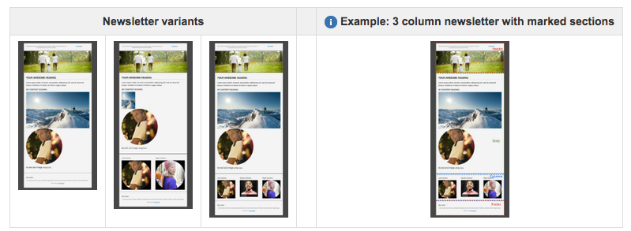

# Aanbevolen procedures voor e-mailsjablonen {#best-practices-for-email-templates}

>[!CAUTION]
>
>De AEM e-mailcomponenten zijn afgekeurd. Vanwege de aard van e-mail, waarin inhoud en stijl worden samengevoegd, worden de e-mailcomponenten die door AEM buiten de box worden geleverd van beperkte hergebruik voor klanten omdat aangepaste stijlen moeten worden geïmplementeerd in alle componenten die vereist zijn voor projecten.
>
>E-mailcomponenten kunnen op projectniveau worden geïmplementeerd en de verouderde AEM e-mailcomponenten laten zien hoe dat kan worden bereikt. Deze vervangen onderdelen mogen echter niet worden gebruikt voor projecten.

In dit document worden enkele van de aanbevolen procedures beschreven voor het ontwerpen van e-mailberichten. Dit resulteert in een goed ontwikkelde sjabloon voor e-mailcampagnes.

De demo-campagne in AEM volgt al deze beste praktijken. Hoe de beste praktijken in de demo campagne worden uitgevoerd wordt beschreven voor elke beste praktijken.

Gebruik deze aanbevolen procedures bij het maken van uw eigen nieuwsbrief.

>[!NOTE]
>
>Alle inhoud van de campagne moet worden gemaakt onder een `master` pagina van het type `cq/personalization/components/ambitpage`.
>
>Bijvoorbeeld als uw geplande campagnestructuur ongeveer als volgt is
>
>`/content/campaigns/teasers/en/campaign-promotion-global`
>
>Zorg ervoor dat het onder een `master` pagina staat
>
>`/content/campaigns/teasers/master/en/campaign-promotion-global`

>[!NOTE]
>
>Wanneer u een mailsjabloon voor Adobe Campaign maakt, moet u de eigenschap **Mapping** met de waarde **mapRecipient** opnemen in het knooppunt **jcr:content** van de sjabloon, anders kunt u de Adobe Campaign-sjabloon niet selecteren in **Pagina-eigenschappen** van AEM (veld is uitgeschakeld).

## Sjabloon/pagina-component {#template-page-component}

***/libs/mcm/campagne/components/campagne_newsletterpage***

<table>
 <tbody>
  <tr>
   <td><strong>Beste praktijken</strong></td>
   <td><strong>Implementatie</strong></td>
  </tr>
  <tr>
   <td>
Geef het documenttype op om consistente rendering te garanderen.
 
DOCTYPE aan het begin toevoegen (HTML of XHTML)
 </td>
   <td>
Kan worden geconfigureerd door het ontwerp waardoor de eigenschap <i>cq:doctype</i> in<i>"/etc/designs/default/jcr:content/campagne_newsletterpage" wordt gewijzigd</i>
 
De standaardwaarde is "XHTML":
 
&lt;!DOCTYPE html PUBLIC "-//W3C//DTD XHTML 1.0 Transitional//EN" "https://www.w3.org/TR/xhtml1/DTD/xhtml1-transitional.dtd"&gt;
 
Kan worden gewijzigd in "HTML_5":
 
&lt;!DOCTYPE HTML&gt;
 </td>
  </tr>
  <tr>
   <td>
Geef een tekendefinitie op om ervoor te zorgen dat speciale tekens correct worden weergegeven.
 
CHARSET-declaratie (bijvoorbeeld iso-8859-15, UTF-8) toevoegen aan &lt;head&gt;
 </td>
   <td>
Is ingesteld op UTF-8.
 
&lt;meta http-equiv="content-type" content="text/html; charset=UTF-8"&gt;
 </td>
  </tr>
  <tr>
   <td>
Codeer alle structuur met behulp van het &lt;table&gt;element. Voor complexere lay-outs moet u tabellen nesten om complexe structuren te maken.
 
E-mail moet er goed uitzien, zelfs zonder css.
 </td>
   <td>
Tabellen worden in de gehele sjabloon gebruikt voor het structureren van inhoud. Momenteel met maximaal vier geneste tabellen (1 basislabel + max.) 3 nestniveaus)
 
&lt;div&gt;-tags worden alleen in de ontwerpmodus gebruikt voor een juiste componentbewerking.
 </td>
  </tr>
  <tr>
   <td>Gebruik elementkenmerken (zoals celopvulling, valsing en breedte) om tabelafmetingen in te stellen. Dit dwingt een box-model structuur.</td>
   <td>
Alle tabellen bevatten noodzakelijke kenmerken, zoals <i>rand</i>, <i>celopvulling</i>, <i>celafstand</i> en <i>breedte</i>.
 
Om de plaatsing van elementen in tabellen te harmoniseren, hebben alle tabelcellen het kenmerk <i>valign="top"</i> dat wordt ingesteld.
 </td>
  </tr>
  <tr>
   <td>
Indien mogelijk rekening houden met de vriendelijkheid van mobiele apparaten. Gebruik mediaquery's om de tekstgrootte op kleine schermen te verhogen en selecteer aanraakgebieden met de grootte van het blokje voor koppelingen.
 
Maak een e-mail ontvankelijk als het ontwerp het toestaat.
 </td>
   <td>Voor zover CSS-stijlen worden gebruikt om demonstratieontwerp te illustreren, worden mediaquery's gebruikt om een mobiele versie aan te bieden.</td>
  </tr>
  <tr>
   <td>Inline CSS is beter dan het plaatsen van alle CSS aan het begin.</td>
   <td>
Om de onderliggende HTML-structuur beter aan te tonen en de mogelijkheid om de nieuwsbrief-structuur aan te passen te vereenvoudigen, zijn slechts enkele CSS-definities gealigneerd.
 
Basisstijlen en sjabloonvariaties zijn geëxtraheerd naar een stijlblok in de &lt;head&gt; van de pagina. Bij de definitieve indiening van de nieuwsbrief moeten deze CSS-definities in de HTML worden opgenomen. Een automatisch inlineringsmechanisme is gepland, maar is momenteel niet beschikbaar.
 </td>
  </tr>
  <tr>
   <td>Houd uw CSS eenvoudig. Vermijd samengestelde stijldeclaraties, korte code, CSS-lay-outeigenschappen, complexe kiezers en pseudo-elementen.</td>
   <td>Voor zover CSS-stijlen worden gebruikt om demonstratieontwerp te illustreren, worden de CSS-aanbevelingen gevolgd.</td>
  </tr>
  <tr>
   <td>E-mails moeten een maximale breedte van 600-800 pixels hebben. Hierdoor kunnen ze zich beter gedragen binnen de grootte van het voorvertoningsvenster die door veel clients wordt geboden.</td>
   <td>De <i>breedte</i> van de inhoudstabel is beperkt tot 600px in duoontwerp.</td>
  </tr>
 </tbody>
</table>

### Afbeeldingen {#images}

/libs/mcm/campagne/componenten/image

| **Beste praktijken** | **Implementatie** |
|---|---|
| Alternatieve ** kenmerken toevoegen aan afbeeldingen | Het kenmerk *alt* is gedefinieerd als verplicht voor de afbeeldingscomponent. |
| JPG- *indeling* gebruiken in plaats van *png* -indeling voor afbeeldingen | Afbeeldingen worden altijd als JPG weergegeven door de afbeeldingscomponent. |
| Gebruik `` elementen in plaats van achtergrondafbeeldingen in een tabel. | Er worden geen achtergrondafbeeldingsgegevens gebruikt in de sjablonen. |
| Kenmerkstijl=&quot;weergaveblok&quot; toevoegen aan afbeeldingen. Staat toe om goed op Gmail te tonen. | Alle afbeeldingen bevatten standaard het kenmerk *style=&quot;display block&quot;* . |

### Tekst en koppelingen {#text-and-links}

/libs/mcm/campagne/components/heading, /libs/mcm/campagne/components/textiel

<table>
 <tbody>
  <tr>
   <td><strong>Beste praktijken</strong></td>
   <td><strong>Implementatie</strong></td>
  </tr>
  <tr>
   <td>HTML &lt;font&gt; gebruiken in plaats van stijl in CSS (font-family)</td>
   <td>De RichTextEditor (bijvoorbeeld in de component van de textielafbeelding) ondersteunt nu het kiezen en toepassen van lettertypefamilies en tekengrootten op geselecteerde teksten. Ze worden weergegeven als &lt;font&gt;-tags.</td>
  </tr>
  <tr>
   <td>Gebruik standaardlettertypen voor verschillende platforms, zoals <i>Arial, Verdana, Georgia</i> en <i>Times New Roman</i>.</td>
   <td>
Afhankelijk van het ontwerp van de nieuwsbrief.
 
Voor het demo-ontwerp wordt het lettertype "Helvetica" gebruikt, maar het wordt teruggezet naar het algemene sans-serif-lettertype, indien dit niet aanwezig is.
 </td>
  </tr>
 </tbody>
</table>

### Algemeen {#generic}

| **Beste praktijken** | **Implementatie** |
|---|---|
| Gebruik W3C-validatie om de HTML-code te corrigeren. Zorg ervoor dat alle open labels goed zijn gesloten. | Code is gevalideerd. Voor XHTML-overgangsdocument ontbreekt alleen het ontbrekende xmlns-kenmerk voor het `<html>` element. |
| Let niet op met JavaScript of Flash - deze technologieën worden grotendeels niet ondersteund door e-mailclients. | JavaScript en Flash worden niet gebruikt in de sjabloon voor nieuwsbrieven. |
| Voeg een gewone tekstversie toe voor het verzenden van meerdere onderdelen. | Er is een nieuwe widget toegevoegd aan de pagina-eigenschappen om eenvoudig een plaintekstversie uit de pagina-inhoud te extraheren. Dit kan als uitgangspunt voor de definitieve plaintext versie worden gebruikt. |

## Sjablonen en voorbeelden voor nieuwsbrieven voor campagnes {#campaign-newsletter-templates-and-examples}

AEM wordt geleverd met verschillende sjablonen en componenten uit de doos die u kunt gebruiken om campagnebulletins te maken. U kunt deze sjablonen en componenten gebruiken om uw aangepaste nieuwsbrieven te maken.

### Sjablonen {#templates}

Er zijn drie enigszins verschillende sjabloontypen beschikbaar uit het vak om een solide basis aan te bieden en de verscheidenheid aan mogelijkheden voor inhoudsstroom uit te breiden. U kunt deze eenvoudig gebruiken om een aangepaste nieuwsbrief te maken.

Alles heeft een **koptekst**, een **voettekst** en een **hoofdtekst** . Onder de hoofdsectie verschilt elke sjabloon in **kolomontwerp** (1, 2 of 3 kolommen).

### Onderdelen {#components}

Er zijn momenteel [zeven componenten beschikbaar voor gebruik binnen campagnemalplaatjes](/help/sites-authoring/adobe-campaign-components.md). Deze componenten zijn allemaal gebaseerd op de Adobe-opmaaktaal **HTL**.

| **Componentnaam** | **Componentpad** |
|---|---|
| Kop | /libs/mcm/campagne/componenten/kop |
| Afbeelding | /libs/mcm/campagne/componenten/image |
| Tekst&amp;personalisatie | /libs/mcm/campagne/componenten/personalisatie |
| Textimage | /libs/mcm/campagne/onderdelen/textielafbeelding |
| Koppeling | /libs/mcm/campagne/componenten/reference |
| Scene7-afbeeldingssjabloon | /libs/mcm/campagne/s7image |
| Gerichte referentie | /libs/mcm/campagne/componenten/reference |

>[!NOTE]
>
>Deze componenten zijn geoptimaliseerd voor e-mailinhoud. dat wil zeggen dat zij zich houden aan de beste praktijken die in dit document worden beschreven. Het gebruiken van andere uit-van-de-doos componenten zal gewoonlijk deze regels overtreden.

Deze componenten worden gedetailleerd beschreven in [Adobe Campaign-componenten](/help/sites-authoring/adobe-campaign-components.md).