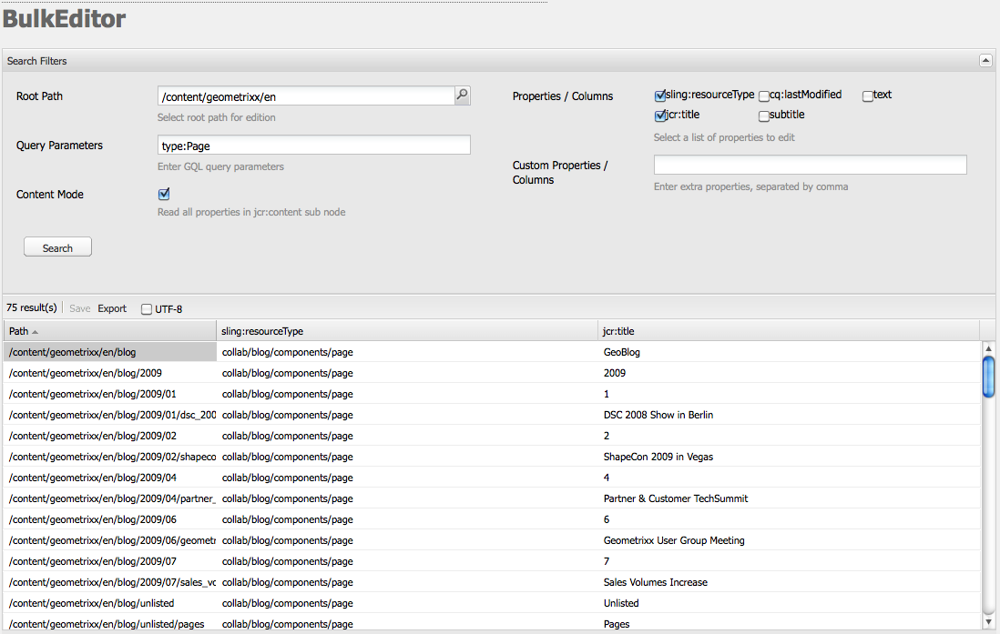

# De Bulkeditor{#the-bulk-editor}

Met de Bulkeditor kunt u op efficiënte wijze pagina&#39;s bewerken wanneer de context van de visuele pagina niet nodig is, omdat u hiermee de volgende mogelijkheden hebt:

* zoeken naar (en weergeven) inhoud van meerdere pagina&#39;s; dit gebeurt met GQL (Google Query Language)
* deze inhoud rechtstreeks in de Bulkeditor bewerken
* de wijzigingen opslaan (op de pagina&#39;s die beginnen)
* deze inhoud exporteren naar een spreadsheetbestand met tabs als scheidingsteken (.tsv)

>[!NOTE]
>
>U kunt ook inhoud importeren in de opslagplaats, maar dit is standaard uitgeschakeld voor de Bulk-editor, zoals beschikbaar in de **Gereedschappen** console.

In deze sectie wordt beschreven hoe u met de Bulk-editor in de **Gereedschappen** console. Gewoonlijk gebruiken beheerders de Bulk-editor om meerdere items te zoeken en bewerken. Dit wordt gedaan door de lijst te bevolken gebruikend een vraag GQL en dan door de inhoudspunten te selecteren om aan te werken. Auteurs gebruiken doorgaans de Bulk-editor als onderdeel van een aangepaste Bulk Editor-toepassing die toegankelijk is via de [productaanbieding](/help/sites-authoring/default-components.md#productlist) component.

>[!CAUTION]
>
>Met de [afgekeurd van de klassieke gebruikersinterface](/help/release-notes/deprecated-removed-features.md) in AEM 6.4 is de Bulk Editor eveneens afgekeurd en is Adobe dus niet van plan de Bulk Editor verder te verbeteren.

## Voorbeeld van hoofdletters/kleine letters voor de Bulkeditor {#example-use-case-for-the-bulk-editor}

Als u bijvoorbeeld alle namen en e-mailadressen nodig hebt van gebruikers die een bepaalde enquête hebben ingevuld, kan de Bulk-editor die informatie verschaffen en kunt u deze naar een werkblad exporteren.

Een voorbeeld om een dergelijk gebruiksgeval te illustreren is opgenomen in de website van de Geometrixx:

1. Ga naar de **Ondersteuning** en vervolgens naar de **Tevredenheid van de Dienst van de klant** enquête.
1. **Bewerken** de **Begin van formulier** alinea. Klik in het dialoogvenster op de knop **Geavanceerd** tabblad, vouwt u de **Configuratie van handelingen** en klik vervolgens op **Gegevens weergeven...**.

   

1. De Bulkeditor is volledig aanpasbaar, maar in dit voorbeeld staat de Bulkeditor gebruikers niet toe de inhoud te bewerken, maar laat ze de informatie alleen exporteren naar een spreadsheet.

   

## De Bulkeditor gebruiken {#how-to-use-the-bulk-editor}

Met de Bulkeditor kunt u:

* [zoeken naar inhoud die op vraagparameters wordt gebaseerd, om gespecificeerde eigenschappen van de resultaten in kolommen te tonen, deze inhoud uit te geven en de veranderingen te bewaren](#searching-and-editing-content)
* [om deze inhoud naar een door tabs gescheiden spreadsheet te exporteren](#exporting-content)

* [inhoud importeren uit een spreadsheet met tabs als scheidingsteken](#importing-content)

### Inhoud zoeken en bewerken {#searching-and-editing-content}

De Bulkeditor gebruiken om meerdere items tegelijk te bewerken:

1. In de **Gereedschappen** console, klik **Importeurs** map om deze uit te vouwen.
1. Dubbelklik op de knop **Bulkeditor**.
1. Voer uw selectievereisten in:

<table>
 <tbody>
  <tr>
   <td>Veld</td>
   <td>Eigenschap</td>
  </tr>
  <tr>
   <td>Hoofdpad</td>
   <td>Hiermee geeft u het hoofdpad aan dat door de Bulk-editor wordt gezocht.  Bijvoorbeeld: <code>/content/geometrixx/en</code>. De Bulk-editor zoekt naar alle onderliggende knooppunten.</td>
  </tr>
  <tr>
   <td>Zoekparameters</td>
   <td>Gebruikend parameters GQL, ga het onderzoekskoord in u de BulkRedacteur wilt zoeken in de bewaarplaats. Bijvoorbeeld: <code>type:Page</code> zoekt naar alle pagina's in het hoofdpad; <code>text:professional</code> zoekt naar alle pagina's waarop het woord "professioneel" staat, en <code>"jcr:title":English</code> zoekt naar alle pagina's die "Engels"als titel hebben. U kunt alleen naar tekenreeksen zoeken.</td>
  </tr>
  <tr>
   <td>Inhoudsmodus, selectievakje</td>
   <td>Schakel dit selectievakje in zodat u eigenschappen kunt lezen in het dialoogvenster <code>jcr:content</code> subknooppunt van de zoekresultaten, indien aanwezig. Alleen gebruiken voor pagina's. Namen van eigenschappen beginnen met <code>"jcr:content/"</code></td>
  </tr>
  <tr>
   <td>Eigenschappen/kolommen</td>
   <td>Schakel de selectievakjes in voor de eigenschappen die de Bulk-editor moet retourneren. De eigenschappen die u selecteert, zijn de kolomkoppen in het resultatenvenster. Standaard wordt het knooppuntpad weergegeven in de resultaten.</td>
  </tr>
  <tr>
   <td>Aangepaste eigenschappen/kolommen</td>
   <td>Voer andere eigenschappen in die niet in de <strong>Eigenschappen/kolommen</strong> veld. Deze aangepaste eigenschappen worden weergegeven in het resultatenvenster. U kunt meerdere eigenschappen toevoegen door een komma te gebruiken om eigenschappen te scheiden. <i>Opmerking:</i> Als u een douanebezit toevoegt dat nog niet bestaat, AEM WCM toont een lege cel. Wanneer u de lege cel wijzigt en deze opslaat, wordt de eigenschap toegevoegd aan het knooppunt. De nieuwe eigenschap moet beperkingen van het knooppunttype en naamruimten van eigenschappen respecteren.</td>
  </tr>
 </tbody>
</table>

Bijvoorbeeld:

1. Klikken **Zoeken**. De resultaten worden weergegeven in de Bulk-editor.
In het bovenstaande voorbeeld worden alle pagina&#39;s die voldoen aan uw zoekcriteria geretourneerd en weergegeven met de gevraagde kolommen.

   

1. Dubbelklik op een cel zodat u wijzigingen kunt aanbrengen.

   

1. Klikken **Opslaan** om uw wijzigingen op te slaan (de **Opslaan** wordt geactiveerd nadat u een cel hebt bewerkt).

   >[!CAUTION]
   >
   >De wijzigingen die u hier aanbrengt, worden geschreven naar de inhoud van de opslagplaats, bijvoorbeeld de pagina waarnaar wordt verwezen in **Pad**.

#### Aanvullende GQL-zoekparameters {#additional-gql-query-parameters}

* **pad:** alleen zoekknooppunten onder dit pad. Als u meer dan één termijn met een wegprefix specificeert, slechts wordt het laatste overwogen.
* **type:** alleen retourknooppunten van het opgegeven knooppunttype. Dit omvat primaire en mixintypes. U kunt meerdere knooppunttypen opgeven die door komma&#39;s worden gescheiden. GQL retourneert knooppunten van een van de opgegeven typen.
* **bestelling:** het resultaat van de opgegeven eigenschappen te bepalen. U kunt meerdere door komma&#39;s gescheiden eigenschapsnamen opgeven. Als u het resultaat in aflopende volgorde wilt rangschikken, plaatst u gewoon een minteken voor de naam van de eigenschap. Bijvoorbeeld de volgorde:-name. Als u een plusteken gebruikt, wordt het resultaat in oplopende volgorde geretourneerd. Dit is ook de standaardinstelling.
* **limiet:** beperkt het aantal resultaten met een interval. Limiet:10..20 Het interval is op nul gebaseerd, het begin is inclusief en het einde is exclusief. U kunt ook een `interval:limit:10..` of `limit:..20`
Als de punten worden weggelaten en slechts één waarde wordt gespecificeerd, GQL keert hoogstens dit aantal resultaten terug. Bijvoorbeeld: `limit:10` (retourneert de eerste tien resultaten).

### Inhoud exporteren {#exporting-content}

Exporteer inhoud indien nodig naar een Excel-werkblad om wijzigingen aan te brengen. U kunt bijvoorbeeld een mailinglijst exporteren en de gebiedscode van alle vermelde telefoonnummers rechtstreeks in Excel wijzigen, of extra regels toevoegen.

Inhoud exporteren:

1. Zoeken naar inhoud zoals beschreven in [Inhoud zoeken en bewerken](#searching-and-editing-content).
1. Klikken **Exporteren** zodat u de wijzigingen kunt exporteren naar een Excel-werkblad met tabs als scheidingsteken. AEM WCM vraagt u waar u het bestand wilt downloaden.

   >[!NOTE]
   >
   >Wijzigingen worden standaard gecodeerd in [Windows-1252](https://en.wikipedia.org/wiki/Windows-1252) (ook bekend als CP-1252). U kunt UTF-8 controleren om de wijzigingen in UTF-8 te exporteren.

   

1. Selecteer de locatie en bevestig dat u het bestand wilt downloaden.
1. Nadat u het bestand hebt gedownload, kunt u het openen vanuit uw spreadsheetprogramma, bijvoorbeeld Microsoft® Excel. Het spreadsheetprogramma importeert het bestand en zet het om in een spreadsheetindeling.

   

### Inhoud importeren {#importing-content}

Standaard is de importfunctionaliteit verborgen wanneer u de Bulk-editor opent. Eenvoudig de parameter toevoegen `hib=false` op de URL wordt het dialoogvenster **Importeren** op de pagina Bulk Editor. U kunt inhoud importeren vanuit elke tab ( `.tsv`). Importeren werkt alleen correct als de kolomkoppen (eerste rij cellen) overeenkomen met de kolomkoppen van de tabel waarnaar u importeert.

>[!NOTE]
>
>Wanneer u inhoud opnieuw importeert, wist u eventuele vorige inhoud voor die knooppunten. Zorg ervoor dat u belangrijke informatie niet overschrijft.

Inhoud importeren:

1. Open de Bulk-editor.
1. Toevoegen `?hib=false` naar de URL, bijvoorbeeld:
   `https://localhost:4502/etc/importers/bulkeditor.html?hib=false`
1. Klikken **Importeren**.
1. Selecteer de `.tsv` bestand. De gegevens worden geïmporteerd in de opslagplaats.
