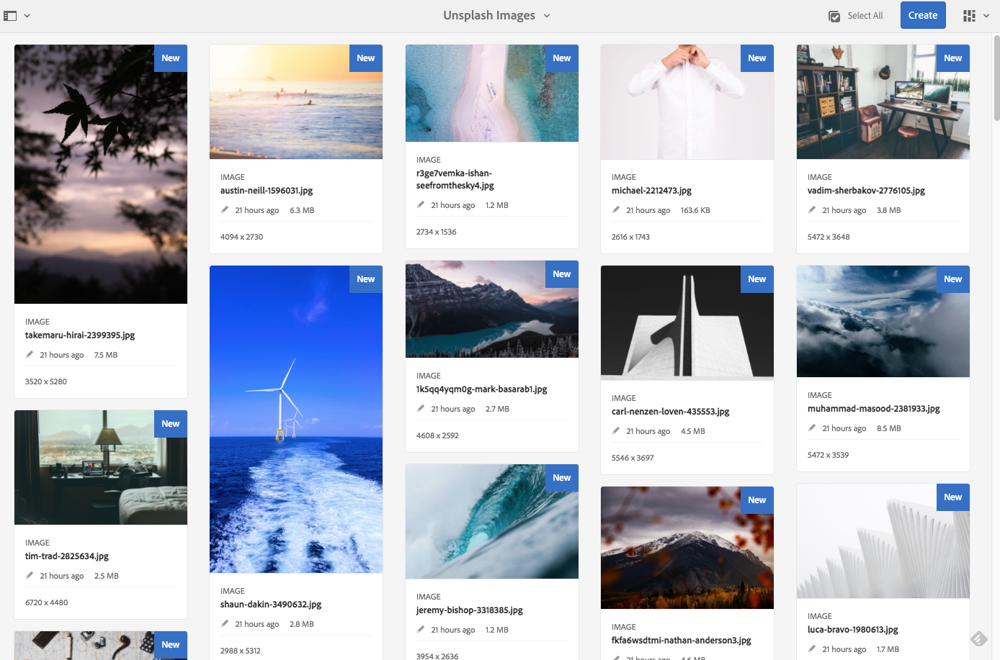
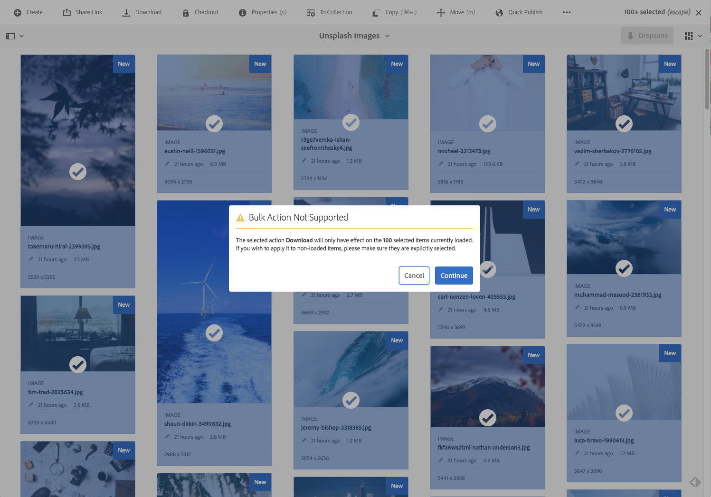

# Verwerking van bulk {#bulk-processing-operations}

## Inleiding {#introduction}

Met de nieuwste versie van AEM is de knop Alles selecteren uitgebreid naar alle weergaven: Lijst, Kolom en Kaart. Met de knop Alles selecteren selecteert u nu alle inhoud in een bepaalde map of verzameling en niet alleen de elementen en pagina&#39;s die zijn geladen en zichtbaar zijn in de clientbrowser.

De belangrijkste acties zijn toegelaten voor de bulkverrichting: **Verplaatsen**, **Verwijderen** en **Kopiëren**. Een nieuw dialoogvenster zal klanten laten weten voor welke acties bulkverwerking niet beschikbaar is.

## Hoe wordt het gebruikt {#how-to-use}

Een nieuwe knop met de naam **Alles selecteren** is toegevoegd aan de Kaart-, Lijst- of Kolomweergave. Deze knop kan in elke weergave worden gebruikt om alle elementen in de gegevensset te selecteren.

In vorige versies van AEM was de selectie beperkt wat in de clientbrowser werd geladen. Deze nieuwe wijzigingen zijn aangebracht om verwarring te voorkomen over het aantal elementen waarop een bulkbewerking wordt uitgevoerd.

Momenteel zijn drie bewerkingen toegevoegd aan bulkverwerking:

* Verplaatsen
* Kopiëren
* Verwijderen

Ondersteuning voor meer bewerkingen wordt in de toekomst toegevoegd.
Als u deze functie wilt gebruiken, moet u naar de map of verzameling navigeren waar u de bulkbewerking op Pagina&#39;s of op Elementen wilt uitvoeren.

Kies vervolgens een van de weergaven, zoals hieronder wordt weergegeven:

### Kaartweergave {#card-view}

### Selectie opheffen in kaartweergave {#bulk-selection-in-card-view}

Elementen of pagina&#39;s kunnen in bulk worden geselecteerd met de opdracht **Alles selecteren** knop rechtsboven:

 

### Lijstweergave {#list-view}

Hetzelfde geldt voor de lijstweergave:

### Bulkselectie in lijstweergave {#bulk-selection-in-list-view}

In de Lijstweergave gebruikt u de optie **Alles selecteren** of schakel het selectievakje links in voor bulksgewijs selecteren.

 

### Kolomweergave {#column-view}

### Bulkselectie in kolomweergave {#bulk-selection-in-column-view}

## Bewerkingen waarvoor bulkfuncties zijn ingeschakeld {#bulk-enabled-operations}

Na de selectie kan een van de drie acties voor bulkactivering worden uitgevoerd: **Verplaatsen**, **Kopiëren** of **Verwijderen**.

Hier, **Verplaatsen** De bewerking wordt uitgevoerd op de hierboven geselecteerde elementen. In om het even welke meningen, zal dit resulteren in alle Activa die naar de gekozen plaats en niet alleen die worden verplaatst die op het scherm worden geladen.

Voor andere bewerkingen die niet in bulk zijn ingeschakeld, zoals **Downloaden,** er wordt een waarschuwing getoond dat alleen wordt aangegeven dat alleen elementen die in de browser worden geladen, in de bewerking worden opgenomen.

