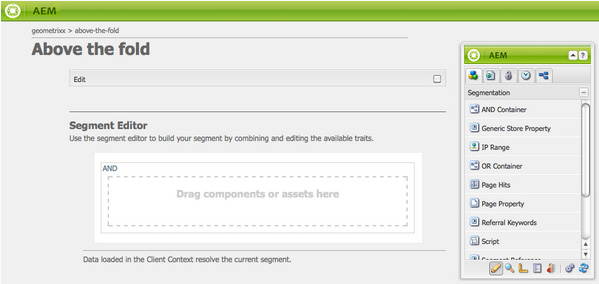

# Segmentatie {#configuring-segmentation} configureren

>[!NOTE]
>
>Dit document behandelt de configuratie van segmentatie zoals die met de Context van de Cliënt wordt gebruikt. Om segmenten met ContextHub te vormen die de aanraking UI gebruiken, gelieve [Vormende Segmentatie met ContextHub](/help/sites-administering/segmentation.md) te zien.

Segmentering is een belangrijke overweging bij het maken van een campagne. Zie [Verklarende woordenlijst van de segmentatie](/help/sites-authoring/segmentation-overview.md) voor informatie over hoe de segmentatie en zeer belangrijke termijnen werkt.

Afhankelijk van de informatie die u reeds over uw plaatsbezoekers en de doelstellingen hebt verzameld u wilt bereiken, zult u de segmenten en de strategieën nodig voor uw gerichte inhoud moeten bepalen.

Deze segmenten worden vervolgens gebruikt om een bezoeker specifieke inhoud te bieden. Deze inhoud wordt bijgehouden in het gedeelte [Campagnes](/help/sites-classic-ui-authoring/classic-personalization-campaigns.md) van de website. De hier gedefinieerde taserpagina&#39;s kunnen als taseralinea&#39;s op elke pagina worden opgenomen en definiëren voor welk bezoekerssegment de gespecialiseerde inhoud van toepassing is.

AEM kunt u eenvoudig segmenten, trasters en campagnes maken en bijwerken. Het staat u ook toe om de resultaten van uw definities te verifiëren.

Met de **Segment-editor** kunt u eenvoudig een segment definiëren:

U kunt **Bewerken** elk segment om een **Titel**, **Beschrijving** en **Boost** factor te specificeren. Met behulp van het hulpdekick kunt u **AND** en **OR** containers toevoegen om **Segment Logic** te bepalen, dan voeg de vereiste **Segment Traits** toe om de selectiecriteria te bepalen.

## Verhogingsfactor {#boost-factor}

Elk segment heeft een **Boost** parameter die als wegingsfactor wordt gebruikt; een hoger getal geeft aan dat het segment wordt geselecteerd in de voorkeur boven een segment met een lager getal.

* Minimumwaarde: `0`
* Maximumwaarde: `1000000`

## Segmentlogica {#segment-logic}

De volgende logische containers zijn beschikbaar uit-van-de-doos en staan u toe om de logica van uw segmentselectie te construeren. Ze kunnen van het hulpwerktuig naar de editor worden gesleept:

<table>
 <tbody>
  <tr>
   <td> EN Container  </td>
   <td> De Booleaanse operator AND.  </td>
  </tr>
  <tr>
   <td> OF Container  </td>
   <td> De Booleaanse operator OR.</td>
  </tr>
 </tbody>
</table>

## Segmentsporen {#segment-traits}

De volgende segmentkenmerken zijn beschikbaar buiten de box; ze kunnen van de hulpwerkbalk naar de editor worden gesleept :

<table>
 <tbody>
  <tr>
   <td> IP-bereik  </td>
   <td>Bepaalt een waaier van IP adressen die de bezoeker kan hebben.  </td>
  </tr>
  <tr>
   <td> Paginapits  </td>
   <td>Hoe vaak is de pagina aangevraagd.   </td>
  </tr>
  <tr>
   <td> Pagina-eigenschap  </td>
   <td>Om het even welk bezit van de bezochte pagina.  </td>
  </tr>
  <tr>
   <td> Referral-trefwoorden  </td>
   <td>Trefwoorden die overeenkomen met gegevens van de verwijzende website.   </td>
  </tr>
  <tr>
   <td> Script</td>
   <td>Javascript-expressie die moet worden geëvalueerd.  </td>
  </tr>
  <tr>
   <td> Segmentverwijzing   </td>
   <td>Verwijzing naar een andere segmentdefinitie.  </td>
  </tr>
  <tr>
   <td> Label Cloud  </td>
   <td>Tags die moeten overeenkomen met de tags van de bezochte pagina's.  </td>
  </tr>
  <tr>
   <td> Leeftijd gebruiker  </td>
   <td>Zoals overgenomen uit het gebruikersprofiel.  </td>
  </tr>
  <tr>
   <td> Gebruikerseigenschap  </td>
   <td>Alle andere informatie die beschikbaar is in het gebruikersprofiel. </td>
  </tr>
 </tbody>
</table>

U kunt deze eigenschappen combineren gebruikend de booleaanse exploitanten OF en EN (zie [Creërend een Nieuw Segment](#creating-a-new-segment)) om het nauwkeurige scenario te bepalen voor het selecteren van dit segment.

Wanneer de volledige verklaring aan waar evalueert dan heeft dit segment opgelost. Als meerdere segmenten van toepassing zijn, wordt ook de **[Boost](/help/sites-administering/campaign-segmentation.md#boost-factor)**-factor gebruikt.

>[!CAUTION]
>
>De segmentredacteur controleert geen cirkelverwijzingen. Zo verwijst segment A bijvoorbeeld naar een ander segment B, dat op zijn beurt weer naar segment A verwijst. U moet ervoor zorgen dat de segmenten geen cirkelverwijzingen bevatten.

>[!NOTE]
>
>Eigenschappen met het achtervoegsel **_i18n** worden geplaatst door een manuscript dat een deel van UI clientlib van de verpersoonlijking is. Alle UI-gerelateerde clientlibs worden alleen op de auteur geladen omdat de gebruikersinterface niet nodig is bij publiceren.
>
>Daarom wanneer het creëren van een segment met dergelijke eigenschappen is het normaal noodzakelijk om op **browserFamily** bijvoorbeeld in plaats van **browserFamily_i18n** te vertrouwen.

### Een nieuw segment maken {#creating-a-new-segment}

Het nieuwe segment definiëren:

1. Kies **Gereedschappen > Bewerkingen > Configuratie**.
1. Klik op de pagina **Segmentatie** in het linkerpaneel, en navigeer aan de vereiste plaats.
1. Maak een [nieuwe pagina](/help/sites-authoring/editing-content.md#creatinganewpage) met de sjabloon **Segment**.
1. Open de nieuwe pagina om de segmenteditor weer te geven:

   

1. Gebruik het secundaire menu of het contextmenu (klik gewoonlijk met de rechtermuisknop en selecteer **Nieuw..** om het venster Nieuwe component invoegen te openen) om het vereiste segmentkenmerk te zoeken. Dan sleep het aan **de Redacteur van het Segment** het zal in het gebrek **AND** container verschijnen.
1. Dubbelklik op de nieuwe eigenschap om de specifieke parameters te bewerken; bijvoorbeeld de muispositie:

   

1. Klik **OK** om uw definitie op te slaan:
1. U kunt de segmentdefinitie **Bewerken** om deze een **Title**, **Description** en **[Boost](#boost-factor)** factor te geven:

   

1. Voeg desgewenst meer kenmerken toe. U kunt booleaanse expressies formuleren met de componenten **AND Container** en **OR Container** die onder **Segment Logic** worden gevonden. Met de segmentredacteur kunt u eigenschappen of containers schrappen niet meer nodig, of hen slepen aan nieuwe posities binnen de verklaring.

### AND en OR containers {#using-and-and-or-containers} gebruiken

U kunt complexe segmenten in AEM samenstellen. Het helpt om zich van een paar basispunten bewust te zijn:

* Het hoogste niveau van de definitie is altijd de EN container die aanvankelijk wordt gecreeerd; dit kan niet worden veranderd, maar heeft geen effect op de rest van uw segmentdefinitie.
* Zorg ervoor dat het nesten van de container zinvol is. De containers kunnen als steunen van uw booleaanse uitdrukking worden bekeken.

In het volgende voorbeeld worden bezoekers geselecteerd die:

Mannelijk en tussen 16 en 65 jaar

OF

Vrouwen tussen 16 en 62 jaar

Aangezien de belangrijkste exploitant OF is moet u met een **OF Container** beginnen. Binnen dit hebt u 2 EN verklaringen, voor elk van deze hebt u **EN Container** nodig, waarin u de individuele eigenschappen kunt toevoegen.

## De toepassing van een segment testen {#testing-the-application-of-a-segment}

Zodra het segment is bepaald, kunnen de potentiële resultaten met de hulp van **[Context van de Cliënt](/help/sites-administering/client-context.md)** worden getest:

1. Selecteer het segment dat u wilt testen.
1. Druk op **[Ctrl-Alt-C](/help/sites-authoring/page-authoring.md#keyboardshortcuts)** om de **[Clientcontext](/help/sites-administering/client-context.md)** te openen, waarin de verzamelde gegevens worden weergegeven. Voor testdoeleinden kunt u **Bewerken** bepaalde waarden, of **Laden** een ander profiel om de impact daar te zien.

1. Afhankelijk van de gedefinieerde kenmerken komen de gegevens die beschikbaar zijn voor de huidige pagina mogelijk niet overeen met de segmentdefinitie. De status van de overeenkomst wordt onder de definitie weergegeven.

Een eenvoudige segmentdefinitie kan bijvoorbeeld gebaseerd zijn op de leeftijd en het geslacht van de gebruiker. Wanneer u een specifiek profiel laadt, wordt getoond dat het segment is opgelost:

Of niet:

>[!NOTE]
>
>Alle kenmerken worden onmiddellijk opgelost, maar de meeste wijzigingen worden alleen toegepast wanneer de pagina opnieuw wordt geladen. Wijzigingen in de muispositie zijn direct zichtbaar, zodat u ze kunt testen.

Dergelijke tests kunnen ook op inhoudspagina&#39;s en in combinatie met **Taser** componenten worden uitgevoerd.

Bij de muisaanwijzer op een teasalinea worden de toegepaste segmenten weergegeven, ongeacht of deze momenteel zijn opgelost en waarom de huidige teaser-instantie is geselecteerd:

### Uw segment gebruiken {#using-your-segment}

Segmenten worden momenteel gebruikt binnen [Campagnes](/help/sites-classic-ui-authoring/classic-personalization-campaigns.md). Ze worden gebruikt om de werkelijke inhoud te sturen die door specifieke doelgroepen wordt gezien. Zie [Segmenten begrijpen](/help/sites-authoring/segmentation-overview.md) voor meer informatie.
