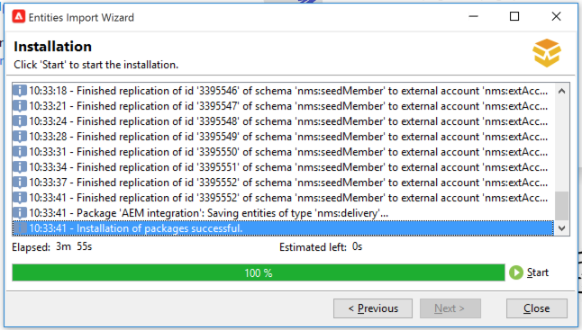

# AEM 6.5 integreren met Adobe Campaign Classic {#integrating-campaign-classic}

Door AEM te integreren met Adobe Campaign Classic (ACC), kunt u e-maillevering, inhoud en formulieren direct in AEM beheren. De stappen van de configuratie in zowel Adobe Campaign Classic als AEM zijn nodig om bidirectionele communicatie tussen oplossingen toe te laten.

Dankzij deze integratie kunnen AEM en Adobe Campaign Classic onafhankelijk worden gebruikt. Marketers kunnen campagnes maken en doelgericht gebruik maken in Adobe Campaign, terwijl makers van inhoud tegelijkertijd in AEM aan het ontwerpen van inhoud kunnen werken. Met behulp van de integratie kunnen de inhoud en het ontwerp van de in AEM gemaakte campagne door Adobe Campaign worden aangesproken en geleverd.

>[!INFO]
>
>In dit document wordt beschreven hoe u Adobe Campaign Classic kunt integreren met AEM 6.5. Voor andere integratie van de Campagne zie het document [&#x200B; Integrerend AEM 6.5 met Adobe Campaign.](campaign.md)

## Integratiestappen {#integration-steps}

De integratie tussen AEM en Campagne vereist verscheidene stappen in beide oplossingen.

1. [Installeer het AEM integratiepakket in de campagne.](#install-package)
1. [Een operator maken voor AEM in campagne](#create-operator)
1. [Integratie van campagnes configureren in AEM](#campaign-integration)
1. [De AEM ExternalAlizer configureren](#externalizer)
1. [De externe gebruiker van de campagne configureren in AEM](#configure-user)
1. [De externe AEM-account configureren in Campagne](#acc-setup)

Dit document leidt u door elk van deze stappen in detail.

## Vereisten {#prerequisites}

* Toegang tot Adobe Campaign Classic voor beheerders
   * Om de integratie uit te voeren, hebt u een werkende instantie van Adobe Campaign Classic, met inbegrip van een gevormd gegevensbestand nodig.
   * Als u extra details op nodig hebt om Adobe Campaign Classic op te zetten en te vormen zie de [&#x200B; documentatie van Adobe Campaign Classic, &#x200B;](https://experienceleague.adobe.com/docs/campaign-classic/using/campaign-classic-home.html?lang=nl-NL) vooral de gids van de Installatie en van de Configuratie.
* Toegang tot AEM beheerder

## Het AEM integratiepakket in de campagne installeren {#install-package}

Het **AEM het pakket van de Integratie** in Adobe Campaign omvat verscheidene standaardconfiguraties noodzakelijk om met AEM te verbinden.

1. Meld u als beheerder aan bij de Adobe Campaign-instantie met de clientconsole.

1. Selecteer **Hulpmiddelen** > **Geavanceerd** > **het pakket van de Invoer..**.

   

1. Klik **installeer een standaardpakket** en klik dan **daarna**.

1. Controleer het **AEM het pakket van de Integratie**.

   

1. Klik **daarna**, en dan **Begin** om met de installatie te beginnen.

   

1. Klik **dicht** wanneer de installatie voltooit.

Het integratiepakket is nu geïnstalleerd.

## De operator voor AEM in campagne maken {#create-operator}

Het integratiepakket maakt automatisch de operator `aemserver` die AEM gebruikt om verbinding te maken met Adobe Campaign. Definieer een beveiligingszone voor deze operator en stel het wachtwoord ervan in.

1. Meld u met de clientconsole aan bij Adobe Campaign als beheerder.

1. Selecteer **Hulpmiddelen** > **Ontdekkingsreiziger** van de menubar.

1. In de ontdekkingsreiziger, navigeer aan het **Beleid** > **Beheer van de Toegang** > **Operatoren** knoop.

1. Selecteer de operator `aemserver` .

1. Op **geef** lusje van de exploitant uit, selecteer het **sub-lusje van de Rechten van de Toegang** en klik dan **uitgeven de toegangsparameters...** verbinding.

   

1. Selecteer de aangewezen veiligheidsstreek en bepaal zonodig het vertrouwde op IP masker.

   >[!CAUTION]
   >
   >De veiligheidsstreek die moet worden gevormd is **Privé bedrijfnetwerk (VPN+LAN)**.

1. Klik **sparen**.

1. Afmelden bij de Adobe Campaign-client.

1. Navigeer in het bestandssysteem van de Adobe Campaign-server naar de installatielocatie voor Campagne en bewerk het `serverConf.xml` -bestand als beheerder. Dit bestand bevindt zich doorgaans onder:
   * `C:\Program Files\Adobe\Adobe Campaign Classic v7\conf` in Windows.
   * `/usr/local/neolane/nl6/conf/eng` in Linux.

1. Zoek naar `securityZone` en zorg ervoor dat de volgende parameters voor de veiligheidsstreek van de AEM exploitant worden geplaatst.

   * `allowHTTP="true"`
   * `sessionTokenOnly="true"`
   * `allowUserPassword="true"`.

1. Sla het bestand op.

1. Zorg ervoor dat de beveiligingszone niet wordt overschreven door de desbetreffende instelling in het `config-<server name>.xml` -bestand.

   * Als het configuratiebestand een aparte instelling voor de beveiligingszone bevat, wijzigt u het kenmerk `allowUserPassword` in `true` .

1. Als u de Adobe Campaign Classic-serverpoort wilt wijzigen, vervangt u `8080` door de gewenste poort.

   >[!CAUTION]
   >
   >Door gebrek, is er geen veiligheidsstreek die voor de exploitant wordt gevormd. Als u AEM verbinding wilt maken met Adobe Campaign, moet u een zone selecteren zoals in de vorige stappen wordt beschreven.
   >
   >Adobe beveelt ten zeerste aan een veiligheidszone in te stellen die is gewijd aan AEM om veiligheidsproblemen te voorkomen. Voor meer over dit onderwerp, zie de [&#x200B; documentatie van Adobe Campaign Classic.](https://experienceleague.adobe.com/docs/campaign-classic/using/installing-campaign-classic/additional-configurations/security-zones.html?lang=nl-NL)

1. In de cliënt van de Campagne, terugkeer aan de `aemserver` exploitant en selecteer het **Algemene** lusje.

1. Klik het **wachtwoord van het Terugstellen..** verbinding.

1. Geef een wachtwoord op en bewaar dit op een veilige locatie voor toekomstig gebruik.

1. Klik **O.K.** om het wachtwoord voor de `aemserver` exploitant te bewaren.

## Campagne-integratie configureren in AEM {#campaign-integration}

AEM gebruikt [&#x200B; de exploitant u reeds opstelling in Campagne &#x200B;](#create-operator) om met Campagne te communiceren

1. Meld u als beheerder aan bij de AEM ontwerpinstantie.

1. Van het globale spoor van de navigatiekant, uitgezochte **Hulpmiddelen** > **Cloud Servicen** > **Verouderde Cloud Servicen** > **Adobe Campaign**, dan klik **nu** vormen.

   

1. In de dialoog, creeer een de dienstconfiguratie van de Campagne door a **Titel** in te gaan en **te klikken creeert**.

   

1. Er wordt een nieuw venster en dialoogvenster geopend om de configuratie te bewerken. Verstrek de noodzakelijke informatie.

   * **Gebruikersnaam** - dit is [&#x200B; de het pakketexploitant van de Integratie van Adobe Campaign AEM die in de vorige stap wordt gecreeerd.](#create-operator) Standaard is dit `aemserver` .
   * **Wachtwoord** - dit is het wachtwoord voor [&#x200B; de het pakketexploitant van de Integratie van Adobe Campaign AEM die in de vorige stap wordt gecreeerd.](#create-operator)
   * **API Eind Punt** - dit is de instantieURL van Adobe Campaign.

   

1. Selecteer **verbinden met Adobe Campaign** om de verbinding te verifiëren en dan **O.K.** te klikken.

AEM kan nu communiceren met Adobe Campaign.

>[!NOTE]
>
>Zorg ervoor dat uw Adobe Campaign-server via internet bereikbaar is. AEM heeft geen toegang tot particuliere netwerken.

## Replicatie configureren naar AEM Publish-instantie {#replication}

Campagne-inhoud wordt gemaakt door de auteurs van de inhoud op de AEM ontwerpinstantie. Dit exemplaar is typisch slechts intern beschikbaar bij uw organisatie. Als u inhoud, zoals afbeeldingen en elementen, toegankelijk wilt maken voor de ontvangers van uw campagne, moet u die inhoud publiceren.

De replicatieagent is verantwoordelijk voor het publiceren van uw inhoud van de AEM auteurinstantie aan de publicatieinstantie en moet opstelling voor de integratie zijn behoorlijk te werken. Deze stap is ook nodig om bepaalde configuraties van ontwerpinstanties te repliceren in de publicatieinstantie.

Om replicatie van uw AEM auteursinstantie aan te vormen publiceer instantie:

1. Meld u als beheerder aan bij de AEM ontwerpinstantie.

1. Van het globale spoor van de navigatiekant, uitgezochte **Hulpmiddelen** > **Plaatsing** > **Replicatie** > **Agenten op auteur**, dan klik **StandaardAgent (publiceren)**.

   

1. Klik **uitgeven** dan selecteren het **Vervoer** lusje.

1. Vorm het **gebied van URI** door de standaard `localhost` waarde met het IP adres van de AEM het publiceren instantie te vervangen.

   

1. Klik **O.K.** om de veranderingen in de agentenmontages te bewaren.

U hebt replicatie aan de AEM gevormd publiceer instantie zodat kunnen uw campagneontvangers tot uw inhoud toegang hebben.

>[!NOTE]
>
>Als u niet replicatie URL wilt gebruiken maar in plaats daarvan openbaar-onder ogen ziet URL gebruiken, kunt u openbare URL in de volgende configuratie plaatsen die via OSGi plaatst
>
>Van het globale spoor van de navigatiekant, uitgezochte **Hulpmiddelen** > **Verrichtingen** > **Console van het Web** > **Configuratie OSGi** en onderzoek naar **AEM de Integratie van de Campagne - Configuratie**. Bewerk de configuratie en verander het gebied **Openbare URL** (`com.day.cq.mcm.campaign.impl.IntegrationConfigImpl#aem.mcm.campaign.publicUrl`).

## De AEM ExternalAlizer configureren {#externalizer}

[&#x200B; ExternalAlizer &#x200B;](/help/sites-developing/externalizer.md) is de dienst OSGi in AEM die een middelweg in externe en absolute URL omzet, die voor AEM noodzakelijk is om inhoud te dienen die de Campagne kan gebruiken. Vorm het zodat de integratie van de Campagne werkt.

1. Meld u als beheerder aan bij de AEM-ontwerpinstantie.
1. Van het globale spoor van de navigatiekant, uitgezochte **Hulpmiddelen** > **Verrichtingen** > **Console van het Web** > **Configuratie OSGi** en onderzoek naar **de verbindingExternalzer van CQ van de Dag**.
1. Door gebrek is de laatste ingang op het **gebied van Domeinen** voorgenomen voor publiceer instantie. Wijzig de URL van de standaardinstelling `http://localhost:4503` in de openbaar beschikbare publicatie-instantie.

   

1. Klik **sparen**.

U hebt de Externalzer geconfigureerd en Adobe Campaign heeft nu toegang tot uw inhoud.

>[!NOTE]
>
>De publicatie-instantie moet bereikbaar zijn vanaf de Adobe Campaign-server. Als het verwijst naar `localhost:4503` of een andere server die Adobe Campaign niet kan bereiken, worden afbeeldingen van AEM niet weergegeven in de Adobe Campaign-console.

## Vorm de campagne-verre Gebruiker in AEM {#configure-user}

Campagne kan alleen communiceren met AEM als u een wachtwoord instelt voor de gebruiker van `campaign-remote` in AEM.

1. Meld u aan bij AEM als beheerder.
1. Op de belangrijkste navigatieconsole, en klik **Hulpmiddelen** in het linkerspoor.
1. Dan klik **Veiligheid** > **Gebruikers** om de console van het gebruikersbeleid te openen.
1. Zoek de `campaign-remote` -gebruiker.
1. Selecteer de `campaign-remote` gebruiker en klik **Eigenschappen** om de gebruiker uit te geven.
1. In **geef het venster van de Montages van de Gebruiker** uit, klik **Wachtwoord van de Verandering**.
1. Geef de gebruiker een nieuw wachtwoord op en noteer het wachtwoord op een veilige locatie voor toekomstig gebruik.
1. Klik **sparen** om de wachtwoordverandering te bewaren.
1. Klik **sparen &amp; Sluiten** om de veranderingen in de `campaign-remote` gebruiker te bewaren.

## De externe AEM-account configureren in de campagne {#acc-setup}

Wanneer [&#x200B; het installeren van het **AEM 2&rbrace; pakket van de Integratie &lbrace;in Campagne, &#x200B;](#install-package) een externe rekening wordt gecreeerd voor AEM.** Door deze externe account te configureren, kan Adobe Campaign verbinding maken met AEM, waardoor tweerichtingscommunicatie tussen de oplossingen mogelijk is.

1. Meld u met de clientconsole aan bij Adobe Campaign als beheerder.

1. Selecteer **Hulpmiddelen** > **Ontdekkingsreiziger** van de menubar.

1. In de explorator, navigeer aan het **Beleid** > **Platform** > **Externe Rekeningen** knoop.

   

1. Zoek de externe AEM. Standaard heeft het de volgende waarden:

   * **Type** - `AEM`
   * **Etiket** - `AEM Instance`
   * **Interne Naam** - `aemInstance`

1. Op het **Algemene** lusje van deze rekening, ga de gebruikersinformatie in die u in de [&#x200B; vastgestelde campagne-verre stap van het Wachtwoord van de Gebruiker &#x200B;](#set-campaign-remote-password) bepaalde.

   * **Server** - het adres van de AEM auteurserver
      * De AEM auteurserver moet van de de serverinstantie van Adobe Campaign Classic bereikbaar zijn.
      * Zorg ervoor dat het serveradres **niet** in een het slepen schuine streep beëindigt.
   * **Rekening** - door gebrek, is dit de `campaign-remote` gebruiker die u in AEM in de [&#x200B; Vastgestelde campagne-verre stap van het Wachtwoord van de Gebruiker &#x200B;](#set-campaign-remote-password) plaatst.
   * **Wachtwoord** - Dit wachtwoord is het zelfde als de `campaign-remote` gebruiker die u in AEM in de [&#x200B; Vastgestelde campagne-verre stap van het Wachtwoord van de Gebruiker &#x200B;](#set-campaign-remote-password) plaatst.

1. Selecteer **Toegelaten** checkbox.

1. Klik **sparen**.

Adobe Campaign kan nu communiceren met AEM.

## Volgende stappen {#next-steps}

Met zowel Adobe Campaign Classic als AEM geconfigureerd is de integratie nu voltooid.

U kunt nu leren hoe te om een nieuwsbrief in Adobe Experience Manager tot stand te brengen door met [&#x200B; dit document voort te gaan.](/help/sites-authoring/campaign.md)
