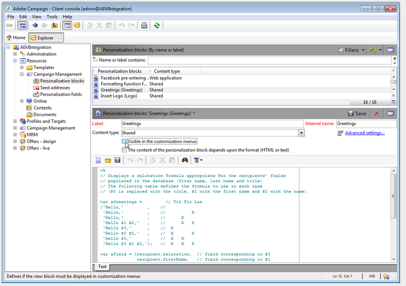

# Integreren met Adobe Campaign Classic{#integrating-with-adobe-campaign-classic}

>[!NOTE]
>
>In deze documentatie wordt beschreven hoe u AEM kunt integreren met Adobe Campaign Classic, de on-premise oplossing. Als u Adobe Campaign Standard gebruikt, zie [Integratie met Adobe Campaign Standard](/help/sites-administering/campaignstandard.md) voor die instructies.

Met Adobe Campaign kunt u inhoud en formulieren voor e-maillevering rechtstreeks in Adobe Experience Manager beheren.

Om beide oplossingen samen tezelfdertijd te gebruiken, moet u hen eerst vormen om met elkaar te verbinden. Dit omvat configuratiestappen in zowel Adobe Campaign als Adobe Experience Manager. Deze stappen worden in dit document uitgebreid beschreven.

Het werken met Adobe Campaign in AEM omvat de capaciteit om e-mail via Adobe Campaign te verzenden en wordt beschreven bij [Werken met Adobe Campaign](/help/sites-authoring/campaign.md). Dit omvat ook het gebruik van formulieren op AEM pagina&#39;s voor het bewerken van gegevens.

Bovendien kunnen de volgende onderwerpen van belang zijn wanneer het integreren van AEM met [Adobe Campaign](https://helpx.adobe.com/support/campaign/classic.html):

* [Aanbevolen procedures voor e-mailsjablonen](/help/sites-administering/best-practices-for-email-templates.md)
* [Problemen met Adobe Campaign-integratie oplossen](/help/sites-administering/troubleshooting-campaignintegration.md)

Als u uw integratie met Adobe Campaign uitbreidt, wilt u wellicht de volgende pagina&#39;s zien:

* [Aangepaste extensies maken](/help/sites-developing/extending-campaign-extensions.md)
* [Aangepaste formuliertoewijzingen maken](/help/sites-developing/extending-campaign-form-mapping.md)

## AEM en Adobe Campaign Integration Workflow {#aem-and-adobe-campaign-integration-workflow}

In deze sectie wordt een typische workflow beschreven tussen AEM en Adobe Campaign bij het maken van campagnes en het leveren van inhoud.

De typische werkstroom omvat het volgende en wordt in detail beschreven:

1. Begin uw campagne te ontwikkelen (zowel in Adobe Campaign als AEM).
1. Voordat u de inhoud en levering koppelt, past u de inhoud aan in AEM en maakt u een levering in Adobe Campaign.
1. Inhoud en levering koppelen in Adobe Campaign.

### Uw campagne starten {#start-building-your-campaign}

Je begint op elk moment een campagne te ontwikkelen. Voordat u de inhoud met elkaar verbindt, zijn AEM en AC onafhankelijk. Dit betekent dat marketers hun campagnes kunnen starten en zich kunnen richten in Adobe Campaign, terwijl makers van inhoud aan het ontwerp werken in AEM.

### Vóór het koppelen van inhoud en levering {#before-linking-content-and-delivery}

Voordat u de inhoud koppelt en een leveringsmechanisme maakt, moet u het volgende doen:

**In AEM**

* Personaliseer gebruikend de verpersoonlijkingsgebieden in **Tekst &amp; Personalisatie** component

**In Adobe Campaign**

* Een levering maken van het type **aemContent**

### Inhoud koppelen en levering instellen {#linking-content-and-setting-delivery}

Nadat u de inhoud voor het verbinden en levering hebt voorbereid, bepaalt u precies hoe en waar om inhoud te verbinden.

Al deze stappen zijn voltooid in Adobe Campaign.

1. Geef op welke AEM instantie moet worden gebruikt.
1. Synchroniseer de inhoud door op de knop Synchroniseren te klikken.
1. Open de inhoudkiezer om de inhoud te kiezen.

### Als u nog niet eerder {#if-you-are-new-to-aem} hebt AEM

Als u nog niet eerder AEM, zijn de volgende koppelingen wellicht handig voor AEM:

* [AEM starten](/help/sites-deploying/deploy.md)
* [Replicatieagents begrijpen](/help/sites-deploying/replication.md)
* [Logbestanden zoeken en gebruiken](/help/sites-deploying/monitoring-and-maintaining.md#working-with-audit-records-and-log-files)
* [Inleiding tot het AEM Platform](/help/sites-deploying/platform.md)

## Adobe Campaign {#configuring-adobe-campaign} configureren

Bij het configureren van Adobe Campaign gaat het om het volgende:

1. Het integratiepakket voor AEM installeren in Adobe Campaign.
1. Een externe account configureren.
1. Controleren of AEMResourceTypeFilter correct is geconfigureerd.

Bovendien zijn er geavanceerde configuraties die u kunt maken, die omvatten:

* Inhoudsblokken beheren
* Verpersoonlijkingsvelden beheren

Zie [Geavanceerde configuraties](#advanced-configurations).

>[!NOTE]
>
>Als u deze bewerkingen wilt uitvoeren, moet u de rol **administration** in Adobe Campaign hebben.

### Vereisten {#prerequisites}

Zorg ervoor dat u de volgende elementen vooraf hebt:

* [Een AEM-ontwerpinstantie](/help/sites-deploying/deploy.md#getting-started)
* [Een AEM-publicatie-instantie](/help/sites-deploying/deploy.md#author-and-publish-installs)
* [Een Adobe Campaign Classic-instantie](https://helpx.adobe.com/support/campaign/classic.html)  - inclusief een client en een server
* Internet Explorer 11

>[!NOTE]
>
>Als u een versie vroeger dan Adobe Campaign Classic bouwt 8640 in werking stelt, zie [verbeteringsdocumentatie](https://docs.campaign.adobe.com/doc/AC6.1/en/PRO_Updating_Adobe_Campaign_Upgrading.html) voor meer informatie. Merk op dat zowel de cliënt als het gegevensbestand aan zelfde bouwstijl moeten worden bevorderd.

>[!CAUTION]
>
>Bewerkingen die worden beschreven in de secties [Adobe Campaign configureren](#configuring-adobe-campaign) en [Adobe Experience Manager configureren](#configuring-adobe-experience-manager) zijn nodig om de integratiefuncties tussen AEM en Adobe Campaign correct te laten werken.

### Installatie van het AEM integratiepakket {#installing-the-aem-integration-package}

U moet **AEM Integratie** pakket in Adobe Campaign installeren. Dit doet u als volgt:

1. Ga naar de Adobe Campaign-instantie die u wilt koppelen aan AEM.
1. Selecteer *Gereedschappen* > *Geavanceerd* > *Pakket importeren..*.

   

1. Klik **Installeer een standaardpakket**, dan selecteer **AEM Integratie** pakket.

   

1. Klik **Volgende**, en dan **Begin**.

   Dit pakket bevat de **aemserver** operator die wordt gebruikt om de AEM server aan te sluiten op Adobe Campaign.

   >[!CAUTION]
   >
   >Door gebrek, wordt geen veiligheidsstreek gevormd voor deze exploitant. Als u via AEM verbinding wilt maken met Adobe Campaign, moet u er een selecteren.
   >
   >In het **serverConf.xml**-bestand moet het **allowUserPassword**-kenmerk van de geselecteerde beveiligingszone zijn ingesteld op **true** om AEM te machtigen om Adobe Campaign via aanmelding/wachtwoord te verbinden.
   >
   >We raden u ten zeerste aan een beveiligingszone in te stellen die is gewijd aan AEM om beveiligingsproblemen te voorkomen. Raadpleeg voor meer informatie de [Installatiegids](https://docs.campaign.adobe.com/doc/AC/en/INS_Additional_configurations_Configuring_Campaign_server.html).

   

### Een AEM externe account {#configuring-an-aem-external-account} configureren

U moet een externe account configureren waarmee u Adobe Campaign kunt verbinden met uw AEM.

>[!NOTE]
>
>* Wanneer u het pakket **AEM Integration** installeert, wordt een externe AEM account gemaakt. U kunt de verbinding met uw AEM instantie van het vormen of nieuwe tot stand brengen.
>* Zorg er AEM voor dat u het wachtwoord voor de externe gebruiker van de campagne instelt. U moet dit wachtwoord instellen om Adobe Campaign te verbinden met AEM. Login als beheerder en in de console van het gebruikersbeleid, onderzoek naar de campagne-verre gebruiker en klik **Reeks Wachtwoord**.

>


Een externe AEM-account configureren:

1. Ga naar **Beheer** > **Platform** > **Externe accounts**.
1. Maak een nieuwe externe account en selecteer het type **AEM**.
1. Voer de toegangsparameters voor de AEM ontwerpinstantie in: het serveradres en de id en het wachtwoord waarmee u verbinding maakt met deze instantie. Het wachtwoord van de campagne-api-gebruikersrekening is het zelfde als de campagne-verre gebruiker die u een wachtwoord voor in AEM plaatst.

   >[!NOTE]
   >
   >Zorg ervoor dat het serveradres **niet** eindigt in een sluitslash. Typ bijvoorbeeld `https://yourserver:4502` in plaats van `https://yourserver:4502/`

    

1. Zorg ervoor dat **Enabled** checkbox wordt geselecteerd.

### De optie AEMResourceTypeFilter {#verifying-the-aemresourcetypefilter-option} controleren

De optie **AEMResourceTypeFilter** wordt gebruikt om typen AEM te filteren die in Adobe Campaign kunnen worden gebruikt. Op deze manier kan Adobe Campaign AEM inhoud ophalen die specifiek is ontworpen voor gebruik in alleen Adobe Campaign.

Deze optie moet vooraf worden geconfigureerd; als u deze optie wijzigt, kan dit echter tot een niet-functionerende integratie leiden.

Om te verifiëren wordt de **optie AEMResourceTypeFilter** gevormd:

1. Ga naar **Platform** >**Opties**.
1. Controleer in de optie **AEMResourceTypeFilter** of de paden juist zijn. Dit veld moet de waarde bevatten:

   **mcm/campagne/componenten/nieuwsbrief,mcm/campagne/componenten/campagne_newsletterpage,mcm/neolane/components/nieuwsbrief**

   In sommige gevallen is de waarde als volgt:

   **mcm/campagne/componenten/nieuwsbrief**

   

## Adobe Experience Manager {#configuring-adobe-experience-manager} configureren

Om AEM te vormen, moet u het volgende doen:

* Configureer replicatie tussen instanties.
* Verbind AEM met Adobe Campaign via Cloud Services.
* Configureer de externalizer.

### Het vormen replicatie tussen AEM instanties {#configuring-replication-between-aem-instances}

Inhoud die is gemaakt van de AEM authoring instantie wordt eerst naar de publishing-instantie verzonden. U moet publiceren zodat de afbeeldingen in de nieuwsbrief beschikbaar zijn op het publicatieexemplaar en aan ontvangers voor de nieuwsbrief. De replicatieagent moet daarom worden gevormd om van de AEM auteursinstantie aan de AEM het publiceren instantie te herhalen.

>[!NOTE]
>
>Als u de replicatie-URL niet wilt gebruiken maar in plaats daarvan de publieksgerichte URL, kunt u **Openbare URL** in de volgende configuratie plaatsen die in OSGi (**AEM logo** > **Hulpmiddelen** pictogram > **Verrichtingen** > **Webconsole** > &lt;a 10/>OSGi Configuration **>** AEM Campagne Integration - Configuration **):**
**Openbare URL:** com.day.cq.mcm.campagne.impl.IntegrationConfigImpl#aem.mcm.campagne.publicUrl

Deze stap is ook nodig om bepaalde configuraties van ontwerpinstanties te repliceren in de publicatieinstantie.

Om replicatie tussen AEM instanties te vormen:

1. Selecteer **AEM logo** **Tools** pictogram > **Implementatie** > **Replication** > **Agents op auteur** en klik vervolgens op **Default Agent**.

   

   >[!NOTE]
   Vermijd het gebruik van localhost (een lokale kopie van AEM) bij het configureren van uw integratie met Adobe Campaign, tenzij de publicatie- en auteurinstantie beide op dezelfde computer staan.

1. Tik of klik op **Bewerken** en selecteer vervolgens het tabblad **Vervoer**.
1. Vorm URI door **localhost** met het IP adres of het adres van de AEM het publiceren instantie te vervangen.

   

### AEM aansluiten op Adobe Campaign {#connecting-aem-to-adobe-campaign}

Voordat u AEM en Adobe Campaign samen kunt gebruiken, moet u het verband tussen beide oplossingen tot stand brengen zodat zij kunnen communiceren.

1. Verbind met uw AEM authoring instantie.
1. Selecteer **AEM logo** > **Gereedschappen** pictogram > **Implementatie** > **Cloud Services** en **Configureer nu** in de sectie Adobe Campaign.

   

1. Maak een nieuwe configuratie door een **Titel** in te voeren en op **Maken** te klikken, of kies de bestaande configuratie die u met uw Adobe Campaign-instantie wilt koppelen.
1. Bewerk de configuratie zodat deze overeenkomt met de parameters van uw Adobe Campaign-instantie.

   * **Gebruikersnaam**:  **aemserver**, de Adobe Campaign AEM Integration package operator gebruikt om het verband tussen de twee oplossingen tot stand te brengen.
   * **Wachtwoord**: Wachtwoord Adobe Campaign-beheerder. U moet het wachtwoord voor deze operator mogelijk rechtstreeks in Adobe Campaign opnieuw opgeven.
   * **API-eindpunt**: Adobe Campaign-instantie-URL.

1. Selecteer **Verbinding maken met Adobe Campaign** en klik op **OK**.

   

   >[!NOTE]
   Nadat u [uw e-mail creeert en het publiceert](/help/sites-authoring/campaign.md), moet u de configuratie op uw publiceren instantie opnieuw publiceren.

   

>[!NOTE]
Als de verbinding ontbreekt, zorg ervoor u het volgende controleert:
* Er kan een certificaatprobleem optreden wanneer u een beveiligde verbinding met een Adobe Campaign-instantie (https) gebruikt. U moet het Adobe Campaign-instantiecertificaat toevoegen aan het **cacerts**-bestand van de JDK van uw AEM-instantie.
* Een veiligheidsstreek moet voor [aemserver exploitant](#connecting-aem-to-adobe-campaign) in Adobe Campaign worden gevormd. Bovendien moet in het **serverConf.xml**-bestand het **allowUserPassword**-kenmerk van de beveiligingszone zijn ingesteld op **true** om AEM verbinding met Adobe Campaign te autoriseren met de modus voor aanmelding/wachtwoord.

Daarnaast raadpleegt u [Problemen met uw integratie tussen AEM en Adobe Campaign oplossen](/help/sites-administering/troubleshooting-campaignintegration.md).

### De externalizer {#configuring-the-externalizer} configureren

U moet [externalizer](/help/sites-developing/externalizer.md) in AEM op uw auteursinstantie vormen. ExternalAlizer is de dienst OSGi die u een middelweg in een externe en absolute URL laat omzetten. Deze service biedt een centrale plaats om die externe URL&#39;s te configureren en samen te stellen.

Zie [De externalizer](/help/sites-developing/externalizer.md) voor algemene instructies configureren. Voor de integratie van Adobe Campaign moet u de publicatieserver op `https://<host>:<port>/system/console/configMgr/com.day.cq.commons.impl.ExternalizerImpl`niet richten naar `localhost:4503` maar naar een server die bereikbaar is door de Adobe Campaign-console.

Als het verwijst naar `localhost:4503` of een andere server die Adobe Campaign niet kan bereiken, worden uw afbeeldingen niet weergegeven op de Adobe Campaign-console.


## Geavanceerde configuraties {#advanced-configurations}

U kunt ook een aantal geavanceerde configuraties uitvoeren, namelijk:

* U kunt aanpassingsvelden en -blokken beheren.
* Deactiveer een verpersoonlijkingsblok.
* Doelextensiegegevens beheren.

### Beheren van verpersoonlijkingsgebieden en blokken {#managing-personalization-fields-and-blocks}

De velden en blokken die beschikbaar zijn om personalisatie aan uw e-mailinhoud in AEM toe te voegen, worden beheerd door Adobe Campaign.

Er is een standaardlijst opgegeven, maar deze kan worden gewijzigd. U kunt ook aanpassingsvelden en blokken toevoegen of verbergen.

#### Een aanpassingsveld {#adding-a-personalization-field} toevoegen

Om een nieuw verpersoonlijkingsgebied aan die toe te voegen die reeds beschikbaar zijn, moet u het schema van Adobe Campaign **nms:seedMember** als volgt uitbreiden:

>[!CAUTION]
Het gebied dat u moet toevoegen moet reeds via een ontvankelijke schemauitbreiding (**nms:ontvanger**) zijn toegevoegd. Voor meer informatie, zie [Configuratie](https://docs.campaign.adobe.com/doc/AC6.1/en/CFG_Editing_schemas_Editing_schemas.html) gids.

1. Ga naar **Beheer** > **Configuratie** > **Gegevensschema&#39;s** in de navigatie van Adobe Campaign.
1. Selecteer **Nieuw**.

   

1. Selecteer **De gegevens in de tabel uitbreiden met een extensieschema** in het pop-upvenster en klik op **Volgende**.

   

1. Voer de verschillende parameters van het uitgebreide schema in:

   * **Schema**: Selecteer de  **nms:** seedMemberschema. De overige velden in het venster worden automatisch ingevuld.
   * **Naamruimte**: pas namespace van het uitgebreide schema aan.

1. Bewerk de XML-code van het schema om het veld op te geven dat u daar wilt toevoegen. Voor meer informatie bij het uitbreiden van schema&#39;s in Adobe Campaign, verwijs naar [de gids van de Configuratie](https://docs.campaign.adobe.com/doc/AC6.1/en/CFG_Editing_schemas_Extending_a_schema.html).
1. Sla uw schema op en werk vervolgens de Adobe Campaign-databasestructuur bij via het menu **Tools** > **Advanced** > **Update databasestructuur** in de console.
1. Verbinding verbreken en vervolgens opnieuw verbinding maken met de Adobe Campaign-console om uw wijzigingen op te slaan. Het nieuwe veld wordt nu weergegeven in de lijst met aanpassingsvelden die beschikbaar zijn in AEM.

#### Voorbeeld {#example}

Als u een veld **Registratienummer** wilt toevoegen, moet u de volgende elementen hebben:

* De **nms:receiving** schemaversie genoemd **cus:recei** bevat:

```xml
<element desc="Recipient table (profiles)" img="nms:recipient.png" label="Recipients" labelSingular="Recipient" name="recipient">

  <attribute dataPolicy="smartCase" desc="Recipient registration number"
  label="Registration Number"
  length="50" name="registrationNumber" type="string"/>

</element>
```

De schema-extensie **nms:seedMember** met de naam **cus:seedMember** bevat:

```xml
<element desc="Seed to insert in the export files" img="nms:unknownad.png" label="Seed addresses" labelSingular="Seed" name="seedMember">

  <element name="custom_nms_recipient">
    <attribute name="registrationNumber"
    template="cus:recipient:recipient/@registrationNumber"/>
  </element>

</element>
```

Het veld **Registratienummer** maakt nu deel uit van de beschikbare verpersoonlijkingsvelden:


#### Een personalisatieveld {#hiding-a-personalization-field} verbergen

Om een verpersoonlijkingsgebied onder die te verbergen die reeds beschikbaar zijn, moet u het schema van Adobe Campaign **nms uitbreiden &lt;a0/>nms:seedMember** zoals die in [een verpersoonlijkingsgebied](#adding-a-personalization-field) wordt gedetailleerd. Voer de volgende stappen uit:

1. Kopieer het veld dat u wilt ophalen uit het schema **nms:seedMember** in het uitgebreide schema (**cus:seedMember** bijvoorbeeld).
1. Voeg het **advanced=&quot;true&quot;** attribuut van XML aan het gebied toe. Deze wordt niet meer weergegeven in de lijst met personalisatievelden die beschikbaar zijn in AEM.

   Als u bijvoorbeeld het veld **Middennaam** wilt verbergen, moet het schema **cud:seedMember** het volgende element bevatten:

   ```xml
   <element desc="Seed to insert in the export files" img="nms:unknownad.png" label="Seed addresses" labelSingular="Seed" name="seedMember">
   
     <element name="custom_nms_recipient">
       <attribute advanced="true" name="middleName"/>
     </element>
   
   </element>
   ```

### Een aanpassingsblok {#deactivating-a-personalization-block} deactiveren

Een van de beschikbare personalisatieklokken deactiveren:

1. Ga naar **Bronnen** > **Campagnebeheer** > **Personalisatieblokken** in de navigatie van Adobe Campaign.
1. Selecteer het verpersoonlijkingsblok dat u in AEM wilt deactiveren.
1. Schakel het selectievakje **Zichtbaar in de aanpassingsmenu&#39;s** uit en sla uw wijzigingen op. Het blok wordt niet meer weergegeven in de lijst met aanpassingsblokken die beschikbaar zijn in Adobe Campaign.

   

### Doelextensiegegevens beheren {#managing-target-extension-data}

U kunt de gegevens van de doeluitbreiding voor verpersoonlijking ook opnemen. De gegevens van de uitbreiding van het doel (ook genoemd &quot;Gegevens van het Doel&quot;), komen uit het verrijken van of het toevoegen van gegevens in een vraag in een campagnewerkschema bijvoorbeeld. Raadpleeg de secties [Query&#39;s maken](https://docs.campaign.adobe.com/doc/AC/en/PTF_Creating_queries_About_queries_in_Campaign.html) en [Gegevens verrijken](https://docs.campaign.adobe.com/doc/AC/en/WKF_Use_cases_Enriching_data.html) voor meer informatie.

>[!NOTE]
De gegevens in het doel zijn alleen beschikbaar als de AEM inhoud is gesynchroniseerd met een Adobe Campaign-levering. Zie [In AEM gemaakte inhoud synchroniseren met een levering vanuit Adobe Campaign](/help/sites-authoring/campaign.md#synchronizing-content-created-in-aem-with-a-delivery-from-adobe-campaign-classic).


