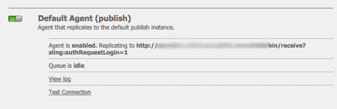
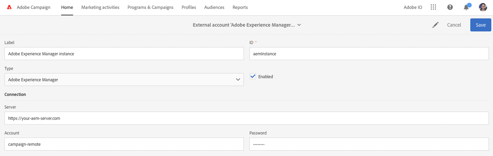

# AEM 6.5 integreren met Adobe Campaign Standard {#integrating-with-adobe-campaign-standard}

Door AEM 6.5 te integreren met Adobe Campaign Standard (ACS), kunt u e-maillevering, inhoud en formulieren direct in AEM beheren. De stappen van de configuratie in zowel Adobe Campaign Standard als AEM zijn nodig om bidirectionele communicatie tussen oplossingen toe te laten.

Dankzij deze integratie kunnen AEM en Adobe Campaign Standard onafhankelijk worden gebruikt. Marketers kunnen campagnes maken en doelgericht gebruik maken in Adobe Campaign, terwijl makers van inhoud tegelijkertijd in AEM aan het ontwerpen van inhoud kunnen werken. Met behulp van de integratie kunnen de inhoud en het ontwerp van de in AEM gemaakte campagne door Adobe Campaign worden aangesproken en geleverd.

>[!INFO]
>
>In dit document wordt beschreven hoe u Adobe Campaign Standard kunt integreren met AEM 6.5. Voor andere integratie van de Campagne zie het document [ Integrerend AEM 6.5 met Adobe Campaign.](campaign.md)

## Integratiestappen {#integration-steps}

De configuratie van de integratie tussen AEM en Adobe Campaign Standard vereist verschillende stappen in beide oplossingen.

1. [Vorm ](#aemserver-user)
1. [Controleer de ](#resource-type-filter)
1. [Een AEM-specifieke e-mailleveringssjabloon maken in campagne](#aem-email-delivery-template)
1. [Campagne-integratie configureren in AEM](#campaign-integration)
1. [Replicatie configureren naar AEM Publish-instantie](#replication)
1. [De AEM ExternalAlizer configureren](#externalizer)
1. [Vorm ](#campaign-remote-user)
1. [De externe AEM-account configureren in de campagne](#acc-external-user)

Dit document leidt u door elk van deze stappen in detail.

## Vereisten {#prerequisites}

* Toegang tot Adobe Campaign Standard voor beheerders
   * Als u extra details op nodig hebt om Adobe Campaign Standard op te zetten en te vormen zie de [ documentatie van Adobe Campaign Standard.](https://experienceleague.adobe.com/docs/campaign-standard/using/campaign-standard-home.html)
* Toegang tot AEM beheerder

## De beheerder van de server configureren in Campagne {#aemserver-user}

Adobe Campaign Standard wordt standaard geleverd met een `aemserver` -gebruiker die verbinding AEM maken met Adobe Campaign. Wijs een geschikte beveiligingsgroep toe aan deze gebruiker en stel het wachtwoord ervan in.

1. Meld u als beheerder aan bij Adobe Campaign.

1. Klik het Logo van Adobe Campaign bij top-left van de menubar om de globale navigatie te openen, dan uitgezocht **Beleid** > **Gebruikers &amp; Veiligheid** > **Gebruikers** van het navigatiemenu.

1. Klik op de `aemserver` -gebruiker in de gebruikersconsole.

1. Zorg ervoor dat de gebruiker `aemserver` minimaal wordt toegewezen aan een beveiligingsgroep waaraan de rol `deliveryPrepare` is toegewezen. Standaard heeft de groep `Standard Users` deze rol.

   

1. Klik **sparen** om de veranderingen te bewaren.

Uw `aemserver` -gebruiker heeft nu de benodigde rechten zodat AEM deze kan gebruiken om te communiceren met Adobe Campaign.

Voordat AEM de `aemserver` -gebruiker kan gebruiken, moet het wachtwoord echter zijn ingesteld. Dat kan niet via Adobe Campaign. Het moet worden uitgevoerd door een Adobe-ondersteunend ingenieur. [ voorlegt een kaartje met de Zorg van de Klant van de Adobe ](https://experienceleague.adobe.com/?support-tab=home#support) om het terugstellen van het `aemserver` wachtwoord te verzoeken. Als u het wachtwoord van de klantenservice van de Adobe hebt, bewaart u het op een veilige locatie.

## Verifieer AEMResourceTypeFilter in Campagne {#resource-type-filter}

`AEMResourceTypeFilter` is een optie in Adobe Campaign die wordt gebruikt om AEM bronnen te filteren die in Adobe Campaign kunnen worden gebruikt. Omdat AEM veel inhoud bevat, fungeert deze optie als een filter waarmee Adobe Campaign alleen de AEM inhoud kan ophalen van typen die specifiek zijn ontworpen voor gebruik in Adobe Campaign.

Deze optie is vooraf geconfigureerd. Het kan echter zijn dat u deze moet bijwerken als u de onderdelen Campagne van AEM hebt aangepast. Voer de volgende stappen uit om te controleren of de optie `AEMResourceTypeFilter` is geconfigureerd.

1. Meld u als beheerder aan bij Adobe Campaign.

1. Klik het Logo van Adobe Campaign bij top-left van de menubar om de globale navigatie te openen, dan uitgezocht **Beleid** > **de Montages van de Toepassing** > **Opties** van het navigatiemenu.

1. Klik op `AEMResourceTypeFilter` in de optieconsole.

1. Bevestig de configuratie van de `AEMResourceTypeFilter` . De paden worden gescheiden met komma&#39;s en bevatten standaard:

   * `mcm/campaign/components/newsletter`
   * `mcm/campaign/components/campaign_newsletterpage`
   * `mcm/neolane/components/newsletter`

   

1. Klik **sparen** om de veranderingen te bewaren.

Uw `AEMResourceTypeFilter` is nu geconfigureerd om de juiste inhoud van AEM op te halen.

## Een AEM-specifieke e-mailleveringssjabloon maken in campagne {#aem-email-delivery-template}

AEM is standaard niet ingeschakeld in e-mailsjablonen van Adobe Campaign. Configureer een nieuwe sjabloon voor e-maillevering die kan worden gebruikt om e-mails te maken met AEM inhoud. Voer de volgende stappen uit om een AEM-specifieke sjabloon voor e-maillevering te maken.

1. Meld u als beheerder aan bij Adobe Campaign.

1. Klik het Logo van Adobe Campaign bij top-left van de menubar om de globale navigatie te openen, dan selecteren **Middelen** > **Malplaatjes** > **de malplaatjes van de Levering** van het navigatiemenu.

1. In de console van de leveringsmalplaatjes, bepaal de plaats van het standaard e-mailmalplaatje **verzendt via e-mail (post)** en beweegt de muis over de kaart (of lijn) die het vertegenwoordigen om de opties te openbaren. Klik **Dubbel element**.

   

1. In de **Bevestiging** dialoog, bevestigt de klik **&#x200B;**&#x200B;om het malplaatje te dupliceren.

   

1. De malplaatjeredacteur opent met uw exemplaar van **verzendt via e-mail (post)** malplaatje. Klik **uitgeven eigenschappen** pictogram bij het hoogste recht van het venster.

   

1. In het eigenschappenvenster, verander het **gebied van het Etiket** beschrijvend van uw nieuw AEM malplaatje te zijn.

1. Klik de **rubriek van de Inhoud** om het uit te breiden en **Adobe Experience Manager** in de **bron van de Inhoud** drop-down te selecteren.

1. Dit openbaart het **de rekening van Adobe Experience Manager** gebied. Gebruik drop-down om **instantie van Adobe Experience Manager (aemInstance) te selecteren** gebruiker. Dit is de standaard externe gebruiker voor de AEM integratie.

1. Klik **bevestigen** om de veranderingen in de eigenschappen te bewaren.

1. In de malplaatjeredacteur, klik **sparen** om uw gewijzigd exemplaar van het e-mailmalplaatje voor gebruik met AEM te bewaren.

U hebt nu een e-mailsjabloon die AEM inhoud kan gebruiken.

## Campagne-integratie configureren in AEM {#campaign-integration}

AEM communiceert met Adobe Campaign met behulp van een ingebouwde integratie en de `aemserver` -gebruiker die u in Adobe Campaign hebt geconfigureerd. Voer de volgende stappen uit om deze integratie te configureren.

1. Meld u als beheerder aan bij de AEM ontwerpinstantie.

1. Van het globale spoor van de navigatiekant, uitgezochte **Hulpmiddelen** > **Cloud Servicen** > **Verouderde Cloud Servicen** > **Adobe Campaign**, dan klik **nu** vormen.

   

1. In de dialoog, creeer een de dienstconfiguratie van de Campagne door a **Titel** in te gaan en **te klikken creeert**.

   

1. Er wordt een nieuw venster en dialoogvenster geopend om de configuratie te bewerken. Verstrek de noodzakelijke informatie.

   * **Gebruikersnaam** - dit is [ de `aemserver` gebruiker in Adobe Campaign die u in een vorige stap vormde.](#aemserver-user) Standaard is dit `aemserver` .
   * **Wachtwoord** - dit is het wachtwoord voor [ de `aemserver` gebruiker in Adobe Campaign die u van de Zorg van de Klant van de Adobe in een vorige stap vroeg.](#aemserver-user)
   * **API Eind Punt** - dit is de instantieURL van Adobe Campaign.

   

1. Selecteer **verbinden met Adobe Campaign** om de verbinding te verifiëren en dan **O.K.** te klikken.

AEM kan nu communiceren met Adobe Campaign.

>[!NOTE]
>
>Zorg ervoor dat uw Adobe Campaign-server via internet bereikbaar is. AEM heeft geen toegang tot particuliere netwerken.

## Replicatie configureren naar AEM Publish-instantie {#replication}

Campagne-inhoud wordt gemaakt door de auteurs van de inhoud op de AEM ontwerpinstantie. Dit exemplaar is typisch slechts intern beschikbaar bij uw organisatie. Als u inhoud, zoals afbeeldingen en elementen, toegankelijk wilt maken voor de ontvangers van uw campagne, moet u die inhoud publiceren.

De replicatieagent is verantwoordelijk voor het publiceren van uw inhoud van de AEM auteurinstantie aan de publicatieinstantie en moet opstelling voor de integratie zijn behoorlijk te werken. Deze stap is ook nodig om bepaalde configuraties van ontwerpinstanties te repliceren in de publicatieinstantie.

Om replicatie van uw AEM auteursinstantie aan te vormen publiceer instantie:

1. Meld u als beheerder aan bij de AEM ontwerpinstantie.

1. Van het globale spoor van de navigatiekant, uitgezochte **Hulpmiddelen** > **Plaatsing** > **Replicatie** > **Agenten op auteur**, dan klik **StandaardAgent (publiceren)**.

   

1. Klik **uitgeven** dan selecteren het **Vervoer** lusje.

1. Vorm het **gebied van URI** door de standaard `localhost` waarde met het IP adres van de AEM het publiceren instantie te vervangen.

   

1. Klik **O.K.** om de veranderingen in de agentenmontages te bewaren.

U hebt replicatie aan de AEM gevormd publiceer instantie zodat kunnen uw campagneontvangers tot uw inhoud toegang hebben.

>[!NOTE]
>
>Als u niet replicatie URL wilt gebruiken maar in plaats daarvan openbaar-onder ogen ziet URL gebruiken, kunt u openbare URL in de volgende configuratie plaatsen die via OSGi plaatst
>
>Van het globale spoor van de navigatiekant, uitgezochte **Hulpmiddelen** > **Verrichtingen** > **Console van het Web** > **Configuratie OSGi** en onderzoek naar **AEM de Integratie van de Campagne - Configuratie**. Bewerk de configuratie en verander het gebied **Openbare URL** (`com.day.cq.mcm.campaign.impl.IntegrationConfigImpl#aem.mcm.campaign.publicUrl`).

## De AEM ExternalAlizer configureren {#externalizer}

[ ExternalAlizer ](/help/sites-developing/externalizer.md) is de dienst OSGi in AEM die een middelweg in externe en absolute URL omzet, die voor AEM noodzakelijk is om inhoud te dienen die de Campagne kan gebruiken. Vorm het zodat de integratie van de Campagne werkt.

1. Meld u als beheerder aan bij de AEM-ontwerpinstantie.
1. Van het globale spoor van de navigatiekant, uitgezochte **Hulpmiddelen** > **Verrichtingen** > **Console van het Web** > **Configuratie OSGi** en onderzoek naar **de verbindingExternalzer van CQ van de Dag**.
1. Door gebrek is de laatste ingang op het **gebied van Domeinen** voorgenomen voor publiceer instantie. Wijzig de URL van de standaardinstelling `http://localhost:4503` in de openbaar beschikbare publicatie-instantie.

   

1. Klik **sparen**.

U hebt de Externalzer geconfigureerd en Adobe Campaign heeft nu toegang tot uw inhoud.

>[!NOTE]
>
>De publicatie-instantie moet bereikbaar zijn vanaf de Adobe Campaign-server. Als het verwijst naar `localhost:4503` of een andere server die Adobe Campaign niet kan bereiken, worden afbeeldingen van AEM niet weergegeven in de Adobe Campaign-console.

## Vorm de campagne-verre Gebruiker in AEM {#campaign-remote-user}

Zoals u een gebruiker in Adobe Campaign nodig hebt die AEM kan gebruiken om met Adobe Campaign te communiceren, heeft Adobe Campaign ook een gebruiker in AEM nodig voor communicatie met AEM. Standaard maakt de integratie van Campagne de gebruiker `campaign-remote` in AEM. Voer de volgende stappen uit om deze gebruiker te configureren.

1. Meld u aan bij AEM als beheerder.
1. Op de belangrijkste navigatieconsole, klik **Hulpmiddelen** in het linkerspoor.
1. Dan klik **Veiligheid** > **Gebruikers** om de console van het gebruikersbeleid te openen.
1. Zoek de `campaign-remote` -gebruiker.
1. Selecteer de `campaign-remote` gebruiker en klik **Eigenschappen** om de gebruiker uit te geven.
1. In **geef het venster van de Montages van de Gebruiker** uit, klik **Wachtwoord van de Verandering**.
1. Geef de gebruiker een nieuw wachtwoord op en noteer het wachtwoord op een veilige locatie voor toekomstig gebruik.
1. Klik **sparen** om de wachtwoordverandering te bewaren.
1. Klik **sparen &amp; Sluiten** om de veranderingen in de `campaign-remote` gebruiker te bewaren.

## De externe AEM-account configureren in de campagne {#acc-external-user}

Wanneer u [ een AEM-specifiek malplaatje van de e-maillevering creeerde, ](#aem-email-delivery-template) u specificeerde dat het malplaatje de `aemInstance` externe rekening zou moeten gebruiken om met AEM te communiceren. Om communicatie in twee richtingen tussen beide oplossingen mogelijk te maken, moet u deze rekening in Adobe Campaign vormen.

1. Meld u als beheerder aan bij Adobe Campaign.

1. Klik het Logo van Adobe Campaign bij top-left van de menubar om de globale navigatie te openen, dan uitgezocht **Beleid** > **de montages van de Toepassing** > **Externe rekeningen** van het navigatiemenu.

1. Klik de **instantie van Adobe Experience Manager (aemInstance)** gebruiker in de gebruikersconsole.

1. Zorg ervoor dat de gebruiker **Adobe Experience Manager** als **Type** heeft.

1. In de **sectie van de Verbinding**, bepaal de volgende gebieden:

   1. Server: dit is de URL van uw AEM-ontwerpserver. Dit mag niet in een slash eindigen.
   1. Account: Dit is de `campaign-remote` gebruiker u [ eerder gevormd in AEM.](#campaign-remote-user)
   1. Wachtwoord: Dit is het wachtwoord voor de `campaign-remote` gebruiker u [ eerder gevormd in AEM.](#campaign-remote-user)

   

1. Zorg ervoor dat **Toegelaten** checkbox wordt geselecteerd en klik dan **sparen** om uw veranderingen te bewaren.

Gefeliciteerd! U hebt de integratie tussen AEM en Adobe Campaign Standard voltooid!

## Volgende stappen {#next-steps}

Met zowel Adobe Campaign Classic als AEM geconfigureerd is de integratie nu voltooid.

U kunt nu leren hoe te om een nieuwsbrief in Adobe Experience Manager tot stand te brengen door met [ dit document voort te gaan.](/help/sites-authoring/campaign.md)
