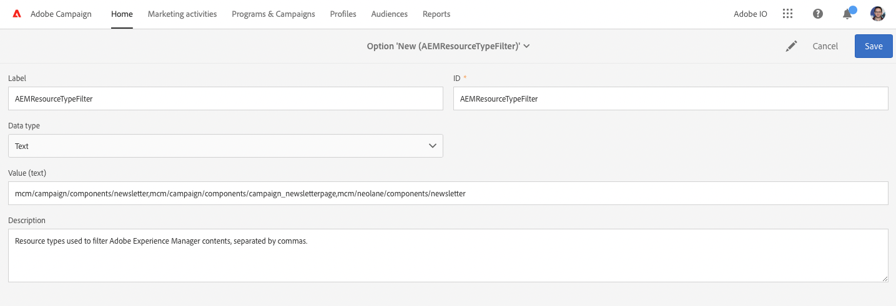

# AEM 6.5 integreren met Adobe Campaign Standard {#integrating-with-adobe-campaign-standard}

Door AEM 6.5 te integreren met Adobe Campaign Standard (ACS), kunt u e-maillevering, inhoud en formulieren direct in AEM beheren. De stappen van de configuratie in zowel Adobe Campaign Standard als AEM zijn nodig om bidirectionele communicatie tussen oplossingen toe te laten.

Dankzij deze integratie kunnen AEM en Adobe Campaign Standard onafhankelijk worden gebruikt. Marketers kunnen campagnes maken en doelgericht gebruik maken in Adobe Campaign, terwijl makers van inhoud tegelijkertijd in AEM aan het ontwerpen van inhoud kunnen werken. Met behulp van de integratie kunnen de inhoud en het ontwerp van de in AEM gemaakte campagne door Adobe Campaign worden aangesproken en geleverd.

>[!INFO]
>
>In dit document wordt beschreven hoe u Adobe Campaign Standard kunt integreren met AEM 6.5. Zie het document voor andere Campagne-integratie [AEM 6.5 integreren met Adobe Campaign.](campaign.md)

## Integratiestappen {#integration-steps}

De configuratie van de integratie tussen AEM en Adobe Campaign Standard vereist verschillende stappen in beide oplossingen.

1. [Vorm ](#aemserver-user)
1. [Controleer de ](#resource-type-filter)
1. [Een AEM-specifieke e-mailleveringssjabloon maken in campagne](#aem-email-delivery-template)
1. [Campagne-integratie configureren in AEM](#campaign-integration)
1. [Replicatie configureren voor AEM publicatie-instantie](#replication)
1. [De AEM ExternalAlizer configureren](#externalizer)
1. [Vorm ](#campaign-remote-user)
1. [De externe AEM-account configureren in de campagne](#acc-external-user)

Dit document leidt u door elk van deze stappen in detail.

## Vereisten {#prerequisites}

* Toegang tot Adobe Campaign Standard voor beheerders
   * Als u meer informatie nodig hebt over het instellen en configureren van Adobe Campaign Standard, raadpleegt u de [Adobe Campaign Standard-documentatie.](https://experienceleague.adobe.com/docs/campaign-standard/using/campaign-standard-home.html)
* Toegang tot AEM beheerder

## De beheerder van de server configureren in Campagne {#aemserver-user}

Adobe Campaign Standard wordt standaard geleverd met een `aemserver` gebruiker die AEM gebruikt om verbinding te maken met Adobe Campaign. Wijs een geschikte beveiligingsgroep toe aan deze gebruiker en stel het wachtwoord ervan in.

1. Meld u als beheerder aan bij Adobe Campaign.

1. Klik op het Adobe Campaign-logo linksboven in de menubalk om de globale navigatie te openen en selecteer vervolgens **Administratie** > **Gebruikers en beveiliging** > **Gebruikers** in het navigatiemenu.

1. Klik op de knop `aemserver` gebruiker in de gebruikersconsole.

1. Zorg ervoor dat de `aemserver` gebruiker wordt toegewezen minstens aan een veiligheidsgroep die de rol heeft `deliveryPrepare` toegewezen. Standaard wordt de groep `Standard Users` heeft deze rol.

   

1. Klikken **Opslaan** om de wijzigingen op te slaan

Uw `aemserver` -gebruiker beschikt nu over de benodigde rechten, zodat AEM deze kan gebruiken om te communiceren met Adobe Campaign.

Voordat AEM echter de opdracht `aemserver` -gebruiker, moet het wachtwoord zijn ingesteld. Dat kan niet via Adobe Campaign. Het moet worden uitgevoerd door een Adobe-ondersteunend ingenieur. [Een ticket indienen bij de klantenservice van de Adobe](https://experienceleague.adobe.com/?support-tab=home#support) om het opnieuw instellen van de `aemserver` wachtwoord. Als u het wachtwoord van de klantenservice van de Adobe hebt, bewaart u het op een veilige locatie.

## Verifieer AEMResourceTypeFilter in Campagne {#resource-type-filter}

De `AEMResourceTypeFilter` is een optie in Adobe Campaign die wordt gebruikt om AEM bronnen te filteren die in Adobe Campaign kunnen worden gebruikt. Omdat AEM veel inhoud bevat, fungeert deze optie als een filter waarmee Adobe Campaign alleen de AEM inhoud kan ophalen van typen die specifiek zijn ontworpen voor gebruik in Adobe Campaign.

Deze optie is vooraf geconfigureerd. Het kan echter zijn dat u deze moet bijwerken als u de onderdelen Campagne van AEM hebt aangepast. Om te verifiëren dat `AEMResourceTypeFilter` Deze stappen volgen.

1. Meld u als beheerder aan bij Adobe Campaign.

1. Klik op het Adobe Campaign-logo linksboven in de menubalk om de globale navigatie te openen en selecteer vervolgens **Administratie** > **Toepassingsinstellingen** > **Opties** in het navigatiemenu.

1. Klik op de knop `AEMResourceTypeFilter` in de optieconsole.

1. Bevestig de configuratie van `AEMResourceTypeFilter`. De paden worden gescheiden met komma&#39;s en bevatten standaard:

   * `mcm/campaign/components/newsletter`
   * `mcm/campaign/components/campaign_newsletterpage`
   * `mcm/neolane/components/newsletter`

   

1. Klikken **Opslaan** om de wijzigingen op te slaan

Uw `AEMResourceTypeFilter` is nu gevormd om de correcte inhoud van AEM terug te winnen.

## Een AEM-specifieke e-mailleveringssjabloon maken in campagne {#aem-email-delivery-template}

AEM is standaard niet ingeschakeld in e-mailsjablonen van Adobe Campaign. Configureer een nieuwe sjabloon voor e-maillevering die kan worden gebruikt om e-mails te maken met AEM inhoud. Voer de volgende stappen uit om een AEM-specifieke sjabloon voor e-maillevering te maken.

1. Meld u als beheerder aan bij Adobe Campaign.

1. Klik op het Adobe Campaign-logo linksboven in de menubalk om de globale navigatie te openen en selecteer vervolgens **Bronnen** > **Sjablonen** > **Afleveringssjablonen** in het navigatiemenu.

1. Zoek in de console met leveringssjablonen de standaard-e-mailsjabloon **Verzenden via e-mail (e-mail)** Houd de muis boven de kaart (of lijn) die deze voorstelt om de opties weer te geven. Klikken **Element dupliceren**.

   

1. In de **Bevestiging** dialoogvenster, klikt u op **Bevestigen** om de sjabloon te dupliceren.

   

1. De sjablooneditor wordt geopend met uw exemplaar van de **Verzenden via e-mail (e-mail)** sjabloon. Klik op de knop **Eigenschappen bewerken** aan de rechterbovenhoek van het venster.

   

1. Wijzig in het venster Eigenschappen de instelling **Label** een beschrijvend veld voor uw nieuwe AEM sjabloon.

1. Klik op de knop **Inhoud** kop om te vergroten en te selecteren **Adobe Experience Manager** in de **Inhoudsbron** vervolgkeuzelijst.

1. Dit onthult de **Adobe Experience Manager-account** veld. Selecteer in het keuzemenu **Adobe Experience Manager-instantie (aemInstance)** gebruiker. Dit is de standaard externe gebruiker voor de AEM integratie.

1. Klikken **Bevestigen** om de wijzigingen in de eigenschappen op te slaan.

1. Klik in de sjablooneditor op **Opslaan** om de gewijzigde kopie van de e-mailsjabloon op te slaan voor gebruik met AEM.

U hebt nu een e-mailsjabloon die AEM inhoud kan gebruiken.

## Campagne-integratie configureren in AEM {#campaign-integration}

AEM communiceert met Adobe Campaign met behulp van een ingebouwde integratie en de `aemserver` gebruiker die u hebt geconfigureerd in Adobe Campaign. Voer de volgende stappen uit om deze integratie te configureren.

1. Meld u als beheerder aan bij de AEM ontwerpinstantie.

1. Selecteer vanuit de globale spoorstaaf voor de navigatie **Gereedschappen** > **Cloud Servicen** > **Oudere Cloud Servicen** > **Adobe Campaign** en klik vervolgens op **Nu configureren**.

   

1. In de dialoog, creeer een de dienstconfiguratie van de Campagne door een **Titel** en klik op **Maken**.

   

1. Er wordt een nieuw venster en dialoogvenster geopend om de configuratie te bewerken. Verstrek de noodzakelijke informatie.

   * **Gebruikersnaam** - Dit is [de `aemserver` gebruiker in Adobe Campaign die u in een vorige stap hebt geconfigureerd.](#aemserver-user) Standaard is dit `aemserver`.
   * **Wachtwoord** - Dit is het wachtwoord voor [de `aemserver` gebruiker in Adobe Campaign die u in een vorige stap bij de Adobe van Klantenservice hebt aangevraagd.](#aemserver-user)
   * **API-eindpunt** - Dit is de URL van de Adobe Campaign-instantie.

   

1. Selecteren **Verbinding maken met Adobe Campaign** om de verbinding te verifiëren en klik vervolgens op **OK**.

AEM kan nu communiceren met Adobe Campaign.

>[!NOTE]
>
>Zorg ervoor dat uw Adobe Campaign-server via internet bereikbaar is. AEM heeft geen toegang tot particuliere netwerken.

## Replicatie configureren voor AEM publicatie-instantie {#replication}

Campagne-inhoud wordt gemaakt door de auteurs van de inhoud op de AEM ontwerpinstantie. Dit exemplaar is typisch slechts intern beschikbaar bij uw organisatie. Als u inhoud, zoals afbeeldingen en elementen, toegankelijk wilt maken voor de ontvangers van uw campagne, moet u die inhoud publiceren.

De replicatieagent is verantwoordelijk voor het publiceren van uw inhoud van de AEM auteurinstantie aan de publicatieinstantie en moet opstelling voor de integratie zijn behoorlijk te werken. Deze stap is ook nodig om bepaalde configuraties van ontwerpinstanties te repliceren in de publicatieinstantie.

Om replicatie van uw AEM auteursinstantie aan te vormen publiceer instantie:

1. Meld u als beheerder aan bij de AEM ontwerpinstantie.

1. Selecteer vanuit de globale spoorstaaf voor de navigatie **Gereedschappen** > **Implementatie** > **Replicatie** > **Medewerkers op auteur** en klik vervolgens op **Standaardagent (publiceren)**.

   

1. Klikken **Bewerken** Selecteer vervolgens de **Vervoer** tab.

1. Vorm **URI** veld door de standaardwaarde te vervangen `localhost` waarde met het IP adres van de AEM het publiceren instantie.

   

1. Klikken **OK** om de veranderingen in de agentenmontages te bewaren.

U hebt replicatie aan de AEM gevormd publiceer instantie zodat kunnen uw campagneontvangers tot uw inhoud toegang hebben.

>[!NOTE]
>
>Als u niet replicatie URL wilt gebruiken maar in plaats daarvan openbaar-onder ogen ziet URL gebruiken, kunt u openbare URL in de volgende configuratie plaatsen die via OSGi plaatst
>
>Selecteer vanuit de globale spoorstaaf voor de navigatie **Gereedschappen** > **Bewerkingen** > **Webconsole** > **OSGi-configuratie** en zoek naar **AEM Campagne-integratie - Configuratie**. De configuratie bewerken en het veld wijzigen **Openbare URL** (`com.day.cq.mcm.campaign.impl.IntegrationConfigImpl#aem.mcm.campaign.publicUrl`).

## De AEM ExternalAlizer configureren {#externalizer}

[De externalizer](/help/sites-developing/externalizer.md) is de dienst OSGi in AEM die een middelweg in externe en absolute URL omzet, die voor AEM noodzakelijk is om inhoud te dienen die de Campagne kan gebruiken. Vorm het zodat de integratie van de Campagne werkt.

1. Meld u als beheerder aan bij de AEM-ontwerpinstantie.
1. Selecteer vanuit de globale spoorstaaf voor de navigatie **Gereedschappen** > **Bewerkingen** > **Webconsole** > **OSGi-configuratie** en zoek naar **Day CQ-koppeling ExternalAlizer**.
1. Standaard wordt de laatste vermelding in het dialoogvenster **Domeinen** is bestemd voor de publicatie-instantie. De URL wijzigen vanuit de standaardinstelling `http://localhost:4503` naar uw openbaar beschikbare publicatie-instantie.

   

1. Klikken **Opslaan**.

U hebt de Externalzer geconfigureerd en Adobe Campaign heeft nu toegang tot uw inhoud.

>[!NOTE]
>
De publicatie-instantie moet bereikbaar zijn vanaf de Adobe Campaign-server. Als deze naar `localhost:4503` of een andere server die Adobe Campaign niet kan bereiken, worden afbeeldingen van AEM niet weergegeven in de Adobe Campaign-console.

## Vorm de campagne-verre Gebruiker in AEM {#campaign-remote-user}

Zoals u een gebruiker in Adobe Campaign nodig hebt die AEM kan gebruiken om met Adobe Campaign te communiceren, heeft Adobe Campaign ook een gebruiker in AEM nodig voor communicatie met AEM. Standaard wordt met de integratie Campagne het dialoogvenster `campaign-remote` gebruiker in AEM. Voer de volgende stappen uit om deze gebruiker te configureren.

1. Meld u aan bij AEM als beheerder.
1. Klik in de hoofdnavigatieconsole op **Gereedschappen** in het linkerspoor.
1. Klik vervolgens op **Beveiliging** > **Gebruikers** om de gebruikersbeheerconsole te openen.
1. Zoek de `campaign-remote` gebruiker.
1. Selecteer de `campaign-remote` gebruiker en klik op **Eigenschappen** om de gebruiker te bewerken.
1. In de **Gebruikersinstellingen bewerken** venster, klikt u op **Wachtwoord wijzigen**.
1. Geef de gebruiker een nieuw wachtwoord op en noteer het wachtwoord op een veilige locatie voor toekomstig gebruik.
1. Klikken **Opslaan** om de wachtwoordwijziging op te slaan.
1. Klikken **Opslaan en sluiten** om de wijzigingen in de `campaign-remote` gebruiker.

## De externe AEM-account configureren in de campagne {#acc-external-user}

Wanneer u [een AEM specifieke sjabloon voor e-maillevering heeft gemaakt,](#aem-email-delivery-template) u hebt opgegeven dat de sjabloon de `aemInstance` externe account voor communicatie met AEM. Om communicatie in twee richtingen tussen beide oplossingen mogelijk te maken, moet u deze rekening in Adobe Campaign vormen.

1. Meld u als beheerder aan bij Adobe Campaign.

1. Klik op het Adobe Campaign-logo linksboven in de menubalk om de globale navigatie te openen en selecteer vervolgens **Administratie** > **Toepassingsinstellingen** > **Externe rekeningen** in het navigatiemenu.

1. Klik op de knop **Adobe Experience Manager-instantie (aemInstance)** gebruiker in de gebruikersconsole.

1. Controleer of de gebruiker **Adobe Experience Manager** als de **Type**.

1. In de **Verbinding** definieert u de volgende velden:

   1. Server: dit is de URL van uw AEM-ontwerpserver. Dit mag niet in een slash eindigen.
   1. Account: Dit is het `campaign-remote` gebruiker u [eerder geconfigureerd in AEM.](#campaign-remote-user)
   1. Wachtwoord: dit is het wachtwoord voor het `campaign-remote`gebruiker u [eerder geconfigureerd in AEM.](#campaign-remote-user)

   

1. Zorg ervoor dat de **Ingeschakeld** Selectievakje is geselecteerd en klik vervolgens op **Opslaan** om uw wijzigingen op te slaan.

Gefeliciteerd! U hebt de integratie tussen AEM en Adobe Campaign Standard voltooid!

## Volgende stappen {#next-steps}

Met zowel Adobe Campaign Classic als AEM geconfigureerd is de integratie nu voltooid.

Je kunt nu leren hoe je een nieuwsbrief kunt maken in Adobe Experience Manager door door te gaan met [dit document.](/help/sites-authoring/campaign.md)
