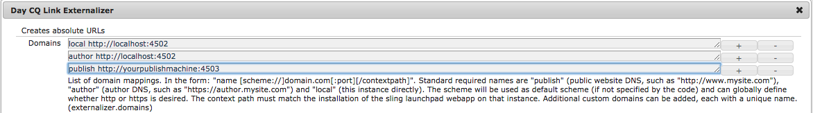

# Integreren met Adobe Campaign Standard{#integrating-with-adobe-campaign-standard}

>[!NOTE]
>
>In deze documentatie wordt beschreven hoe u AEM kunt integreren met Adobe Campagne Standard, de oplossing op basis van abonnementen. Als u Adobe Campagne 6.1 gebruikt, zie [Integratie met de Campagne van Adobe 6.1](/help/sites-administering/campaignonpremise.md) voor die instructies.

Met Adobe Campaign kunt u inhoud en formulieren voor e-maillevering rechtstreeks beheren in Adobe Experience Manager.

Om beide oplossingen samen te gebruiken tezelfdertijd, moet u hen eerst vormen om met elkaar te verbinden. Hiervoor moeten configuratiestappen worden uitgevoerd in zowel Adobe Campaign als Adobe Experience Manager. Deze stappen worden in dit document uitgebreid beschreven.

Als u met Adobe Campaign werkt in AEM, kunt u e-mail en formulieren verzenden via Adobe Campaign. Dit wordt beschreven in [Werken met Adobe Campagne](/help/sites-authoring/campaign.md).

Bovendien kunnen de volgende onderwerpen van belang zijn bij de integratie van AEM met [Adobe-campagne](https://docs.campaign.adobe.com/doc/standard/en/home.html):

* [Aanbevolen procedures voor e-mailsjablonen](/help/sites-administering/best-practices-for-email-templates.md)
* [Oplossen van problemen met de integratie van Adobe Campagne](/help/sites-administering/troubleshooting-campaignintegration.md)

Als u uw integratie met Adobe Campaign uitbreidt, wilt u wellicht de volgende pagina&#39;s zien:

* [Aangepaste extensies maken](/help/sites-developing/extending-campaign-extensions.md)
* [Aangepaste formuliertoewijzingen maken](/help/sites-developing/extending-campaign-form-mapping.md)

## Adobe-campagne configureren {#configuring-adobe-campaign}

Het configureren van Adobe Campaign omvat het volgende:

1. Het vormen van de gebruiker **van de server** .
1. Een speciale externe account maken.
1. De optie AEMResourceTypeFilter controleren.
1. Een toegewezen leveringssjabloon maken.

>[!NOTE]
>
>Als u deze bewerkingen wilt uitvoeren, moet u de **beheerrol** in Adobe Campaign hebben.

### Vereisten {#prerequisites}

Zorg ervoor dat u de volgende elementen vooraf hebt:

* [Een AEM-ontwerpinstantie](/help/sites-deploying/deploy.md#getting-started)
* [Een AEM-publicatie-instantie](/help/sites-deploying/deploy.md#author-and-publish-installs)
* [Een Adobe Campaign-exemplaar](https://docs.adobe.com/content/docs/en/campaign/ACS.html)

>[!CAUTION]
>
>Voor de juiste werking van de integratiefuncties tussen AEM en Adobe Campaign [zijn bewerkingen nodig die worden beschreven in de secties Adobe Experience Manager](#configuring-adobe-campaign)  configureren en configureren.

### De servergebruiker configureren {#configuring-the-aemserver-user}

De gebruiker **van de server** moet in de Campagne van Adobe worden gevormd. De **server** is een technische gebruiker die wordt gebruikt om de AEM-server te verbinden met Adobe Campaign.

Ga naar **Beheer** > **Gebruikers en beveiliging** > **Gebruikers** en selecteer de **gewenste** gebruiker. Klik erop om de gebruikersinstellingen te openen.

* U moet een wachtwoord instellen voor deze gebruiker. Dit kan niet via UI worden gedaan. Deze configuratie moet in REST door een technische beheerder worden gedaan.
* U kunt specifieke rollen aan deze gebruiker, zoals **deliveryPrepare** toewijzen, die de gebruiker toestaat om leveringen tot stand te brengen en uit te geven.

### Een externe account voor Adobe Experience Manager configureren {#configuring-an-adobe-experience-manager-external-account}

U moet een externe account configureren waarmee u Adobe Campaign kunt verbinden met uw AEM-instantie.

>[!NOTE]
>
>Zorg er in AEM voor dat u het wachtwoord voor de externe gebruiker van de campagne instelt. U moet dit wachtwoord instellen om Adobe Campaign te verbinden met AEM. Login als beheerder en in de console van het gebruikersbeleid, onderzoek naar de campagne-verre gebruiker en klik **Vastgestelde Wachtwoord**.

Een externe AEM-account configureren:

1. Ga naar **Beheer** > **Toepassingsinstellingen** > **Externe accounts**.

   

1. Selecteer de standaard externe **account** nameInstance of maak een nieuwe door op de knop **Maken** te klikken.
1. Selecteer **Adobe Experience** Manageri in het veld **Type** en voer de toegangsparameters in die worden gebruikt voor uw AEM-ontwerpinstantie: serveradres, accountnaam en wachtwoord.

   >[!NOTE]
   >
   >Zorg ervoor dat u geen eindslash **/** aan het einde van de URL toevoegt, anders werkt de verbinding niet.

1. Controleer of het selectievakje **Ingeschakeld** is ingeschakeld en klik vervolgens op **Opslaan** om uw wijzigingen op te slaan.

### De optie AEMResourceTypeFilter controleren {#verifying-the-aemresourcetypefilter-option}

De optie **AEMResourceTypeFilter** wordt gebruikt om typen AEM-bronnen te filteren die kunnen worden gebruikt in Adobe-campagne. Hierdoor kan Adobe Campaign AEM-inhoud ophalen die speciaal is ontworpen om alleen in Adobe Campaign te worden gebruikt.

Deze optie is vooraf geconfigureerd; als u deze optie wijzigt, kan dit echter tot een niet-functionerende integratie leiden.

Om te verifiëren wordt de optie **AEMResourceTypeFilter** gevormd:

1. Ga naar **Beheer** > **Toepassingsinstellingen** > **Opties**.
1. In de lijst kunt u ervoor zorgen dat de optie **AEMResourceTypeFilter** wordt vermeld en dat de paden correct zijn.

### Een AEM-specifieke sjabloon voor e-maillevering maken {#creating-an-aem-specific-email-delivery-template}

De functie AEM is standaard niet ingeschakeld in de e-mailsjablonen van Adobe Campaign. U kunt een nieuwe sjabloon voor e-maillevering configureren die wordt gebruikt om e-mails met AEM-inhoud te maken.

Een AEM-specifieke sjabloon voor e-maillevering maken:

1. Ga naar **Bronnen** > **Sjablonen** > **Leveringssjablonen**.
1. **Schakel selectie** in door op het vinkje op de actiebalk te klikken en de bestaande standaardsjabloon voor **standaard-e-mail (e-mail)** te selecteren. Dubbelklik vervolgens op het pictogram **Kopiëren** en klik op **Bevestigen**.
1. Schakel de selectiemodus uit door op de **x** te klikken en de zojuist gemaakte sjabloon **Kopiëren van standaard-e-mail (e-mail)** te openen. Selecteer vervolgens Eigenschappen **** bewerken op de actiebalk van het sjabloondashboard.

   U kunt het **Label** van de sjabloon wijzigen.

1. Wijzig in het gedeelte Eigenschappen **Inhoud** de **inhoudsbron** in **Adobe Experience Manager**. Selecteer vervolgens de externe account die eerder is gemaakt en klik op **Bevestigen**.

   Sla uw wijzigingen op door op **Bevestigen** te klikken en op **Opslaan te klikken.**

   De AEM-inhoudsfunctie wordt ingeschakeld voor e-mailleveringen die zijn gemaakt van deze sjabloon.

   

## Adobe Experience Manager configureren {#configuring-adobe-experience-manager}

Om AEM te vormen, moet u het volgende doen:

* Configureer replicatie tussen instanties.
* Sluit AEM aan de Campagne van Adobe aan.
* Configureer de externalizer.

### Replicatie tussen AEM-instanties configureren {#configuring-replication-between-aem-instances}

Inhoud die is gemaakt van de AEM-ontwerpinstantie wordt eerst naar de publicatieinstantie verzonden. Deze publicatie-instantie brengt de inhoud vervolgens over naar Adobe Campaign. De replicatieagent moet daarom worden gevormd om van de auteursinstantie AEM aan de het publiceren instantie AEM te herhalen.

>[!NOTE]
>
>Als u niet replicatie URL wilt gebruiken maar in plaats daarvan publiek-onder ogen ziet URL gebruiken, kunt u **Openbare URL** in de volgende configuratie plaatsen die in OSGi (**Hulpmiddelen** > de Console **van het** Web > Configuratie **OSGi > de Integratie van de Campagne AEM - Configuratie**) plaatst:
**Openbare URL:** com.day.cq.mcm.campagne.impl.IntegrationConfigImpl#aem.mcm.campagne.publicUrl

Deze stap is ook nodig om bepaalde configuraties van ontwerpinstanties te repliceren in de publicatieinstantie.

Om replicatie tussen AEM instanties te vormen:

1. Selecteer in de ontwerpinstantie **AEM-logo**> **Extra** > **Implementatie** > **Replicatie** > **Agents op auteur****** en klik vervolgens op Default Agent.

   

   >[!NOTE]
   Gebruik geen localhost (dat wil zeggen een lokale kopie van AEM) wanneer u uw integratie met Adobe Campaign configureert, tenzij de publicatie- en auteurinstantie zich beide op dezelfde computer bevinden.

1. Klik op **Bewerken** en selecteer het tabblad **Vervoer** .
1. Vorm URI door **localhost** met het IP adres of het adres van de AEM het publiceren instantie te vervangen.

   

### AEM verbinden met Adobe-campagne {#connecting-aem-to-adobe-campaign}

Voordat u AEM en Adobe Campaign samen kunt gebruiken, moet u het verband tussen beide oplossingen tot stand brengen zodat zij kunnen communiceren.

1. Maak verbinding met uw AEM-ontwerpinstantie.
1. Selecteer **Gereedschappen** > **Bewerkingen** > **Cloud** > **Cloud Services** en **configureer nu** in de sectie Adobe Campagne.

   

1. Maak een nieuwe configuratie door een **titel** in te voeren en op **Maken** te klikken, of kies de bestaande configuratie die u met uw instantie van de Campagne van Adobe wilt verbinden.
1. Bewerk de configuratie zodat deze overeenkomt met de parameters van uw Adobe Campagne-instantie.

   * **Gebruikersnaam**: **aemserver**, de AEM-pakketoperator voor campagnes van Adobe die wordt gebruikt om de koppeling tussen de twee oplossingen tot stand te brengen.
   * **Wachtwoord**: Wachtwoord voor Adobe Campagne-serveroperator. Mogelijk moet u het wachtwoord voor deze operator opnieuw opgeven in Adobe Campaign.
   * **API-eindpunt**: Instantie-URL van Adobe Campagne.

1. Selecteer **Verbinding maken met Adobe-campagne** en klik op **OK**.

   

   >[!NOTE]
   Nadat u uw e-mail hebt [gemaakt en deze](/help/sites-authoring/campaign.md)hebt gepubliceerd, moet u de configuratie opnieuw publiceren naar uw publicatie-exemplaar.

   

>[!NOTE]
Als de verbinding ontbreekt, zorg ervoor u het volgende controleert:
* Er kan een certificaatprobleem optreden wanneer u een beveiligde verbinding met een Adobe Campagne-instantie (https) gebruikt. U moet het Adobe Campagne-instantiecertificaat toevoegen aan het **cacerts **bestand van uw JDK.
* Zie ook [Problemen met uw AEM/Adobe Campagne Integration](/help/sites-administering/troubleshooting-campaignintegration.md)oplossen.

### De externalizer configureren {#configuring-the-externalizer}

U moet de externalizer [in AEM op uw auteursinstantie](/help/sites-developing/externalizer.md) vormen. ExternalAlizer is de dienst OSGi die u een middelweg in een externe en absolute URL laat omzetten. Deze service biedt een centrale plaats om die externe URL&#39;s te configureren en samen te stellen.

Zie [De externalizer](/help/sites-developing/externalizer.md) configureren voor algemene instructies. Voor de integratie van de Campagne van Adobe, zorg ervoor u de publicatieserver op `https://<host>:<port>/system/console/configMgr/com.day.cq.commons.impl.ExternalizerImpl` geen punt aan `localhost:4503` maar aan een server vormt die door de console van de Campagne van Adobe bereikbaar is.

Als de component verwijst naar `localhost:4503` een andere server die niet kan worden bereikt met Adobe Campaign, worden de afbeeldingen niet weergegeven op de Adobe Campaign-console.

