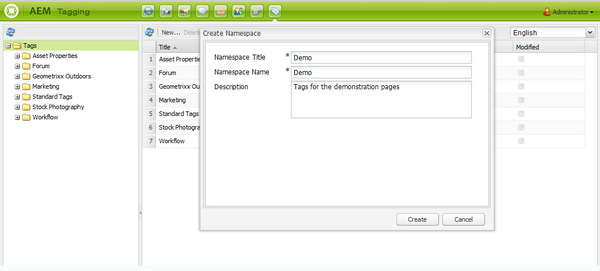

# Classic UI Tagging Console{#classic-ui-tagging-console}

Deze sectie is voor de Classic UI Tagging Console.

De Touch-geoptimaliseerde UI Tagging Console is [hier](/help/sites-administering/tags.md#tagging-console).

U kunt als volgt de klassieke UI-tagingconsole openen:

* op auteur
* aanmelden met beheerdersrechten
* naar de console bladeren
bijvoorbeeld [https://localhost:4502/tagging](https://localhost:4502/tagging)

## Tags en naamruimten maken {#creating-tags-and-namespaces}

1. Afhankelijk van het niveau u van u begint kunt of een markering of een namespace tot stand brengen gebruikend **Nieuw**:

   Als u **Codes** selecteert, kunt u een naamruimte maken:

   

   Als u een naamruimte selecteert (bijvoorbeeld **Demo**), kunt u een tag maken binnen die naamruimte:

   

1. In beide gevallen voert u

   * **Titel**
(
*Vereist*) De weergavetoetiek voor de tag. Tijdens het invoeren van elk teken
u wordt aangeraden deze speciale tekens niet te gebruiken:

      * `colon (:)` - naamruimtescheidingsteken
      * `forward slash (/)` - scheidingsteken voor subtags

      Deze tekens worden niet weergegeven als ze worden ingevoerd.

   * **Naam**
(
*Vereist*) De knooppuntnaam voor de markering.

   * **Beschrijving**
(
*(Optioneel*) Een beschrijving van de tag.

   * Selecteer **Maken**

## Labels {#editing-tags} bewerken

1. Selecteer in het rechterdeelvenster de tag die u wilt bewerken.
1. Klik **Bewerken**.
1. U kunt de **Titel** en **Beschrijving** wijzigen.
1. Klik **Opslaan** om het dialoogvenster te sluiten.

## Labels {#deleting-tags} verwijderen

1. Selecteer in het rechterdeelvenster het label dat u wilt verwijderen.
1. Klik **Delete**.
1. Klik **Ja** om het dialoogvenster te sluiten.

   De tag mag niet meer worden vermeld.

## Labels {#activating-and-deactivating-tags} activeren en deactiveren

1. Selecteer in het rechterdeelvenster de naamruimte of tag die u wilt activeren (publiceren) of deactiveren (publiceren ongedaan maken).
1. Klik **Activeer** of **Deactivate** zoals vereist.

## Lijst - tonen waar de markeringen {#list-showing-where-tags-are-referenced} van verwijzingen voorzien

**Met** Listener wordt een nieuw venster geopend waarin de paden van alle pagina&#39;s met de gemarkeerde tag worden weergegeven:

## Labels {#moving-tags} verplaatsen

Als u wilt helpen dat tagbeheerders en ontwikkelaars de taxonomie opschonen of de naam van een tag-id wijzigen, kunt u een tag naar een nieuwe locatie verplaatsen:

1. Open de **Tags toevoegen**-console.
1. Selecteer de tag en klik op **Verplaatsen...** in de bovenste werkbalk (of in het contextmenu).
1. Definieer in het dialoogvenster **Tag verplaatsen**:

   * **naar**, de bestemmingsknoop.
   * **Naam wijzigen in**, de naam van het nieuwe knooppunt.

1. Klik **Verplaatsen**.

Het dialoogvenster **Tag verplaatsen** ziet er als volgt uit:

>[!NOTE]
>
>Auteurs mogen geen tags verplaatsen of de naam van een tag-id wijzigen. Indien nodig mogen auteurs alleen [de labeltitels](#editing-tags) wijzigen.

## Codes {#merging-tags} samenvoegen

U kunt tags samenvoegen wanneer een taxonomie duplicaten bevat. Wanneer label A wordt samengevoegd met label B, worden alle pagina&#39;s met label A getagd met label B en is label A niet meer beschikbaar voor auteurs.

Een tag samenvoegen in een andere tag:

1. Open de **Tags toevoegen**-console.
1. Selecteer de tag en klik op **Samenvoegen..** in de bovenste werkbalk (of in het contextmenu).
1. Definieer in het dialoogvenster **Tag samenvoegen**:

   * **in**, de bestemmingsknoop.

1. Klik **Samenvoegen**.

Het dialoogvenster **Tag samenvoegen** ziet er als volgt uit:

## Tellen van gebruik van tags {#counting-usage-of-tags}

Zo ziet u hoe vaak een tag wordt gebruikt:

1. Open de **Tags toevoegen**-console.
1. Klik **Telgebruik** in de bovenste werkbalk: In de kolom Aantal wordt het resultaat weergegeven.

## Tags beheren in verschillende talen {#managing-tags-in-different-languages}

De optionele `title`eigenschap van een tag kan in meerdere talen worden vertaald. De tag `titles` kan vervolgens worden weergegeven volgens de gebruikerstaal of de paginataal.

### Tagtitels definiëren in meerdere talen {#defining-tag-titles-in-multiple-languages}

De volgende procedure laat zien hoe u de `title`tag **Dieren** vertaalt in het Engels, Duits en Frans:

1. Ga naar de **Tagging** console.
1. Bewerk de tag **Dieren** onder **Codes** > **Stock Photography**.
1. Voeg de vertalingen in de volgende talen toe:

   * **Engels**: Dieren
   * **Duits**: Tiere
   * **Frans**: Animaux

1. Sla de wijzigingen op.

Het dialoogvenster ziet er als volgt uit:

In de tagconsole wordt de taalinstelling van de gebruiker gebruikt. Voor de tag Animal wordt &#39;Animaux&#39; weergegeven voor een gebruiker die de taal in gebruikerseigenschappen instelt op Frans.

Als u een nieuwe taal wilt toevoegen aan het dialoogvenster, raadpleegt u de sectie [Een nieuwe taal toevoegen aan het dialoogvenster Tag bewerken](/help/sites-developing/building.md#adding-a-new-language-to-the-edit-tag-dialog) in de sectie **Tags toevoegen voor ontwikkelaars**.

### Tagtitels weergeven in pagina-eigenschappen in een opgegeven taal {#displaying-tag-titles-in-page-properties-in-a-specified-language}

Standaard wordt de tag `titles`in de pagina-eigenschappen weergegeven in de paginalabel. Het tagdialoogvenster in de pagina-eigenschappen heeft een taalveld waarmee tag `titles`in een andere taal kan worden weergegeven. De volgende procedure beschrijft hoe u de tag `titles`in het Frans kunt weergeven:

1. Raadpleeg de vorige sectie om de Franse vertaling toe te voegen aan **Dieren** onder **Codes** > **Stock Photography**.
1. Open de pagina-eigenschappen van de pagina **Products** in de Engelse vertakking van de site **Geometrixx**.
1. Open het dialoogvenster **Tags/Trefwoorden** (door het keuzemenu rechts van het weergavegebied Tags/Trefwoorden te selecteren) en selecteer de taal **Frans** in het keuzemenu rechtsonder.
1. Schuif met de pijlen naar links en rechts totdat u het tabblad **Stock Photography** kunt selecteren

   Selecteer de tag **Dieren** (**Animaux**) en selecteer buiten het dialoogvenster om deze te sluiten en de tag toe te voegen aan de pagina-eigenschappen.

   

Standaard wordt in het dialoogvenster Pagina-eigenschappen het label `titles`weergegeven volgens de paginataal.

In het algemeen wordt de taal van de tag opgehaald uit de paginataal als de paginataal beschikbaar is. Wanneer de [ `tag` widget](/help/sites-developing/building.md#tagging-on-the-client-side) in andere gevallen wordt gebruikt (bijvoorbeeld in formulieren of in dialoogvensters), hangt de labeltaal af van de context.

>[!NOTE]
>
>De tagcloud en de metatrefwoorden in de standaardpaginacomponent gebruiken de gelokaliseerde tag `titles`gebaseerd op de paginataal, indien beschikbaar.