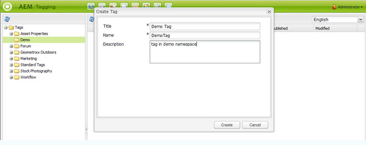
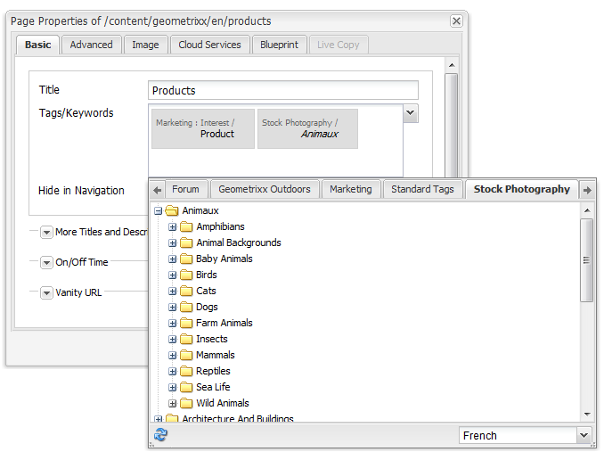

# Klassieke UI-tagconsole{#classic-ui-tagging-console}

Deze sectie is voor de Classic UI Tagging Console.

>[!NOTE]
>
>Zie [&#x200B; Beherende Markeringen &#x200B;](/help/sites-administering/tags.md#tagging-console) voor details van de aanraking-geoptimaliseerde Console van het Tags van UI.

De klassieke UI-tagingconsole openen:

* op auteur
* aanmelden met beheerdersrechten
* naar de console bladeren
bijvoorbeeld, [&#x200B; https://localhost:4502/tagging](https://localhost:4502/tagging)

## Tags en naamruimten maken {#creating-tags-and-namespaces}

1. Afhankelijk van het niveau u van u begint kunt of een markering of een namespace tot stand brengen gebruikend **Nieuw**:

   Als u **Markeringen** selecteert kunt u tot een namespace leiden:

   

   Als u een namespace (bijvoorbeeld, **Demo**) selecteert kunt u een markering binnen dat namespace tot stand brengen:

   

1. In beide gevallen voert u

   * **Titel**
(*Vereiste*) de vertoningstitel voor de markering. Tijdens het invoeren van elk teken
u wordt aangeraden deze speciale tekens niet te gebruiken:

      * `colon (:)` - naamruimtescheidingsteken
      * `forward slash (/)` - scheidingsteken voor subtags

     Deze tekens worden niet weergegeven als ze worden ingevoerd.

   * **Naam**
(*Vereiste*) de knoopnaam voor de markering.

   * **Beschrijving**
(*Facultatieve*) een beschrijving voor de markering.

   * selecteren **creeer**

## Tags bewerken {#editing-tags}

1. Selecteer in het rechterdeelvenster de tag die u wilt bewerken.
1. Klik **uitgeven**.
1. U kunt de **Titel** en de **Beschrijving** wijzigen.
1. Klik **sparen** om de dialoog te sluiten.

## Tags verwijderen {#deleting-tags}

1. Selecteer in het rechterdeelvenster het label dat u wilt verwijderen.
1. Klik **Schrapping**.
1. Klik **ja** om de dialoog te sluiten.

   De tag mag niet meer worden vermeld.

## Labels activeren en deactiveren {#activating-and-deactivating-tags}

1. Selecteer in het rechterdeelvenster de naamruimte of tag die u wilt activeren (publiceren) of deactiveren (publiceren ongedaan maken).
1. Klik **activeren** of **&#x200B;**&#x200B;desactivate zoals vereist.

## Lijst - tonen waar naar tags wordt verwezen {#list-showing-where-tags-are-referenced}

**Lijst** opent een nieuw venster dat de wegen van alle pagina&#39;s toont gebruikend de benadrukte markering:

 van verwijzingen worden voorzien

## Labels verplaatsen {#moving-tags}

Als u wilt helpen dat tagbeheerders en ontwikkelaars de taxonomie opschonen of de naam van een tag-id wijzigen, kunt u een tag naar een nieuwe locatie verplaatsen:

1. Open de **Tags** console.
1. Selecteer de markering en klik **Beweging...** in de hoogste hulpmiddelbar (of in het contextmenu).
1. In de **dialoog van de Markering van de Beweging**, bepaal:

   * **aan**, de bestemmingsknoop.
   * **noem aan** anders, de nieuwe knoopnaam.

1. Klik **Beweging**.

De **dialoog van de Markering van de Beweging** kijkt als volgt:

>[!NOTE]
>
>Auteurs mogen geen tags verplaatsen of de naam van een tag-id wijzigen. Indien nodig, zouden de Auteurs slechts [&#x200B; de markeringstitels &#x200B;](#editing-tags) moeten veranderen.

## Tags samenvoegen {#merging-tags}

U kunt tags samenvoegen wanneer een taxonomie duplicaten bevat. Wanneer label A wordt samengevoegd met label B, worden alle pagina&#39;s met label A getagd met label B en is label A niet meer beschikbaar voor auteurs.

Een tag samenvoegen in een andere tag:

1. Open de **Tags** console.
1. Selecteer de markering en klik **Fusie...** in de hoogste hulpmiddelbar (of in het contextmenu).
1. In de **dialoog van de Markering van de Fusie**, bepaal:

   * **in**, de bestemmingsknoop.

1. Klik **Samenvoegen**.

De **dialoog van de Markering van de Fusie** kijkt als volgt:

## Gebruik van tags tellen {#counting-usage-of-tags}

Zo ziet u hoe vaak een tag wordt gebruikt:

1. Open de **Tags** console.
1. Klik **gebruik van de Telling** in de hoogste hulpmiddelbar: de kolomTelling toont het resultaat.

## Tags beheren in verschillende talen {#managing-tags-in-different-languages}

Het facultatieve `title` bezit van een markering kan in veelvoudige talen worden vertaald. Label `titles` kan vervolgens worden weergegeven volgens de taal van de gebruiker of de paginataal.

### Tagtitels definiëren in meerdere talen {#defining-tag-titles-in-multiple-languages}

De volgende procedure toont hoe te om `title` van de markering **Dieren** in het Engels, Duits en Frans te vertalen:

1. Ga naar de **Tags** console.
1. Bewerk de markering **Dieren** onder **Markeringen** > **Fotografie van de Voorraad**.
1. Voeg de vertalingen in de volgende talen toe:

   * **Engels**: Dieren
   * **Duits**: Tiere
   * **Frans**: Animaux

1. Sla de wijzigingen op.

Het dialoogvenster ziet er als volgt uit:

In de tagconsole wordt de taalinstelling van de gebruiker gebruikt. Voor de tag Animal wordt &#39;Animaux&#39; weergegeven voor een gebruiker die de taal in gebruikerseigenschappen instelt op Frans.

Om een nieuwe taal aan de dialoog toe te voegen, zie de sectie [&#x200B; Toevoegend een Nieuwe Taal aan de Edit Dialoog van de Markering &#x200B;](/help/sites-developing/building.md#adding-a-new-language-to-the-edit-tag-dialog) in het **Tags toevoegen voor de sectie van Ontwikkelaars**.

### Tagtitels weergeven in Pagina-eigenschappen in een opgegeven taal {#displaying-tag-titles-in-page-properties-in-a-specified-language}

Door gebrek wordt de markering `titles` in de paginaeigenschappen getoond in de paginataal. Het tagdialoogvenster in de pagina-eigenschappen heeft een taalveld dat de weergave van tag `titles` in een andere taal mogelijk maakt. De volgende procedure beschrijft hoe te om de markering `titles` in het Frans te tonen:

1. Verwijs naar de vorige sectie om de Franse vertaling aan de **Dieren** toe te voegen onder **Markeringen** > **Fotografie van de Voorraad**.
1. Open de paginaeigenschappen van de **Produkten** pagina in de Engelse tak van de **Geometrixx** plaats.
1. Open de **Tags/de dialoog van Trefwoorden** (door het pull-down menu rechts van het de vertoningsgebied van Tags/Trefwoorden te selecteren) en de **Franse** taal van het pull-down menu in de bodem juiste hoek te selecteren.
1. De rol die de linker-juiste pijlen gebruikt tot het **Fotografie van de Voorraad** tabel kan selecteren

   Selecteer de **Dieren** (**Animaux**) markering en selecteer buiten de dialoog om het te sluiten en de markering toe te voegen aan de paginaeigenschappen.

   

Door gebrek, toont de de dialoogdoos van de Eigenschappen van de Pagina de markering `titles` volgens de paginataal.

In het algemeen wordt de taal van de tag opgehaald uit de paginataal als de paginataal beschikbaar is. Wanneer de [`tag` widget &#x200B;](/help/sites-developing/building.md#tagging-on-the-client-side) in andere gevallen wordt gebruikt (bijvoorbeeld in formulieren of in dialoogvensters), is de taal van de tag afhankelijk van de context.

>[!NOTE]
>
>De markeringswolk en de metatrefwoorden in de standaardpaginacomponent gebruiken de gelokaliseerde markering `titles` die op de paginalaal wordt gebaseerd, als beschikbaar.
