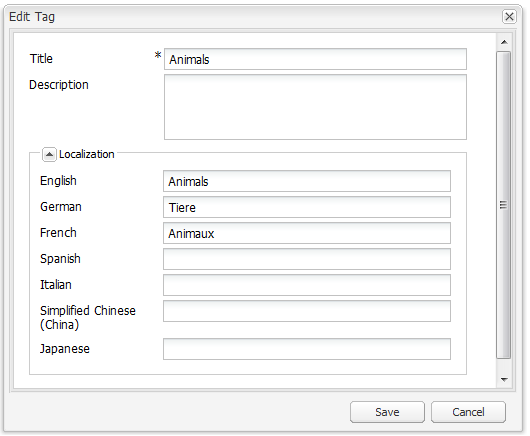

# Klassieke UI-tagconsole{#classic-ui-tagging-console}

Deze sectie is voor de Classic UI Tagging Console.

De voor aanraking geoptimaliseerde UI-tagging-console is [hier](/help/sites-administering/tags.md#tagging-console).

De klassieke UI-tagingconsole openen:

* op auteur
* aanmelden met beheerdersrechten
* naar de console bladeren, bijvoorbeeld [https://localhost:4502/tagging](https://localhost:4502/tagging)

## Tags en naamruimten maken {#creating-tags-and-namespaces}

1. Afhankelijk van het niveau dat u begint, kunt u een tag of een naamruimte maken met **Nieuw**:

   Als u **Tags** u kunt een naamruimte maken:

   

   Als u een naamruimte selecteert (bijvoorbeeld **Demo**) U kunt een tag maken binnen die naamruimte:

   

1. In beide gevallen voert u

   * **Titel**
(*Vereist*) De titel van de weergave voor de tag. U kunt elk teken invoeren, maar u kunt het beste deze speciale tekens niet gebruiken:

      * `colon (:)` - naamruimtescheidingsteken
      * `forward slash (/)` - scheidingsteken voor subtags

     Deze tekens worden niet weergegeven als ze worden ingevoerd.

   * **Naam**
(*Vereist*) De knooppuntnaam voor de tag.

   * **Beschrijving**
(*Optioneel*) Een beschrijving voor de tag.

   * selecteren **Maken**

## Tags bewerken {#editing-tags}

1. Selecteer in het rechterdeelvenster de tag die u wilt bewerken.
1. Klikken **Bewerken**.
1. U kunt de **Titel** en de **Beschrijving**.
1. Klikken **Opslaan** het dialoogvenster sluiten.

## Tags verwijderen {#deleting-tags}

1. Selecteer in het rechterdeelvenster het label dat u wilt verwijderen.
1. Klikken **Verwijderen**.
1. Klikken **Ja** het dialoogvenster sluiten.

   De tag mag niet meer worden vermeld.

## Labels activeren en deactiveren {#activating-and-deactivating-tags}

1. Selecteer in het rechterdeelvenster de naamruimte of tag die u wilt activeren (publiceren) of deactiveren (publiceren ongedaan maken).
1. Klikken **Activeren** of **Deactiveren** zoals vereist.

## Lijst - tonen waar naar tags wordt verwezen {#list-showing-where-tags-are-referenced}

**Lijst** Hiermee opent u een nieuw venster waarin de paden van alle pagina&#39;s met de gemarkeerde code worden weergegeven:

## Labels verplaatsen {#moving-tags}

Als u wilt helpen dat tagbeheerders en ontwikkelaars de taxonomie opschonen of de naam van een tag-id wijzigen, kunt u een tag naar een nieuwe locatie verplaatsen:

1. Open de **Tags** console.
1. Selecteer de tag en klik op **Verplaatsen...** in de bovenste werkbalk (of in het contextmenu).
1. In de **Tag verplaatsen** , definiëren:

   * **tot**, het doelknooppunt.
   * **Naam wijzigen in**, de naam van het nieuwe knooppunt.

1. Klikken **Verplaatsen**.

De **Tag verplaatsen** ziet er als volgt uit:

>[!NOTE]
>
>Auteurs mogen geen tags verplaatsen of de naam van een tag-id wijzigen. Indien nodig mogen auteurs alleen [de titels van tags wijzigen](#editing-tags).

## Tags samenvoegen {#merging-tags}

U kunt tags samenvoegen wanneer een taxonomie duplicaten bevat. Wanneer label A wordt samengevoegd met label B, worden alle pagina&#39;s met label A getagd met label B en is label A niet meer beschikbaar voor auteurs.

Een tag samenvoegen in een andere tag:

1. Open de **Tags** console.
1. Selecteer de tag en klik op **Samenvoegen...** in de bovenste werkbalk (of in het contextmenu).
1. In de **Tag samenvoegen** , definiëren:

   * **in**, het doelknooppunt.

1. Klikken **Samenvoegen**.

De **Tag samenvoegen** ziet er als volgt uit:

## Gebruik van tags tellen {#counting-usage-of-tags}

Zo ziet u hoe vaak een tag wordt gebruikt:

1. Open de **Tags** console.
1. Klikken **Telgebruik** in de bovenste werkbalk: het resultaat wordt weergegeven in de kolom Aantal.

## Tags beheren in verschillende talen {#managing-tags-in-different-languages}

De optionele `title`De eigenschap van een tag kan in meerdere talen worden vertaald. Tag `titles` kan vervolgens worden weergegeven volgens de taal van de gebruiker of de paginataal.

### Tagtitels definiëren in meerdere talen {#defining-tag-titles-in-multiple-languages}

De volgende procedure laat zien hoe u de `title`van de tag **Dieren** Engels, Duits en Frans:

1. Ga naar de **Tags** console.
1. De tag bewerken **Dieren** onder **Tags** > **Stock Photography**.
1. Voeg de vertalingen in de volgende talen toe:

   * **Engels**: Dieren
   * **Duits**: Tiere
   * **Frans**: Animaux

1. Sla de wijzigingen op.

Het dialoogvenster ziet er als volgt uit:

In de tagconsole wordt de taalinstelling van de gebruiker gebruikt. Voor de tag Animal wordt &#39;Animaux&#39; weergegeven voor een gebruiker die de taal in gebruikerseigenschappen instelt op Frans.

Zie de sectie voor een nieuwe taal aan het dialoogvenster [Een nieuwe taal toevoegen aan het dialoogvenster Tag bewerken](/help/sites-developing/building.md#adding-a-new-language-to-the-edit-tag-dialog) in de **Tags voor ontwikkelaars** sectie.

### Tagtitels weergeven in Pagina-eigenschappen in een opgegeven taal {#displaying-tag-titles-in-page-properties-in-a-specified-language}

Standaard wordt de tag `titles`in de pagina-eigenschappen worden weergegeven in de paginataal. Het tagdialoogvenster in de pagina-eigenschappen heeft een taalveld waarmee de tag kan worden weergegeven `titles`in een andere taal. De volgende procedure beschrijft hoe u de tag kunt weergeven `titles`in het Frans:

1. Zie het vorige gedeelte om de Franse vertaling aan de **Dieren** onder **Tags** > **Stock Photography**.
1. Open de pagina-eigenschappen van het dialoogvenster **Producten** pagina in het Engelse gedeelte van de **Geometrixx** site.
1. Open de **Tags/trefwoorden** (door het keuzemenu rechts van het weergavegebied Tags/Trefwoorden te selecteren) en het dialoogvenster **Frans** in het keuzemenu rechtsonder.
1. Schuif met de pijlen naar links en rechts totdat u de optie **Stock Photography** tab

   Selecteer de **Dieren** (**Animaux**) en selecteert u buiten het dialoogvenster om het te sluiten en de tag toe te voegen aan de pagina-eigenschappen.

   

Standaard wordt in het dialoogvenster Pagina-eigenschappen het label weergegeven `titles`volgens de paginataal.

In het algemeen wordt de taal van de tag opgehaald uit de paginataal als de paginataal beschikbaar is. Wanneer de [`tag` widget](/help/sites-developing/building.md#tagging-on-the-client-side) wordt in andere gevallen gebruikt (bijvoorbeeld in formulieren of in dialoogvensters), is de taal van de tag afhankelijk van de context.

>[!NOTE]
>
>De tagcloud en de metatrefwoorden in de standaardpaginacomponent gebruiken de gelokaliseerde tag `titles`op basis van de paginataal, indien beschikbaar.
