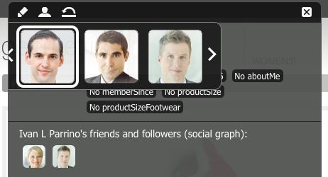

# Clientcontext{#client-context}

>[!NOTE]
>
>De Context van de cliënt is vervangen door ContextHub. Zie de verwante [configuration]ch-configure.md) en [developer](/help/sites-developing/contexthub.md) documentatie voor meer informatie.

De context van de Cliënt is een mechanisme dat u van bepaalde informatie over de huidige pagina en de bezoeker voorziet. Het kan worden geopend met **Ctrl-Alt-c** (vensters) of **control-option-c** (MAC):

In zowel [publiceer als auteursmilieu toont het informatie](#propertiesavailableintheclientcontext) over:

* de bezoeker; afhankelijk van uw instantie wordt bepaalde informatie gevraagd, of afgeleid.
* Paginalabels en het aantal keren dat deze labels door de huidige bezoeker zijn geopend (dit wordt weergegeven wanneer u de muis over een specifieke tag beweegt).
* Pagina-informatie.
* informatie over de technische omgeving; zoals het IP-adres, de browser en de schermresolutie.
* Om het even welke segmenten die momenteel worden opgelost.

Met de pictogrammen (alleen beschikbaar in de auteursomgeving) kunt u de details van de clientcontext configureren:

* **Er wordt een**
nieuwe pagina geopend, zodat u een profieleigenschap [ kunt ](#editingprofiledetails)bewerken, toevoegen of verwijderen.

* ****
LadenU kunt een profiel in een lijst  [selecteren en het ](#loading-a-new-user-profile) profiel laden dat u wilt testen.

* ****
HerstellenU kunt het  [profiel ](#resetting-the-profile-to-the-current-user) opnieuw instellen op dat van de huidige gebruiker.

## Beschikbare clientcontextcomponenten {#available-client-context-components}

De context van de Cliënt kan de volgende eigenschappen ([afhankelijk van wat zijn geselecteerd gebruikend Edit](#adding-a-property-component)) tonen:

**Surfer** InformationGeeft de volgende informatie aan de clientzijde weer:

* het **IP-adres**
* **** trefwoorden voor verwijzing zoekmachine
* de **browser** die wordt gebruikt
* het **gebruikte besturingssysteem** (besturingssysteem)
* het scherm **resolutie**
* de positie **mouse X**
* de positie **mouse Y**

**Activity** StreamThis biedt informatie over de sociale activiteit van de gebruiker op verschillende platforms; bijvoorbeeld de AEM forums , blogs , beoordelingen , enz .

**** CampaignHiermee kunnen auteurs een specifieke ervaring voor een campagne simuleren. Deze component overschrijft de normale campagneresolutie en ervaringsselectie om het testen van verschillende permutaties mogelijk te maken.

De oplossing van de campagne is doorgaans gebaseerd op de prioritaire eigenschap van de campagne. De ervaring wordt gewoonlijk geselecteerd gebaseerd op segmentatie.

**** CartHiermee worden winkelwagengegevens getoond, waaronder productgegevens (titel, hoeveelheid, prijsOpgemaakt, enz.), opgeloste aanbiedingen (titel, bericht, enz.) en vouchers (code, beschrijving, enz.).

De opslag van de wortelzitting brengt de server ook op de hoogte van opgeloste bevorderingsveranderingen (die op segmenteringsveranderingen worden gebaseerd) gebruikend ClientContextCartServlet.

**Generic** StoreIs een generische component die de inhoud van een opslag toont. Het is een lagere versie van de Algemene component van de Eigenschappen van de Opslag.

De Generic Store moet met een renderer worden gevormd JS die de gegevens op een douanemethode zal tonen.

**Generic Store** PropertiesIs een generische component die de inhoud van een opslag toont. Het is een versie op hoger niveau van de Algemene component van de Opslag.

De component Algemene opslageigenschappen bevat een standaardrenderer met de geconfigureerde eigenschappen (samen met een miniatuur).

**** GeolocationGeeft de breedte en lengte van de client weer. De HTML5-geolocatie-API wordt gebruikt om in de browser te zoeken naar de huidige locatie. Dit leidt ertoe dat een pop-up aan de bezoeker wordt getoond, waar browser hen vraagt of komen zij overeen om hun plaats te delen.

Wanneer de component in de Context Cloud wordt weergegeven, gebruikt de component een Google API om een kaart als miniatuur weer te geven. Voor de component gelden de [gebruikslimieten](https://developers.google.com/maps/documentation/staticmaps/intro#Limits) van de Google-API.

>[!NOTE]
>
>In AEM 6.1 biedt het Geolocation Store niet langer de functie voor omgekeerde geocoding. Daarom wint de opslag Geolocation geen details meer over de huidige plaats, zoals de plaatsnaam of landcode terug. Segmenten die deze opslaggegevens gebruiken, werken niet correct. De Geolocation Store bevat alleen de breedte en lengte van een locatie.

**De component JSONP** StoreA die inhoud toont die van uw installatie afhankelijk is.

De norm JSONP is een aanvulling aan JSON die de omzeiling van het zelfde oorsprongbeleid toestaat (die het voor een Web app onmogelijk maakt om met servers te communiceren die op een ander domein zijn). Het bestaat uit het verpakken van het JSON-object in een functieaanroep om het als een `<script>` van het andere domein te kunnen laden (een toegestane uitzondering op hetzelfde oorsprongbeleid).

De opslag JSONP is als een andere opslag, maar het laadt informatie die uit een ander domein zonder de behoefte komt om een volmacht voor die informatie over het huidige domein te hebben. Zie het voorbeeld in [Gegevens opslaan in Clientcontext via JSONP](/help/sites-administering/client-context.md#storing-data-in-client-context-via-jsonp).

>[!NOTE]
>
>De opslag JSONP bewaart niet de informatie in het koekje, maar wint die gegevens over elke paginading terug.

**Profielgegevens** Hiermee geeft u informatie weer die in het gebruikersprofiel is verzameld. Bijvoorbeeld geslacht, leeftijd, e-mailadres.

**Resolved** segmentsShow welke segmenten momenteel oplossen (vaak afhankelijk van andere informatie die in de cliëntcontext wordt getoond). Dit is van belang wanneer u een campagne configureert.

Hiermee wordt bijvoorbeeld aangegeven of de muis zich momenteel op het linker- of rechtergedeelte van het venster bevindt. Dit segment wordt vooral gebruikt voor het testen, omdat wijzigingen direct zichtbaar zijn.

**Sociale** grafiekHiermee geeft u de sociale grafiek weer van de vrienden en volgers van de gebruiker.

>[!NOTE]
>
>Dit is momenteel een demo-functie die afhankelijk is van vooraf geconfigureerde gegevensset op de profielknooppunten van onze demonstratiegebruikers. Zie bijvoorbeeld:
>
>`/home/users/geometrixx/aparker@geometrixx.info/profile` =>, eigenschap vrienden

**Label** CloudShow-tags ingesteld op de huidige pagina en de tags verzameld tijdens het surfen op de site. Als u de muis over een tag beweegt, wordt het aantal keren weergegeven dat de huidige gebruiker pagina&#39;s met die specifieke tag heeft geopend.

>[!NOTE]
Labels die zijn ingesteld op DAM-elementen die worden weergegeven op de bezochte pagina&#39;s, worden niet meegeteld.

**Technologie** StoreDeze component is afhankelijk van uw installatie.

**** ViewedProductsTraces registreert de producten die de verkoper heeft bekeken. Kan worden aangevraagd voor het meest recent bekeken product, of het meest recent bekeken product dat nog niet in de kar zit.

Deze zittingsopslag heeft geen standaardcomponent van de cliëntcontext.

Voor extra informatie, zie [Context van de Cliënt in Detail](/help/sites-developing/client-context.md).

>[!NOTE]
Paginagegevens bevinden zich niet meer in de clientcontext als een standaardcomponent. Indien nodig, kunt u dit toevoegen door de cliëntcontext uit te geven, toevoegend **Algemene Eigenschappen van de Opslag** component, dan vormend dit om **Store** als `pagedata` te bepalen.

## Het clientcontextprofiel wijzigen {#changing-the-client-context-profile}

Met de clientcontext kunt u op interactieve wijze details wijzigen:

* Als u het profiel wijzigt dat wordt gebruikt in de clientcontext, kunt u de verschillende ervaringen zien die de verschillende gebruikers zien voor de huidige pagina.
* U kunt niet alleen het gebruikersprofiel wijzigen, maar ook bepaalde profieldetails wijzigen om te zien hoe de pagina er onder verschillende omstandigheden anders uitziet.

### Een nieuw gebruikersprofiel {#loading-a-new-user-profile} laden

U kunt het profiel als volgt wijzigen:

* [het pictogram load gebruiken](#loading-a-new-visitor-profile-with-the-load-profile-icon)
* [met de selectieregelaar](#loadinganewvisitorprofilewiththeselectionslider)

Als u klaar bent, kunt u [het profiel](#resetting-the-profile-to-the-current-user) opnieuw instellen.

#### Een nieuw bezoekersprofiel laden met het pictogram Profiel laden {#loading-a-new-visitor-profile-with-the-load-profile-icon}

1. Klik op het pictogram Profiel laden:

   

1. Hiermee wordt het dialoogvenster geopend waarin u het profiel kunt selecteren dat u wilt laden:

   

1. Klik **OK** om te laden.

#### Een nieuw gebruikersprofiel laden met de selectieregelaar {#loading-a-new-user-profile-with-the-selection-slider}

U kunt ook een profiel selecteren met de selectieregelaar:

1. Dubbelklik op het pictogram dat de huidige gebruiker vertegenwoordigt. De kiezer wordt geopend, de pijlen worden gebruikt om te navigeren en de beschikbare profielen te bekijken:

   

1. Klik op het profiel dat u wilt laden. Klik buiten de kiezer om de details te sluiten wanneer deze zijn geladen.

#### Het profiel opnieuw instellen op de huidige gebruiker {#resetting-the-profile-to-the-current-user}

1. Gebruik het pictogram Herstellen om het profiel in de context van de Cliënt aan dat van de huidige gebruiker terug te keren:

   

### Het Browser Platform {#changing-the-browser-platform} veranderen

1. Dubbelklik op het pictogram dat het browserplatform vertegenwoordigt. De kiezer wordt geopend, de pijlen worden gebruikt om te navigeren en de beschikbare platforms/browsers te bekijken:

   

1. Klik op de platformbrowser die u wilt laden. Klik buiten de kiezer om de details te sluiten wanneer deze zijn geladen.

### De Geolocatie wijzigen {#changing-the-geolocation}

1. Dubbelklik op het geolocatiepictogram. Er wordt een uitgevouwen kaart geopend waarin u het markeerteken naar een nieuwe locatie kunt slepen:

   

1. Klik buiten de kaart om deze te sluiten.

### De tagselectie wijzigen {#changing-the-tag-selection}

1. Dubbelklik op het gedeelte Tagwolk van de clientcontext. Het dialoogvenster wordt geopend, waar u tags kunt selecteren:

   

1. Klik op OK om te laden in de clientcontext.

## De clientcontext bewerken {#editing-the-client-context}

Het bewerken van een clientcontext kan worden gebruikt om de waarden van bepaalde eigenschappen in te stellen (of opnieuw in te stellen), een nieuwe eigenschap toe te voegen of een eigenschap te verwijderen die niet langer nodig is.

### Bewerkingsdetails {#editing-property-details} bewerken

Het bewerken van een clientcontext kan worden gebruikt om de waarden van bepaalde eigenschappen in te stellen (of opnieuw in te stellen). Dit staat u toe om specifieke scenario&#39;s (met name nuttig voor [segmentation](/help/sites-administering/campaign-segmentation.md) en [campagnes](/help/sites-classic-ui-authoring/classic-personalization-campaigns.md)) te testen.

### Een component Property {#adding-a-property-component} toevoegen

Nadat u de **ClientContext ontwerppagina** hebt geopend, kunt u **Een volledig nieuwe eigenschap toevoegen** ook met de beschikbare componenten (de componenten worden vermeld op zowel de hulpwerkschijf als in het dialoogvenster **Nieuwe component invoegen** dat wordt geopend nadat u dubbelklikt op **Componenten of middelen hier**):

### Een component Property {#removing-a-property-component} verwijderen

Nadat u **ClientContext ontwerppagina** hebt geopend, kunt u **Een eigenschap ook verwijderen als u deze niet meer nodig hebt.** Dit omvat eigenschappen die buiten de box worden geleverd; **Reset** zal deze herstellen als zij zijn verwijderd.

## Gegevens opslaan in clientcontext via JSONP {#storing-data-in-client-context-via-jsonp}

Volg dit voorbeeld om de JSONP component van de de contextopslag van de Opslag te gebruiken om externe gegevens aan de Context van de Cliënt toe te voegen. Maak vervolgens een segment op basis van de informatie uit die gegevens. Het voorbeeld gebruikt de dienst JSONP die WIPmania.com verleent. De service retourneert informatie over de geolocatie op basis van het IP-adres van de webclient.

In dit voorbeeld wordt de voorbeeldwebsite van Geometrixx Outdoors gebruikt om toegang te krijgen tot Client Context en het gemaakte segment te testen. U kunt een andere website gebruiken zolang de pagina Clientcontext heeft ingeschakeld. (Zie [Clientcontext toevoegen aan een pagina](/help/sites-developing/client-context.md#adding-client-context-to-a-page).)

### De JSONP Store-component {#add-the-jsonp-store-component} toevoegen

Voeg de component van de Winkel JSONP aan de Context van de Cliënt toe en gebruik het om geolocatieinformatie over de Webcliënt terug te winnen en op te slaan.

1. Open de Engelse homepage van de site Geometrixx Outdoors op de AEM auteur. ([https://localhost:4502/content/geometrixx-outdoors/en.html](https://localhost:4502/content/geometrixx-outdoors/en.html)).
1. Druk op Ctrl+Alt+c (vensters) of Control+Option+c (Mac) om de clientcontext te openen.
1. Klik op het bewerkingspictogram boven aan Client Context om Client Context Designer te openen.

   

1. Sleep de JSONP Store-component naar Client-context.

   

1. Dubbelklik op de component om het dialoogvenster Bewerken te openen.
1. Voer in het vak URL JSONP-service de volgende URL in en klik op Opslag zoeken:

   `https://api.wipmania.com/jsonp?callback=${callback}`

   De component roept de dienst JSONP en maakt een lijst van alle eigenschappen die de teruggekeerde gegevens bevat. De eigenschappen die in de lijst zijn zijn die die in de Context van de Cliënt beschikbaar zullen zijn.

   

1. Klik op OK.
1. Ga terug naar de startpagina van Geometrixx Outdoors en vernieuw de pagina. De Context van de cliënt omvat nu de informatie van de component van de Winkel JSONP.

   

### Het segment {#create-the-segment} maken

Gebruik de gegevens van de zittingsopslag die u gebruikend de JSONP opslagcomponent creeerde. Het segment gebruikt de breedtegraad van de zittingsopslag en de huidige datum om te bepalen of het wintertijd bij de plaats van de cliënt is.

1. Open de console van Hulpmiddelen in uw Webbrowser (`https://localhost:4502/miscadmin#/etc`).
1. Klik in de mappenstructuur op de map Tools/Segmentation en klik vervolgens op Nieuw > Nieuwe map. Geef de volgende eigenschapswaarden op en klik op Maken:

   * Naam: mysegments
   * Titel: Mijn segmenten

1. Selecteer de map Mijn segmenten en klik op Nieuw > Nieuwe pagina:

   1. Voor de titel typt u Winter.
   1. Selecteer de Segmentsjabloon.
   1. Klik op Maken.

1. Klik met de rechtermuisknop op het wintersegment en klik op Openen.
1. Sleep het Algemene bezit van de Opslag aan het gebrek EN container.

   

1. Dubbelklik op de component om het dialoogvenster Bewerken te openen, geef de volgende eigenschapswaarden op en klik op OK:

   * Winkel: wipmanie
   * Naam eigenschap: breedtegraad
   * Operator: is groter dan
   * Waarde eigenschap: 30

1. Sleep de component Script naar dezelfde container AND en open het dialoogvenster voor het bewerken van de component. Voeg het volgende script toe en klik op OK:

   `3 < new Date().getMonth() < 12`

