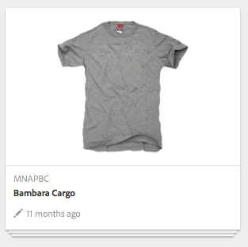

# Concepten{#concepts}

Het integratiekader biedt de mechanismen en componenten voor:

* verbinding met een eCommerce-motor
* gegevens ophalen in AEM
* die gegevens weergeven en de reacties van de winkels verzamelen
* transactiedetails retourneren
* zoeken naar gegevens van beide systemen

Dit betekent dat:

* Winkelaars kunnen zich registreren en winkelen zonder te wachten.
* De kopers zullen de prijswijzigingen onmiddellijk zien.
* De producten kunnen worden toegevoegd zoals vereist.

>[!NOTE]
>
>Het eCommerce-kader kan worden gebruikt met:
>
>* [Magento](https://www.adobe.io/apis/experiencecloud/commerce-integration-framework/integrations.html#!AdobeDocs/commerce-cif-documentation/master/integrations/02-AEM-Magento.md)
>* [SAP Commerce Cloud](/help/sites-administering/sap-commerce-cloud.md)
>* [Salesforce Commerce Cloud](https://github.com/adobe/commerce-salesforce)
>

>[!CAUTION]
>
>Het [eCommerce-integratiekader](https://www.adobe.com/solutions/web-experience-management/commerce.html) is een AEM-invoegtoepassing.
>
>Uw vertegenwoordiger zal alle details kunnen verstrekken, afhankelijk van de geschikte motor.

>[!CAUTION]
>
>Het framework biedt de basisvereisten voor uw eigen project.
>
>Er is altijd een zekere hoeveelheid ontwikkelingswerk nodig om het kader aan uw specificaties aan te passen.

>[!CAUTION]
>
>De standaard AEM-installatie omvat de algemene implementatie van eCommerce (AEM).
>
>Dit is momenteel bedoeld voor demonstratiedoeleinden of als de basis voor een aangepaste implementatie volgens uw vereisten.

Om de werking te optimaliseren, concentreren zowel AEM als de eCommerce-motor zich op hun eigen expertisegebied. De informatie wordt in realtime tussen beide overgedragen; bijvoorbeeld:

* AEM kan:

   * Verzoek:

      * Productinformatie van de eCommerce-engine.
   * Geef:

      * Weergaven van gebruikers voor productinformatie, winkelwagentje en kassa.
      * Winkelwagentje en afrekeninformatie naar de eCommerce-engine.
      * SEO (Search Engine Optimization, optimalisatie van zoekmachines).
      * communautaire functionaliteit.
      * Niet-gestructureerde marketinginteracties.

* eCommerce-engine kan:

   * Geef:

      * Productinformatie uit de database.
      * Beheer van productvarianten.
      * Bestelbeheer.
      * ERP (Enterprise Resource Planning).
      * Zoek in de productinformatie.
   * Proces:

      * Het winkelwagentje.
      * De kassa.
      * Volgorde.

>[!NOTE]
>
>De precieze details zijn afhankelijk van de eCommerce-motor en de uitvoering van het project.

Voor het gebruik van de integratielaag wordt een aantal AEM-componenten buiten de doos meegeleverd. Deze omvatten momenteel:

* Productinformatie
* Winkelwagentje
* Uitchecken
* Mijn account

Er zijn ook verschillende zoekopties beschikbaar.

## Architectuur {#architecture}

Het integratieframework biedt de API, een reeks componenten om functionaliteit te illustreren en verschillende extensies om voorbeelden van verbindingsmethoden te geven:

Het framework biedt u toegang tot functies zoals:

### Implementaties {#implementations}

AEM eCommerce wordt geïmplementeerd met een eCommerce-motor:

* Het integratieframework voor eCommerce is ontworpen om u in staat te stellen een eCommerce-motor eenvoudig met AEM te integreren. De speciaal gebouwde eCommerce-engine bestuurt productgegevens, winkelwagentjes, kassa&#39;s en bestellingen, terwijl AEM de campagnes voor het weergeven en op de markt brengen van gegevens beheert.

>[!NOTE]
>
>De standaard AEM-installatie omvat de algemene implementatie van eCommerce (AEM).
>
>Dit is momenteel bedoeld voor demonstratiedoeleinden of als de basis voor een aangepaste implementatie volgens uw vereisten.
>
>AEM eCommerce dat binnen AEM wordt geïmplementeerd door middel van algemene ontwikkeling op basis van JCR is:
>
>* Een zelfstandig, native voorbeeld van eCommerce met AEM om het gebruik van de API te illustreren. Dit kan worden gebruikt om productgegevens, winkelkaarten en kassa&#39;s te controleren in combinatie met de bestaande campagnes voor het weergeven en op de markt brengen van gegevens. In dit geval wordt de productdatabase opgeslagen in de systeemeigen opslagruimte van AEM (implementatie van [JCR](https://docs.adobe.com/content/docs/en/spec/jcr/2.0/index.html)door Adobe).
>
>  
De standaard AEM-installatie bevat de grondbeginselen van de [algemene eCommerce-implementatie](/help/sites-administering/generic.md).

### Handelsleveranciers {#commerce-providers}

Wanneer het invoeren van gegevens van een handelingsmotor in uw plaats van de Handel AEM, wordt een handelsleverancier gebruikt om de importeurs van gegevens te voorzien. Eén handelsprovider kan meerdere importeurs ondersteunen.

Een handelsleverancier is AEM-code aangepast aan:

* interface aan een achterste verkoopmotor
* een handelssysteem implementeren bovenop de gegevensopslagruimte van het GCO

Er zijn momenteel twee voorbeeld-leveranciers beschikbaar voor AEM:

* één voor geometrixx-hybris
* een andere voor geometrixx-generic (JCR)

Hoewel gewoonlijk zal een project hun eigen, aangepaste, handelsleverancier specifiek voor hun PIM en schema van productgegevens moeten ontwikkelen.

>[!NOTE]
>
>De geometrixximporteurs gebruiken CSV-bestanden; er is een beschrijving van het aanvaarde schema (met douaneeigenschappen toegestaan) in de commentaren boven hun implementatie.

De [ProductServicesManager](https://helpx.adobe.com/experience-manager/6-5/sites/developing/using/reference-materials/javadoc/com/adobe/cq/commerce/pim/api/ProductServicesManager.html) handhaaft (door [OSGi](/help/sites-deploying/configuring.md#osgi-configuration-settings)) een lijst van implementaties van de interfaces [ProductImporter](https://helpx.adobe.com/experience-manager/6-5/sites/developing/using/reference-materials/javadoc/com/adobe/cq/commerce/pim/api/ProductImporter.html) en [CatalogBluprintImporter](https://helpx.adobe.com/experience-manager/6-5/sites/developing/using/reference-materials/javadoc/com/adobe/cq/commerce/pim/api/CatalogBlueprintImporter.html) . Deze worden vermeld op het dropdown gebied van de Leverancier van de **Importer/van de Handel** van de Importeur tovenaar (gebruikend het `commerceProvider` bezit als naam).

Wanneer een specifieke importeur/handelsleverancier beschikbaar is in de vervolgkeuzelijst, moeten eventuele aanvullende gegevens worden gedefinieerd (afhankelijk van het type importeur) in:

* `/apps/commerce/gui/content/catalogs/importblueprintswizard/importers`
* `/apps/commerce/gui/content/products/importproductswizard/importers`

De map in de juiste `importers` map moet overeenkomen met de naam van de importeur. bijvoorbeeld:

* `.../importproductswizard/importers/geometrixx/.content.xml`

De indeling van het bronimportbestand wordt gedefinieerd door de importer. Of de importer kan een verbinding tot stand brengen (bijvoorbeeld WebDAV of http) met de commerce engine.

## Rollen {#roles}

Het geïntegreerde systeem voorziet voor de volgende rollen om de gegevens te handhaven:

* PIM-gebruiker (Product Information Management) die het volgende onderhoudt:

   * Productinformatie.
   * Taxonomie, categorisering, goedkeuring.
   * Werkt met beheer van digitale middelen.
   * Prijsstelling - vaak komt dit uit een ERP-systeem en wordt dit niet expliciet in het handelssysteem gehandhaafd.

* Auteur/marketingmanager die het volgende onderhoudt:

   * Inhoud voor alle kanalen op de markt brengen.
   * Promoties.
   * Vouchers.
   * Campagnes.

* Surfer/shopper die:

   * Bekijk uw productinformatie.
   * Hiermee plaatst u artikelen in het winkelwagentje.
   * Controleert hun bestellingen.
   * Voldoen van bestelling verwacht.

Hoewel de daadwerkelijke plaats van uw implementatie kan afhangen; bijvoorbeeld generiek of met een eCommerce-engine:

## Producten {#products}

### Product Gegevens versus marketinggegevens {#product-data-versus-marketing-data}

#### Structuur- en marketingcategorieën {#structural-versus-marketing-categories}

Als de volgende twee categorieën kunnen worden gedifferentieerd, kunt u zo duidelijke URL&#39;s met een zinvolle structuur (bomen van `cq:Page` knooppunten) maken en dus zeer dicht bij het klassieke AEM-inhoudsbeheer):

* *Structurele *categorieën

   De categorieboom die bepaalt *wat een product* is; bijvoorbeeld:

   `/products/mens/shoes/sneakers`

* *Verkoopcategorieën*

   Alle andere categorieën waartoe een *product kan behoren*; bijvoorbeeld:

   `/special-offers/christmas/shoes`)

### Productgegevens {#product-data}

Als u uw product wilt portretteren en beheren, wilt u een reeks gegevens over het product bewaren.

Productgegevens kunnen zijn:

* rechtstreeks in AEM (algemeen) worden onderhouden.
* in de eCommerce-engine wordt onderhouden en in AEM beschikbaar wordt gesteld.

   Afhankelijk van het gegevenstype wordt het zo nodig [gesynchroniseerd](#catalog-maintenance-data-synchronization) , of direct betreden; bijvoorbeeld, worden de hoogst vluchtige en kritieke gegevens zoals productprijzen teruggewonnen van de e-commerce motor op elke paginaverzoek om ervoor te zorgen dat zij altijd bijgewerkt zijn.

In beide gevallen, wanneer de productgegevens zijn ingegaan/in AEM ingevoerd kan het van de console van **Producten** worden gezien. Hier wordt op de kaart en in de lijst informatie over een product weergegeven, zoals:

* de afbeelding
* de SKU-code
* wanneer laatst gewijzigd

### Productvarianten {#product-variants}

Voor geschikte producten kan ook informatie over varianten worden bewaard. Voor kledingstukken worden de verschillende beschikbare kleuren bijvoorbeeld als varianten bewaard:

### Productkenmerken {#product-attributes}

De afzonderlijke kenmerken van elk product kunnen afhankelijk zijn van de eCommerce-engine die wordt gebruikt en uw AEM-implementatie. Deze zijn (waar van toepassing) beschikbaar bij het bekijken van productpagina&#39;s en/of het uitgeven van productinformatie en kunnen omvatten:

* **Afbeelding**

   Een afbeelding van het product.

* **Titel**

   De productnaam.

* **Beschrijving**

   Een tekstuele beschrijving van het product.

* **Tags**

   Tags die worden gebruikt om verwante producten te groeperen.

* **Standaardelementcategorie**

   Een standaardcategorie voor elementen.

* **ERP-gegevens**

   ERP-informatie (Enterprise Resource Planning).

   * **SKU**

      Informatie over de bewaareenheid (SKU).

   * **Kleur**
   * **Grootte**
   * **Prijs**

      De eenheidsprijs van het product.

* **Samenvatting**

   Een samenvatting van de productkenmerken.

* **Functies**

   Meer informatie over de productfuncties.

### Productelementen {#product-assets}

Voor afzonderlijke producten kan een selectie van activa worden aangehouden. Dit zijn meestal afbeeldingen en video&#39;s.

## Catalogi {#catalogs}

In een catalogus worden productgegevens gegroepeerd voor zowel beheer als representatie voor de klant. Een catalogus is vaak gestructureerd op basis van onder andere taal, geografisch gebied, merk, seizoen, hobby, sport.

### Catalogusstructuur {#catalog-structure}

#### Catalogi in meerdere talen {#catalogs-in-multiple-languages}

AEM ondersteunt productinhoud in meerdere talen. Bij het aanvragen van gegevens haalt het integratieframework de taal op uit de huidige structuur (bijvoorbeeld `en_US` voor pagina&#39;s onder `/content/geometrixx-outdoors/en_US`).

Voor een meertalige opslag kunt u de catalogus voor elke taalboom afzonderlijk importeren (of kopiëren met behulp van [MSM](/help/sites-administering/msm.md)).

#### Catalogi voor meerdere merken {#catalogs-for-multiple-brands}

Net als bij talen kunnen grote multinationale ondernemingen meerdere merken in aanmerking nemen.

#### Catalogi op tags {#catalogs-by-tags}

Met labels kunt u ook producten groeperen in een catalogus. Deze kunnen worden gebruikt voor meer dynamische catalogi, zoals seizoensaanbiedingen.

### Catalogusinstelling (eerste import) {#catalog-setup-initial-import}

Afhankelijk van uw implementatie kunt u de vereiste productgegevens voor uw basiscatalogus in AEM importeren van:

* een CSV-bestand (voor de algemene implementatie)
* de eCommerce-motor

### Catalogusonderhoud (gegevenssynchronisatie) {#catalog-maintenance-data-synchronization}

Verdere wijzigingen van de productgegevens zijn onvermijdelijk:

* voor de generieke implementatie kunnen deze worden beheerd met de [producteditor](/help/sites-administering/generic.md#editing-product-information)
* bij gebruik van een [eCommerce-engine moeten de wijzigingen worden gesynchroniseerd](#data-synchronization-with-an-ecommerce-engine-ongoing)

#### Gegevenssynchronisatie met een eCommerce-engine (aan de gang) {#data-synchronization-with-an-ecommerce-engine-ongoing}

Na de eerste import zijn wijzigingen in de productgegevens onvermijdelijk.

Bij gebruik van een eCommerce-motor worden de productgegevens daar bewaard en moeten ze beschikbaar zijn in AEM. Deze productgegevens moeten worden gesynchroniseerd wanneer updates worden uitgevoerd.

Dit kan afhankelijk zijn van het type gegevens:

* Een [periodieke synchronisatie wordt gebruikt samen met een gegevensvoer van veranderingen](/help/sites-developing/sap-commerce-cloud.md#product-synchronization-and-publishing).

   Daarnaast kunt u specifieke updates selecteren voor een express-update.

* De hoogst volatiele gegevens, zoals prijsinformatie, worden teruggewonnen van de handelingsmotor voor elk paginaverzoek, om ervoor te zorgen dat het altijd bijgewerkt is.

### Catalogi - Prestaties en schalen {#catalogs-performance-and-scaling}

Het importeren van een grote catalogus met een groot aantal producten (meestal meer dan 100.000) uit een eCommerce-engine (PIM) kan het systeem beïnvloeden vanwege het grote aantal knooppunten. Het kan ook de ontwerpinstantie vertragen als de producten bijbehorende elementen (zoals productafbeeldingen) hebben. Dit komt door het feit dat de naverwerking van deze middelen CPU- en geheugenintensief is.

U kunt kiezen uit verschillende strategieën om deze problemen op te lossen:

* [Bucketing](#bucketing) - om rekening te houden met het grote aantal knooppunten
* [Middelen na verwerking naar een specifieke instantie verplaatsen](#offload-asset-post-processing-to-a-dedicated-instance)
* [Alleen productgegevens importeren](#only-import-product-data)
* [Throttling importeren en opslaan in batch](#import-throttling-and-batch-saves)
* [Prestatietesten](#performance-testing)
* [Prestaties - Diversen](#performance-miscellaneous)

#### Emmertje {#bucketing}

Als een JCR-knooppunt veel directe onderliggende knooppunten heeft (bijvoorbeeld 1000 en meer), zijn emmers (fantoommappen) vereist om ervoor te zorgen dat de prestaties niet worden beïnvloed. Deze worden gegenereerd volgens een algoritme bij het importeren.

Deze emmers hebben de vorm van fantoommappen die aan uw catalogusstructuur worden geïntroduceerd, maar kunnen worden gevormd zodat zij niet duidelijk in openbare URLs zijn.

#### Middelen na verwerking naar een specifieke instantie verplaatsen {#offload-asset-post-processing-to-a-dedicated-instance}

In dit scenario worden twee auteur-instanties ingesteld:

1. Master instantie van auteur

   Hiermee importeert u productgegevens van PIM, waarop naverwerking voor de assetpaden is uitgeschakeld.

1. Speciale DAM-auteurinstantie

   Importeert en nabewerkt productactiva van PIM, en herhaalt deze dan terug naar de master auteurinstantie voor gebruik.

#### Alleen productgegevens importeren {#only-import-product-data}

Als producten geen te importeren elementen (afbeeldingen) bevatten, kunt u de productgegevens importeren zonder dat dit wordt beïnvloed door de naverwerking van het element.

<!--delete
#### Import Throttling and Batch Saves {#import-throttling-and-batch-saves}

[Import throttling](/help/sites-deploying/scaling.md#import-throttling) and [batch saves](/help/sites-deploying/scaling.md#batch-saves) are two general [scaling](/help/sites-deploying/scaling.md) mechanisms that can help when importing large volumes of data.-->

#### Prestatietesten {#performance-testing}

Bij de implementatie van AEM e-commerce moet rekening worden gehouden met prestatieonderzoek:

* Auteursomgeving:

   Achtergrondactiviteiten (bijvoorbeeld import) kunnen tegelijkertijd met normale gebruikersactiviteiten plaatsvinden (bijvoorbeeld paginabewerking) en zelfs als front-end prestaties (in het algemeen) een hogere prioriteit krijgen, kunnen slechte prestaties van online auteurs leiden tot frustratie die een go-live beslissing kan blokkeren.

* Publicatieomgeving:

   Replicatie is een belangrijk proces om ervoor te zorgen dat de inhoud snel en betrouwbaar wordt gepubliceerd. Dit kan worden beïnvloed door de manier waarop de auteur de te publiceren inhoud groepeert.

* Voorkant:

   De combinatie van front-end en cache-invalidaties kan mogelijk leiden tot prestatieverrassingen. Door te testen voorkomt u deze problemen.

Houd er rekening mee dat voor deze prestatietests kennis en analyse van uw doel vereist is:

* Inhoudsvolumes

   * Assets
   * Gelokaliseerde, I18-producten en SKU&#39;s

* Gebruikersactiviteit:

   * Bulkuitgave
   * Bulkpublicatie
   * Intensieve zoekverzoeken

* Achtergrondprocessen

   * Invoer
   * Synchronisatie-updates (bijvoorbeeld prijzen)

* Onderhoudsvereisten (back-up, Tar PM-optimalisatie, afvalophaling voor datastore, enz.)

#### Prestaties - Diversen {#performance-miscellaneous}

Voor alle implementaties kan rekening worden gehouden met de volgende punten:

* Aangezien het product, de bewaareenheden en de categorieën talrijk kunnen zijn, probeer om het minste aantal knopen te gebruiken mogelijk om de inhoud te modelleren.

   Hoe meer knooppunten u hebt, des te flexibeler uw inhoud is (bijvoorbeeld parsys). Maar alles is een compromis en hebt u (standaard) individuele flexibiliteit nodig bij het manipuleren (bijvoorbeeld) van 30K-producten?

* Vermijd dubbel zoveel als u kunt (zie lokalisatie), of wanneer u doet, denk over hoeveel knopen uw duplicatie tot zal leiden.
* Probeer de inhoud zo veel mogelijk van tags te voorzien om de query-optimalisatie voor te bereiden.

   Bijvoorbeeld:

   `/content/products/france/fr/shoe/reebok/pump/46 SKU`

   moet één tag per inhoudsniveau hebben (d.w.z. land, taal, categorie, merk, product). Zoeken naar

   `//element(*,my:Sku)[@country=’france’ and @language=’fr’`

   and

   `@category=’shoe’ and @brand=’reebok’ and @product=’pump’]`

   wordt veel sneller dan zoeken naar

   `/jcr:root/content/france/fr/shoe/reebok/pump/element(*,my:Sku)`

* In uw technische stapel, plan zeer gefactoriseerde inhoudstoegangsmodel en de diensten. Dit is een algemene beste praktijk, maar is nog belangrijker, aangezien u, in optimalisatiefasen, toepassingsgeheime voorgeheugens voor gegevens kunt toevoegen die zeer vaak worden gelezen (en dat u niet de bundelgeheime voorgeheugen met wilt vullen).

   Bijvoorbeeld, is het attributenbeheer zeer vaak een goede kandidaat voor caching aangezien het gegevens betreft die door de invoer van producten worden bijgewerkt.
* Overweeg het gebruik van [proxypagina](/help/sites-administering/concepts.md#proxy-pages)&#39;s.

### Sectiepagina&#39;s catalogus {#catalog-section-pages}

De secties van de Catalogus verstrekken u, bijvoorbeeld:

* een inleiding (afbeelding en/of tekst) op de categorie; dit kan ook worden gebruikt voor banners en teasers om speciale aanbiedingen te promoten
* links naar de afzonderlijke producten van die categorie
* links naar de andere categorieën

### Productpagina&#39;s {#product-pages}

Productpagina&#39;s bevatten uitgebreide informatie over afzonderlijke producten. Dynamische updates vanaf worden ook weerspiegeld; bijvoorbeeld prijswijzigingen die zijn geregistreerd op de eCommerce-engine.

Productpagina&#39;s zijn AEM-pagina&#39;s die gebruikmaken van de component **Product** ; bijvoorbeeld in de template **Koophandel** :

De component Product biedt:

* Algemene productinformatie; inclusief tekst en afbeeldingen.
* Prijsstelling; Dit wordt gewoonlijk teruggewonnen van de eCommerce motor telkens als de pagina wordt getoond/verfrist.
* Informatie over productvarianten; bijvoorbeeld kleur en grootte.

Met deze informatie kan de verkoper het volgende selecteren wanneer hij een item aan zijn mandje toevoegt:

* Kleur- en formaatvarianten
* Aantal

#### Landingspagina&#39;s product {#product-landing-pages}

Dit zijn AEM pagina&#39;s die hoofdzakelijk statische informatie verstrekken; bijvoorbeeld een inleiding en een overzicht met koppelingen naar de onderliggende productpagina&#39;s.

### Productcomponent {#product-component}

De component **Product** kan worden toegevoegd aan elke pagina met een bovenliggende pagina die de vereiste metagegevens levert (d.w.z. de paden naar `cartPage` en `cartObject`). Op de demonstratielocatie Geometrixx Outdoor wordt dit geleverd door `UserInfo.jsp`.

De **component Product** kan ook worden aangepast aan uw individuele vereisten.

### Proxypagina&#39;s {#proxy-pages}

Proxypagina&#39;s worden gebruikt om de structuur van de opslagplaats te vereenvoudigen en de opslagcapaciteit voor grote catalogi te optimaliseren.

Bij het maken van een catalogus worden tien knooppunten per product gebruikt, omdat dit afzonderlijke componenten bevat voor elk product dat u kunt bijwerken en aanpassen in AEM. Dit grote aantal knooppunten kan een probleem worden als uw catalogus honderden of zelfs duizenden producten bevat. Om problemen te voorkomen kunt u uw catalogus maken met proxypagina&#39;s.

Proxypagina&#39;s gebruiken een structuur met twee knooppunten ( `cq:Page` en `jcr:content`) die geen van de werkelijke productinhoud bevat. De inhoud wordt op verzoek gegenereerd door te verwijzen naar de productgegevens en de sjabloonpagina.

Er is echter een compromis. U kunt de productinformatie niet aanpassen in AEM. Er wordt een standaardsjabloon (gedefinieerd voor uw site) gebruikt.

>[!NOTE]
>
>Er zijn geen problemen als u een grote catalogus zonder proxypagina&#39;s importeert.
>
>U kunt op elk gewenst moment van de ene methode naar de andere converteren. U kunt ook een subsectie van uw catalogus omzetten.

## Promoties en vouchers {#promotions-and-vouchers}

### Vouchers {#vouchers}

Vouchers zijn een beproefde methode om kortingen aan te bieden om klanten aan te trekken voor het maken van een aankoop en/of het belonen van de loyaliteit van de klant.

* Levering aan vouchers:

   * Een vouchercode (die door de verkoper in de winkelwagen moet worden getypt).
   * Een voucherlabel (dat moet worden weergegeven nadat de gebruiker het in de winkelwagen heeft ingevoerd).
   * Een promotiepad (dat de actie definieert die de voucher toepast).

* De motoren van de buitenlandse handel kunnen bonnen ook leveren.

In AEM:

* Een voucher is een op pagina gebaseerde component die wordt gemaakt/bewerkt met de websiteconsole.
* De **component Voucher** biedt:

   * Een renderer voor voucherbeheer; hieruit blijkt welke vouchers zich momenteel in de kar bevinden .
   * De bewerkingsdialoogvensters (formulier) voor het beheren (toevoegen/verwijderen) van de vouchers.
   * De handelingen die vereist zijn voor het toevoegen/verwijderen van vouchers aan/uit de kar.

* Vouchers hebben geen eigen datum/tijd, maar gebruiken die van hun bovenliggende campagnes.

>[!NOTE]
>
>AEM gebruikt de term **Voucher**, dit is synoniem met de term **Coupon**.

### Aanbiedingen {#promotions}

Met promoties kunt u samen met vouchers scenario&#39;s realiseren zoals:

* Een bedrijf verstrekt douaneprijzen voor werknemers, die een handgemaakte lijst van gebruikers is.
* Langlopende klanten ontvangen kortingen op alle orders.
* Een verkoopprijs die wordt aangeboden over een welomschreven periode.
* Een klant ontvangt een voucher wanneer de vorige bestelling een bepaald bedrag overschrijdt.
* Een klant die *product-X* koopt wordt aangeboden een korting op *product-Y* (paarproducten).

Promoties worden gewoonlijk niet onderhouden door productinformatiemanagers, maar door marketingmanagers:

* Een bevordering is een op pagina-gebaseerde component die met de console van Websites wordt gecreeerd/uitgegeven. ``
* Aanbod voor promoties:

   * Een prioriteit
   * Een pad voor promotiemandschappen

* U kunt promoties verbinden met een campagne om de aan/uit-datum of -tijden te definiëren.
* U kunt promoties aan een ervaring verbinden om hun segmenten te bepalen.
* Promoties die geen verband houden met een ervaring, worden niet op zichzelf afgegaan, maar kunnen nog steeds door een Voucher worden geactiveerd.
* De component Promotie bevat:

   * renderers en dialoogvensters voor bevorderingsbeheer
   * subcomponenten voor het teruggeven en het uitgeven configuratieparameters specifiek voor de bevorderingsmanagers

In AEM zijn de promoties ook geïntegreerd in het [Campagnebeheer](/help/sites-authoring/personalization.md):

* een [campagne](/help/sites-authoring/personalization.md) geeft de aan/uit-tijden aan
* [ervaringen](/help/sites-authoring/personalization.md) *binnen* de campagne worden gebruikt om elementen (theaterpagina&#39;s, promoties, enz.) te groeperen volgens het publiekssegment dat zij beantwoorden aan

Een promotieactie kan worden uitgevoerd in een ervaring of rechtstreeks in de campagne:

* Als een bevordering in een ervaring wordt gehouden, dan kan het automatisch op een publiekssegment worden toegepast.

   In de geometrixx-outdoorvoorbeeldsite is de promotie bijvoorbeeld:

   `/content/campaigns/geometrixx-outdoors/big-spender/ordervalueover100/free-shipping`

   bevindt zich in een ervaring en wordt dus automatisch geactiveerd wanneer het segment ( `ordervalueover100`) verdwijnt.

* Als een bevordering niet binnen een ervaring verschijnt (slechts in de campagne), dan kan het niet automatisch op een publiek worden toegepast. Het kan echter nog steeds worden geactiveerd als de gebruiker een voucher in zijn winkelwagen invoert en die voucher verwijst naar de promotie.

   Bijvoorbeeld:

   `/content/campaigns/geometrixx-outdoors/article/10-bucks-off`

   buiten een ervaring valt en dus nooit automatisch wordt geactiveerd (dat wil zeggen: op basis van segmentatie). Er wordt echter naar verwezen door de vouchers die te vinden zijn in verschillende ervaringen in de artikelcampagne. Als deze vouchercodes in de winkelwagentje worden ingevoerd, wordt de promotieactie geactiveerd.

>[!NOTE]
>
>[hybris promotions](https://www.hybris.com/modules/promotion) and [hybris vouchers](https://www.hybris.com/en/modules/voucher) bestrijken alles wat van invloed is op het winkelwagentje en verband houdt met de prijsstelling . Promotie-specifieke marketinginhoud (zoals banners, enz.) maakt geen deel uit van de hybrispromotie.

## Personalisatie {#personalization}

### Klantenregistratie en -accounts {#customer-registration-and-accounts}

Wanneer een winkel zich registreert, moeten de accountgegevens worden gesynchroniseerd tussen AEM en de eCommerce-engine. Gevoelige gegevens worden onafhankelijk opgeslagen, maar profielen worden gedeeld:

Het precieze mechanisme kan van het scenario afhangen:

1. De gebruikersaccounts bestaan in beide systemen:

   1. Geen actie vereist.

1. De gebruikersaccount bestaat alleen in AEM:

   1. De gebruiker wordt gemaakt in de eCommerce-engine met dezelfde account-id en een willekeurig wachtwoord dat wordt opgeslagen in AEM.
   1. Het willekeurige wachtwoord is noodzakelijk, aangezien AEM probeert om in de eCommerce motor op de eerste vraag (bijvoorbeeld, wanneer een productpagina wordt gevraagd en de eCommerce motor voor de prijs van verwijzingen wordt voorzien) te registreren. Omdat dit gebeurt na de AEM-aanmelding, is het wachtwoord niet beschikbaar.

1. De gebruikersaccount bestaat alleen in de eCommerce-engine:

   1. Het account wordt gemaakt in AEM met dezelfde account-id en hetzelfde wachtwoord.

Bij gebruik van een eCommerce-engine slaat AEM alleen de account-id en het wachtwoord op (optioneel een gebruikersgroep). Alle andere informatie wordt opgeslagen in de eCommerce-engine.

>[!NOTE]
>
>Wanneer u een eCommerce-engine gebruikt, moet u ervoor zorgen dat accounts die zijn gemaakt voor gebruikers die zich aanmelden bij een AEM-instantie, worden gerepliceerd (bijvoorbeeld via workflows) naar andere AEM-instanties die met die engine communiceren.
>
>Anders zullen deze andere AEM-instanties ook proberen accounts te maken voor dezelfde gebruikers in de engine. Deze acties zullen mislukken met een `DuplicateUidException` afkomstig van de motor.

### Aanmelden bij klant {#customer-sign-up}

Vaak is aanmelding vereist voor de winkelwagentje. Hiervoor is registratie (Account maken) vereist, zodat een klantspecifieke account kan worden gemaakt.

>[!NOTE]
>
>Een anonieme winkelwagentje en afhandeling worden ook ondersteund.

### Aanmelden bij klant {#customer-sign-in}

Na aanmelding kan de winkel zich aanmelden bij zijn account, zodat de acties van de winkel kunnen worden bijgehouden en de bestellingen kunnen worden uitgevoerd.

### Single Sign-On {#single-sign-on}

Single-sign-on (SSO) wordt verstrekt, zodat de auteurs in zowel AEM als het eCommerce systeem gekend zijn zonder het moeten login tweemaal.

### myAccount {#myaccount}

Transactiegegevens van de eCommerce-engine worden gecombineerd met persoonlijke informatie over de winkelier. AEM gebruikt sommige van deze gegevens als profielgegevens. De actie van een formulier in AEM schrijft informatie terug naar de eCommerce-engine.

Er is een pagina waarop u uw accountgegevens eenvoudig kunt beheren. U kunt het openen door **Mijn Rekening** bij de bovenkant van een geometrixx pagina te klikken, of door te navigeren aan `/content/geometrixx-outdoors/en/user/account.html`.

### Adresboek {#address-book}

Uw site moet een selectie adressen opslaan. inclusief levering, facturering en alternatieve adressen. Dit kan worden uitgevoerd gebruikend vormen die op uw standaardadresformaat worden gebaseerd of u kunt de component van het Boek van het Adres gebruiken die door AEM wordt verstrekt.

Met deze component Adresboek kunt u:

* adressen in het boek bewerken
* selecteer een adres in het boek voor het verzendadres
* selecteer een adres uit het boek voor het factureringsadres

U kunt kiezen welk adres u als gebrek wilt.

De component van het adresboek is bereikbaar van de pagina **Mijn Rekening** door **het Boek** van het Adres te klikken of door aan `/content/geometrixx-outdoors/en/user/account/address-book.html`. te navigeren.

U kunt op Nieuw adres **toevoegen klikken...** om een nieuw adres in uw adresboek toe te voegen. Er wordt een formulier geopend dat u kunt invullen en vervolgens op Adres **** toevoegen klikt.

>[!NOTE]
>
>U kunt verschillende adressen invoeren in uw adresboek.

Het adresboek wordt gebruikt wanneer u uw winkelwagentje uitcheckt:

Adressen blijven hieronder behouden `user_home/profile/addresses`.
Voor Alison Parker, bijvoorbeeld, zou het onder /home/users/geometrixx/aparker@geometrixx.info/profile/adressen zijn

U kunt kiezen welk adres u als gebrek wilt, wordt deze informatie voortgeduurd in het profiel van de verkoopster eerder dan met het adres. De profieleigenschap `address.default` wordt ingesteld met het pad van het geselecteerde adres voor waarde.

### Klantspecifieke prijzen {#customer-specific-pricing}

De eCommerce-engine gebruikt de context (in wezen de verkoopinformatie) om de prijs te bepalen die hij in zijn bezit heeft en geeft de juiste informatie terug aan AEM.

## Winkelwagentje en bestellingen {#shopping-cart-and-orders}

Wanneer de winkel wordt geopend, bladert de winkelier door de productpagina&#39;s en selecteert hij items om deze in zijn winkelwagentje te plaatsen. Wanneer ze doorgaan met het uitchecken, kan een bestelling worden geplaatst.

### Anonieme kopers {#anonymous-shoppers}

Een anonieme klant kan:

* Producten weergeven
* Producten aan hun winkelwagentje toevoegen
* Uitchecken uitvoeren om de bestelling te plaatsen

>[!NOTE]
>
>Afhankelijk van de configuratie van uw informatie van het instantieadres, of klantenregistratie, zou voorafgaand aan controle kunnen worden vereist.

### Geregistreerde kopers {#registered-shoppers}

Een geregistreerde klant kan:

* Aanmelden bij hun account
* Producten weergeven
* Producten aan hun winkelwagentje toevoegen
* Uitchecken uitvoeren om de bestelling te plaatsen
* Eerdere bestellingen weergeven en volgen

### Overzicht van winkelwagentje inhoud {#shopping-cart-content-overview}

Het winkelwagentje biedt:

* een overzicht van geselecteerde objecten
* koppelingen naar de productpagina&#39;s voor de geselecteerde items
* de mogelijkheid om:

   * het aantal/de hoeveelheid afzonderlijke items bijwerken
   * afzonderlijke items verwijderen

Het winkelwagentje wordt opgeslagen op basis van de gebruikte motor:

* In AEM wordt de winkelwagen in een cookie opgeslagen.
* Bepaalde eCommerce-motoren kunnen de winkelwagen tijdens een sessie opslaan.

In beide gevallen blijven de items in het winkelwagentje (en kunnen ze worden hersteld) staan bij aanmelding/afmelding (maar alleen op dezelfde computer/browser). Bijvoorbeeld:

* bladeren als producten `anonymous` en deze toevoegen aan het winkelwagentje
* aanmelden als `Allison Parker` - haar winkelwagen is leeg
* producten toevoegen aan haar winkelwagentje
* afmelden - de winkelwagen zal de producten tonen voor `anonymous`

* opnieuw aanmelden wanneer `Allison Parker` - haar producten zijn hersteld

>[!NOTE]
>
>Een anonieme wagen kan alleen op dezelfde computer/browser worden hersteld.

>[!NOTE]
>
>Het wordt niet aanbevolen het terugzetten van de inhoud van het winkelwagentje met de `admin` account te testen, omdat dit in strijd kan zijn met de `admin` rekening van de eCommerce-motor (bijvoorbeeld hybris).

>[!NOTE]
>
>hybris kan worden geconfigureerd om hangende winkelwagentjes na een bepaalde periode te verwijderen .

Vóór het afrekenen worden prijswijzigingen weerspiegeld (in beide systemen) naarmate ze zich voordoen.

### Ordergegevens {#order-information}

Afhankelijk van uw implementatiegegevens over een bestelling wordt deze informatie door AEM weergegeven in de eCommerce-engine of AEM.

Er worden diverse gegevens opgeslagen, waaronder:

* **Order-id**

   Het referentienummer van de bestelling.

* **Geplaatst**

   De datum waarop de bestelling is geplaatst.

* **Status**

   de status van de order; bijvoorbeeld Verzonden.

* **Valuta**

   De valuta van de order.

* **Inhoud-items**

   Een lijst met geordende items.

* **Subtotaal**

   De totale kosten van de bestelde objecten.

* **Belasting**

   Het bedrag van de verschuldigde belastingen op de order.

* **Verzending**

   Verzendkosten.

* **Totaal**

   de totale waarde van de order; bestelde objecten, belastingen en overslag.

* **Factuuradres**

   Het adres waarnaar de factuur moet worden verzonden.

* **Betaaltoken**

   De betalingsmethode.

* **Betalingsstatus**

   De status van de betaling.

* **Verzendadres**

   Het adres waarnaar de goederen moeten worden verzonden.

* **Verzendmethode**

   de wijze van verzending; bijvoorbeeld land, zee of lucht.

* **Trackingnummer**

   Elk trackingnummer dat door de verzendende onderneming wordt gebruikt.

* **Koppeling bijhouden**

   De koppeling die wordt gebruikt voor het bijhouden van de bestelling tijdens het verzenden.

>[!NOTE]
>
>De velden die worden gebruikt in de wizard voor het maken van bestellingen zijn afhankelijk van een voor aanrakingen geoptimaliseerde basisstructuur die is gedefinieerd voor de locatie. In het algemene voorbeeld vindt u de volgende informatie:
>`/etc/scaffolding/geometrixx-outdoors/order/jcr:content/cq:dialog`

Wanneer de orde binnen AEM wordt gehouden toont de console van de Orde het volgende voor elke orde:

* het aantal artikelen in het winkelwagentje
* de totale waarde van de order
* op het moment dat de order werd geplaatst
* de status

### Volgorde bijhouden {#order-tracking}

Nadat kopers een bestelling hebben geplaatst, keren ze vaak terug naar:

* De status van hun bestelling controleren
* Producten uit de bestelling verwijderen
* Producten aan de bestelling toevoegen

Na ontvangst van de levering van de bestelling willen kopers wellicht ook de geschiedenis van bestellingen over een bepaalde periode bekijken.

De afhandeling en het bijhouden van bestellingen wordt meestal beheerd door de eCommerce-engine. De informatie kan door AEM worden getoond gebruikend de component van de Geschiedenis van de Orde, die alle relevante details, met inbegrip van de toegepaste vouchers en promoties toont. Bijvoorbeeld:

## Afhandeling {#checkout}

Afhandeling wordt geïmplementeerd met standaard AEM-formulieren. Hierdoor kan de marketingmanager de ervaring met marketinginhoud aanpassen.

De eCommerce beheert vervolgens het afrekenproces met invoer uit de AEM-formulieren.

### Betalingsbeveiliging {#payment-security}

Betalingsgegevens, waaronder creditcardgegevens, worden vaak beheerd door de eCommerce-engine. AEM stuurt dergelijke transactiegegevens door naar de motor (vanwaar deze vervolgens wordt doorgestuurd naar een betalingsverwerkingsdienst).

PGB-compatibiliteit (Payment Card Industry) kan worden bereikt.

### Bevestiging van bestelling {#confirmation-of-order}

De volgorde wordt op het scherm bevestigd en kan worden bijgehouden met de [volgorde](#order-tracking).

## Zoeken {#search-features}

Aangezien AEM standaardpagina&#39;s voor producten gebruikt, kunt u de standaardzoekcomponent gebruiken om een zoekpagina te maken.

Als u een grondiger implementatie nodig hebt, kunt u:

* Breid de standaardonderzoekscomponent met de functionaliteit uit u wenst.
* Voer de onderzoeksmethode in uw uit `CommerceService` en gebruik dan de eCommerce onderzoekscomponent op uw onderzoekspagina.

Wanneer u een eCommerce-engine gebruikt, kan de zoekfunctie-API voor eCommerce volledig worden geïmplementeerd in de eCommerce-oplossing, zodat u de zoekcomponent voor eCommerce kunt gebruiken die buiten het vak is opgegeven. Met de beperkte zoekopdracht kunt u zoeken in JCR en/of de engine:

