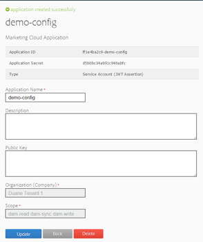

# AEM Assets-integratie met Experience Cloud configureren {#configure-aem-assets-integration-with-experience-cloud-and-creative-cloud}

Als u een Adobe Experience Cloud-klant bent, kunt u uw middelen in Adobe Experience Manager Assets synchroniseren met Adobe Creative Cloud en omgekeerd. U kunt uw elementen ook synchroniseren met Experience Cloud en omgekeerd. U kunt deze synchronisatie instellen via [!DNL Adobe I/O] . De bijgewerkte naam van [!DNL Adobe Marketing Cloud] is [!DNL Adobe Experience Cloud] .

De workflow voor het instellen van deze integratie is:

1. Creeer een authentificatie in [!DNL Adobe I/O] gebruikend een openbare gateway en krijg toepassings identiteitskaart
1. Maak een profiel op uw AEM Assets-instantie met de toepassings-id.
1. Gebruik deze configuratie om uw elementen te synchroniseren.

Op de achtergrond, verifieert de AEM server uw profiel met de gateway en synchroniseert dan de gegevens tussen Assets en Experience Cloud.

>[!NOTE]
>
>Deze functie is vervangen in [!DNL Assets] . Vind vervangingen in [ AEM en de beste praktijken van de Integratie van het Creative Cloud ](/help/assets/aem-cc-integration-best-practices.md). Als u om het even welke vragen hebt, [ contacteer de Steun van de Klant van de Adobe ](https://www.adobe.com/account/sign-in.supportportal.html).

<!-- Hiding this for now via cqdoc-16834.

>[!NOTE]
>
>Sharing assets between Adobe Experience Cloud and Adobe Creative Cloud requires administrator privileges on the AEM instance.
-->

## Een toepassing maken {#create-an-application}

1. Heb toegang tot de gatewayinterface van Adobe Developer door het programma te openen bij [ https://legacy-oauth.cloud.adobe.io ](https://legacy-oauth.cloud.adobe.io/).

   >[!NOTE]
   >
   >U hebt beheerdersrechten nodig om een toepassings-id te maken.

1. Navigeer in het linkervenster naar **[!UICONTROL Developer Tools]** > **[!UICONTROL Applications]** om een lijst met toepassingen weer te geven.
1. Klik **[!UICONTROL Add]**  om een toepassing tot stand te brengen.
1. Selecteer in de lijst **[!UICONTROL Client Credentials]** de optie **[!UICONTROL Service Account (JWT Assertion)]** . Dit is een server-naar-server communicatieservice voor serververificatie.

   

1. Geef een naam voor de toepassing en een optionele beschrijving op.
1. Selecteer in de lijst **[!UICONTROL Organization]** de organisatie waarvoor u elementen wilt synchroniseren.
1. Selecteer in de lijst **[!UICONTROL Scope]** de optie **[!UICONTROL dam-read]** , **[!UICONTROL dam-sync]** , **[!UICONTROL dam-write]** en **[!UICONTROL cc-share]** .
1. Klik op **[!UICONTROL Create]**. Een bericht meldt dat de toepassing is gemaakt.

   

1. Kopieer de **[!UICONTROL Application ID]** die voor de nieuwe toepassing wordt geproduceerd.

   >[!CAUTION]
   >
   >Zorg ervoor dat u de **[!UICONTROL Application Secret]** niet per ongeluk kopieert in plaats van de **[!UICONTROL Application ID]** .

## Een nieuwe configuratie toevoegen aan Experience Cloud {#add-a-new-configuration}

1. Klik op het AEM logo in de gebruikersinterface van uw lokale AEM Assets-instantie en navigeer naar **[!UICONTROL Tools]** > **[!UICONTROL Cloud Services]** > **[!UICONTROL Legacy Cloud Services]** .

1. Zoek de service **[!UICONTROL Adobe Experience Cloud]** . Klik op **[!UICONTROL Configure Now]** als er geen configuraties bestaan. Als er configuraties bestaan, klikt u op **[!UICONTROL Show Configurations]** en klikt u op `+` om een nieuwe configuratie toe te voegen.

   >[!NOTE]
   >
   >Gebruik een Adobe ID-account met beheerdersrechten voor de organisatie.

1. Geef in het dialoogvenster **[!UICONTROL Create Configuration]** een titel en naam op voor de nieuwe configuratie en klik op **[!UICONTROL Create]** .

   

1. Geef in het veld **[!UICONTROL Tenant URL]** de URL voor AEM Assets op. Als de URL in het verleden is gedefinieerd als `https://<tenant_id>.marketing.adobe.com` , wijzigt u deze in `https://<tenant_id>.experiencecloud.adobe.com` .

   1. Navigeer aan **Hulpmiddelen > Cloud Servicen > Verouderde Cloud Servicen**. Onder Adobe Experience Cloud, klik **tonen Configuraties**.
   1. Selecteer de bestaande configuratie die u wilt bewerken. Bewerk de configuratie en vervang `marketing.adobe.com` door `experiencecloud.adobe.com` .
   1. Sla de configuratie op. Test de MAC-sync replicatiemiddelen.

1. Op het **[!UICONTROL Client ID]** gebied, deeg toepassingsidentiteitskaart u aan het eind van de procedure [ kopieerde creeert een toepassing ](#create-an-application).

   

1. Onder **[!UICONTROL Synchronization]** selecteert u **[!UICONTROL Enabled]** om synchronisatie in te schakelen en klikt u op **[!UICONTROL OK]** . Als u **gehandicapt** selecteert, werkt de synchronisatie in één enkele richting.

1. Klik op de configuratiepagina op **[!UICONTROL Display Public Key]** om de openbare sleutel weer te geven die voor uw instantie is gegenereerd. U kunt ook op **[!UICONTROL Download Public Key for OAuth Gateway]** klikken om het bestand met de openbare sleutel te downloaden. Open vervolgens het bestand om de openbare sleutel weer te geven.

## Synchronisatie inschakelen {#enable-synchronization}

1. Toon de openbare sleutel gebruikend één van de volgende methodes die in de laatste stap van de procedure [ worden vermeld voeg een nieuwe configuratie aan Experience Cloud ](#add-a-new-configuration) toe. Klik op **[!UICONTROL Display Public Key]**.

1. Kopieer de openbare sleutel en kleef het in het **[!UICONTROL Public Key]** gebied van configuratieinterface van de toepassing u in [ creeerde een toepassing ](#create-an-application).

   

1. Klik op **[!UICONTROL Update]**. Synchroniseer uw elementen nu met de AEM Assets-instantie.

## Synchronisatie testen {#test-the-synchronization}

1. Klik het AEM embleem op het gebruikersinterface van uw lokale instantie van AEM Assets en navigeer aan **[!UICONTROL Tools]** > **[!UICONTROL Deployment]** > ** [!UICONTROL Replication] **om van de replicatieprofielen de plaats te bepalen die voor synchronisatie worden gecreeerd.
1. Klik op de pagina **[!UICONTROL Replication]** op **[!UICONTROL Agents on author]** .
1. Klik in de lijst met profielen op het standaard replicatieprofiel voor uw organisatie om dit te openen.
1. Klik in het dialoogvenster op **[!UICONTROL Test Connection]**.

   

1. Wanneer de replicatierest voltooit, controleer een succesbericht aan het eind van de testresultaten.

## Gebruikers aan Experience Cloud toevoegen {#add-users-to-experience-cloud}

1. Meld u aan bij het Experience Cloud met beheerdersreferenties.
1. Ga vanaf de rails naar **[!UICONTROL Administration]** en klik op **[!UICONTROL Launch Enterprise Dashboard]** .
1. Klik in de track op **[!UICONTROL Users]** om de pagina **[!UICONTROL User Management]** te openen.
1. Van de toolbar, klik **toevoegen** .
1. Voeg een of meer gebruikers toe die u de mogelijkheid wilt bieden elementen te delen met Creative Cloud.

<!-- TBD: Check.
   >[!NOTE]
   >
   >Only the users that you add to Experience Cloud can share assets from AEM Assets to Creative Cloud.

-->

## Wisselmiddelen tussen AEM Assets en Experience Cloud {#exchange-assets-between-aem-and-experience-cloud}

1. Meld u aan bij AEM Assets.
1. Maak een map in de Assets-console en upload enkele bestanden naar de map. Bijvoorbeeld, creeer een omslag **mc-demo** en upload activa aan het.
1. Selecteer de omslag en klik **Aandeel** .
1. Selecteer **[!UICONTROL Adobe Experience Cloud]** in het menu en klik op **[!UICONTROL Share]** . Een bericht meldt dat de map wordt gedeeld met Experience Cloud.

   >[!NOTE]
   >
   >Het delen van een Assets-map van het type `sling:OrderedFolder` wordt niet ondersteund voor delen in Adobe Experience Cloud. Selecteer de optie **[!UICONTROL Ordered]** niet als u een map wilt delen wanneer u deze maakt in AEM Assets.

1. Vernieuw de AEM Assets-gebruikersinterface. De map die u in de Assets-console van uw lokale AEM Assets-instantie hebt gemaakt, wordt gekopieerd naar de gebruikersinterface van het Experience Cloud. Het middel dat u naar de map in AEM Assets uploadt, wordt in de kopie van de map in het Experience Cloud weergegeven nadat deze door de AEM server is verwerkt.
1. U kunt ook elementen uploaden in de gekopieerde kopie van de map in het Experience Cloud. Nadat het element is verwerkt, wordt het in de gedeelde map in AEM Assets weergegeven.

<!-- Removing as per PM guidance via https://jira.corp.adobe.com/browse/CQDOC-16834?focusedCommentId=22881523&page=com.atlassian.jira.plugin.system.issuetabpanels:comment-tabpanel#comment-22881523.

## Exchange assets between AEM Assets and Creative Cloud {#exchange-assets-between-aem-assets-and-creative-cloud}

>[!CAUTION]
>
>The AEM to Creative Cloud Folder Sharing feature is deprecated. Customers are strongly advised to use newer capabilities, like [Adobe Asset Link](https://helpx.adobe.com/enterprise/using/adobe-asset-link.html) or [AEM desktop app](https://helpx.adobe.com/experience-manager/desktop-app/aem-desktop-app.html). Learn more in [AEM and Creative Cloud Integration Best Practices](/help/assets/aem-cc-integration-best-practices.md).

AEM Assets lets you share folders containing assets with Adobe Creative Cloud users.

1. In the Assets console, select the folder to share with Creative Cloud.
1. From the toolbar, click **[!UICONTROL Share]** .
1. From the list, select the **[!UICONTROL Adobe Creative Cloud]** option.

   >[!NOTE]
   >
   >The options are available for users with read permissions on the root. Users must have the required permission to access the replication agent information of Marketing Cloud.

1. In the **[!UICONTROL Creative Cloud Sharing]** page, add the user to share the folder with and choose a role for the user. Click **[!UICONTROL Save]** and click **[!UICONTROL OK]**.

1. Log on to Creative Cloud with the credentials of the user you shared the folder with. The shared folder is available in Creative Cloud.

The AEM Assets-Marketing Cloud synchronization is designed in a way that the user machine instance from where the asset is uploaded retains the right to modify the asset. Only these changes are propagated to the other instance.

For example, if an asset is uploaded from an AEM Assets (on premises) instance, the changes to the asset from this instance are propagated to the Marketing Cloud instance. However, the changes done from the Marketing Cloud instance to the same asset aren’t propagated to the AEM instance and conversely for asset uploaded from Marketing Cloud.
-->

>[!MORELIKETHIS]
>
>* [ de integratie van Assets en van het Creative Cloud beste praktijken ](/help/assets/aem-cc-integration-best-practices.md)
