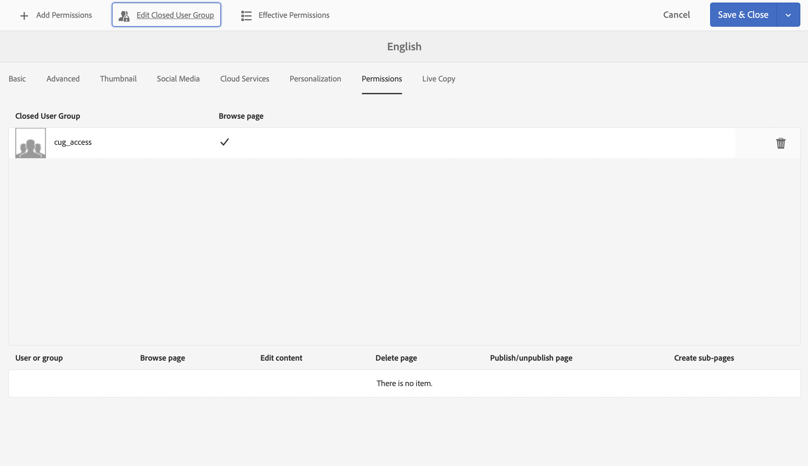

# Een gesloten gebruikersgroep maken{#creating-a-closed-user-group}

Gesloten gebruikersgroepen (CUG&#39;s) worden gebruikt om de toegang te beperken tot specifieke pagina&#39;s die zich op een gepubliceerde website bevinden. Dergelijke pagina&#39;s vereisen de toegewezen leden login en verstrekken veiligheidsgeloofsbrieven.

U configureert een dergelijk gebied binnen uw website als volgt:

* [ creeer de daadwerkelijke gesloten gebruikersgroep en wijs leden ](#creating-the-user-group-to-be-used) toe.

* [ pas deze groep op de vereiste pagina&#39;s ](#applying-your-closed-user-group-to-content-pages) toe en selecteer (of creeer) de login pagina voor gebruik door de leden van CUG; ook gespecificeerd wanneer het toepassen van een KUG op een inhoudspagina.

* [ creeer een verbinding, van één of andere vorm, aan minstens één pagina binnen het beschermde gebied ](#linking-to-the-cug-pages), anders zal het niet zichtbaar zijn.

* [ vormt Dispatcher ](#configure-dispatcher-for-cugs) als in gebruik.

>[!CAUTION]
>
>Gesloten gebruikersgroepen (CUG&#39;s) moeten altijd worden gemaakt met het oog op prestaties.
>
>Hoewel het aantal gebruikers en groepen in een CUG niet beperkt is, kan een hoog aantal CUG&#39;s op een pagina de renderprestaties vertragen.
>
>Bij het testen van de prestaties moet altijd rekening worden gehouden met het effect van CUG&#39;s.

## Gebruikersgroep maken die moet worden gebruikt {#creating-the-user-group-to-be-used}

Een gesloten gebruikersgroep maken:

1. Ga naar **Hulpmiddelen - Veiligheid** van AEM homescreen.

   >[!NOTE]
   >
   >Zie [ het Leiden Gebruikers en Groepen ](/help/sites-administering/security.md#managing-users-and-groups) voor volledige informatie bij het creëren van en het vormen van gebruikers en groepen.

1. Selecteer de **kaart van Groepen** van het volgende scherm.

   

1. Druk **creeer** knoop in de hoogste juiste hoek, om een groep tot stand te brengen.
1. Geef de nieuwe groep een naam, bijvoorbeeld `cug_access` .

   

1. Ga naar het **lusje van Leden** en wijs de vereiste gebruikers aan deze groep toe.

   

1. Activeer alle gebruikers die u aan de CUG hebt toegewezen, in dit geval alle leden van `cug_access` .
1. Activeer de gesloten gebruikersgroep zodat deze beschikbaar is in de publicatieomgeving; in dit voorbeeld `cug_access` .

## Gesloten gebruikersgroep toepassen op inhoudspagina&#39;s {#applying-your-closed-user-group-to-content-pages}

De CUG toepassen op een pagina of pagina&#39;s:

1. Navigeer naar de basispagina van de beperkte sectie die u aan uw CUG wilt toewijzen.
1. Selecteer de pagina door op zijn duimnagel te klikken en dan **Eigenschappen** in de hoogste toolbar te selecteren.

   

1. In het volgende venster, open het **Geavanceerde** lusje.

1. De rol neer aan de **sectie van de Vereiste van de Authentificatie**.

   1. Activeer **toelaten** tickbox.

   1. Voeg de weg aan uw **Login Pagina** toe.
Dit is optioneel als de standaardaanmeldingspagina leeg blijft.

   

1. Daarna, ga naar het **lusje van Toestemmingen** en selecteer **uitgeven Gesloten Groep van de Gebruiker**.

   

   >[!NOTE]
   >
   >CUG&#39;s op het tabblad Machtigingen kunnen niet worden geïmplementeerd voor actieve kopieën van blauwdrukken. Plan dit rond wanneer het vormen van Levend Exemplaar.
   >
   >Voor meer informatie, zie [ deze pagina ](closed-user-groups.md#aem-livecopy).

1. Het **geeft Gesloten dialoog van de Groep van de Gebruiker uit** opent. Hier kunt u zoeken naar, en selecteren, uw KUG, dan de groepsselectie met **bevestigen sparen**.

   De groep zal aan de lijst worden toegevoegd; bijvoorbeeld, de groep **cug_access**.

   

1. Bevestig de veranderingen met **sparen &amp; sluit**.

>[!NOTE]
>
>Zie [ Identity Management ](/help/sites-administering/identity-management.md) voor informatie over profielen in publiceren milieu en het verstrekken van vormen voor het programma openen en uit.

## Koppelen aan de CUG-pagina&#39;s {#linking-to-the-cug-pages}

Aangezien het doel van koppelingen naar de CUG-pagina&#39;s niet zichtbaar is voor de anonieme gebruiker, verwijdert de koppelingencontrole dergelijke koppelingen.

Om dit te voorkomen, is het raadzaam om niet-beveiligde omleidingspagina&#39;s te maken die verwijzen naar pagina&#39;s in het gebied CUG. De navigatie-items worden vervolgens gerenderd zonder dat de koppelingencontrole problemen ondervindt. Alleen wanneer de omleidingspagina daadwerkelijk wordt geopend, wordt de gebruiker omgeleid binnen het CUG-gebied - nadat hij of zij zijn of haar aanmeldingsgegevens heeft opgegeven.

## Dispatcher voor CUG&#39;s configureren {#configure-dispatcher-for-cugs}

Als u Dispatcher gebruikt, moet u een Dispatcher-farm met de volgende eigenschappen definiëren:

* [ virtuele gastheren ](https://experienceleague.adobe.com/docs/experience-manager-dispatcher/using/configuring/dispatcher-configuration.html#identifying-virtual-hosts-virtualhosts): Gelijke de weg aan de pagina&#39;s die CUG op van toepassing is.
* \sessionmanagement: zie hieronder.
* [ geheime voorgeheugen ](https://experienceleague.adobe.com/docs/experience-manager-dispatcher/using/configuring/dispatcher-configuration.html#configuring-the-dispatcher-cache-cache): Een geheim voorgeheugenfolder die aan de dossiers wordt gewijd die CUG op van toepassing is.

### Dispatcher Session Management configureren voor CUG&#39;s {#configuring-dispatcher-session-management-for-cugs}

Vorm [ zittingsbeheer in het dispatcher.any- dossier ](https://experienceleague.adobe.com/docs/experience-manager-dispatcher/using/configuring/dispatcher-configuration.html#enabling-secure-sessions-sessionmanagement) voor CUG. De authentificatiemanager die wordt gebruikt wanneer de toegang voor de pagina&#39;s van de CUG wordt gevraagd bepaalt hoe u zittingsbeheer vormt.

```xml
/sessionmanagement
    ...
    /header "Cookie:login-token"
    ...
```

>[!NOTE]
>
>Wanneer een landbouwbedrijf van Dispatcher toegelaten zitting-beheer heeft, alle pagina&#39;s die de landbouwbedrijfhandvatten niet in het voorgeheugen onder worden gebracht. Om pagina&#39;s in het voorgeheugen onder te brengen die buiten CUG zijn, creeer een tweede landbouwbedrijf in dispatcher.any
>die de niet-CUG-pagina&#39;s afhandelt.

1. Configureer [ /sessionmanagement ](https://experienceleague.adobe.com/docs/experience-manager-dispatcher/using/configuring/dispatcher-configuration.html#enabling-secure-sessions-sessionmanagement) door `/directory` te definiëren, bijvoorbeeld:

   ```xml
   /sessionmanagement
     {
     /directory "/usr/local/apache/.sessions"
     ...
     }
   ```

1. Stel [ /allowAuthorized ](https://experienceleague.adobe.com/docs/experience-manager-dispatcher/using/configuring/dispatcher-configuration.html#caching-when-authentication-is-used) in op `0` .
