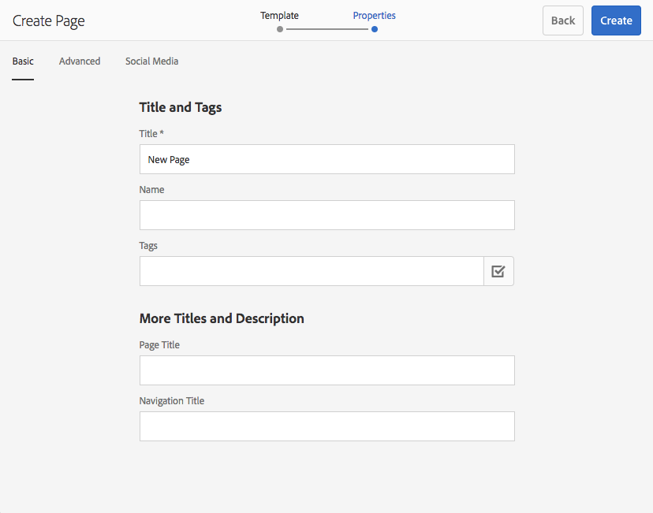
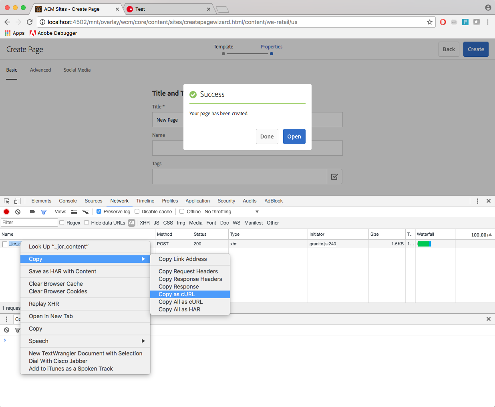
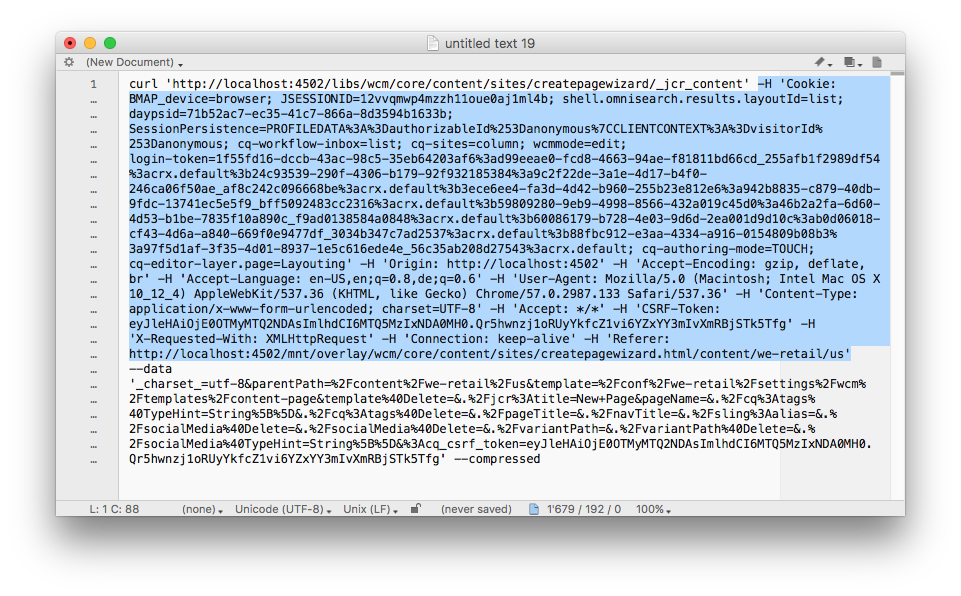

# cURL gebruiken met AEM{#using-curl-with-aem}

Beheerders moeten veelvoorkomende taken in elk systeem vaak automatiseren of vereenvoudigen. In AEM bijvoorbeeld, zijn het leiden van gebruikers, het installeren van pakketten, en het beheren van bundels OSGi taken die algemeen moeten worden gedaan.

Vanwege de RESTful-aard van het Sling-framework waarop AEM is gebouwd, kunnen de meeste taken worden uitgevoerd met een URL-aanroep. cURL kan worden gebruikt om dergelijke URL vraag uit te voeren en kan een nuttig hulpmiddel voor AEM beheerders zijn.

## Wat is cURL {#what-is-curl}

cURL is een opensource opdrachtregelprogramma voor het uitvoeren van URL-bewerkingen. Deze biedt ondersteuning voor een groot aantal internetprotocollen, waaronder HTTP, HTTPS, FTP, FTPS, SCP, SFTP, TFTP, LDAP, DAP, DICT, TELNET, FILE, IMAP, POP3, SMTP en RTSP.

cURL is een gevestigde en wijdverspreide hulpmiddel om gegevens te krijgen of te verzenden gebruikend de syntaxis URL en oorspronkelijk vrijgegeven in 1997. De naam cURL betekende oorspronkelijk &quot;zie URL.&quot;

Vanwege de RESTful-aard van het Sling-framework waarop AEM is gebouwd, kunnen de meeste taken worden beperkt tot een URL-aanroep, die kan worden uitgevoerd met cURL. [Taken voor het manipuleren van inhoud](/help/sites-administering/curl.md#common-content-manipulation-aem-curl-commands) zoals het activeren van pagina&#39;s en het starten van workflows en [operationele taken](/help/sites-administering/curl.md#common-operational-aem-curl-commands) zoals pakketbeheer en het beheren van gebruikers kunnen worden geautomatiseerd met cURL. Bovendien kunt u [zelf een cURL maken](/help/sites-administering/curl.md#building-a-curl-ready-aem-command) opdrachten voor de meeste taken in AEM.

>[!NOTE]
>
>Elke AEM die via cURL wordt uitgevoerd, moet net als elke gebruiker worden geautoriseerd om te AEM. Alle ACLs en toegangsrechten worden gerespecteerd wanneer het gebruiken van cURL om een AEM bevel uit te voeren.

## cURL downloaden {#downloading-curl}

cURL is een standaardonderdeel van macOS en sommige Linux-distros. Deze is echter voor de meeste besturingssystemen beschikbaar. De meest recente downloads zijn te vinden op [https://curl.haxx.se/download.html](https://curl.haxx.se/download.html).

cURL&#39;s bronbewaarplaats kan ook op GitHub worden gevonden.

## Een URL-klaar AEM-opdracht maken {#building-a-curl-ready-aem-command}

cURL-opdrachten kunnen worden samengesteld voor de meeste bewerkingen in AEM, zoals workflows activeren, OSGi-configuraties controleren, JMX-opdrachten activeren, replicatieagents maken en nog veel meer.

Om het nauwkeurige bevel te vinden u voor uw bepaalde verrichting nodig hebt, moet u de ontwikkelaarshulpmiddelen in uw browser gebruiken om de vraag van de POST aan de server te vangen wanneer u het AEM bevel uitvoert.

In de volgende stappen wordt beschreven hoe u dit kunt doen door als voorbeeld een nieuwe pagina te maken in de Chrome-browser.

1. Bereid de actie voor u binnen AEM wenst aan te halen. In dit geval hebben we tot het einde van de **Pagina maken** wizard, maar u hebt nog niet geklikt **Maken**.

   

1. Start de ontwikkelaars en selecteer de **Netwerk** tab. Klik op de knop **Logbestand behouden** voordat u de console wist.

   

1. Klikken **Maken** in de **Pagina maken** om de workflow te maken.
1. Klik met de rechtermuisknop op de resulterende POST en selecteer **Kopiëren** > **Kopiëren als cURL**.

   

1. Kopieer de opdracht cURL naar een teksteditor en verwijder alle headers uit de opdracht, die beginnen met `-H` (in de onderstaande afbeelding blauw gemarkeerd) en voeg de juiste verificatieparameter toe, zoals `-u <user>:<password>`.

   

1. Voer de opdracht cURL uit via de opdrachtregel en bekijk de reactie.

   

## Gemeenschappelijke operationele AEM cURL-opdrachten {#common-operational-aem-curl-commands}

Hier volgt een lijst met AEM cURL-opdrachten voor algemene beheertaken en operationele taken.

>[!NOTE]
>
>In de volgende voorbeelden wordt ervan uitgegaan dat AEM wordt uitgevoerd `localhost` op poort `4502` en gebruikt de gebruiker `admin` met wachtwoord `admin`. Extra plaatsaanduidingen voor opdrachten worden ingesteld tussen punthaken.

### Pakketbeheer {#package-management}

#### Alle geïnstalleerde pakketten weergeven

```shell
curl -u <user>:<password> http://<host>:<port>/crx/packmgr/service.jsp?cmd=ls
```

#### Een pakket maken {#create-a-package}

```shell
curl -u <user>:<password> -X POST http://localhost:4502/crx/packmgr/service/.json/etc/packages/mycontent.zip?cmd=create -d packageName=<name> -d groupName=<name>
```

#### Een voorbeeld van een pakket bekijken {#preview-a-package}

```shell
curl -u <user>:<password> -X POST http://localhost:4502/crx/packmgr/service/.json/etc/packages/mycontent.zip?cmd=preview
```

#### Pakketinhoud weergeven {#list-package-content}

```shell
curl -u <user>:<password> -X POST http://localhost:4502/crx/packmgr/service/console.html/etc/packages/mycontent.zip?cmd=contents
```

#### Een pakket maken {#build-a-package}

```shell
curl -X POST http://localhost:4502/crx/packmgr/service/.json/etc/packages/mycontent.zip?cmd=build
```

#### Een pakket opnieuw inpakken {#rewrap-a-package}

```shell
curl -u <user>:<password> -X POST http://localhost:4502/crx/packmgr/service/.json/etc/packages/mycontent.zip?cmd=rewrap
```

#### De naam van een pakket wijzigen {#rename-a-package}

```shell
curl -u <user>:<password> -X POST -Fname=<New Name> http://localhost:4502/etc/packages/<Group Name>/<Package Name>.zip/jcr:content/vlt:definition
```

#### Een pakket uploaden {#upload-a-package}

```shell
curl -u <user>:<password> -F cmd=upload -F force=true -F package=@test.zip http://localhost:4502/crx/packmgr/service/.json
```

#### Een pakket installeren {#install-a-package}

```shell
curl -u <user>:<password> -F cmd=install http://localhost:4502/crx/packmgr/service/.json/etc/packages/my_packages/test.zip
```

#### Een pakket verwijderen {#uninstall-a-package}

```shell
curl -u <user>:<password> -F cmd=uninstall http://localhost:4502/crx/packmgr/service/.json/etc/packages/my_packages/test.zip
```

#### Een pakket verwijderen {#delete-a-package}

```shell
curl -u <user>:<password> -F cmd=delete http://localhost:4502/crx/packmgr/service/.json/etc/packages/my_packages/test.zip
```

#### Een pakket downloaden {#download-a-package}

```shell
curl -u <user>:<password> http://localhost:4502/etc/packages/my_packages/test.zip
```

#### Een pakket repliceren {#replicate-a-package}

```shell
curl -u <user>:<password> -X POST http://localhost:4502/crx/packmgr/service/.json/etc/packages/my_packages/test.zip?cmd=replicate
```

### Gebruikersbeheer {#user-management}

#### Een nieuwe gebruiker maken {#create-a-new-user}

```shell
curl -u <user>:<password> -FcreateUser= -FauthorizableId=hashim -Frep:password=hashim http://localhost:4502/libs/granite/security/post/authorizables
```

#### Een nieuwe groep maken {#create-a-new-group}

```shell
curl -u <user>:<password> -FcreateGroup=group1 -FauthorizableId=testGroup1 http://localhost:4502/libs/granite/security/post/authorizables
```

#### Een eigenschap toevoegen aan een bestaande gebruiker {#add-a-property-to-an-existing-user}

```shell
curl -u <user>:<password> -Fprofile/age=25 http://localhost:4502/home/users/h/hashim.rw.html
```

#### Een gebruiker met een profiel maken {#create-a-user-with-a-profile}

```shell
curl -u <user>:<password> -FcreateUser=testuser -FauthorizableId=hashimkhan -Frep:password=hashimkhan -Fprofile/gender=male http://localhost:4502/libs/granite/security/post/authorizables
```

#### Een nieuwe gebruiker maken als lid van een groep {#create-a-new-user-as-a-member-of-a-group}

```shell
curl -u <user>:<password> -FcreateUser=testuser -FauthorizableId=testuser -Frep:password=abc123 -Fmembership=contributor http://localhost:4502/libs/granite/security/post/authorizables
```

#### Een gebruiker toevoegen aan een groep {#add-a-user-to-a-group}

```shell
curl -u <user>:<password> -FaddMembers=testuser1 http://localhost:4502/home/groups/t/testGroup.rw.html
```

#### Een gebruiker uit een groep verwijderen {#remove-a-user-from-a-group}

```shell
curl -u <user>:<password> -FremoveMembers=testuser1 http://localhost:4502/home/groups/t/testGroup.rw.html
```

#### Gebruikersgroeplidmaatschap instellen {#set-a-user-s-group-membership}

```shell
curl -u <user>:<password> -Fmembership=contributor -Fmembership=testgroup http://localhost:4502/home/users/t/testuser.rw.html
```

#### Een gebruiker verwijderen {#delete-a-user}

```shell
curl -u <user>:<password> -FdeleteAuthorizable= http://localhost:4502/home/users/t/testuser
```

#### Een groep verwijderen {#delete-a-group}

```shell
curl -u <user>:<password> -FdeleteAuthorizable= http://localhost:4502/home/groups/t/testGroup
```

### Back-up {#backup}

Zie [Back-up en herstel](/help/sites-administering/backup-and-restore.md#automating-aem-online-backup) voor meer informatie.

### OSGi {#osgi}

#### Een bundel starten {#starting-a-bundle}

```shell
curl -u <user>:<password> -Faction=start http://localhost:4502/system/console/bundles/<bundle-name>
```

#### Een bundel stoppen {#stopping-a-bundle}

```shell
curl -u <user>:<password> -Faction=stop http://localhost:4502/system/console/bundles/<bundle-name>
```

### Dispatcher {#dispatcher}

#### De cache ongeldig maken {#invalidate-the-cache}

```shell
curl -H "CQ-Action: Activate" -H "CQ-Handle: /content/test-site/" -H "CQ-Path: /content/test-site/" -H "Content-Length: 0" -H "Content-Type: application/octet-stream" http://localhost:4502/dispatcher/invalidate.cache
```

#### De cache verwijderen {#evict-the-cache}

```shell
curl -H "CQ-Action: Deactivate" -H "CQ-Handle: /content/test-site/" -H "CQ-Path: /content/test-site/" -H "Content-Length: 0" -H "Content-Type: application/octet-stream" http://localhost:4502/dispatcher/invalidate.cache
```

### Replication Agent {#replication-agent}

#### Controleer de Status van een Agent {#check-the-status-of-an-agent}

```shell
curl -u <user>:<password> "http://localhost:4502/etc/replication/agents.author/publish/jcr:content.queue.json?agent=publish"
http://localhost:4502/etc/replication/agents.author/publish/jcr:content.queue.json?agent=publish
```

#### Een agent verwijderen {#delete-an-agent}

```shell
curl -X DELETE http://localhost:4502/etc/replication/agents.author/replication99 -u <user>:<password>
```

#### Een agent maken {#create-an-agent}

```shell
curl -u <user>:<password> -F "jcr:primaryType=cq:Page" -F "jcr:content/jcr:title=new-replication" -F "jcr:content/sling:resourceType=/libs/cq/replication/components/agent" -F "jcr:content/template=/libs/cq/replication/templates/agent" -F "jcr:content/transportUri=http://localhost:4503/bin/receive?sling:authRequestLogin=1" -F "jcr:content/transportUser=admin" -F "jcr:content/transportPassword={DES}8aadb625ced91ac483390ebc10640cdf"http://localhost:4502/etc/replication/agents.author/replication99
```

#### Een agent pauzeren {#pause-an-agent}

```shell
curl -u <user>:<password> -F "cmd=pause" -F "name=publish"  http://localhost:4502/etc/replication/agents.author/publish/jcr:content.queue.json
```

#### Wis een Rij van de Agent {#clear-an-agent-queue}

```shell
curl -u <user>:<password> -F "cmd=clear" -F "name=publish"  http://localhost:4502/etc/replication/agents.author/publish/jcr:content.queue.json
```

### Gemeenschappen {#communities}

#### Badges toewijzen en intrekken {#assign-and-revoke-badges}

Zie [Scores en badges van gemeenschappen](/help/communities/implementing-scoring.md#assign-and-revoke-badges) voor meer informatie.

Zie [Scores en Badges Essentials](/help/communities/configure-scoring.md#example-setup) voor meer informatie.

#### MSRP opnieuw indexeren {#msrp-reindexing}

Zie [MSRP - MongoDB Storage Resource Provider](/help/communities/msrp.md#running-msrp-reindex-tool-using-curl-command) voor meer informatie.

### Beveiliging {#security}

#### CRX DE Lite in- en uitschakelen {#enabling-and-disabling-crx-de-lite}

Zie [CRXDE Lite inschakelen in AEM](/help/sites-administering/enabling-crxde-lite.md) voor meer informatie.

### Opruimverzameling gegevensopslag {#data-store-garbage-collection}

Zie [Opruimverzameling gegevensopslag](/help/sites-administering/data-store-garbage-collection.md#automating-data-store-garbage-collection) voor meer informatie.

### Analyses en doelintegratie {#analytics-and-target-integration}

Zie [Opteren in Adobe Analytics en Adobe Target](/help/sites-administering/opt-in.md#configuring-the-setup-and-provisioning-via-script) voor meer informatie.

### Single Sign On {#single-sign-on}

#### Testkop verzenden {#send-test-header}

Zie [Single Sign On](/help/sites-deploying/single-sign-on.md) voor meer informatie.

## Algemene AEM-URL-opdrachten voor bewerken van inhoud {#common-content-manipulation-aem-curl-commands}

Hier volgt een lijst met AEM cURL-opdrachten voor het manipuleren van inhoud.

>[!NOTE]
>
>In de volgende voorbeelden wordt ervan uitgegaan dat AEM wordt uitgevoerd `localhost` op poort `4502` en gebruikt de gebruiker `admin` met wachtwoord `admin`. Extra plaatsaanduidingen voor opdrachten worden ingesteld tussen punthaken.

### Paginabeheer {#page-management}

#### Paginaactivering {#page-activation}

```shell
curl -u <user>:<password> -X POST -F path="/content/path/to/page" -F cmd="activate" http://localhost:4502/bin/replicate.json
```

#### Deactivering van pagina {#page-deactivation}

```shell
curl -u <user>:<password> -X POST -F path="/content/path/to/page" -F cmd="deactivate" http://localhost:4502/bin/replicate.json
```

#### Boomactivering {#tree-activation}

```shell
curl -u <user>:<password> -F cmd=activate -F ignoredeactivated=true -F onlymodified=true -F path=/content/geometrixx http://localhost:4502/etc/replication/treeactivation.html
```

#### Pagina vergrendelen {#lock-page}

```shell
curl -u <user>:<password> -X POST -F cmd="lockPage" -F path="/content/path/to/page" -F "_charset_"="utf-8" http://localhost:4502/bin/wcmcommand
```

#### Pagina ontgrendelen {#unlock-page}

```shell
curl -u <user>:<password> -X POST -F cmd="unlockPage" -F path="/content/path/to/page" -F "_charset_"="utf-8" http://localhost:4502/bin/wcmcommand
```

#### Pagina kopiëren {#copy-page}

```shell
curl -u <user>:<password> -F cmd=copyPage -F destParentPath=/path/to/destination/parent -F srcPath=/path/to/source/location http://localhost:4502/bin/wcmcommand
```

### Workflows {#workflows}

Zie [Programmatische interactie met Workflows](/help/sites-developing/workflows-program-interaction.md) voor meer informatie.

### Inhoud verkopen {#sling-content}

#### Een map maken {#create-a-folder}

```shell
curl -u <user>:<password> -F jcr:primaryType=sling:Folder http://localhost:4502/etc/test
```

#### Een knooppunt verwijderen {#delete-a-node}

```shell
curl -u <user>:<password> -F :operation=delete http://localhost:4502/etc/test/test.properties
```

#### Een knooppunt verplaatsen {#move-a-node}

```shell
curl -u <user>:<password> -F":operation=move" -F":applyTo=/sourceurl"  -F":dest=/target/parenturl/" https://localhost:4502/content
```

#### Een knooppunt kopiëren {#copy-a-node}

```shell
curl -u <user>:<password> -F":operation=copy" -F":applyTo=/sourceurl"  -F":dest=/target/parenturl/" https://localhost:4502/content
```

#### Bestanden uploaden met Sling PostServlet {#upload-files-using-sling-postservlet}

```shell
curl -u <user>:<password> -F"*=@test.properties"  http://localhost:4502/etc/test
```

#### Bestanden uploaden met Sling PostServlet en door Node Name op te geven {#upload-files-using-sling-postservlet-and-specifying-node-name}

```shell
curl -u <user>:<password> -F"test2.properties=@test.properties"  http://localhost:4502/etc/test
```

#### Bestanden uploaden die een inhoudstype opgeven {#upload-files-specifying-a-content-type}

```shell
curl -u <user>:<password> -F "*=@test.properties;type=text/plain" http://localhost:4502/etc/test
```

### Manipulatie van middelen {#asset-manipulation}

Zie [Elementen HTTP-API](/help/assets/mac-api-assets.md) voor meer informatie.
