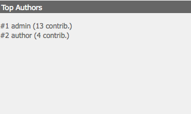

# Dashboards{#dashboards}

Wanneer u AEM gebruikt, kunt u een groot aantal verschillende typen inhoud beheren (bijvoorbeeld pagina&#39;s, elementen). AEM dashboards verstrekken een makkelijk te gebruiken en aanpasbare manier om pagina&#39;s te bepalen die geconsolideerde gegevens tonen.

>[!NOTE]
>
>AEM dashboards worden gecreeerd op een per gebruikersbasis, zodat kan een gebruiker tot hun eigen dashboard slechts toegang hebben.
>
>Maar [Dashboardsjablonen](#creating-a-dashboard-template) kan worden gebruikt om algemene configuratie en dashboardlay-out te delen.


## Dashboards beheren {#administering-dashboards}

### Een dashboard maken {#creating-a-dashboard}

1. In de **Gereedschappen** sectie, klikken **Configuratieconsole**.
1. Dubbelklik in de structuur op **Dashboard**.
1. Klikken **Nieuw dashboard**.
1. Typ de **Titel** (bijvoorbeeld Mijn dashboard) en de **Naam**.
1. Klikken **Maken**.

### Een dashboard klonen {#cloning-a-dashboard}

Mogelijk wilt u meerdere dashboards hebben om snel informatie over uw inhoud vanuit verschillende weergaven te bekijken. AEM biedt een kloonfunctie waarmee u een bestaand dashboard kunt dupliceren, zodat u een nieuw dashboard kunt maken. Ga als volgt te werk om een dashboard te klonen:

1. In de **Gereedschappen** sectie, klikken **Configuratieconsole**.

1. Klik in de structuur op **Dashboard**.
1. Klik op het dashboard dat u wilt klonen.

1. Klikken **Klonen**.

1. Typ de **Naam** van uw nieuwe dashboard.

### Een dashboard verwijderen {#removing-a-dashboard}

1. In de **Gereedschappen** sectie, klikken **Configuratieconsole**.

1. Klik in de structuur op **Dashboard**.
1. Klik op het dashboard dat u wilt verwijderen.

1. Klikken **Verwijderen**.

1. Klikken **Ja** ter bevestiging.

## Dashboardcomponenten {#dashboard-components}

### Overzicht {#overview}

Onderdelen van het dashboard zijn niet meer dan normaal [AEM componenten](/help/sites-developing/developing-components-samples.md). In deze sectie worden de rapportonderdelen beschreven die bij AEM worden geleverd.

### Webanalytische rapportagecomponenten {#web-analytics-reporting-components}

AEM schepen met een reeks componenten die veelvoudige metriek van uw teruggeven [SiteCatalyst](/help/sites-administering/adobeanalytics.md) gegevens. Deze onderdelen worden vermeld in de Sidekick onder de **Dashboard** sectie.

Elke rapportcomponent bevat ten minste drie tabbladen:

* **Basis**: bevat de hoofdconfiguratie.

* **Rapport:** bevat specifiek de configuratie van elk rapport.
* **Stijl**: bevat opmaakconfiguratie zoals diagramgrootte en -marge.

De rapportcomponenten worden geïnitialiseerd met een standaardconfiguratie die u helpt snel opstelling uw dashboard.

#### Basisconfiguratie {#basic-configuration}

De **Basis** verleent toegang tot de volgende configuratieingangen:

**Titel** De titel die op het dashboard wordt weergegeven.

**Type aanvraag** De manier waarop gegevens worden aangevraagd.

**Configuratie SiteCatalyst (optioneel)** De configuratie u wilt gebruiken om met SiteCatalyst te verbinden. Indien niet verstrekt wordt de configuratie verondersteld om op de pagina van het Dashboard (via paginaeigenschappen) te worden gevormd.

**ID rapportsuite (optioneel)** De het rapportreeks van de SiteCatalyst u wilt gebruiken om de grafiek te produceren.

#### Rapportconfiguratie {#report-configuration}

Als u webstatistieken wilt weergeven, moet u het datumbereik definiëren van de gegevens die u wilt genereren. De **Rapport** bevat twee velden om dat bereik te definiëren.

>[!NOTE]
>
>Als u een datumbereik voor een grote datum instelt, kan de reactiesnelheid van het dashboard afnemen.

**Datum vanaf** Absolute of relatieve datum vanaf wanneer de gegevens worden opgehaald.

**Datum tot** Absolute of relatieve datum waarop de gegevens worden opgehaald.

Elke component definieert ook specifieke instellingen.

#### Rapport overuren {#overtime-report}


**Datum van granulariteit** Tijdeenheid van de X-as (bijvoorbeeld dag, uur).

**Metrisch** De lijst met gebeurtenissen die u wilt weergeven.

**Elementen** De lijst met elementen die de metagegevens in de grafiek opsplitst.

#### Rapport met gerangschikte lijst {#ranked-list-report}


**Elementen** Het element dat de cijfergegevens in de grafiek opsplitst.

**Metrisch** De gebeurtenis die u wilt weergeven.

**Nee. van bovenste objecten** Aantal punten door het rapport worden getoond dat.

#### Geregistreerd rapport {#ranked-report}


**Metrisch** De gebeurtenis die u wilt weergeven.

**Elementen** Het element dat de cijfergegevens in de grafiek opsplitst.

#### Rapport voor bovenste site-sectie {#top-site-section-report}

Deze component geeft een grafiek weer met de meer bezochte sectie van een website volgens de volgende configuratie.


**Nee. van bovenste objecten** Aantal sectie die door in het rapport wordt getoond.

#### Trend Report {#trended-report}


**Datum van granulariteit** Tijdeenheid van de X-as (bijvoorbeeld dag, uur).

**Metrisch** De gebeurtenis die u wilt weergeven.

**Elementen** Het element dat de cijfergegevens in de grafiek opsplitst.

## Het dashboard uitbreiden {#extending-dashboard}

### Overzicht {#overview-1}

Dashboards zijn normale pagina&#39;s ( `cq:Page`), kunnen daarom alle componenten worden gebruikt om dashboards samen te stellen.

Er is een standaardcomponentgroep `Dashboard` met analytische rapportagecomponenten die standaard op de sjabloon zijn ingeschakeld.

### Een dashboardsjabloon maken {#creating-a-dashboard-template}

Een sjabloon definieert de standaardinhoud van een nieuw dashboard. U kunt verschillende sjablonen gebruiken voor het maken van verschillende typen dashboards.

Dashboardsjablonen worden net als andere paginasjablonen gemaakt, behalve dat ze onder `/libs/cq/dashboards/templates/`. Zie de [Sjabloon voor inhoudspagina maken](/help/sites-developing/website.md#creating-the-contentpage-template) sectie.

>[!NOTE]
>
>Dashboardsjablonen worden door gebruikers gedeeld.

### Een dashboardcomponent ontwikkelen {#developing-a-dashboard-component}

Het ontwikkelen van een dashboardcomponent bestaat uit het maken van een gewone AEM. Deze sectie beschrijft een voorbeeld van een component die hoogste 10 van contribuanten toont.


De bovenste auteurcomponenten worden opgeslagen in de gegevensopslagruimte op `/apps/geometrixx-outdoors/components/reporting` en bestaat uit:

1. a `jsp` bestand dat jcr-gegevens leest en dat de `html` plaatsaanduiding.

1. een bibliotheek aan de clientzijde met één `js` bestand dat de gegevens ophaalt en bestelt, vult vervolgens het `html` plaatsaanduiding.



Het volgende JavaScript-bestand wordt gedefinieerd in het dialoogvenster `geout.reporting.topauthors` [Clientbibliotheek](/help/sites-developing/clientlibs.md) als een onderliggend element van de component zelf.

De [QueryBuilder](/help/sites-developing/querybuilder-api.md) wordt gebruikt om de gegevensopslagruimte te vragen om te lezen `cq:AuditEvent` knooppunten. Het queryresultaat is een JSON-object waaruit de bijdragen van de auteur worden geëxtraheerd.

#### top_authors.js {#top-authors-js}

```
$.ajax({
  url: "/bin/querybuilder.json",
  cache: false,
  data: {
       "orderby": "cq:time",
       "orderby.sort": "desc",
       "p.hits": "full",
       "p.limit": 100,
       "path": "/var/audit/com.day.cq.wcm.core.page/",
       "type": "cq:AuditEvent"
   },
  dataType: "json"
}).done(function( res ) {
    var authors = {};
    // from JSON to Object
    for(var r in res.hits) {
        var userId = res.hits[r].userId;
        if(userId == undefined) {
            continue;
        }
        var auth = authors[userId] || {userId : userId};
        auth.contrib = (auth.contrib || 0) +1;

        authors[userId] = auth;
    }

    // order by contribution
    var orderedByContrib = [];
    for(var a in authors) {
        orderedByContrib.push(authors[a]);
    }
    orderedByContrib.sort(function(a,b){return b.contrib - a.contrib});

    // produce the list
    for (var i=0, tot=orderedByContrib.length; i < tot; i++) {
        var current = orderedByContrib[i];
        $("<div> #" + (i + 1) +" "+ current.userId + " (" + current.contrib +" contrib.)</div>").appendTo("#authors-list");

    }
});
```

De `JSP` omvat beide `global.jsp` en `clientlib`.

#### top_authors.jsp {#top-authors-jsp}

```java
<%@page session="false" contentType="text/html; charset=utf-8" %><%
%><%
%><%@include file="/libs/foundation/global.jsp" %><%
%>
<ui:includeClientLib categories="geout.reporting.topauthors" />
<%
String reportletTitle = properties.get("title", "Top Authors");
%>
<html>
     <h3><%=xssAPI.encodeForHTML(reportletTitle) %></h3>
     <div id="authors-list"></div>
</html>
```
