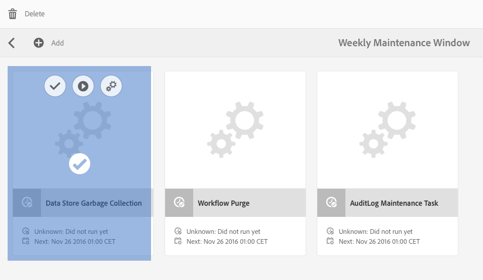

# Afvalverzameling gegevensopslag {#data-store-garbage-collection}

Wanneer een conventioneel WCM-element wordt verwijderd, kan de verwijzing naar het onderliggende record van de gegevensopslagruimte uit de knooppunthiërarchie worden verwijderd, maar blijft de record van de gegevensopslagruimte zelf behouden. Deze gegevensopslagrecord zonder referenties wordt dan &#39;garbage&#39; die niet hoeft te worden bewaard. In gevallen waar een aantal vuilnisbelten bestaan, is het nuttig om van hen af te komen om ruimte te bewaren en steun en het onderhoudsprestaties van het bestandssysteem te optimaliseren.

Een WCM-toepassing heeft meestal de neiging om informatie te verzamelen, maar niet om informatie te verwijderen. Hoewel er nieuwe afbeeldingen worden toegevoegd, zelfs als deze oudere versies vervangen, blijft het oude versiebeheersysteem behouden en kunt u er desgewenst naar terugkeren. Het grootste deel van de inhoud die wij als toevoeging aan het systeem beschouwen, wordt dus permanent opgeslagen. Wat is de typische bron van &quot;afval&quot; in de opslagplaats die we misschien willen opschonen?

AEM gebruikt de opslagplaats als opslagplaats voor een aantal interne en huishoudelijke activiteiten:

* Gebouwde en gedownloade pakketten
* Tijdelijke bestanden die zijn gemaakt voor publicatie-replicatie
* Workflowpayloads
* Elementen die tijdelijk zijn gemaakt tijdens DAM-rendering

Wanneer om het even welk van deze tijdelijke voorwerpen groot genoeg is om opslag in de gegevensopslag te vereisen, en wanneer het voorwerp uiteindelijk uit gebruik overgaat, blijft het verslag van de gegevensopslag zelf als &quot;huisvuil&quot;. In een standaard WCM auteur/publish toepassing, is de grootste bron van huisvuil van dit type gewoonlijk het proces van publicatieactivering. Wanneer gegevens worden gerepliceerd om te publiceren, wordt deze eerst verzameld in verzamelingen in een efficiënte gegevensindeling, genaamd &quot;Durbo&quot;, en in de gegevensopslagruimte opgeslagen onder `/var/replication/data`. De gegevensbundels zijn vaak groter dan de kritieke groottedrempel voor de gegevensopslag en daarom opgeslagen als verslagen van de gegevensopslag. Wanneer de replicatie volledig is, wordt de knoop in `/var/replication/data` geschrapt, maar het verslag van de gegevensopslag blijft als &quot;huisvuil&quot;.

Een andere bron van terugwinbare ongewenste details zijn pakketten. Pakketgegevens worden, net als alle andere, opgeslagen in de opslagplaats en dus voor pakketten die groter zijn dan 4KB, in de gegevensopslag. In de loop van een ontwikkelingsproject of in tijd terwijl het handhaven van een systeem, kunnen de pakketten worden gebouwd en vele tijden worden herbouwd, elke bouwstijl die in een nieuw verslag van de gegevensopslag resulteert, die het vorige bouwstijlverslag verwekt.

## Hoe werkt de gegevensopslag huisvuilinzameling? {#how-does-data-store-garbage-collection-work}

Als de opslagplaats met een externe gegevensopslag is gevormd, [zal de inzameling van het huisvuil van de gegevensopslag automatisch](/help/sites-administering/data-store-garbage-collection.md#automating-data-store-garbage-collection) als deel van het Wekelijkse Onderhoudsvenster in werking stellen. De systeembeheerder kan ook [de inzameling van de opslaghuisvuilinzameling manueel ](#running-data-store-garbage-collection) op als-nodig basis in werking stellen. Over het algemeen, wordt geadviseerd dat de inzameling van het huisvuil van de gegevensopslag periodiek wordt uitgevoerd, maar dat de volgende factoren in aanmerking worden genomen bij de planning van huisvuilinzamelingen van de gegevensopslag:

* De huisvuilinzamelingen van de opslagplaats van gegevens nemen tijd en kunnen prestaties beïnvloeden, zodat zouden zij dienovereenkomstig moeten worden gepland.
* Het verwijderen van afvalrecords in de gegevensopslagruimte heeft geen invloed op de normale prestaties, dus dit is geen optimalisatie van de prestaties.
* Als het opslaggebruik en verwante factoren zoals reservetijden geen zorg zijn, dan zou de huisvuilinzameling van de gegevensopslag veilig kunnen worden uitgesteld.

De opschoonfunctie voor het opslaan van gegevens noteert eerst de huidige tijdstempel wanneer het proces begint. De verzameling wordt vervolgens uitgevoerd met behulp van een algoritme voor het markeren/vegen van meerdere controles.

In de eerste fase voert de opschoonfunctie van de gegevensopslagruimte een uitgebreide doorloop uit van alle inhoud van de opslagplaats. Voor elk inhoudsobject met een verwijzing naar een record in een gegevensopslagruimte bevindt het bestand zich in het bestandssysteem en voert het een update uit van de metagegevens. Het kenmerk &quot;Laatst gewijzigd&quot; of het kenmerk MTIME wordt gewijzigd. Op dit punt worden de dossiers die door deze fase worden betreden nieuwer dan aanvankelijke basislijntimestamp.

In de tweede fase, oversteekt de vuilnisman van de gegevensopslag de fysieke folderstructuur van de gegevensopslag op ongeveer de zelfde manier zoals &quot;vinden&quot;. Het onderzocht het &quot;laatste gewijzigde&quot;attribuut of MTIME van het dossier en stelt de volgende bepaling:

* Als de MTIME nieuwer is dan de aanvankelijke tijdstempel voor de basislijn, werd het bestand gevonden in de eerste fase, of het is een geheel nieuw bestand dat aan de opslagplaats werd toegevoegd terwijl het verzamelingsproces aan de gang was. In beide gevallen wordt de registratie als actief beschouwd en wordt het bestand niet verwijderd.
* Als de MTIME vóór de aanvankelijke basislijntijdstempel ligt, is het bestand geen actief bestand waarnaar wordt verwezen en wordt het beschouwd als verwijderbaar afval.

Deze benadering werkt goed voor één enkel knooppunt met een persoonlijke gegevensopslag. De gegevensopslag kan echter worden gedeeld en als dit betekent dat potentieel actieve live verwijzingen naar gegevensopslagrecords van andere opslagplaatsen niet worden gecontroleerd en actieve bestanden waarnaar wordt verwezen, per ongeluk kunnen worden verwijderd. Het is noodzakelijk dat het systeembeheer de gedeelde aard van de gegevensopslag begrijpt alvorens om het even welke huisvuilinzamelingen te plannen, en slechts het eenvoudige ingebouwde proces van de huisvuilinzameling van de gegevensopslag te gebruiken wanneer het bekend is dat de gegevensopslag niet wordt gedeeld.

>[!NOTE]
>
>Wanneer het uitvoeren van huisvuilinzameling in een gegroepeerde of gedeelde opstelling van de gegevensopslag (met Mongo of Tar van het Segment) zou het logboek waarschuwingen over de onmogelijkheid kunnen tonen om bepaalde blob IDs te schrappen. Dit gebeurt omdat de blob IDs die in een vorige huisvuilinzameling worden geschrapt verkeerd opnieuw van verwijzingen wordt voorzien door andere cluster of gedeelde knopen die geen informatie over de schrappingen van identiteitskaart hebben. Dientengevolge, wanneer de huisvuilinzameling wordt uitgevoerd registreert het een waarschuwing wanneer het probeert om identiteitskaart te schrappen die reeds in de laatste looppas is geschrapt. Dit gedrag heeft geen invloed op prestaties of functionaliteit.

## Afvalverzameling van gegevensopslag uitvoeren {#running-data-store-garbage-collection}

Er zijn drie manieren om de inzameling van de huisvuilopslag in werking te stellen, afhankelijk van de opstelling van de gegevensopslag waarop AEM loopt:

1. Via [Revision Cleanup](/help/sites-deploying/revision-cleanup.md) - een opschoonmechanisme voor ongewenste details dat gewoonlijk wordt gebruikt voor opruimen van knooppunten.

1. Via [Gegevensopslag opschonen](/help/sites-administering/data-store-garbage-collection.md#running-data-store-garbage-collection-via-the-operations-dashboard) - een opschoonmechanisme dat specifiek is voor externe gegevensopslag, beschikbaar op het vectordashboard Verrichtingen.
1. Via de [JMX-console](/help/sites-administering/jmx-console.md).

Als TarMK als zowel knoopopslag als gegevensopslag wordt gebruikt, dan kan de Opruiming van de Revisie voor huisvuilinzameling van zowel knoopopslag als gegevensopslag worden gebruikt. Nochtans als een externe gegevensopslag zoals de Opslag van de Gegevens van het Systeem van het Dossier wordt gevormd, dan moet de inzameling van het huisvuil van de gegevensopslag uitdrukkelijk gescheiden van de Opruiming van de Revisie worden teweeggebracht. De inzameling van het huisvuil van de opslaggegevens kan of via het Dashboard van Verrichtingen of de Console worden teweeggebracht JMX.

De onderstaande lijst toont het type van de huisvuilinzameling van de gegevensopslag dat voor alle gesteunde plaatsingen van de gegevensopslag in AEM 6 moet worden gebruikt:

<table>
 <tbody>
  <tr>
   <td><strong>Node Store</strong><br /> </td>
   <td><strong>Gegevensopslag</strong></td>
   <td><strong>Mechanisme voor afvalophaling</strong><br /> </td>
  </tr>
  <tr>
   <td>TarMK</td>
   <td>TarMK</td>
   <td>Revision Cleanup (binaire bestanden worden in een segmentwinkel geplaatst)</td>
  </tr>
  <tr>
   <td>TarMK</td>
   <td>Extern bestandssysteem</td>
   <td><p>De taak van de Inzameling van de Winkel van gegevens via het Dashboard van Verrichtingen</p> <p>JMX-console</p> </td>
  </tr>
  <tr>
   <td>MongoDB</td>
   <td>MongoDB</td>
   <td><p>De taak van de Inzameling van de Winkel van gegevens via het Dashboard van Verrichtingen</p> <p>JMX-console</p> </td>
  </tr>
  <tr>
   <td>MongoDB</td>
   <td>Extern bestandssysteem</td>
   <td><p>De taak van de Inzameling van de Winkel van gegevens via het Dashboard van Verrichtingen</p> <p>JMX-console</p> </td>
  </tr>
 </tbody>
</table>

### De lopende Inzameling van het huisvuil van de Opslag van Gegevens via het Dashboard van Verrichtingen {#running-data-store-garbage-collection-via-the-operations-dashboard}

Het ingebouwde venster van het Onderhoud Weekly, beschikbaar via [het Dashboard van Verrichtingen](/help/sites-administering/operations-dashboard.md), bevat een ingebouwde taak om de Inzameling van de Afvalsinzameling van de Opslag van Gegevens bij 1 uur op Zondag teweeg te brengen.

Als u de inzameling van de opslagvuilnisophaling van gegevens buiten deze tijd moet in werking stellen, kan het manueel via het Dashboard van Verrichtingen worden teweeggebracht.

Voordat u de opschoonfunctie voor gegevensopslag uitvoert, moet u controleren of er op dat moment geen back-ups worden uitgevoerd.

1. Open het vectordashboard op **Navigatie** -> **Gereedschappen** -> **Bewerkingen** -> **Onderhoud**.
1. Klik of tik **Wekelijks Onderhoudsvenster**.

   

1. Selecteer de **taak van de Inzameling van het huisvuil van de Opslag van Gegevens** en klik of tik dan **Run** pictogram.

   

1. De looppas van de de huisvuilinzameling van de opslaggegevens en zijn status wordt getoond in het dashboard.

   

>[!NOTE]
>
>De taak van de Inzameling van de Afvalverzameling van de Opslag van Gegevens zal slechts zichtbaar zijn als u een externe opslag van dossiergegevens hebt gevormd. Zie [Het vormen knoopopslag en gegevensopslag in AEM 6](/help/sites-deploying/data-store-config.md#file-data-store) voor informatie over hoe te opstelling een opslag van dossiergegevens.

### Afvalverzameling van gegevensopslag uitvoeren via de JMX-console {#running-data-store-garbage-collection-via-the-jmx-console}

Deze sectie gaat over het handmatig uitvoeren van opschoning van gegevensopslagruimten via de JMX-console. Als uw installatie zonder een externe gegevensopslag wordt opgezet, dan is dit niet op uw installatie van toepassing. In plaats daarvan raadpleegt u de instructies over het uitvoeren van het opschonen van de revisie onder [Behoud van de opslagplaats](/help/sites-deploying/storage-elements-in-aem-6.md#maintaining-the-repository).

>[!NOTE]
>
>Als u TarMK met een externe gegevensopslag in werking stelt, wordt het vereist u de Opruiming van de Revisie eerst in werking stelt om huisvuilinzameling efficiënt te zijn.

Opschoonfunctie uitvoeren:

1. Markeer in de Apache Felix OSGi Management Console het tabblad **Main** en selecteer **JMX** in het volgende menu.
1. Zoek vervolgens naar en klik op **Opslagplaats Manager** MBean (of ga naar `https://<host>:<port>/system/console/jmx/org.apache.jackrabbit.oak%3Aname%3Drepository+manager%2Ctype%3DRepositoryManagement`).
1. Klik **startDataStoreGC(booleaanse markOnly)**.
1. Voer indien nodig &quot;`true`&quot; in voor de parameter `markOnly`:

   | **Optie** | **Beschrijving** |
   |---|---|
   | boolean markOnly | Ingesteld op true als alleen verwijzingen worden gemarkeerd en niet in de teken- en veegbewerking. Deze modus moet worden gebruikt wanneer de onderliggende BlobStore wordt gedeeld tussen meerdere verschillende repositories. Voor alle andere gevallen stelt u de waarde in op false om de volledige afvalophaling uit te voeren. |

1. Klik **Invoke**. CRX stelt de huisvuilinzameling in werking en wijst op wanneer het heeft voltooid.

>[!NOTE]
>
>De opschoonfunctie van de gegevensopslagruimte verzamelt geen bestanden die in de afgelopen 24 uur zijn verwijderd.

>[!NOTE]
>
>De taak van de huisvuilinzameling van de gegevensopslag zal slechts beginnen als u een externe opslag van dossiergegevens hebt gevormd. Als een externe opslag van dossiergegevens niet is gevormd, zal de taak het bericht `Cannot perform operation: no service of type BlobGCMBean found` na het aanhalen terugkeren. Zie [Het vormen knoopopslag en gegevensopslag in AEM 6](/help/sites-deploying/data-store-config.md#file-data-store) voor informatie over hoe te opstelling een opslag van dossiergegevens.

## Afvalophaling {#automating-data-store-garbage-collection} automatiseren

Indien mogelijk, zou de inzameling van het huisvuil van de gegevensopslag moeten in werking worden gesteld wanneer er weinig lading op het systeem, bijvoorbeeld in de ochtend is.

Het ingebouwde venster van het Onderhoud Weekly, beschikbaar via [het Dashboard van Verrichtingen](/help/sites-administering/operations-dashboard.md), bevat een ingebouwde taak om de Inzameling van de Afvalsinzameling van de Opslag van Gegevens bij 1 uur op Zondag teweeg te brengen. U zou ook moeten controleren dat geen steunen op dit ogenblik lopen. Het begin van het onderhoudsvenster kan zo nodig via het dashboard worden aangepast.

>[!NOTE]
>
>De reden om het niet gelijktijdig in werking te stellen is zodat de oude (en ongebruikte) dossiers van de gegevensopslag ook worden gesteund, zodat als het moet terugdraaien aan een oude revisie, de binaire getallen nog in de steun zijn.

Als u niet wenst om de inzameling van de gegevensopslag met het Wekelijkse Venster van het Onderhoud in het Dashboard van Verrichtingen in werking te stellen, kan het ook worden geautomatiseerd gebruikend de wget of de krullende cliënten van HTTP. Hieronder ziet u hoe u back-ups kunt automatiseren met curl:

>[!CAUTION]
>
>In het volgende voorbeeld `curl` bevelen diverse parameters zouden voor uw instantie kunnen moeten worden gevormd; bijvoorbeeld de hostnaam ( `localhost`), poort ( `4502`), het beheerderswachtwoord ( `xyz`) en diverse parameters voor de feitelijke afvalophaling van de gegevensopslagruimte.

Hier is een bevel van de voorbeeldkrulling om huisvuilinzameling van de gegevensopslag via de bevellijn aan te halen:

```shell
curl -u admin:admin -X POST --data markOnly=true  https://localhost:4503/system/console/jmx/org.apache.jackrabbit.oak"%"3Aname"%"3Drepository+manager"%"2Ctype"%"3DRepositoryManagement/op/startDataStoreGC/boolean
```

De curl-opdracht wordt onmiddellijk geretourneerd.

## Consistentie gegevensopslag {#checking-data-store-consistency} controleren

De controle van de consistentie van de gegevensopslag zal om het even welke binaire getallen van de gegevensopslag melden die missen maar nog van verwijzingen voorzien zijn. Voer de volgende stappen uit om een consistentiecontrole te starten:

1. Ga naar de JMX-console. Voor informatie over hoe te om de console te gebruiken JMX, zie [dit artikel](/help/sites-administering/jmx-console.md#using-the-jmx-console).
1. Zoek naar **BlobGarbageCollection** en klik het.
1. Klik op de koppeling `checkConsistency()`.

Nadat de consistentiecontrole is voltooid, wordt een bericht weergegeven met het aantal binaire getallen dat als ontbrekend wordt gerapporteerd. Als het aantal groter is dan 0, controleer `error.log` voor meer details op de ontbrekende binaire getallen.

Hieronder ziet u een voorbeeld van de manier waarop de ontbrekende binaire bestanden in de logboeken worden gerapporteerd:

```xml
11:32:39.673 INFO [main] MarkSweepGarbageCollector.java:600 Consistency check found [1] missing blobs
```

```xml
11:32:39.673 WARN [main] MarkSweepGarbageCollector.java:602 Consistency check failure intheblob store : DataStore backed BlobStore [org.apache.jackrabbit.oak.plugins.blob.datastore.OakFileDataStore], check missing candidates in file /tmp/gcworkdir-1467352959243/gccand-1467352959243
```

