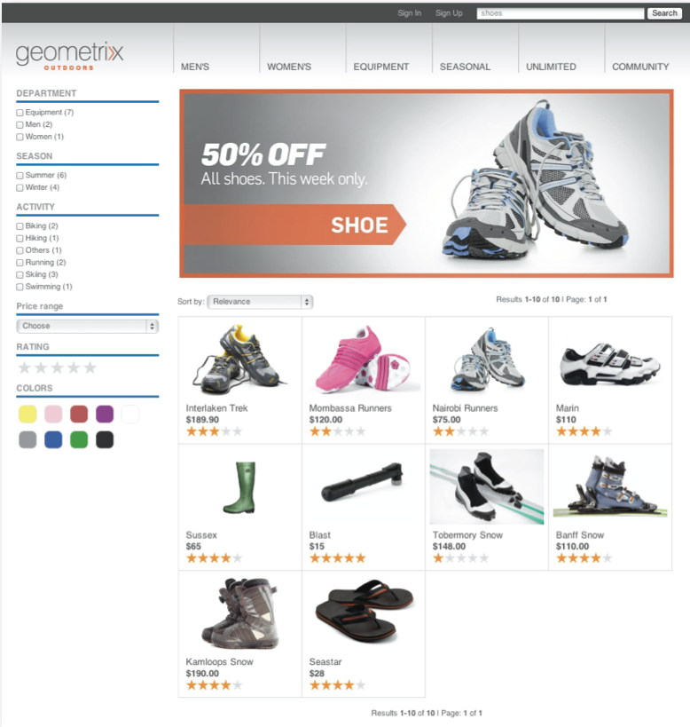
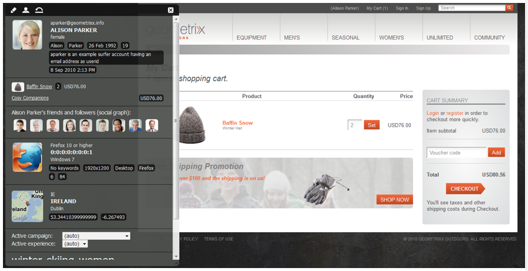

# eCommerce{#ecommerce}

* [Concepten](/help/sites-administering/concepts.md)
* [Beheer (algemeen)](/help/sites-administering/generic.md)

Adobe biedt twee versies van het Commerce Integration Framework:

<table>
 <tbody>
  <tr>
   <th>
 
 </th>
   <th>
CIF on prem
 </th>
   <th>
CIF Cloud
 </th>
  </tr>
  <tr>
   <td>
Ondersteunde AEM-versies
 </td>
   <td>
AEM on-prem of AMS 6.x
 </td>
   <td>AEM AMS 6.4 en 6.5</td>
  </tr>
  <tr>
   <td>
Terug
 </td>
   <td>
    <ul>
     <li>AEM, Java</li>
     <li>Monolithische integratie, vooraf samengestelde toewijzing (sjabloon)</li>
     <li>JCR-opslagplaats</li>
    </ul> </td>
   <td>
    <ul>
     <li>Magento</li>
     <li>Java en JavaScript</li>
     <li>Geen handelsgegevens opgeslagen in JCR-gegevensopslagruimte</li>
    </ul> </td>
  </tr>
  <tr>
   <td>
Voorkant
 </td>
   <td>
Gerenderde pagina's op de AEM-server
 </td>
   <td>Toepassing gemengde pagina (hybride rendering)</td>
  </tr>
  <tr>
   <td>
Productcatalogus
 </td>
   <td>
    <ul>
     <li>Producimporteur, editor, caching in AEM</li>
     <li>Normale catalogi met AEM- of proxypagina's</li>
    </ul> </td>
   <td>
    <ul>
     <li>Geen producten importeren</li>
     <li>Algemene sjablonen</li>
     <li>Gegevens op aanvraag via aansluiting</li>
    </ul> </td>
  </tr>
  <tr>
   <td>
Schaalbaarheid
 </td>
   <td>
    <ul>
     <li>Kan maximaal een paar miljoen producten ondersteunen (afhankelijk van het gebruiksgeval)</li>
     <li>Caching op Dispatcher</li>
    </ul> </td>
   <td>
    <ul>
     <li>Geen volumebeperking</li>
     <li>Caching op Dispatcher of CDN</li>
    </ul> </td>
  </tr>
  <tr>
   <td>Gestandaardiseerd gegevensmodel</td>
   <td>Nee</td>
   <td>Ja, Magento GraphQL-schema</td>
  </tr>
  <tr>
   <td>Beschikbaarheid</td>
   <td>
Ja. SAP Commerce Cloud (extensie die is bijgewerkt ter ondersteuning van AEM 6.4 en Hybris 5 (standaard) en die compatibel blijft met Hybris 4
 
Salesforce Commerce Cloud (connector open-sourced voor ondersteuning van AEM 6.4)
 </td>
   <td>Ja via open bron via GitHub.  De Handel van Magento (Steunt Magento 2.3.2 (gebrek) en compatibel met Magento 2.3.1).</td>
  </tr>
  <tr>
   <td>Wanneer gebruiken</td>
   <td>Beperkte gebruiksgevallen: Bijvoorbeeld scenario's waarin kleine, statische catalogi mogelijk moeten worden geïmporteerd</td>
   <td>Voorkeursoplossing in de meeste gebruikscategorieën</td>
  </tr>
 </tbody>
</table>

eCommerce handelt samen met Product Information Management (PIM) de activiteiten van een website die gericht is op het verkopen van producten via een online-winkel:

* Maken, levensduur en veroudering van een product
* Prijsbeheer
* Transactiebeheer
* Beheer van volledige catalogi
* Live en gecentraliseerde opslagrecords
* Webinterfaces

Met AEM eCommerce kunnen marketers overal op het web, mobiele apparaten en sociale aanraakpunten merkboodschap, persoonlijke boodschappen aanbieden. In de AEM-ontwerpomgeving kunt u pagina&#39;s en componenten aanpassen op basis van de context van de doelbezoeker en de marketingstrategieën. bijvoorbeeld:

* Productpagina&#39;s
* Winkelwagentjes
* Onderdelen uitchecken

De implementatie maakt realtime toegang tot productinformatie mogelijk. Dit kan worden gebruikt om af te dwingen:

* Integriteit van productinformatie
* Prijzen
* Voorraadinventaris
* Variaties in de toestand van een winkelwagentje

>[!NOTE]
>
>Als u het integratieframework wilt gebruiken met externe eCommerce-providers, moet u eerst de vereiste pakketten installeren. Voor meer informatie, zie het [Opstellen van eCommerce](/help/sites-deploying/ecommerce.md).
>
>Voor informatie over het uitbreiden van eCommerce-mogelijkheden, zie het [Ontwikkelen van eCommerce](/help/sites-developing/ecommerce.md).

## Belangrijkste functies {#main-features}

AEM eCommerce biedt het volgende:

* Een aantal **uit-van-de-doos componenten** AEM om te illustreren wat voor uw project kan worden bereikt:

   * Productweergave
   * Winkelwagentje
   * Uitchecken
   * Onlangs bekeken producten
   * Vouchers
   * en andere
   

   >[!NOTE]
   >
   >Met het integratieframework dat AEM biedt, kunt u ook extra AEM-componenten voor commerciële mogelijkheden maken, onafhankelijk van uw specifieke eCommerce-engine.

* **Zoeken** - met een van de volgende methoden:

   * de AEM-zoekopdracht
   * het zoeken van het eCommerce-systeem
   * een zoekopdracht van derden (zoals Zoeken&amp;Promoten)
   * of een combinatie daarvan.
   

* Gebruikt de AEM-mogelijkheid om uw inhoud **weer te geven op meerdere kanalen**, of het nu gaat om het volledige browservenster of mobiele apparaat. Hierdoor wordt uw inhoud geleverd in de indeling die uw bezoekers nodig hebben.

   

* De mogelijkheid om uw eigen integratie-implementatie te **ontwikkelen op basis van het[AEM e-Commerce-kader](#the-framework)**.

   De twee momenteel beschikbare implementaties zijn beide op dezelfde basis gebaseerd - bovenop de algemene API (het framework). Het implementeren van een nieuwe integratie houdt alleen in dat u de functies implementeert die uw integratie nodig heeft. De front-end componenten kunnen door om het even welke nieuwe implementatie worden gebruikt aangezien zij interfaces (zo onafhankelijk van de implementatie zijn) gebruiken.

* De mogelijkheid om **op ervaring gebaseerde handel te ontwikkelen op basis van verkoopgegevens en activiteiten**. Dit staat u toe om vele scenario&#39;s te realiseren:

   * Een voorbeeld hiervan kan zijn het verlagen van de verzendkosten wanneer de totale bestelling een bepaald bedrag overschrijdt.
   * Een andere mogelijkheid is mogelijk om seizoensgebonden aanbiedingen te doen die profielgegevens gebruiken (bijvoorbeeld locatie). Deze kunnen vervolgens worden gemarkeerd, ook als dat nodig is, afhankelijk van andere factoren.
   In het onderstaande voorbeeld ziet u een gummetje omdat de inhoud van het karretje minder dan $75 bedraagt:

   

   Dit kan worden gewijzigd wanneer de inhoud van het winkelwagentje meer dan $75 bedraagt:

   

* en andere functies, zoals:

   * De inhoud van het winkelwagentje blijft behouden tijdens sessies
   * Historie van volledige volgorde
   * Catalogusupdate uitvoeren

## Het kader {#the-framework}

In het gedeelte [Concepts](/help/sites-administering/concepts.md) wordt het kader nader beschreven, maar het volgende biedt een snelle en geavanceerde visie op het kader:

### Wat? {#what}

* Het integratieframework biedt de API, een reeks componenten om functionaliteit te illustreren en diverse extensies om voorbeelden van verbindingsmethoden te bieden.
* Het kader biedt de basisstructuur die nodig is voor de uitvoering van een project.
* Het kader is uitbreidbaar.
* Het framework biedt geen kant-en-klare site. Er is altijd een zekere hoeveelheid ontwikkelingswerk nodig om het kader aan uw specificaties aan te passen.

### Waarom? {#why}

* Om de basismechanismen te verstrekken nodig om een aangepaste plaats van de Handel snel te realiseren.
* Tp biedt de flexibiliteit die nodig is voor de ontwikkeling van een echte eCommerce-site.
* Beste werkwijzen illustreren.