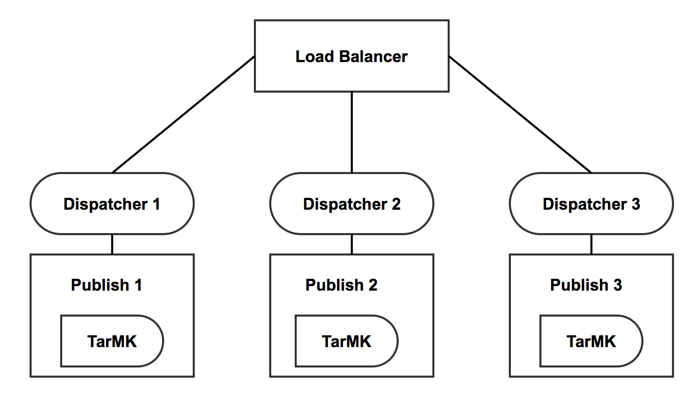

# Ondersteuning voor ingekapselde token{#encapsulated-token-support}

## Inleiding {#introduction}

Door gebrek, gebruikt AEM de Symbolische Handler van de Authentificatie om elk verzoek voor authentiek te verklaren. Om verificatieverzoeken te kunnen uitvoeren, vereist de Token Authentication Handler echter toegang tot de opslagplaats voor elk verzoek. Dit gebeurt omdat de koekjes worden gebruikt om de authentificatiestatus te handhaven. Logischerwijze moet de status in de opslagplaats worden voortgezet om volgende aanvragen te valideren. In feite, betekent dit dat het authentificatiemechanisme stateful is.

Dit is van bijzonder belang voor horizontale schaalbaarheid. In een opstelling van meerdere instanties zoals het hieronder afgebeeld publicatielandbouwbedrijf, kan lading het in evenwicht brengen niet op een optimale manier worden bereikt. Met stateful authentificatie, zal de persisted authentificatiestatus slechts op de instantie beschikbaar zijn waar de gebruiker eerst voor authentiek wordt verklaard.

Neem het volgende scenario als voorbeeld:

Een gebruiker kan bij publicatie-instantie één worden geverifieerd, maar als een volgende aanvraag naar publicatie-instantie twee gaat, heeft die instantie niet de status persisted authentication, omdat die status in de opslagplaats van publicatie één werd aangehouden en twee een eigen opslagplaats heeft.

De oplossing voor dit is kleverige verbindingen op het niveau van het taakverdelingsmechanisme te vormen. Met kleverige verbindingen zou een gebruiker altijd naar hetzelfde publicatie-exemplaar worden geleid. Als gevolg hiervan is een werkelijk optimale taakverdeling niet mogelijk.

Als een publicatie-instantie niet beschikbaar wordt, verliezen alle gebruikers die voor die instantie zijn geverifieerd hun sessie. Dit komt omdat toegang tot de opslagplaats nodig is om het verificatiecookie te valideren.

## Stateless Authentificatie met Encapsulated Token {#stateless-authentication-with-the-encapsulated-token}

De oplossing voor horizontale scalability is stateless authentificatie met het gebruik van de nieuwe Encapsulated Token steun in AEM.

Het ingekapselde token is een stuk cryptografie waarmee AEM op veilige wijze verificatiegegevens offline kan maken en valideren zonder toegang te krijgen tot de gegevensopslagruimte. Op deze manier kan een verificatieverzoek worden uitgevoerd op alle publicatieexemplaren zonder dat er kleverige verbindingen nodig zijn. Het heeft ook het voordeel om authentificatieprestaties te verbeteren aangezien de bewaarplaats niet voor elk authentificatieverzoek te hoeven worden betreden.

U kunt zien hoe dit werkt in een geografisch gedistribueerde implementatie met MongoMK-auteurs en TarMK-publicatie-instanties hieronder:

>[!NOTE]
>
>Houd er rekening mee dat het ingekapselde token over verificatie gaat. Het zorgt ervoor dat het cookie kan worden gevalideerd zonder toegang te hebben tot de gegevensopslagruimte. Nochtans, wordt het nog vereist dat de gebruiker op alle instanties bestaat en dat de informatie die onder die gebruiker wordt opgeslagen door elke instantie kan worden betreden.
>
>Als er bijvoorbeeld een nieuwe gebruiker wordt gemaakt op het nummer één van de publicatie-instantie, wordt deze vanwege de manier waarop de ingekapselde token werkt, geverifieerd bij het publiceren van nummer twee. Als de gebruiker niet bestaat op de tweede publicatie-instantie, is de aanvraag nog steeds niet geslaagd.

## Het vormen van Encapsulated Token {#configuring-the-encapsulated-token}

>[!NOTE]
>Alle authentificatiemanagers die gebruikers synchroniseren en zich op symbolische authentificatie (zoals SAML &amp; OAuth) baseren zullen slechts met ingekapselde tokens werken als:
>
>* Vaste sessies zijn ingeschakeld, of
   >
   >
* Gebruikers worden al in AEM gemaakt wanneer de synchronisatie start. Dit betekent dat ingekapselde tokens niet zullen worden gesteund in situaties waar de managers gebruikers tijdens het synchronisatieproces **creëren** .

Er zijn een paar dingen u in overweging moet nemen wanneer het vormen van Encapsulated Token:

1. Wegens de cryptografie in kwestie, moeten alle instanties de zelfde sleutel HMAC hebben. Sinds AEM 6.3 wordt het sleutelmateriaal niet meer opgeslagen in de gegevensopslagruimte, maar in het feitelijke bestandssysteem. In dit verband is het de beste manier om de toetsen te repliceren om deze van het bestandssysteem van de broninstantie naar die van de doelinstantie(s) te kopiëren waarnaar u de toetsen wilt repliceren. Zie hieronder meer informatie onder &quot;Replicating the HMAC key&quot;.
1. Het ingekapselde token moet worden ingeschakeld. Dit kan door de Console van het Web worden gedaan.

### Replicatie van de HMAC-sleutel {#replicating-the-hmac-key}

De sleutel HMAC is aanwezig als binair bezit van `/etc/key` in de bewaarplaats. U kunt het afzonderlijk downloaden door de **meningsverbinding** naast het te drukken:

Als u de sleutel in meerdere instanties wilt repliceren, moet u:

1. Toegang krijgen tot de AEM-instantie, doorgaans een instantie van de auteur, die het te kopiëren toetsmateriaal bevat.
1. Zoek de `com.adobe.granite.crypto.file` bundel in het lokale bestandssysteem. Onder dit pad bijvoorbeeld:

   * &lt;auteur-aem-install-dir>/crx-quickstart/launch/felix/bundle21
   Het `bundle.info` bestand in elke map geeft de naam van de bundel aan.

1. Navigeer naar de gegevensmap. Bijvoorbeeld:

   * `<author-aem-install-dir>/crx-quickstart/launchpad/felix/bundle21/data`

1. Kopieer de HMAC- en hoofdbestanden.
1. Dan, ga naar de doelinstantie u de sleutel HMAC aan wilt dupliceren, en aan de gegevensomslag navigeren. Bijvoorbeeld:

   * `<publish-aem-install-dir>/crx-quickstart/launchpad/felix/bundle21/data`

1. Plak de twee bestanden die u eerder hebt gekopieerd.
1. [Vernieuw de Crypto Bundle](/help/communities/deploy-communities.md#refresh-the-granite-crypto-bundle) als de doelinstantie reeds loopt.

1. Herhaal de bovenstaande stappen voor alle gevallen waarin u de toets wilt repliceren.

#### Encapsulated Token toelaten {#enabling-the-encapsulated-token}

Zodra de sleutel HMAC is herhaald, kunt u Encapsulated Token via de Console van het Web toelaten:

1. Wijs uw browser aan `https://serveraddress:port/system/console/configMgr`
1. Zoek naar een ingang genoemd **Dag CRX Symbolische de Handler** van de Authentificatie en klik het.
1. Schakel in het volgende venster het vakje Ingekapselde token-ondersteuning **** inschakelen in en druk op **Opslaan**.

