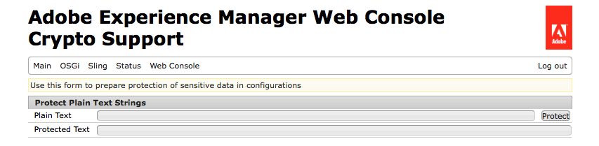

# Coderingsondersteuning voor configuratieeigenschappen{#encryption-support-for-configuration-properties}

## Overzicht {#overview}

Met deze functie kunnen alle OSGi-configuratie-eigenschappen worden opgeslagen in een beveiligd versleuteld formulier in plaats van tekst te wissen. Met het formulier in de gebruikersinterface van de webconsole wordt gecodeerde tekst gemaakt op basis van duidelijke tekst met behulp van de master coderingssleutel voor het hele systeem.

De steun van de Insteekmodule van de Configuratie OSGi werd toegevoegd om het bezit te decrypteren alvorens het door de dienst wordt gebruikt.

>[!NOTE]
>
>De diensten die een gecodeerde waarde verwachten moeten de controle gebruiken IsProtected om te zien of wordt de waarde gecodeerd alvorens te proberen om het te decrypteren, aangezien het reeds kan gedecrypteerd zijn.

## Coderingsondersteuning {#enabling-encryption-support} inschakelen

Deze stappen tonen hoe te om het wachtwoord SMTP voor de dienst van de Post te coderen. U kunt deze stappen uitvoeren voor een OSGI-eigenschap die u wilt coderen.

1. Ga naar de AEM webconsole op *https://&lt;serveradres>:&lt;serverport>/system/console/configMgr*
1. Ga in de linkerbovenhoek naar **Hoofd - Crypto Support**

   

1. De pagina **Adobe Experience Manager Web Console Crypto Support** wordt weergegeven.

   

1. Typ in het veld **Onbewerkte tekst** de tekst van de vertrouwelijke gegevens die u wilt beschermen.
1. Selecteer **Protect**. De beveiligde tekst wordt weergegeven als gecodeerde tekst.

   

1. Kopieer de beveiligde tekst uit Stap#5 en plak deze in de waarde OSGI-formulier. In dit voorbeeld wordt het versleutelde **SMTP-wachtwoord** toegevoegd aan de *Day CQ Mail Service*.

   

1. Sla de eigenschappen van de Day CQ Mail Service op. Het SMTP-wachtwoord wordt nu verzonden als een gecodeerde waarde.

## Decoderingsondersteuning {#decryption-support}

AEM verstrekt nu een Insteekmodule van de Configuratie om configuratieeigenschappen te decrypteren. Deze AEM insteekmodule zal automatisch de duidelijke teksteigenschappen decoderen en terugwinnen.
