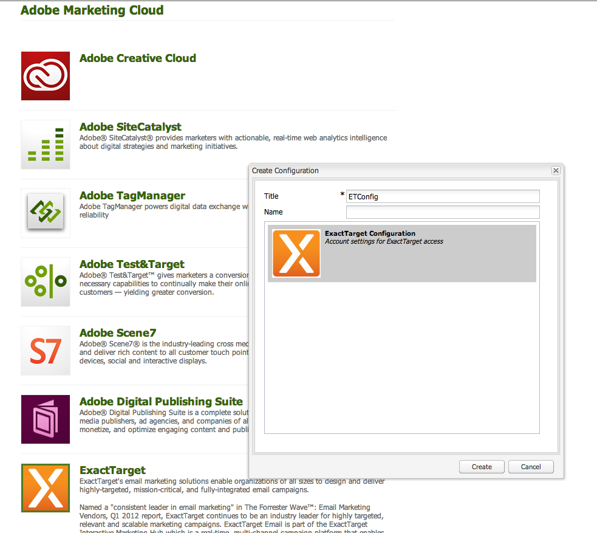

# Integreren met ExactTarget{#integrating-with-exacttarget}

Door AEM te integreren met Exact Target kunt u in AEM gemaakte e-mailberichten beheren en verzenden via Exact Target. U kunt hiermee ook de beheerfuncties voor leads van Exact Target gebruiken via AEM-formulieren op AEM-pagina&#39;s.

De integratie biedt u de volgende functies:

* De capaciteit om E-mail in AEM tot stand te brengen en hen te publiceren aan Exact Doel voor distributie.
* De capaciteit om actie van een vorm te plaatsen AEM om een Exact abonnee van het Doel tot stand te brengen.

Nadat ExactTarget is geconfigureerd, kunt u nieuwsbrieven of e-mails naar ExactTarget publiceren. Zie Nieuwsbrieven [publiceren naar een e-mailservice](/help/sites-authoring/personalization.md).

## Een ExactTarget-configuratie maken {#creating-an-exacttarget-configuration}

De configuraties ExactTarget kunnen via de Diensten van de Wolk of Hulpmiddelen worden toegevoegd. Beide methoden worden in deze sectie beschreven.

### ExactTarget configureren via Cloudservices {#configuring-exacttarget-via-cloudservices}

Een ExactTarget-configuratie maken in Cloud Services:

1. Klik op **Cloud Services** op de welkomstpagina. (Of rechtstreeks toegang om `https://<hostname>:<port>/etc/cloudservices.html`.)
1. Klik **ExactTarget** en dan **vormen**. Het ExactTarget configuratievenster opent.

   

1. Voer een titel en eventueel een naam in en klik op **Maken**. Het configuratievenster **ExactTarget Settings** wordt geopend.

   

1. Voer de gebruikersnaam en het wachtwoord in en selecteer een API-eindpunt (bijvoorbeeld **https://webservice.exacttarget.com/Service.asmx**).
1. Klik op **Verbinden met ExactTarget.** Wanneer de verbinding tot stand is gebracht, wordt het dialoogvenster geslaagd. Klik op **OK** om het venster te sluiten.

   

1. Selecteer een account, indien beschikbaar. De account is bestemd voor Enterprise 2.0-klanten. Click **OK**.

   ExactTarget is gevormd. U kunt de configuratie bewerken door op **Bewerken** te klikken. U kunt naar ExactTarget gaan door te klikken **Ga naar ExactTarget**.

1. AEM beschikt nu over een functie voor gegevensextensie. U kunt ExactTarget-gegevensextensiekolommen importeren. Dit kan worden gevormd door &quot;+&quot;teken te klikken dat behalve met succes tot stand gebrachte configuratie ExactTarget verschijnt. U kunt een van de bestaande gegevensextensies selecteren in de vervolgkeuzelijst. Raadpleeg de [ExactTarget-documentatie](https://help.exacttarget.com/en/documentation/exacttarget/subscribers/data_extensions_and_data_relationships)voor meer informatie over het configureren van gegevensextensies.

   De ingevoerde kolommen van de gegevensuitbreiding kunnen later door de component van de **Tekst en van de Personalisatie** worden gebruikt.

   

### ExactTarget configureren via tools {#configuring-exacttarget-via-tools}

Om een configuratie ExactTarget in Hulpmiddelen tot stand te brengen:

1. Klik op de welkomstpagina op **Gereedschappen**. Of navigeer daar rechtstreeks door naar `https://<hostname>:<port>/misadmin#/etc`te gaan.
1. Selecteer **Hulpmiddelen**, dan de Configuraties van de Diensten van de **Wolk,** dan **ExactTarget**.
1. Klik op **Nieuw** om het venster **Pagina maken **maken te openen.

   

1. Voer de **titel** en eventueel de **naam** in en klik op **Maken**.
1. Ga de configuratieinformatie in zoals die in stap 4 in de vorige procedure wordt geschetst. Volg die procedure om het vormen ExactTarget te beëindigen.

### Meerdere configuraties toevoegen {#adding-multiple-configurations}

Meerdere configuraties toevoegen:

1. Klik op de welkomstpagina op **Cloud Services** en klik op **ExactTarget**. Klik op de knop **Configuraties** tonen die wordt weergegeven als een of meer ExactTarget-configuraties beschikbaar zijn. Alle beschikbare configuraties worden vermeld.
1. Klik op het **+** -teken naast Beschikbare configuraties. Hiermee opent u het venster **Configuraties** maken. Volg de vorige configuratieprocedure om een nieuwe configuratie tot stand te brengen.