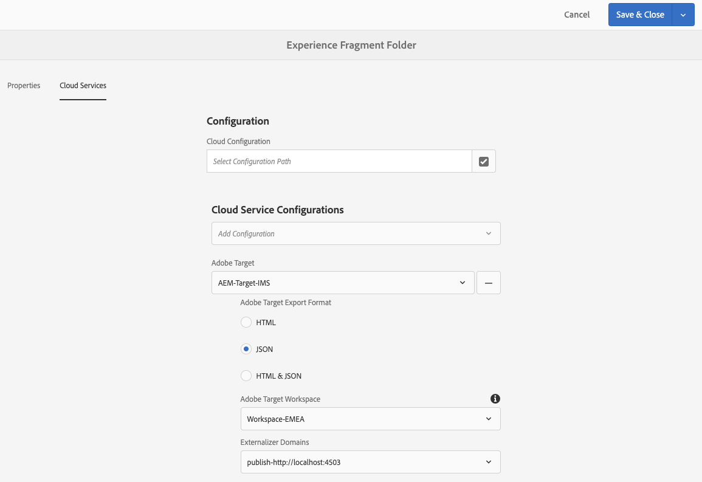

# Exporteren van ervaringsfragmenten naar Adobe Target{#exporting-experience-fragments-to-adobe-target}

U kunt [&#x200B; Fragmenten van de Ervaring &#x200B;](/help/sites-authoring/experience-fragments.md) uitvoeren, die in Adobe Experience Manager (AEM), aan Adobe Target (Doel) worden gecreeerd. Zij kunnen dan als aanbiedingen in de activiteiten van het Doel worden gebruikt, om, ervaringen op schaal te testen en te personaliseren.

Er zijn drie formaatopties beschikbaar voor het uitvoeren van een Fragment van de Ervaring naar Adobe Target:

* HTML (standaard): ondersteuning voor web en hybride inhoud
* JSON: ondersteuning voor levering van inhoud zonder kop
* HTML en JSON

AEM Experience Fragments kunnen worden geëxporteerd naar de standaardwerkruimte in Adobe Target of naar door de gebruiker gedefinieerde werkruimten voor Adobe Target. Dit wordt gedaan gebruikend Adobe Developer Console, waarvoor AEM [&#x200B; met Adobe Target moet worden geïntegreerd gebruikend IMS &#x200B;](/help/sites-administering/setting-up-ims-integrations-for-aem.md).

>[!NOTE]
>
>[&#x200B; IMS de integratie wordt nu gevormd met S2S OAuth &#x200B;](/help/sites-administering/setting-up-ims-integrations-for-aem.md).
>
>De vorige configuraties werden gemaakt met [&#x200B; geloofsbrieven JWT die nu onderworpen aan verval in Adobe Developer Console &#x200B;](/help/sites-administering/jwt-credentials-deprecation-in-adobe-developer-console.md) zijn.

>[!NOTE]
>
>De Adobe Target-werkruimten bestaan niet in Adobe Target zelf. Deze worden gedefinieerd en beheerd in Adobe IMS (Identity Management System) en vervolgens geselecteerd voor gebruik in verschillende oplossingen met behulp van integratie vanuit de Adobe Developer Console.

>[!NOTE]
>
>De werkruimten van Adobe Target kunnen worden gebruikt om leden van een organisatie (groep) toe te staan om aanbiedingen en activiteiten voor deze organisatie slechts tot stand te brengen en te beheren; zonder toegang tot andere gebruikers te verlenen. Bijvoorbeeld landspecifieke organisaties binnen een wereldwijd bereik.

>[!NOTE]
>
>Zie ook voor meer informatie:
>
>* [&#x200B; de ontwikkeling van Adobe Target &#x200B;](https://developers.adobetarget.com/)
>* [&#x200B; Componenten van de Kern - de Fragmenten van de Ervaring &#x200B;](https://experienceleague.adobe.com/docs/experience-manager-core-components/using/wcm-components/experience-fragment.html?lang=nl-NL)
>

## Vereisten {#prerequisites}

Er zijn verschillende acties vereist:

1. U moet [&#x200B; AEM met Adobe Target integreren gebruikend IMS &#x200B;](/help/sites-administering/setting-up-ims-integrations-for-aem.md).

   >[!NOTE]
   >
   >[&#x200B; IMS de integratie wordt nu gevormd met S2S OAut &#x200B;](/help/sites-administering/setting-up-ims-integrations-for-aem.md).
   >
   >De vorige configuraties werden gemaakt met [&#x200B; geloofsbrieven JWT die nu onderworpen aan verval in Adobe Developer Console &#x200B;](/help/sites-administering/jwt-credentials-deprecation-in-adobe-developer-console.md) zijn.

1. De Fragmenten van de ervaring worden uitgevoerd van de AEM auteurinstantie, zodat moet u [&#x200B; de AEM Verbinding Externalzer &#x200B;](/help/sites-administering/target-requirements.md#configuring-the-aem-link-externalizer) op de auteursinstantie vormen om ervoor te zorgen dat om het even welke verwijzingen binnen het Fragment van de Ervaring voor Weblevering worden geexternaliseerd.

   >[!NOTE]
   >
   >Voor verbinding die niet door het gebrek herschrijft, is de [&#x200B; Verstrekker van de Verbinding van het Fragment van de Ervaring Rewriter &#x200B;](/help/sites-developing/experience-fragments.md#the-experience-fragment-link-rewriter-provider-html) beschikbaar. Met dit, kunnen de aangepaste regels voor uw geval worden ontwikkeld.

## Cloudconfiguratie toevoegen {#add-the-cloud-configuration}

Alvorens een fragment uit te voeren, moet u de **Configuratie van de Wolk** voor **Adobe Target** aan het fragment, of de omslag toevoegen. Hierdoor kunt u ook:

* Geef de indelingsopties op die voor het exporteren moeten worden gebruikt
* een doelwerkruimte selecteren als doel
* Selecteer een externalizer-domein voor het herschrijven van verwijzingen in het ervaringsfragment (optioneel)

De vereiste opties kunnen in **Eigenschappen van de Pagina** van de vereiste omslag en/of het fragment worden geselecteerd; de specificatie zal zonodig worden geërft.

1. Navigeer aan de **console van de Fragmenten van de Ervaring**.

1. Open **Eigenschappen van de Pagina** voor de aangewezen omslag of het fragment.

   >[!NOTE]
   >
   >Als u de wolkenconfiguratie aan de ouderomslag van het Fragment van de Ervaring toevoegt, wordt de configuratie geërft door alle kinderen.
   >
   >
   >Als u de wolkenconfiguratie aan het Fragment van de Ervaring zelf toevoegt, wordt de configuratie geërft door alle variaties.

1. Selecteer de **Cloud Servicen** tabel.

1. Onder **Configuratie van de Cloud Service**, uitgezochte **Adobe Target** van de drop-down lijst.

   >[!NOTE]
   >
   >De JSON-indeling van een Experience Fragment-aanbieding kan worden aangepast. Hiertoe definieert u een componentervaringsfragmentcomponent en noteert u vervolgens hoe u de eigenschappen ervan in het deelstijlmodel exporteert.
   >
   >Zie de kerncomponent:
   >
   >[&#x200B; Componenten van de Kern - de Fragmenten van de Ervaring &#x200B;](https://experienceleague.adobe.com/docs/experience-manager-core-components/using/wcm-components/experience-fragment.html?lang=nl-NL)

   Onder **Adobe Target** uitgezocht:

   * de juiste configuratie
   * de optie voor de vereiste indeling
   * een Adobe Target-werkruimte
   * indien nodig - het Externalalizer-domein

   >[!CAUTION]
   >
   >Het ExternalAlizer-domein is optioneel.
   >
   >AEM wordt ExternalAlizer gevormd wanneer u de uitgevoerde inhoud aan specifiek wilt richten ** domein publiceren. Voor meer details, zie [&#x200B; Vormend de AEM Verbinding Externalzer &#x200B;](/help/sites-administering/target-requirements.md#configuring-the-aem-link-externalizer).
   >
   >Houd er ook rekening mee dat Externe domeinen alleen relevant zijn voor de inhoud van het ervaringsfragment dat naar Doel wordt verzonden, en niet voor metagegevens zoals Inhoud weergaveaanbod.

   Bijvoorbeeld voor een map:

   

1. **sparen &amp; sluit**.

## Een ervaringsfragment exporteren naar Adobe Target {#exporting-an-experience-fragment-to-adobe-target}

>[!CAUTION]
>
>Voor media-elementen, zoals afbeeldingen, wordt alleen een verwijzing naar Doel geëxporteerd. Het element zelf blijft opgeslagen in AEM Assets en wordt geleverd via de AEM-publicatie-instantie.
>
>Daarom moet het Experience Fragment, met alle gerelateerde elementen, worden gepubliceerd voordat het naar Target wordt geëxporteerd.

Een ervaringsfragment van AEM naar doel exporteren (nadat u de Cloud-configuratie hebt opgegeven):

1. Navigeer naar de Experience Fragment-console.
1. Selecteer het ervaringsfragment dat u naar doel wilt exporteren.

   >[!NOTE]
   >
   >Het moet een variant van het Web van het Fragment van de Ervaring zijn.

1. Klik **Uitvoer aan Adobe Target**.

   >[!NOTE]
   >
   >Als het Fragment van de Ervaring reeds is uitgevoerd, uitgezochte **Update in Adobe Target**.

1. Klik **Uitvoer zonder het publiceren** of **Publish** zoals vereist.

   >[!NOTE]
   >
   >Het selecteren van **Publish** publiceert het Fragment van de Ervaring onmiddellijk en verzendt het naar Doel.

1. Klik **O.K.** in de bevestigingsdialoog.

   Het ervaringsfragment moet nu Doel zijn.

   >[!NOTE]
   >
   >[&#x200B; de Diverse details &#x200B;](/help/sites-authoring/experience-fragments.md#details-of-your-experience-fragment) van de uitvoer kunnen in **Mening van de Lijst** van de console en **Eigenschappen** worden gezien.

   >[!NOTE]
   >
   >Wanneer het bekijken van een Fragment van de Ervaring in Adobe Target, is de *laatst gewijzigde* datum die wordt gezien de datum dat het fragment het laatst in AEM werd gewijzigd, niet de datum dat het fragment het laatst werd uitgevoerd naar Adobe Target.

>[!NOTE]
>
>Alternatief, kunt u de uitvoer van de paginaredacteur uitvoeren, gebruikend vergelijkbare bevelen in het [&#x200B; menu van de Informatie van de Pagina &#x200B;](/help/sites-authoring/author-environment-tools.md#page-information).

## Uw ervaringsfragmenten in Adobe Target gebruiken {#using-your-experience-fragments-in-adobe-target}

Nadat u de voorgaande taken hebt uitgevoerd, wordt het Experience Fragment weergegeven op de pagina Offers in Adobe Target. Bekijk de [&#x200B; specifieke documentatie van het Doel &#x200B;](https://experienceleague.adobe.com/docs/target/using/experiences/offers/aem-experience-fragments.html?lang=nl-NL) om over te leren wat u daar kunt bereiken.

>[!NOTE]
>
>Wanneer het bekijken van een Fragment van de Ervaring in Adobe Target, is de *laatst gewijzigde* datum die wordt gezien de datum dat het fragment het laatst in AEM werd gewijzigd, niet de datum dat het fragment het laatst werd uitgevoerd naar Adobe Target.

## Een ervaringsfragment verwijderen dat al naar Adobe Target is geëxporteerd {#deleting-an-experience-fragment-already-exported-to-adobe-target}

Als u een ervaringsfragment verwijdert dat al naar Target is geëxporteerd, kan dit problemen veroorzaken als het fragment al in een aanbieding in Adobe Target wordt gebruikt. Als u het fragment verwijdert, wordt de aanbieding onbruikbaar omdat de fragmentinhoud door AEM wordt geleverd.

Om dergelijke situaties te voorkomen:

* Als het ervaringsfragment momenteel niet wordt gebruikt in een activiteit, AEM kan de gebruiker het fragment zonder een waarschuwingsbericht verwijderen.
* Als het ervaringsfragment in gebruik is door een activiteit in Adobe Target, wordt de AEM gebruiker een foutbericht gegeven over de mogelijke gevolgen die het verwijderen van het fragment kan hebben voor de activiteit.

  Het foutbericht in AEM belet de gebruiker niet (geforceerd) het ervaringsfragment te verwijderen. Als het ervaringsfragment wordt verwijderd:

   * De aanbieding van het Doel met AEM Fragment van de Ervaring kan ongewenste gedrag tonen

      * Het aanbod wordt waarschijnlijk nog steeds weergegeven, aangezien de HTML van het ervaringsfragment naar Target is geduwd
      * Eventuele verwijzingen in het ervaringsfragment werken mogelijk niet correct als middelen waarnaar wordt verwezen ook in AEM worden verwijderd.

   * Eventuele verdere wijzigingen in het ervaringsfragment zijn onmogelijk omdat het ervaringsfragment niet meer in AEM bestaat.


## ClientLibs verwijderen uit Experience Fragments geëxporteerd naar Target {#removing-clientlibs-from-fragments-exported-target}

De Fragmenten van de ervaring bevatten volledige HTML- markeringen en alle noodzakelijke Bibliotheken van de Cliënt (CSS/JS) om het fragment precies terug te geven aangezien het door de Inhoudsauteur van het Fragment van de Ervaring werd gecreeerd. Dit is bijontwerp.

Wanneer u een Experience Fragment-aanbieding met Adobe Target gebruikt op een pagina die door AEM wordt geleverd, bevat de doelpagina al alle benodigde clientbibliotheken. Bovendien is vreemde html in de Aanbieding van het Fragment van de Ervaring niet nodig één van beide (zie [&#x200B; Overwegingen &#x200B;](#considerations)).

Hier volgt een pseudo-voorbeeld van de HTML in een Experience Fragment-aanbieding:

```html
<!DOCTYPE>
<html>
   <head>
      <title>…</title>
      <!-- all the client libraries (css/js) -->
      …
   </head>
   <body>
        <!--/* Actual XF Offer content would appear here... */-->
   </body>
</html>
```

Op een hoog niveau doet AEM een Ervaringsfragment naar Adobe Target exporteren dit met behulp van verschillende extra Sling Selectors. De URL voor het geëxporteerde ervaringsfragment kan er bijvoorbeeld als volgt uitzien (opmerking `nocloudconfigs.atoffer`):

* http://www.your-aem-instance.com/content/experience-fragments/my-offers/my-xf-offer.nocloudconfigs.atoffer.html

De kiezer van `nocloudconfigs` wordt gedefinieerd met HTML en kan worden bedekt door deze te kopiëren uit:

* /libs/cq/experience-fragments/components/xfpage/nocloudconfigs.html

De `atoffer` selecteur wordt toegepast post-verwerking gebruikend [&#x200B; het Schipen Rewriter &#x200B;](/help/sites-developing/experience-fragments.md#the-experience-fragment-link-rewriter-provider-html). Of kan worden gebruikt om de Bibliotheken van de Cliënt te verwijderen.

### Voorbeeld {#example}

Laten we hier illustreren hoe u dit kunt doen met `nocloudconfigs` .

>[!NOTE]
>
>Zie [&#x200B; Bewerkbare Malplaatjes &#x200B;](/help/sites-developing/templates.md#editable-templates) voor verdere details.

#### Bedekkingen {#overlays}

In dit bijzondere voorbeeld, zullen de [&#x200B; bekledingen &#x200B;](/help/sites-developing/overlays.md) die worden omvat de Bibliotheken van de Cliënt *en* de vreemde html verwijderen. Aangenomen wordt dat u al het Sjabloontype voor fragmenten uit ervaring hebt gemaakt. De volgende bestanden moeten worden gekopieerd uit `/libs/cq/experience-fragments/components/xfpage/` :

* `nocloudconfigs.html`
* `head.nocloudconfigs.html`
* `body.nocloudconfigs.html`

#### Sjabloonoverlays {#template-type-overlays}

In dit voorbeeld is dit de volgende structuur:


De inhoud van deze bestanden is als volgt:

* `body.nocloudconfigs.html`

  

* `head.nocloudconfigs.html`

  

* `nocloudconfigs.html`

  

>[!NOTE]
>
>Als u `data-sly-unwrap` wilt gebruiken om de tag body te verwijderen, hebt u `nocloudconfigs.html` nodig.

### Overwegingen {#considerations}

Als u zowel AEM plaatsen als niet AEM plaatsen moet steunen gebruikend de Aanbiedingen van het Fragment van de Ervaring in Adobe Target, moet u twee Fragments van de Ervaring (twee verschillende malplaatjetypes) tot stand brengen:

* Eén met de overlay om clientlibs/extra html te verwijderen

* Een die niet de overlay heeft en daarom de vereiste clientlibs bevat