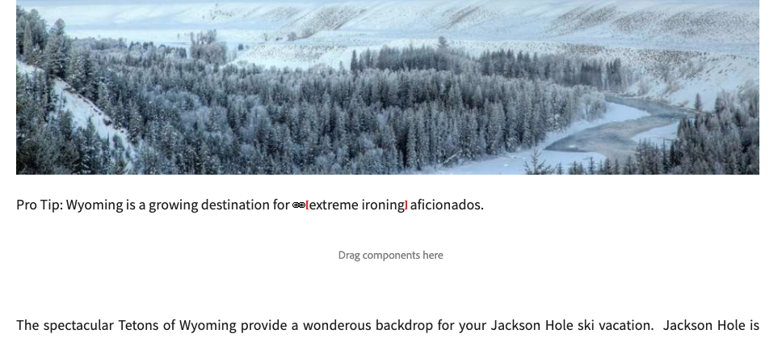

# De koppelingencontrole {#the-link-checker}

Inhoudsauteurs hoeven zich niet bezig te houden met het valideren van elke koppeling die ze in hun inhoudspagina&#39;s opnemen.

De koppelingencontrole wordt automatisch uitgevoerd om inhoudsauteurs bij te staan met hun koppelingen, waaronder:

* Koppelingen valideren terwijl deze aan inhoud worden toegevoegd
* Een lijst met alle externe koppelingen in de inhoud weergeven
* Koppelingtransformaties uitvoeren

De controleur van de Verbinding heeft verscheidene [ configuratieopties ](#configuring) zoals het bepalen van interne bevestiging, toestaand bepaalde verbindingen of verbindingspatters om van bevestiging worden weggelaten, en het herschrijven van verbinding herschrijvend regels.

De controleur van de Verbinding bevestigt zowel [ interne verbindingen ](#internal) als [ externe verbindingen.](#external)

>[!NOTE]
>
>Omdat de koppelingencontrole de koppelingen van elke inhoudspagina controleert, kan de koppelingencontrole de prestaties op grote opslagplaatsen beïnvloeden. In dergelijke gevallen, kunt u moeten [ vormen hoe vaak de Controle van de Verbinding ](#configuring) loopt of [ het onbruikbaar maakt.](#disabling)

## Interne koppelingencontrole {#internal}

Interne koppelingen zijn koppelingen naar andere inhoud in uw AEM. Interne koppelingen kunnen worden toegevoegd met de padkiezer voor de RTE of met een aangepaste component. Bijvoorbeeld:

* Uw pagina `/content/wknd/us/en/adventures/ski-touring.html`
* Bevat een verbinding aan `/content/wknd/us/en/adventures/extreme-ironing.html` in de Component van de a [ Tekst.](https://experienceleague.adobe.com/docs/experience-manager-core-components/using/components/text.html)

Interne koppelingen worden gevalideerd zodra de auteur van de inhoud een interne koppeling naar een pagina toevoegt. Als de koppeling ongeldig wordt:

* Deze wordt verwijderd uit de uitgever. De tekst van de koppeling blijft behouden, maar de koppeling zelf wordt verwijderd.
* Het wordt getoond als gebroken verbinding in de auteursinterface.

## Controleren van externe koppeling {#external}

Externe koppelingen zijn koppelingen naar inhoud buiten de AEM opslagplaats. De externe verbindingen kunnen worden toegevoegd gebruikend RTE of gebruikend een douanecomponent. Bijvoorbeeld:

* Uw pagina `/content/wknd/us/en/adventures/ski-touring.html`
* Bevat een verbinding aan `https://bunwarmerthermalunderwear.com` in de Component van de a [ Tekst.](https://experienceleague.adobe.com/docs/experience-manager-core-components/using/components/text.html)

Externe koppelingen worden gevalideerd voor syntaxis en door de beschikbaarheid ervan te controleren. Deze controle wordt asynchroon gedaan bij een configureerbare intern. Als de koppelingencontrole een externe koppeling ongeldig vindt:

* Deze wordt verwijderd uit de uitgever. De tekst van de koppeling blijft behouden, maar de koppeling zelf wordt verwijderd.
* Het wordt getoond als gebroken verbinding in de auteursinterface.

Bovendien verstrekt de [ Externe interface van de Controle van de Verbinding ](#external-link-checker) een overzicht van alle externe verbindingen op uw inhoudspagina&#39;s.

### De externe koppelingencontrole gebruiken {#external-link-checker}

De External Link Checker gebruiken:

1. Gebruikend **Navigatie**, selecteer **Hulpmiddelen**, toen **Plaatsen**.
1. Selecteer **Externe Controle van de Verbinding** en een lijst van alle externe verbindingen wordt getoond.

De volgende informatie wordt weergegeven:

* **Status** - de bevestigingsstatus van de verbinding die één van het volgende kan zijn:
   * **Geldig** - de externe verbinding is bereikbaar door de Controle van de Verbinding
   * **in afwachting** - de externe verbinding werd toegevoegd aan plaatsinhoud, maar is nog niet bevestigd door de Controleur van de Verbinding
   * **Ongeldig** - de externe verbinding is niet bereikbaar door de Controle van de Verbinding
* **URL** - de externe verbinding
* **Referrer** - de inhoudspagina die de externe verbinding bevat
   * Dit is slechts bevolkt [ als gevormd.](#configuring)
* **Laatste Gecontroleerde** - de laatste tijd de Controle van de Verbinding bevestigde de externe verbinding
   * Hoe vaak worden de verbindingen gecontroleerd [ configureerbaar.](#configuring)
* **Laatste Status** - de laatste HTML statuscode teruggekeerde toen de Verbinding het laatst controleerde verbinding
* **Laatste Beschikbare** - Tijd sinds de verbinding laatste beschikbaar aan de Controle van de Verbinding was
* **Laatste Toegelaten** - tijd sinds de pagina met de externe verbinding werd laatst betreden in de auteursinterface

U kunt de inhoud van het venster bewerken met de twee knoppen boven aan de lijst met koppelingen:

* **verfrissen zich** - om de inhoud van de lijst te verfrissen
* **Controle** - om een individuele externe verbinding te controleren die in de lijst wordt geselecteerd

### De werking van de externe koppelingencontrole {#how-it-works}

Hoewel gemakkelijk te gebruiken, vertrouwt de Externe Controle van de Verbinding op verscheidene diensten en het begrip van hoe zij werken helpt u begrijpen hoe te [ de Controle van de Verbinding ](#configuring) vormen om aan uw behoeften te voldoen.

1. Wanneer een inhoudsontwerper een koppeling naar een pagina opslaat, wordt een gebeurtenishandler geactiveerd.
1. De gebeurtenishandler doorloopt alle inhoud onder `/content` en controleert op nieuwe of bijgewerkte koppelingen en voegt deze toe aan een cache voor de koppelingencontrole.
1. De **Dienst van de Controle van de Verbinding van de Dag CQ** voert dan op een regelmatig programma uit om de ingangen in het geheime voorgeheugen voor geldige syntaxis te controleren.
1. De syntaxis-bevestigde verbindingen verschijnen dan in het [ Externe venster van de Controle van de Verbinding ](#external-link-checker). Nochtans zullen zij in a **Hangende** staat zijn.
1. De **Taak van de Controle van de Verbinding van CQ van de Dag CQ** voert dan op een regelmatige basis uit om de verbindingen te bevestigen door een vraag van de GET te maken.
1. De **Taak van de Controleur van de Verbinding van de Dag CQ** werkt dan de ingangen in het Externe venster van de Controleur van de Verbinding met de resultaten van de vraag van de GET bij.

## De koppelingencontrole configureren {#configuring}

De koppelingencontrole is automatisch in AEM beschikbaar. Nochtans, zijn er verscheidene configuraties OSGi die kunnen worden gewijzigd om zijn gedrag te veranderen:

* **de Opslagdienst van de Opslag van de Info van de Verbinding van 0} Dag CQ - Deze dienst bepaalt de grootte van het geheime voorgeheugen van de Controleur van de Verbinding in de bewaarplaats.**
* {de Dienst van de Controle van de Verbinding van 0} Dag CQ **- Deze dienst voert asynchrone controle van de syntaxis van externe verbindingen uit.** U kunt de controleperiode bepalen en welke typen koppelingen door de controleur onder andere worden overgeslagen.
* **CQ van de Verbinding van de Dag CQ Taak** - Deze dienst voert de bevestiging van de GET van externe verbindingen uit. Het staat afzonderlijke definities van intervallen toe om slechte en goede verbindingen onder andere opties te controleren.
* **De Transformator van de Controle van de Verbinding van de Dag CQ** - staat voor het omzetten van verbindingen toe die op een user-defined regelreeks worden gebaseerd.

Zie de Montages van de Configuratie OSGi van het document ](/help/sites-deploying/osgi-configuration-settings.md) voor meer details op hoe te om montages te veranderen OSGi.[

## De koppelingencontrole uitschakelen {#disabling}

U kunt de koppelingencontrole volledig uitschakelen. Daartoe:

1. Open de OSGi-console.
1. Bewerk de **Transformator van de Controle van de Verbinding van de Dag CQ**
1. Selecteer de optie(s) die u wilt uitschakelen:
   * **maak het Controleren** onbruikbaar - om bevestiging van verbindingen onbruikbaar te maken
   * **maak het Herschrijven** onbruikbaar - om verbindingstransformaties onbruikbaar te maken

>[!NOTE]
>
>Als u verbinding het controleren na aanvang onbruikbaar maakt om uw inhoud tot stand te brengen, kunt u nog ingangen in het [ Externe venster van de Controle van de Verbinding zien ](#external-link-checker), maar zij zullen niet meer worden bijgewerkt.
