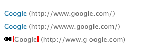

# De externe koppelingencontrole{#the-external-link-checker}

Binnen AEM wordt een externe koppelingencontrole aangeboden. De koppelingencontrole:

* scant alle inhoudspagina&#39;s
* genereert een lijst met alle geldige en ongeldige koppelingen
* Hiermee worden ongeldige koppelingen op de afzonderlijke inhoudspagina&#39;s gemarkeerd als verbroken

## Externe koppelingen valideren {#how-to-validate-external-links}

De externe koppelingencontrole gebruiken:

1. Selecteer **Navigatie**, selecteer **Gereedschappen** en **Sites**.
1. Selecteer **External Link Checker**, er wordt een lijst met alle externe koppelingen gegenereerd.
1. Valideer een specifieke verbinding door het in de lijst te selecteren, dan klikkend **Controle**:

   

   Informatie wordt weergegeven:

   * **Status** van de link
   * **URL**
   * **Referenter**
   * tijd sinds de verbinding **Last Checked** (bevestigd) was
   * de **Laatste status** is geretourneerd

   * tijd sinds de verbinding **Last Available** was
   * tijd sinds de verbinding **Laatst geopend** was

1. Ongeldige koppelingen op de afzonderlijke inhoudspagina&#39;s worden weergegeven als verbroken:

   