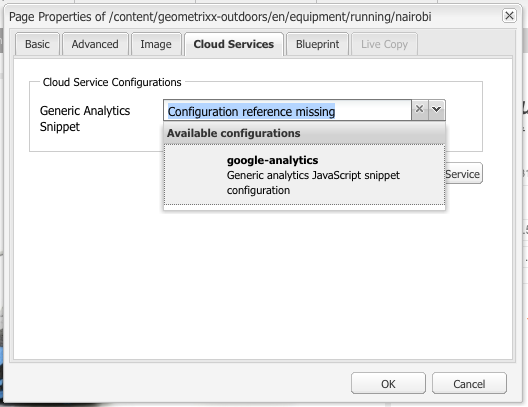

# Analyse met externe providers {#analytics-with-external-providers}

Analyses kunnen u belangrijke en interessante informatie geven over het gebruik van uw website.

Verschillende configuraties buiten de box zijn beschikbaar voor integratie met de juiste service, bijvoorbeeld:

* [Adobe Analytics](/help/sites-administering/adobeanalytics.md)
* [Adobe Target](/help/sites-administering/target.md)

U kunt ook uw eigen exemplaar van de **Algemene analysesnippets** configureren om nieuwe serviceconfiguraties te definiëren.

De informatie wordt vervolgens verzameld door middel van kleine codefragmenten die aan de webpagina&#39;s worden toegevoegd. Bijvoorbeeld:

>[!CAUTION]
>
>Scripts mogen niet in `script`-tags worden ingesloten.

```
var _gaq = _gaq || [];
_gaq.push(['_setAccount', 'UA-XXXXX-X']);
_gaq.push(['_trackPageview']);

(function() {
    var ga = document.createElement('script'); ga.type = 'text/javascript'; ga.async = true;
    ga.src = ('https:' == document.location.protocol ? 'https://ssl' : 'https://www') + '.google-analytics.com/ga.js';
    var s = document.getElementsByTagName('script')[0]; s.parentNode.insertBefore(ga, s);
})();
```

Met dergelijke fragmenten kunnen gegevens worden verzameld en rapporten worden gegenereerd. De werkelijk verzamelde gegevens zijn afhankelijk van de provider en het gebruikte codefragment. Voorbeelden van statistieken zijn:

* hoeveel bezoekers in de loop der tijd
* hoeveel pagina&#39;s zijn bezocht
* zoektermen gebruikt
* landingspagina&#39;s

>[!CAUTION]
>
>De Geometrixx-Buiten demosite is zo geconfigureerd dat de kenmerken die in de Pagina-eigenschappen worden opgegeven, worden toegevoegd aan de HTML-broncode (net boven de eindtag `</html>`) in het corresponderende `js`-script.
>
>Als uw eigen `/apps` niet van de standaardpaginacomponent ( `/libs/foundation/components/page`) erft moet u (of uw ontwikkelaars) ervoor zorgen dat de overeenkomstige `js` manuscripten inbegrepen zijn, bijvoorbeeld door of `cq/cloudserviceconfigs/components/servicescomponents`, of het gebruiken van een gelijkaardig mechanisme.
>
>Zonder dit, zal geen van de diensten (Generic, Analytics, Target, etc.) werken.

## Nieuwe service maken met een algemeen fragment {#creating-a-new-service-with-a-generic-snippet}

Voor de basisconfiguratie:

1. Open de console **Tools**.
1. Vouw **Cloud Services Configuraties** uit in het linkerdeelvenster.
1. Dubbelklik op **Generic Analytics Snippet** om de pagina te openen:

   

1. Klik op + om een nieuwe configuratie toe te voegen gebruikend de dialoog; minimaal een naam toewijzen, bijvoorbeeld google analytics:

   

1. Klik op **Maken**. Het dialoogvenster Fragmenten wordt direct geopend. U kunt het desbetreffende JavaScript-fragment in het veld plakken:

   

1. Klik **OK** om op te slaan.

## Uw nieuwe service gebruiken op pagina&#39;s {#using-your-new-service-on-pages}

Nadat u de de dienstconfiguratie hebt gecreeerd moet u nu de vereiste pagina&#39;s vormen om het te gebruiken:

1. Navigeer naar de pagina.
1. Open **Pagina-eigenschappen** vanuit sidekick en open vervolgens het tabblad **Cloud Services**.
1. Klik **Service toevoegen**, dan selecteer de vereiste dienst; Bijvoorbeeld het **Generic Analytics Snippet**:

   

1. Klik **OK** om op te slaan.
1. U zult aan **Cloud Services** tabel zijn teruggekeerd. Het **Generic Analytics Snippet** wordt nu vermeld met het bericht `Configuration reference missing`. Gebruik de drop-down lijst om uw specifiek de dienstgeval te selecteren; bijvoorbeeld google-analytics:

   

1. Klik **OK** om op te slaan.

   Het fragment kan nu worden weergegeven als u de paginabron voor de pagina bekijkt.

   Nadat een geschikte periode is verstreken, kunt u de verzamelde statistieken bekijken.

   >[!NOTE]
   >
   >Als de configuratie aan een pagina in bijlage is die kindpagina&#39;s heeft, wordt de dienst ook geërft door die.
