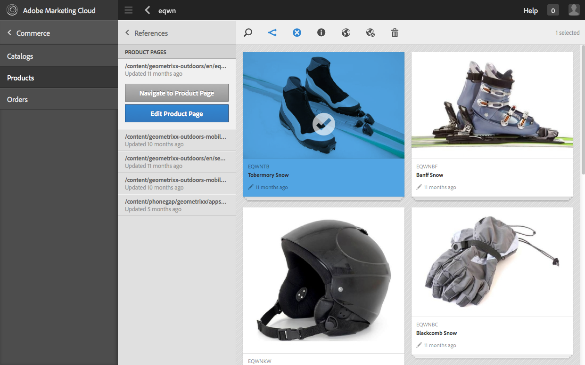
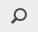
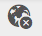
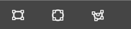

# Algemene eCommerce beheren {#administering-generic-ecommerce}

De AEM generische oplossing verstrekt methodes om de handelsinformatie te beheren die binnen de bewaarplaats wordt gehouden (in tegenstelling tot het gebruiken van een externe e-commerce motor). Dit omvat:

* [Producten](/help/sites-administering/concepts.md#products)
* [Productvarianten](/help/sites-administering/concepts.md#product-variants)
* [Catalogus(s)](/help/sites-administering/concepts.md#catalogs)
* [Aanbiedingen](/help/sites-administering/concepts.md#promotions)
* [Vouchers](/help/sites-administering/concepts.md#vouchers)
* [Orders](/help/sites-administering/concepts.md#shopping-cart-and-orders)
* [Proxypagina&#39;s](/help/sites-administering/concepts.md#proxy-pages)

>[!NOTE]
>
>De standaard AEM installatie omvat de generieke implementatie van de eCommerce AEM (JCR).
>
>Dit is momenteel bedoeld voor demonstratiedoeleinden of als de basis voor een aangepaste implementatie volgens uw vereisten.

## Producten en productvariaties {#products-and-product-variations}

>[!NOTE]
>
>De volgende procedures zijn van toepassing op zowel producten als productvariaties.

Voordat u producten maakt, moet u een [substraat](/help/sites-authoring/scaffolding.md)definiëren. Hiermee geeft u de velden op die u nodig hebt om de producten te definiëren en hoe deze worden bewerkt.

Voor elk afzonderlijk producttype is een steiger nodig. Het geschikte substraat wordt met de producten geassocieerd door:

* path
* het product kan verwijzen naar het substraat

>[!NOTE]
>
>De winkel Geometrixx-Buiten heeft één productsoort (en dus één enkel substraat):
>
>`/etc/scaffolding/geometrixx-outdoors`
>
>Het producttype Geometrixx-Buiten is actief op:
>
>`/etc/commerce/products/geometrixx-outdoors`
>
>U kunt een nieuwe productdefinitie overal onder die zonder enige extra opstelling tot stand brengen.

### Producten importeren {#importing-products}

#### Producten importeren - Voor aanraking geoptimaliseerde interface {#importing-products-touch-optimized-ui}

1. Navigeer aan de console van **Producten** , via **Handel**.
1. Met de **Producten** -console navigeert u naar de gewenste locatie.
1. Open de wizard met het pictogram Producten **** importeren.

   

1. Geef het volgende op:

   * **Importeur**

      De importeur voor de specifieke [handelsleverancier](/help/sites-administering/concepts.md#commerce-providers), door gebrek `Geometrixx`.

   * **Bron**

      Het bestand dat u wilt importeren; u kunt de browser gebruiken om een bestand te selecteren.

   * **Incrementele import**

      Geef aan of dit een incrementele invoer is (in tegenstelling tot volledige invoer).
   >[!NOTE]
   >
   >De incrementele invoer (van de voorbeeldgeometrixx-outdoorimporteur) vindt plaats op productniveau.
   >
   >Een aangepaste importmodule kan zo worden gedefinieerd dat deze naar wens kan werken.

1. Selecteer **Volgende** om de producten in te voeren, een logboek van de genomen acties zal worden getoond.

   >[!NOTE]
   >
   >De producten worden geïmporteerd in of ten opzichte van de huidige locatie.

   >[!NOTE]
   >
   >Als u herhaaldelijk **Volgende** en **Vorige** gebruikt, worden de productdefinities herhaaldelijk geïmporteerd. Nochtans, aangezien zij zelfde SKUs hebben zal de informatie in de bewaarplaats eenvoudig worden beschreven.

1. Selecteer **Gereed** om de wizard te sluiten.

#### Producten importeren - Klassieke UI {#importing-products-classic-ui}

1. Gebruikend de console van **Hulpmiddelen** open de omslag van de **Handel** .
1. Dubbelklik om de **productimportmodule** te openen:

   

1. Geef het volgende op:

   * **Winkelnaam**

      Producten worden geïmporteerd naar:

      `/etc/commerce/products/<*store name*>/`

   * **Handelsprovider**

      De importer voor uw [handelsprovider](/help/sites-administering/concepts.md#commerce-providers); standaard Geometrixx.

   * **Bronbestand**

      De locatie in de opslagplaats van het bestand dat u wilt importeren.

   * **Incrementele import**

      Geef aan of dit een incrementele invoer is (in tegenstelling tot volledige invoer).

1. Klik op Producten **** importeren.

### Productinformatie maken {#creating-product-information}

>[!NOTE]
>
>Het standaardproductbeheer is van fundamenteel belang, omdat de set Geometrixx-Outdoor-producten van fundamenteel belang is. De complexiteit is gebaseerd op de [basisstructuur](/help/sites-authoring/scaffolding.md)van het product, dus met uw eigen productsteigers is het mogelijk om geavanceerdere bewerkingen uit te voeren.

#### Productinformatie maken - Voor aanraking geoptimaliseerde gebruikersinterface {#creating-product-information-touch-optimized-ui}

1. Met de **Producten** -console (via **Handel**) navigeert u naar de gewenste locatie.
1. Gebruik het pictogram **Maken** om een van de volgende opties te selecteren (afhankelijk van de structuur en locatie):

   * **Product maken**
   * **Productvariatie maken**

   

1. De wizard wordt geopend. Gebruik de tabbladen **Standaard** en **Product** om de [productkenmerken](/help/sites-administering/concepts.md#product-attributes) voor het nieuwe product of de nieuwe productvariant in te voeren.

   >[!NOTE]
   >
   >**Titel** en **SKU** zijn het minimum dat wordt vereist om een product of een variant tot stand te brengen.

1. Selecteer **Maken** om de gegevens op te slaan.

>[!NOTE]
>
>Veel producten worden aangeboden in verschillende kleuren en/of grootten. De informatie over het basisproduct en de verwante productvarianten kan allebei van de console van **Producten** worden beheerd.
>
>De producten en hun varianten worden opgeslagen als boomstructuur, is de productinformatie bij de bovenkant, met de varianten onderaan (deze structuur wordt afgedwongen door UI).

### Productinformatie bewerken {#editing-product-information}

>[!NOTE]
>
>De beelden van het product in geometrixx-outdoor worden gediend van:
>
>`/etc/commerce/products/...`
>
>Dit betekent dat, door gebrek, zij door de [verzender](https://helpx.adobe.com/experience-manager/dispatcher/using/dispatcher-configuration.html)worden geblokkeerd, zo vorm zo zoals vereist.

#### Productinformatie bewerken - Voor aanraking geoptimaliseerde interface {#editing-product-information-touch-optimized-ui}

1. Navigeer met de **Producten** -console (via **Handel**) naar de productinformatie.
1. Een van de volgende methoden gebruiken:

   * [snelle acties](/help/sites-authoring/basic-handling.md#quick-actions)
   * [selectiemodus](/help/sites-authoring/basic-handling.md#navigating-and-selection-mode)

   Selecteer het pictogram **Productgegevens** weergeven:

   

1. De [productkenmerken](/help/sites-administering/concepts.md#product-attributes) worden weergegeven. Met **Bewerken** en **Gereed** kunt u wijzigingen aanbrengen.

### Productverwijzingen tonen {#showing-product-references}

#### Productreferenties tonen - Voor aanraking geoptimaliseerde interface {#showing-product-references-touch-optimized-ui}

1. Navigeer met de **Producten** -console (via **Handel**) naar de productinformatie.
1. Open de secundaire rail voor Referenties met het pictogram:

   

1. Selecteer het vereiste product. De secundaire rail wordt bijgewerkt en geeft de beschikbare referentietypen weer:

   

1. Klik/tik op het referentietype (bijvoorbeeld productpagina&#39;s) om de lijst uit te vouwen.
1. Selecteer een specifieke verwijzing om de opties weer te geven:

   * Naar productpagina navigeren
   * Productpagina bewerken

   

### Zoeken naar producten {#search-for-products}

1. Navigeer aan de console van **Producten** , via **Handel**.
1. Open de secundaire rail voor Onderzoek met het pictogram:

   

1. U kunt op verschillende manieren naar producten zoeken. U kunt slechts één of meerdere facetten voor een onderzoek gebruiken. De gevonden producten worden weergegeven:

   

1. Als u op een product klikt of erop tikt, wordt het geopend. U kunt het ook publiceren of de productgegevens bekijken.

#### Zoeken uitbreiden {#extending-search}

U kunt een bestaand facet wijzigen of nieuwe facetten toevoegen met behulp van CRXDE Lite:

1. Ga naar:

   `http://localhost:4502/crx/de/index.jsp#/libs/commerce/gui/content/products/aside/items/search/items/searchpanel/facets`

1. U kunt bijvoorbeeld de grootten wijzigen die op de pagina met productzoekopdrachten worden weergegeven. Klik op het `sizegroup` knooppunt.
1. Klik op `items` knooppunt en klik vervolgens op `propertypredicate` knooppunt.
1. U kunt het `propertyValues`wijzigen. U kunt bijvoorbeeld XS of XXL toevoegen of een grootte verwijderen.
1. Klik op Alles **** opslaan en navigeer naar de pagina met productzoekopdrachten. Uw wijzigingen worden weergegeven.

### Meerdere elementen {#multiple-assets}

U kunt meerdere elementen toevoegen aan de productcomponent en vervolgens het element opgeven dat op de productpagina wordt weergegeven.

>[!NOTE]
>
>Alles wat met meerdere middelen te maken heeft, wordt gedaan met de interface die geoptimaliseerd is voor Touch.

#### Meerdere elementen toevoegen {#adding-multiple-assets}

1. Navigeer aan de console van **Producten** , via **Handel**.
1. Navigeer met behulp van de **Producten** -console naar het vereiste product.

   >[!NOTE]
   >
   >U moet op productniveau zijn, niet op variantniveau.

1. Tik/klik op het pictogram **Productgegevens** weergeven in de selectiemodus of in de modus Snel.
1. Tik op het pictogram Bewerken of klik op het pictogram Bewerken.
1. Schuif naar **Toevoegen**.

   

1. Tik/klik op **Toevoegen**. Er wordt een nieuwe plaatsaanduiding voor elementen weergegeven.
1. Door te tikken of te klikken op **Wijzigen **Hiermee opent u een dialoogvenster waarin u een element kunt kiezen.
1. Selecteer het element dat u wilt toevoegen.

   >[!NOTE]
   >
   >De elementen die u kunt selecteren, zijn afkomstig uit [elementen](https://helpx.adobe.com/experience-manager/aem-previous-versions.html#assets).

1. Tik op het pictogram Gereed/klik op Gereed.

Er worden nu twee elementen in uw productcomponent opgeslagen. U kunt configureren welke op de productpagina wordt weergegeven. Dit werkt met een categoriesysteem. Eerst moet u een categorie toevoegen aan de afzonderlijke elementen:

1. Tik/klik op **Productgegevens** weergeven.
1. Typ bijvoorbeeld een categorie **** Elementen onder de elementen `cat1` en `cat2`.

   >[!NOTE]
   >
   >U kunt ook tags gebruiken voor categorieën.

1. Tik op het pictogram Gereed/klik op Gereed. U moet nu uw wijzigingen [uitvoeren](#rolling-out-a-catalog) .

Uw elementen in de productcomponent hebben nu een categorie. U kunt vormen welke categorie op drie verschillende niveaus zal worden getoond:

* [Productpagina](#product-page)
* [Catalogus](#catalog)
* [Productconsole](#products-console)

>[!NOTE]
>
>Als u geen categorieën instelt, wordt het eerste element weergegeven op de productpagina.

Het mechanisme voor het selecteren van de afbeelding die moet worden weergegeven, is als volgt:

1. Controleer of een categorie is ingesteld voor de productpagina.
1. Zo niet, controleer dan of een categorie is ingesteld voor de catalogus.
1. Zo niet, controleer dan of een categorie is ingesteld voor de productconsole.

>[!NOTE]
>
>Voor zowel het niveau van de Catalogus als het niveau van de Console van Producten, moet u uw veranderingen uitvoeren om de wijzigingen toe te passen en het verschil op de productpagina te zien.

#### Productpagina {#product-page}

1. Navigeer naar de productpagina.
1. **Bewerk** de productcomponent.
1. Typ de gekozen **afbeeldingscategorie** ( `cat1` bijvoorbeeld).
1. Tik/klik op **Gereed**. De pagina wordt vernieuwd en het juiste element moet worden weergegeven.

#### Catalogus  {#catalog}

1. Navigeer naar de catalogus.
1. Tik/klik op **Eigenschappen** weergeven.
1. Tik/klik op **Bewerken**.
1. Tik/klik op het tabblad **Middelen** .
1. Typ de gewenste categorie **Productmiddelen**.
1. Tik/klik op **Gereed**.
1. [Voer](#rolling-out-a-catalog) uw wijzigingen uit.

#### Productconsole {#products-console}

1. Navigeer met de **Producten** -console naar het vereiste product.
1. Tik/klik op **Productgegevens** weergeven.
1. Tik/klik op **Bewerken**.
1. Typ een categorie **Standaardelement**.
1. Tik/klik op **Gereed**.
1. [Voer](#rolling-out-a-catalog) uw wijzigingen uit.

### Productinformatie publiceren/verwijderen {#publishing-unpublishing-product-information}

#### Publiceren/Publiceren van de Informatie van het Product - Touch-geoptimaliseerde UI {#publishing-unpublishing-product-information-touch-optimized-ui}

>[!NOTE]
>
>De productinformatie wordt vaak gepubliceerd via de pagina&#39;s die ernaar verwijzen. Wanneer u bijvoorbeeld pagina X publiceert met verwijzingen naar product Y, AEM u wordt gevraagd of u ook product Y wilt publiceren.
>
>In speciale gevallen ondersteunt AEM ook het rechtstreeks publiceren van de productgegevens.

1. Navigeer met de **Producten** -console (via **Handel**) naar de productinformatie.
1. Een van de volgende methoden gebruiken:

   * [snelle acties](/help/sites-authoring/basic-handling.md#quick-actions)
   * [selectiemodus](/help/sites-authoring/basic-handling.md#navigating-and-selection-mode)

   Selecteer naar wens het pictogram **Publiceren** of **Publiceren** ongedaan maken:

    

   De productinformatie zal worden gepubliceerd of, indien van toepassing, niet gepubliceerd.

### Productfeed {#product-feed}

Dankzij de Search&amp;Promote-integratie kunt u:

* gebruik de eCommerce-API, onafhankelijk van de onderliggende structuur van de gegevensopslagruimte en het handelsplatform.
* hefboomwerking de eigenschap van de Schakelaar van de Index van Search&amp;Promote om een productvoer in formaat van XML te verstrekken.
* de functie voor afstandsbediening van Search&amp;Promote gebruiken om op aanvraag of geplande aanvragen van de productfeed uit te voeren
* feed generation voor verschillende Search&amp;Promote-accounts, geconfigureerd als cloudservices configuraties.

Lees voor meer informatie de [Productfeed](/help/sites-administering/product-feed.md).

### Gebeurtenishandler voor productupdates {#event-handler-for-product-updates}

Er is een gebeurtenishandler die een gebeurtenis registreert wanneer een product wordt toegevoegd, gewijzigd of verwijderd en wanneer een productpagina wordt toegevoegd, gewijzigd of verwijderd. Er zijn de volgende OSGi gebeurtenissen:

* `com/adobe/cq/commerce/pim/PRODUCT_ADDED`
* `com/adobe/cq/commerce/pim/PRODUCT_MODIFIED`
* `com/adobe/cq/commerce/pim/PRODUCT_DELETED`
* `com/adobe/cq/commerce/pim/PRODUCT_PAGE_ADDED`
* `com/adobe/cq/commerce/pim/PRODUCT_PAGE_MODIFIED`
* `com/adobe/cq/commerce/pim/PRODUCT_PAGE_DELETED`

Voor de `PRODUCT_*` gebeurtenissen wijst het pad naar het basisproduct in `/etc/commerce/products`. Voor de `PRODUCT_PAGE_*` gebeurtenissen wijst het pad naar het `cq:Page` knooppunt.

U kunt hen in de Console van het Web in gebeurtenissen bekijken OSGI ( `/system/console/events`), bijvoorbeeld:

>[!NOTE]
>
>Lees ook [Gebeurtenisafhandeling in AEM](https://blogs.adobe.com/experiencedelivers/experience-management/event_handling_incq/). 

### Afbeelding met Koppelingen toevoegen aan winkelwagentje {#image-with-add-to-cart-links}

Met de component Afbeelding met Koppelingen toevoegen aan winkelwagentje kunt u snel een product aan het winkelwagentje toevoegen door een hotspot te maken die is gekoppeld aan een product in een afbeelding.

Als u op de hotspot klikt, wordt een dialoogvenster geopend waarin u de grootte en de hoeveelheid van het product kunt kiezen.

1. Navigeer naar de pagina waaraan u de component wilt toevoegen.
1. Sleep de component naar de pagina.
1. Sleep een afbeelding in de component vanuit de [middelenbrowser](/help/sites-authoring/author-environment-tools.md#assets-browser).
1. U kunt:

   * Klik op de component en klik vervolgens op het pictogram Bewerken
   * langzaam dubbelklikken

1. Klik op het pictogram Volledig scherm.

   

1. Klik op het pictogram Startmap.

   

1. Klik op een van de vormpictogrammen.

   

1. Wijzig en verplaats de vorm naar wens.
1. Klik op de vorm.
1. Als u op het bladerpictogram klikt, wordt de [Asset Picker](../assets/search-assets.md#assetpicker)geopend.

   >[!NOTE]
   >
   >U kunt ook rechtstreeks het productpad typen dat zich op productniveau moet bevinden, niet het variantniveau.

   

1. Klik tweemaal op het bevestigingspictogram en klik op Volledig scherm afsluiten.
1. Klik ergens op de pagina naast de component. De pagina moet worden vernieuwd en u ziet het volgende symbool in uw afbeelding:

   

1. Schakel over naar de [voorvertoningsmodus](/help/sites-authoring/editing-content.md#previewingpagestouchoptimizedui) .
1. Klik op + hotspot. Er wordt een dialoogvenster geopend waarin u de grootte en de hoeveelheid van het product kunt kiezen die u hebt ingevoerd in **Pad**.

   

1. Voer een grootte en een hoeveelheid in.
1. Klik op de knop Toevoegen aan winkelwagentje. Het dialoogvenster wordt gesloten.
1. Navigeer naar uw winkelwagentje. Het product moet hier zijn.

#### Configuratieopties {#configuration-options}

U kunt configureren hoe het dialoogvenster eruitziet wanneer u op de hotspot klikt:

1. Klik de component en klik vormen pictogram.

   

1. Omlaag schuiven. Er is een tabblad **TOEVOEGEN AAN KAART** .

   

1. Klik op **TOEVOEGEN AAN KAART**. Er zijn 3 configuratieopties die u kunt gebruiken.

   

1. Klik op het pictogram Gereed.

## Catalogi {#catalogs}

### Een catalogus genereren {#generating-a-catalog}

#### Een catalogus genereren - Voor aanraking geoptimaliseerde gebruikersinterface {#generating-a-catalog-touch-optimized-ui}

>[!NOTE]
>
>De catalogus verwijst naar uw productgegevens.

Een catalogus genereren:

1. Open de Sites-console (bijvoorbeeld [http://localhost:4502/sites.html/content](http://localhost:4502/sites.html/content)).
1. Navigeer naar de locatie waar u de nieuwe pagina wilt maken.
1. U opent de lijst met opties door het pictogram **Maken** te gebruiken:

   

1. De wizard Catalogus maken wordt geopend in de lijst **Catalogus** maken.

   

1. Navigeer naar de gewenste blauwdruk van de catalogus.
1. Tik/klik op de knop **Selecteren** en tik/klik op de gewenste vervaging voor catalogus.
1. Tik/klik op **Volgende**.

   

1. Typ een **titel** en een **naam**.
1. Tik/klik op de knop **Maken** . De catalogus wordt gemaakt en er wordt een dialoogvenster geopend.

   

1. Door op de knop **Gereed** te tikken of erop te klikken, keert u terug naar de Sites-console waar u de catalogus kunt zien.

   Als u op de knop Catalogus **** openen tikt of erop klikt, wordt de catalogus geopend (bijvoorbeeld `http://localhost:4502/editor.html/content/test-catalog.html`).

#### Een catalogus genereren - klassieke gebruikersinterface {#generating-a-catalog-classic-ui}

>[!NOTE]
>
>De catalogus verwijst naar uw [productgegevens](#products-and-product-variants).

1. Navigeer met behulp van de **websiteconsole** naar uw **catalogusblauwdruk** en vervolgens naar de basiscatalogus.

   Bijvoorbeeld:

   `http://localhost:4502/siteadmin#/content/catalogs/geometrixx-outdoors/base-catalog`

1. Maak een nieuwe pagina met de sjabloon **Sectie vervagen** .

   Bijvoorbeeld, `Swimwear`.

1. Open de nieuwe `Swimwear` pagina en klik vervolgens op Vervaging **** bewerken om het dialoogvenster **Eigenschappen** te openen waarin u de selectie **Producten** kunt instellen.

   Open bijvoorbeeld het veld **Tags/Trefwoorden** om Activiteit te selecteren en vervolgens zwemmen in de sectie Geometrixx-Buiten.

1. Klik op **OK** om de eigenschappen op te slaan. voorbeeldproducten worden weergegeven onder de criteria **voor** productselectie op de pagina Bladeren.
1. Klik op Wijzigingen **rollout...**, selecteer **Rollout-pagina en alle subpagina** en klik vervolgens op **Volgende** en **Uitvoeren**. Zodra de rollout met succes wordt voltooid zal de indicator van de **Status** als groen worden getoond.
1. U kunt nu op **Sluiten** klikken en de nieuwe sectie Catalogus controleren; bijvoorbeeld op en onder :

   `http://localhost:4502/cf#/content/geometrixx-outdoors/en/swimwear.html`

1. Klik nogmaals op de pagina Vervagen **bewerken** en open het tabblad **Gegenereerde pagina** in het dialoogvenster **Eigenschappen** . Selecteer in het lijstveld Banner de afbeelding die u wilt weergeven. bijvoorbeeld: `summer.jpg`
1. Klik op **OK** om de eigenschappen op te slaan. bannergegevens worden weergegeven onder de criteria **voor** productselectie op de pagina Bladeren.
1. Deze nieuwe wijzigingen uitvoeren.

### Een catalogus uitrollen {#rolling-out-a-catalog}

#### Een catalogus implementeren - geoptimaliseerde gebruikersinterface met aanraakfuncties {#rolling-out-a-catalog-touch-optimized-ui}

Een catalogus uitrollen:

1. Navigeer aan de console van **Catalogi** , via **Handel**.
1. Navigeer naar de catalogus die u wilt uitrollen.
1. Een van de volgende methoden gebruiken:

   * [snelle acties](/help/sites-authoring/basic-handling.md#quick-actions)
   * [selectiemodus](/help/sites-authoring/basic-handling.md#navigating-and-selection-mode)

   Selecteer het pictogram **Wijzigingen** doorvoeren:

   

1. Stel in de wizard de rollout zo nodig in en tik op Wijzigingen **** rollout/klik op deze knop.
1. Er wordt een dialoogvenster geopend. Tik/klik op **Gereed** wanneer het proces is voltooid.

#### Een catalogus uitrollen - klassieke gebruikersinterface {#rolling-out-a-catalog-classic-ui}

Een catalogus uitrollen:

1. Navigeer naar de catalogus die u wilt uitrollen. Bijvoorbeeld:

   `http://localhost:4502/cf#/content/catalogs/geometrixx-outdoors/base-catalog.html`

1. Klik op Wijzigingen **rollout...**
1. Stel de rollout naar wens in.
1. Klik op **Uitvoeren**.

### Blauwdrukimportmodule {#blueprint-importer}

#### Blauwdrukimportmodule - Voor aanraking geoptimaliseerde gebruikersinterface {#blueprint-importer-touch-optimized-ui}

1. Navigeer aan de console van **Catalogi** , via **Handel**.
1. Navigeer naar de locatie waar u de blauwdruk van de catalogus wilt importeren.
1. Tik/klik op het pictogram Vervagen **importeren** .

   

1. Selecteer de gewenste bron in de wizard en tik op **Volgende**.

   

1. Tik/klik op **Gereed** wanneer het importeren is voltooid.

#### Invoer van blauwdruk - klassieke gebruikersinterface {#blueprint-importer-classic-ui}

1. Navigeer met de **console Tools** naar **Commerce**.

   Bijvoorbeeld:

   `http://localhost:4502/miscadmin#/etc/commerce`

1. Open de **katalogus van de Invoer** van de Vervaging.
1. Stel de gewenste importbewerking in.
1. Klik op **Catalogusblauwdrukken** importeren.

## Aanbiedingen {#promotions}

### Een aanbieding maken {#creating-a-promotion}

#### Aanbieding maken - klassieke gebruikersinterface {#creating-a-promotion-classic-ui}

>[!NOTE]
>
>In het volgende voorbeeld wordt een promotie behandeld die rechtstreeks in een [campagne](/help/sites-classic-ui-authoring/classic-personalization-campaigns.md)wordt gehouden. Deze wordt gebruikt voor vouchers.
>
>Een promotie kan ook in een [ervaring](/help/sites-authoring/personalization.md) binnen een campagne zijn.
>
>Zie [Promoties en Vouchers](#promotions-and-vouchers)voor meer informatie.

1. Open de **websiteconsole** van de auteur.
1. Selecteer in het linkerdeelvenster de gewenste **campagne**.
1. Klik op **Nieuw**, selecteer het malplaatje van de **Bevordering** , dan specificeer een **Titel** (en een **Naam** indien vereist) voor uw nieuwe bon.
1. Klik op **Maken**. De nieuwe pagina voor speciale acties wordt weergegeven in het rechtervenster.

1. Bewerk de **eigenschappen** door:

   * het openen van de pagina, dan het klikken van de Edit knoop om het dialoogvenster van Eigenschappen te openen
   * het selecteren van de pagina in de console van Websites, dan gebruikend het contextmenu (gewoonlijk de juiste muisknoop) om **Eigenschappen te selecteren...** en opent u het dialoogvenster met eigenschappen

   Geef desgewenst het type **** promotie, het type **** korting, de waarde **voor** korting en andere velden op.

1. Klik op **OK** om op te slaan.

1. Je kunt je speciale actie nu activeren, zodat kopers deze kunnen bekijken op het publicatieexemplaar.

## Vouchers {#vouchers}

### Een voucher maken {#creating-a-voucher}

#### Een voucher maken - een klassieke gebruikersinterface {#creating-a-voucher-classic-ui}

1. Open de **websiteconsole** van de auteur.
1. Selecteer in het linkerdeelvenster de gewenste **campagne**.
1. Klik op **Nieuw**, selecteer het malplaatje van de **Voucher** , dan specificeer een **Titel** (en een **Naam** indien vereist) voor uw nieuwe bon.
1. Klik op **Maken**. De nieuwe voucherpagina wordt weergegeven in het rechterdeelvenster.

1. Open de nieuwe voucherpagina met een dubbelklik en klik vervolgens op **Bewerken** om de gewenste gegevens te configureren.
1. Klik op **OK** om op te slaan.

1. U kunt de voucher nu activeren, zodat kopers deze kunnen gebruiken in hun winkelwagentjes op het publicatieexemplaar.

### Vouchers verwijderen {#removing-vouchers}

#### Vouchers verwijderen - Klassieke UI {#removing-vouchers-classic-ui}

Als u een voucher niet beschikbaar wilt maken voor klanten, kunt u:

* Deactiveer de voucher - deze blijft beschikbaar in de auteursomgeving zodat u deze later opnieuw kunt activeren.
* Verwijder het volledig.

Beide acties kunnen van de console van **Websites** worden gedaan.

### Vouchers wijzigen {#modifying-vouchers}

#### Vouchers wijzigen - Klassieke UI {#modifying-vouchers-classic-ui}

Als u de eigenschappen van een voucher of promotie wilt wijzigen, dubbelklikt u erop op de **websiteconsole** en klikt u op **Bewerken**. Nadat u het bestand hebt opgeslagen, activeert u het zo dat de wijzigingen worden doorgevoerd in de publicatie-instantie(s).

### Vouchers toevoegen aan een winkelwagen {#adding-vouchers-to-a-cart}

Als u gebruikers wilt toestaan vouchers aan hun winkelwagentjes toe te voegen, kunt u de ingebouwde component **Vouchers** (categorie Handel) gebruiken. U moet dit toevoegen aan dezelfde pagina als waar de winkelwagen wordt weergegeven (maar dit is niet verplicht). De component vouchers is slechts een formulier waarin de gebruiker een vouchercode kan invoeren. Het is de winkelwagencomponent die de lijst met toegepaste vouchers en de korting daarop weergeeft.

Op de demo-site (Geometrixx Outdoors - Engels) ziet u het bonformulier op de cartpagina, onder het winkelwagentje zelf.

## Orders {#orders}

>[!NOTE]
>
>Er zij op gewezen dat AEM buiten de box geen handelingen heeft die vereist zijn voor standaardfuncties met betrekking tot bestellingen, zoals het retourneren van handelswaar, het bijwerken van de status van de bestelling, het uitvoeren van de uitvoering en het genereren van pakslips. Het is hoofdzakelijk bedoeld als technologievoorproef.
>
>Het algemene orderbeheer in AEM is van essentieel belang gehouden; de velden in de wizard zijn afhankelijk van het subbestand :
>`/etc/scaffolding/geometrixx-outdoors/order/jcr:content/cq:dialog`
>
>Als u een aangepast subbestand maakt, kunt u meer ordergegevens opslaan.

>[!NOTE]
>
>De orderconsole stelt de informatie van de verkopersorde bloot, die nooit wordt gepubliceerd.
>
>De bestelgegevens van de klant staan in de directory&#39;s van de thuismap en worden weergegeven door de ordergeschiedenis voor hun account. Deze informatie wordt samen met de rest van hun thuismap gepubliceerd.

### Bestelgegevens maken {#creating-order-information}

#### Bestelgegevens maken - Voor aanraking geoptimaliseerde gebruikersinterface {#creating-order-information-touch-optimized-ui}

1. Met de **Orders** -console navigeert u naar de gewenste locatie.
1. Gebruik het pictogram **Maken** om Volgorde **** maken te selecteren.

   

1. De wizard wordt geopend. Gebruik de tabbladen **Basis**, **Inhoud**, **Betaling** en **Afhandeling** om de [informatie over de nieuwe bestelling](/help/sites-administering/concepts.md#order-information)in te voeren.

1. Selecteer **Maken** om de gegevens op te slaan.

### Bewerkingsordergegevens {#editing-order-information}

#### Bewerkordergegevens - Voor aanraking geoptimaliseerde interface {#editing-order-information-touch-optimized-ui}

1. Gebruikend de **console van Orden** navigeert aan de orde.
1. Een van de volgende methoden gebruiken:

   * [snelle acties](/help/sites-authoring/basic-handling.md#quick-actions)
   * [selectiemodus](/help/sites-authoring/basic-handling.md#navigating-and-selection-mode)

   Selecteer het pictogram **Bestelgegevensvolgorde** weergeven:

   

1. De [ordegegevens](/help/sites-administering/concepts.md#order-information) worden weergegeven. Met **Bewerken** en **Gereed** kunt u wijzigingen aanbrengen.

