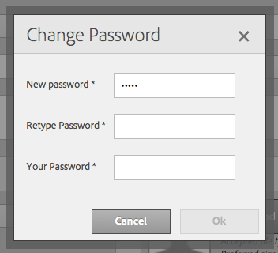

# Graniet-bewerkingen - Beheer van gebruikers en groepen{#granite-operations-user-and-group-administration}

Omdat Granite de implementatie van de JCR API-specificatie in de CRX Repository integreert, heeft het een eigen gebruikers- en groepsbeheer.

Deze accounts vormen de onderliggende basis van de [AEM accounts](/help/sites-administering/security.md) en eventuele wijzigingen in de account die met het beheer van granite zijn doorgevoerd, worden weergegeven als/wanneer de accounts worden geopend via de [AEM gebruikersconsole](/help/sites-administering/security.md#accessing-user-administration-with-the-security-console) (bijvoorbeeld `http://localhost:4502/useradmin`). Vanuit de AEM gebruikersconsole kunt u ook de rechten en andere AEM beheren.

De granietgebruiker en de groepsbeheerconsoles zijn allebei beschikbaar bij **[Tools](/help/sites-administering/tools-consoles.md)** console van touch-geoptimaliseerde UI:

Als u **Gebruikers** of **Groepen** kiest in de gereedschapsconsole, wordt de juiste console geopend. In beide gevallen kunt u actie ondernemen met het selectievakje en vervolgens met handelingen vanaf de werkbalk, of door de accountgegevens te openen via de koppeling onder **Naam**.

* [Gebruikersbeheer](#user-administration)

   

   De **Users** consolelijsten:

   * de gebruikersnaam
   * de aanmeldnaam van de gebruiker (accountnaam)
   * elke titel die de rekening heeft

* [Groepsbeheer](#group-administration)

   

   De **Groepen** consolelijsten:

   * de groepsnaam
   * de groepsbeschrijving
   * het aantal gebruikers/groepen in de groep

## Gebruikersbeheer {#user-administration}

### Een nieuwe gebruiker toevoegen {#adding-a-new-user}

1. Gebruik het pictogram **Gebruiker toevoegen**:

   

1. Het formulier **Gebruiker maken** wordt geopend:

   

   Hier kunt u de gebruikersgegevens voor de account invoeren (de meeste zijn standaard en zonder uitleg):

   * **ID**

      Dit is de unieke identificatie voor de gebruikersaccount. Het is verplicht en mag geen spaties bevatten.

   * **E-mailadres**
   * **Wachtwoord**

      Een wachtwoord is verplicht.

   * **Wachtwoord opnieuw invoeren**

      Dit is verplicht omdat dit vereist is voor bevestiging van het wachtwoord.

   * **Voornaam**
   * **Achternaam**
   * **Telefoonnummer**
   * **Functie**
   * **Straat**
   * **Mobiel**
   * **Plaats**
   * **Postcode**
   * **Land**
   * **Staat**
   * **Titel**
   * **Geslacht**
   * **Info**
   * **Accountinstellingen**

      * ****
StatusU kunt de account markeren als 
**** actief of  **inactief**.
   * **Foto**

      Hier kunt u een foto uploaden om als avatar te gebruiken.

      Geaccepteerde bestandstypen: `.jpg .png .tif .gif`

      Voorkeursgrootte: `240x240px`

   * **Gebruiker toevoegen aan groepen**

      Gebruik het keuzemenu Selectie om groepen te selecteren waarvan de gebruiker lid zou moeten zijn. Als deze optie is geselecteerd, gebruikt u **X** op de naam om de selectie op te heffen voordat u het bestand opslaat.

   * **Groepen**

      Een lijst met groepen waarvan de gebruiker momenteel lid is. Gebruik **X** door de naam om te schrappen alvorens te bewaren.

1. Wanneer u het gebruik van de gebruikersaccount hebt gedefinieerd:

   * **Annuleren** om de registratie af te breken.
   * **Opslaan** om de registratie te voltooien. Het maken van de gebruikersaccount wordt bevestigd met een bericht.

### Een bestaande gebruiker {#editing-an-existing-user} bewerken

1. Open de gebruikersdetails van de verbinding onder de gebruikersnaam in de console van Gebruikers.

1. U kunt de details nu uitgeven zoals in [Toevoegend een Nieuwe Gebruiker](#adding-a-new-user).

1. Open de gebruikersdetails van de verbinding onder de gebruikersnaam in de console van Gebruikers.

1. U kunt de details nu uitgeven zoals in [Toevoegend een Nieuwe Gebruiker](#adding-a-new-user).

### Het wachtwoord voor een bestaande gebruiker wijzigen {#changing-the-password-for-an-existing-user}

1. Open de gebruikersdetails van de verbinding onder de gebruikersnaam in de console van Gebruikers.

1. U kunt de details nu uitgeven zoals in [Toevoegend een Nieuwe Gebruiker](#adding-a-new-user). Onder **Accountinstellingen** vindt u een koppeling voor **Wachtwoord wijzigen**.

   

1. Het dialoogvenster **Wachtwoord wijzigen** wordt geopend. Voer het nieuwe wachtwoord en het wachtwoord in en typ het opnieuw. Gebruik **OK** om de wijzigingen te bevestigen.

   

   Een bericht zal bevestigen dat het wachtwoord is veranderd.

### Snelle groepstoewijzing {#quick-group-assignment}

1. Gebruik het klikvakje om één of meerdere gebruikers te markeren.
1. Gebruik het pictogram **Groepen**:

   

   Het keuzemenu Groepsselectie openen:

   

1. In het selectievak kunt u groepen selecteren of deselecteren waartoe de gebruikersaccount behoort.

1. Wanneer u de groepen hebt toegewezen of niet hebt toegewezen, gebruikt u:

   * **De wijzigingen** annuleren
   * **Opslaan** om de wijzigingen te bevestigen

### Bestaande gebruikersgegevens {#deleting-existing-user-details} verwijderen

1. Gebruik het klikvakje om één of meerdere gebruikers te markeren.
1. Gebruik het pictogram **Delete** om de gebruikersdetails te schrappen:

   

1. U wordt gevraagd de verwijdering te bevestigen, dan zal een bericht bevestigen dat de daadwerkelijke schrapping heeft plaatsgevonden.

## Groepsbeheer {#group-administration}

### Een nieuwe groep toevoegen {#adding-a-new-group}

1. Gebruik het pictogram Groep toevoegen:

   

1. Het formulier **Groep maken** wordt geopend:

   

   Hier kunt u de groepdetails invoeren:

   * **ID**

      Dit is een unieke id voor de groep. Dit is verplicht en mag geen spaties bevatten.

   * **Naam**

      Een naam voor de groep; het zal in de console van Groepen worden getoond.

   * **Beschrijving**

      Een beschrijving van de groep.

   * **Leden aan groep toevoegen**

      Gebruik de keuzelijst Selectie om gebruiker(s) te selecteren die u aan de groep wilt toevoegen. Als deze optie is geselecteerd, gebruikt u **X** op de naam om de selectie op te heffen voordat u het bestand opslaat.

   * **Groepsleden**

      Een lijst met gebruikers in de groep. Gebruik **X** door de naam om te schrappen alvorens te bewaren.

1. Wanneer u de groep hebt gedefinieerd, gebruikt u:

   * **Annuleren** om de registratie af te breken.
   * **Opslaan** om de registratie te voltooien. De oprichting van de groep wordt bevestigd met een bericht.

### Een bestaande groep bewerken {#editing-an-existing-group}

1. Heb toegang tot de groepsdetails van de verbinding onder de groepsnaam in de console van Groepen.

1. U kunt de details nu uitgeven en opslaan zoals in [Toevoegend een Nieuwe Groep](#adding-a-new-group).

### Een bestaande groep {#copying-an-existing-group} kopiëren

1. Gebruik het klikvakje om een groep te markeren.
1. Gebruik het pictogram **Kopiëren** om de groepdetails te kopiëren:

   

1. Het formulier **Groepsinstellingen bewerken** wordt geopend.

   De groep-id komt overeen met het origineel, maar wordt voorafgegaan door `Copy of`. U moet dit bewerken omdat de id geen spaties mag bevatten. Alle andere details zullen het zelfde als origineel zijn.

   U kunt de details nu uitgeven en opslaan zoals in [Toevoegend een Nieuwe Groep](#adding-a-new-group).

### Een bestaande groep {#deleting-an-existing-group} verwijderen

1. Gebruik het klikvakje om één of meerdere groepen te markeren.
1. Gebruik het pictogram **Delete** om de groepdetails te schrappen:

   

1. U wordt gevraagd de verwijdering te bevestigen, dan zal een bericht bevestigen dat de daadwerkelijke schrapping heeft plaatsgevonden.

