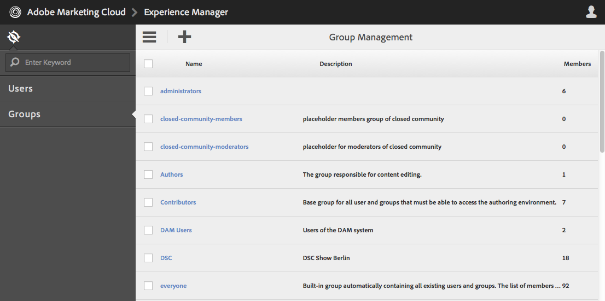

# granietbewerkingen - gebruikers- en groepsbeheer{#granite-operations-user-and-group-administration}

Omdat Granite de implementatie van de JCR API-specificatie in de CRX Repository integreert, heeft het een eigen gebruikers- en groepsbeheer.

Deze rekeningen vormen de onderliggende grondslag van de [AEM](/help/sites-administering/security.md) en eventuele wijzigingen van de rekeningen die met het beheer van Granite zijn aangebracht, worden weergegeven als/wanneer de rekeningen van de [AEM](/help/sites-administering/security.md#accessing-user-administration-with-the-security-console) (bijvoorbeeld `http://localhost:4502/useradmin`). Vanuit de AEM gebruikersconsole kunt u ook de rechten en andere AEM beheren.

De gebruikers- en groepsbeheerconsoles in graniet zijn beide beschikbaar in de **[Gereedschappen](/help/sites-administering/tools-consoles.md)** console van de interface voor geoptimaliseerde aanrakingen:

Kies een van beide **Gebruikers** of **Groepen** vanuit de console van Hulpmiddelen opent de aangewezen console. In beide gevallen kunt u actie ondernemen via het selectievakje en vervolgens via de werkbalk of door de accountgegevens te openen via de koppeling onder **Naam**.

* [Gebruikersbeheer](#user-administration)

  

  De **Gebruikers** consolelijsten:

   * de gebruikersnaam
   * de aanmeldnaam van de gebruiker (accountnaam)
   * elke titel die de rekening heeft

* [Groepsbeheer](#group-administration)

  

  De **Groepen** consolelijsten:

   * de groepsnaam
   * de groepsbeschrijving
   * het aantal gebruikers/groepen in de groep

## Gebruikersbeheer {#user-administration}

### Een nieuwe gebruiker toevoegen {#adding-a-new-user}

1. Gebruik de **Gebruiker toevoegen** pictogram:

   

1. De **Gebruiker maken** formulier wordt geopend:

   

   Hier kunt u de gebruikersgegevens voor de account invoeren (de meeste zijn standaard en zonder uitleg):

   * **ID**

     Dit is de unieke identificatie voor de gebruikersaccount. Het is verplicht en mag geen spaties bevatten.

   * **E-mailadres**
   * **Wachtwoord**

     Een wachtwoord is verplicht.

   * **Wachtwoord opnieuw invoeren**

     Dit is verplicht omdat dit vereist is voor bevestiging van het wachtwoord.

   * **Voornaam**
   * **Achternaam**
   * **Telefoonnummer**
   * **Functie**
   * **Straat**
   * **Mobiel**
   * **Plaats**
   * **Postcode**
   * **Land**
   * **Staat**
   * **Titel**
   * **Geslacht**
   * **Info**
   * **Accountinstellingen**

      * **Status**
U kunt de account markeren als **actief** of **inactief**.

   * **Foto**

     Hier kunt u een foto uploaden om als avatar te gebruiken.

     Geaccepteerde bestandstypen: `.jpg .png .tif .gif`

     Voorkeursgrootte: `240x240px`

   * **Gebruiker toevoegen aan groepen**

     Gebruik het keuzemenu Selectie om groepen te selecteren waarvan de gebruiker lid zou moeten zijn. Als deze optie is geselecteerd, gebruikt u de **X** door de naam die u wilt uitschakelen voordat u het bestand opslaat.

   * **Groepen**

     Een lijst met groepen waarvan de gebruiker momenteel lid is. Gebruik de **X** door de naam die u wilt uitschakelen voordat u het bestand opslaat.

1. Wanneer u het gebruik van de gebruikersaccount hebt gedefinieerd:

   * **Annuleren** om de registratie af te breken.
   * **Opslaan** om de registratie te voltooien. Het maken van de gebruikersaccount wordt bevestigd met een bericht.

### Een bestaande gebruiker bewerken {#editing-an-existing-user}

1. Open de gebruikersdetails van de verbinding onder de gebruikersnaam in de console van Gebruikers.

1. U kunt de gegevens nu op dezelfde manier bewerken als in [Een nieuwe gebruiker toevoegen](#adding-a-new-user).

1. Open de gebruikersdetails van de verbinding onder de gebruikersnaam in de console van Gebruikers.

1. U kunt de gegevens nu op dezelfde manier bewerken als in [Een nieuwe gebruiker toevoegen](#adding-a-new-user).

### Het wachtwoord voor een bestaande gebruiker wijzigen {#changing-the-password-for-an-existing-user}

1. Open de gebruikersdetails van de verbinding onder de gebruikersnaam in de console van Gebruikers.

1. U kunt de gegevens nu op dezelfde manier bewerken als in [Een nieuwe gebruiker toevoegen](#adding-a-new-user). Onder **Accountinstellingen** er is een verband voor **Wachtwoord wijzigen**.

   

1. De **Wachtwoord wijzigen** wordt geopend. Voer het nieuwe wachtwoord en het wachtwoord in en typ het opnieuw. Gebruiken **OK** om de wijzigingen te bevestigen.

   

   Een bericht zal bevestigen dat het wachtwoord is veranderd.

### Snelle groepstoewijzing {#quick-group-assignment}

1. Gebruik het klikvakje om één of meerdere gebruikers te markeren.
1. Gebruik de **Groepen** pictogram:

   

   U opent als volgt de keuzelijst voor groepselectie:

   

1. In het selectievak kunt u groepen selecteren of deselecteren waartoe de gebruikersaccount behoort.

1. Wanneer u de groepen hebt toegewezen of niet hebt toegewezen, gebruikt u:

   * **Annuleren** om de wijzigingen af te breken
   * **Opslaan** ter bevestiging van de wijzigingen

### Bestaande gebruikersgegevens verwijderen {#deleting-existing-user-details}

1. Gebruik het klikvakje om één of meerdere gebruikers te markeren.
1. Gebruik de **Verwijderen** pictogram om de gebruikersgegevens te verwijderen:

   

1. U wordt gevraagd de verwijdering te bevestigen, dan zal een bericht bevestigen dat de daadwerkelijke schrapping heeft plaatsgevonden.

## Groepsbeheer {#group-administration}

### Een nieuwe groep toevoegen {#adding-a-new-group}

1. Gebruik het pictogram Groep toevoegen:

   

1. De **Groep maken** formulier wordt geopend:

   

   Hier kunt u de groepdetails invoeren:

   * **ID**

     Dit is een unieke id voor de groep. Dit is verplicht en mag geen spaties bevatten.

   * **Naam**

     Een naam voor de groep; het wordt getoond in de console van Groepen.

   * **Beschrijving**

     Een beschrijving van de groep.

   * **Leden aan groep toevoegen**

     Gebruik de keuzelijst Selectie om gebruiker(s) te selecteren die u aan de groep wilt toevoegen. Als deze optie is geselecteerd, gebruikt u de **X** door de naam die u wilt uitschakelen voordat u het bestand opslaat.

   * **Groepsleden**

     Een lijst met gebruikers in de groep. Gebruik de **X** door de naam die u wilt uitschakelen voordat u het bestand opslaat.

1. Wanneer u de groep hebt gedefinieerd, gebruikt u:

   * **Annuleren** om de registratie af te breken.
   * **Opslaan** om de registratie te voltooien. De oprichting van de groep wordt bevestigd met een bericht.

### Een bestaande groep bewerken {#editing-an-existing-group}

1. Heb toegang tot de groepsdetails van de verbinding onder de groepsnaam in de console van Groepen.

1. U kunt de details nu bewerken en opslaan zoals in [Een nieuwe groep toevoegen](#adding-a-new-group).

### Een bestaande groep kopiëren {#copying-an-existing-group}

1. Gebruik het klikvakje om een groep te markeren.
1. Gebruik de **Kopiëren** pictogram om de groepdetails te kopiëren:

   

1. De **Groepsinstellingen bewerken** formulier wordt geopend.

   De groep-id is hetzelfde als het origineel, maar heeft het voorvoegsel `Copy of`. Bewerk deze id omdat deze geen spaties kan bevatten. Alle andere details zijn het zelfde als origineel.

   U kunt de details nu bewerken en opslaan zoals in [Een nieuwe groep toevoegen](#adding-a-new-group).

### Een bestaande groep verwijderen {#deleting-an-existing-group}

1. Gebruik het klikvakje om één of meerdere groepen te markeren.
1. Gebruik de **Verwijderen** pictogram om de groepdetails te verwijderen:

   

1. U wordt gevraagd de verwijdering te bevestigen, dan zal een bericht bevestigen dat de daadwerkelijke schrapping heeft plaatsgevonden.
