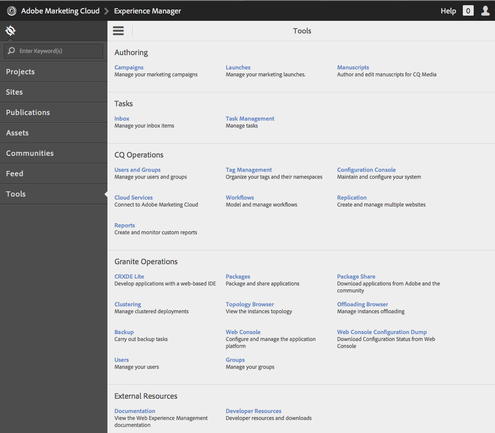

# granietbewerkingen - gebruikers- en groepsbeheer{#granite-operations-user-and-group-administration}

Aangezien Granite de CRX Repository-implementatie van de JCR API-specificatie bevat, heeft het zijn eigen gebruikers- en groepsbeheer.

Deze rekeningen zijn de onderliggende basis van de [ AEM rekeningen ](/help/sites-administering/security.md) en om het even welke die rekeningsveranderingen met het beleid van Granite worden aangebracht zullen worden weerspiegeld als/wanneer de rekeningen van de [ AEM de console van Gebruikers ](/help/sites-administering/security.md#accessing-user-administration-with-the-security-console) (bijvoorbeeld, `http://localhost:4502/useradmin`) worden betreden. Vanuit de AEM gebruikersconsole kunt u ook de rechten en andere AEM beheren.

De gebruiker van graniet en groepsbeleidsconsoles zijn allebei beschikbaar bij de **[console van Hulpmiddelen](/help/sites-administering/tools-consoles.md)** van touch-geoptimaliseerde UI:

Het kiezen van of **Gebruikers** of **Groepen** van de console van Hulpmiddelen opent de aangewezen console. In beide kunt u actie of nemen door klikbox en dan acties van de toolbar te gebruiken, of door de rekeningsdetails via de verbinding onder **Naam** te openen.

* [Gebruikersbeheer](#user-administration)

  

  De **gebruikers** consolelijsten:

   * de gebruikersnaam
   * de aanmeldnaam van de gebruiker (accountnaam)
   * elke titel die de rekening heeft

* [Groepsbeheer](#group-administration)

  

  De **consolelijsten van 0&rbrace; Groepen &lbrace;:**

   * de groepsnaam
   * de groepsbeschrijving
   * het aantal gebruikers/groepen in de groep

## Gebruikersbeheer {#user-administration}

### Een nieuwe gebruiker toevoegen {#adding-a-new-user}

1. Gebruik **voeg Gebruiker** pictogram toe:

    toe

1. De **creeer vorm van de Gebruiker** opent:

   

   Hier kunt u de gebruikersgegevens voor de account invoeren (de meeste zijn standaard en zonder uitleg):

   * **identiteitskaart**

     Dit is de unieke identificatie voor de gebruikersaccount. Het is verplicht en mag geen spaties bevatten.

   * **E-mailadres**
   * **Wachtwoord**

     Een wachtwoord is verplicht.

   * **Wachtwoord van Retype**

     Dit is verplicht omdat dit vereist is voor bevestiging van het wachtwoord.

   * **Voornaam**
   * **Achternaam**
   * **Aantal van de Telefoon**
   * **Titel van de Baan**
   * **Straat**
   * **Mobiel**
   * **Stad**
   * **Postcode**
   * **Land**
   * **Staat**
   * **Titel**
   * **Geslacht**
   * **Ongeveer**
   * **de Montages van de Rekening**

      * **Status**
U kunt de rekening als of **actief** of **inactief** markeren.

   * **Foto**

     Hier kunt u een foto uploaden om als avatar te gebruiken.

     Geaccepteerde bestandstypen: `.jpg .png .tif .gif`

     Voorkeursgrootte: `240x240px`

   * **voeg Gebruiker aan Groepen** toe

     Gebruik het keuzemenu Selectie om groepen te selecteren waarvan de gebruiker lid zou moeten zijn. Zodra geselecteerd, gebruik **X** door de naam om alvorens te schrappen.

   * **Groepen**

     Een lijst met groepen waarvan de gebruiker momenteel lid is. Gebruik **X** door de naam om alvorens te schrappen.

1. Wanneer u het gebruik van de gebruikersaccount hebt gedefinieerd:

   * **annuleert** om de registratie af te breken.
   * **sparen** om de registratie te voltooien. Het maken van de gebruikersaccount wordt bevestigd met een bericht.

### Een bestaande gebruiker bewerken {#editing-an-existing-user}

1. Open de gebruikersdetails van de verbinding onder de gebruikersnaam in de console van Gebruikers.

1. U kunt de details nu uitgeven zoals in [ Toevoegend een Nieuwe Gebruiker ](#adding-a-new-user).

1. Open de gebruikersdetails van de verbinding onder de gebruikersnaam in de console van Gebruikers.

1. U kunt de details nu uitgeven zoals in [ Toevoegend een Nieuwe Gebruiker ](#adding-a-new-user).

### Het wachtwoord voor een bestaande gebruiker wijzigen {#changing-the-password-for-an-existing-user}

1. Open de gebruikersdetails van de verbinding onder de gebruikersnaam in de console van Gebruikers.

1. U kunt de details nu uitgeven zoals in [ Toevoegend een Nieuwe Gebruiker ](#adding-a-new-user). Onder **de Montages van de Rekening** is er een verbinding voor **Wachtwoord van de Verandering**.

   

1. Het **dialoogvenster van het Wachtwoord van de Verandering 0&rbrace; opent.** Voer het nieuwe wachtwoord en het wachtwoord in en typ het opnieuw. Gebruik **O.K.** om de veranderingen te bevestigen.

   

   Een bericht zal bevestigen dat het wachtwoord is veranderd.

### Snelle groepstoewijzing {#quick-group-assignment}

1. Gebruik het klikvakje om één of meerdere gebruikers te markeren.
1. Gebruik het **pictogram van Groepen**:

   

   U opent als volgt de keuzelijst voor groepselectie:

   

1. In het selectievak kunt u groepen selecteren of deselecteren waartoe de gebruikersaccount behoort.

1. Wanneer u de groepen hebt toegewezen of niet hebt toegewezen, gebruikt u:

   * **annuleert** om de veranderingen af te breken
   * **sparen** om de veranderingen te bevestigen

### Bestaande gebruikersgegevens verwijderen {#deleting-existing-user-details}

1. Gebruik het klikvakje om één of meerdere gebruikers te markeren.
1. Gebruik het **pictogram van de Schrapping** om de gebruikersdetails te schrappen:

   

1. U wordt gevraagd de verwijdering te bevestigen, dan zal een bericht bevestigen dat de daadwerkelijke schrapping heeft plaatsgevonden.

## Groepsbeheer {#group-administration}

### Een nieuwe groep toevoegen {#adding-a-new-group}

1. Gebruik het pictogram Groep toevoegen:

    toe

1. **creeer de vorm van de Groep** opent:

   

   Hier kunt u de groepdetails invoeren:

   * **identiteitskaart**

     Dit is een unieke id voor de groep. Dit is verplicht en mag geen spaties bevatten.

   * **Naam**

     Een naam voor de groep; het wordt getoond in de console van Groepen.

   * **Beschrijving**

     Een beschrijving van de groep.

   * **voegt Leden aan Groep** toe

     Gebruik de keuzelijst Selectie om gebruiker(s) te selecteren die u aan de groep wilt toevoegen. Zodra geselecteerd, gebruik **X** door de naam om alvorens te schrappen.

   * **Leden van de Groep**

     Een lijst met gebruikers in de groep. Gebruik **X** door de naam om alvorens te schrappen.

1. Wanneer u de groep hebt gedefinieerd, gebruikt u:

   * **annuleert** om de registratie af te breken.
   * **sparen** om de registratie te voltooien. De oprichting van de groep wordt bevestigd met een bericht.

### Een bestaande groep bewerken {#editing-an-existing-group}

1. Heb toegang tot de groepsdetails van de verbinding onder de groepsnaam in de console van Groepen.

1. U kunt de details nu uitgeven en opslaan zoals in [ Toevoegend een Nieuwe Groep ](#adding-a-new-group).

### Een bestaande groep kopiëren {#copying-an-existing-group}

1. Gebruik het klikvakje om een groep te markeren.
1. Gebruik het **pictogram van het Exemplaar** om de groepsdetails te kopiëren:

   

1. De **geeft de Montages van de Groep** vorm uit zal worden geopend.

   De groep-id is hetzelfde als het origineel, maar heeft het voorvoegsel `Copy of` . Bewerk deze id omdat deze geen spaties kan bevatten. Alle andere details zijn het zelfde als origineel.

   U kunt de details nu uitgeven en opslaan zoals in [ Toevoegend een Nieuwe Groep ](#adding-a-new-group).

### Een bestaande groep verwijderen {#deleting-an-existing-group}

1. Gebruik het klikvakje om één of meerdere groepen te markeren.
1. Gebruik het **pictogram van de Schrapping** om de groepsdetails te schrappen:

   

1. U wordt gevraagd de verwijdering te bevestigen, dan zal een bericht bevestigen dat de daadwerkelijke schrapping heeft plaatsgevonden.
