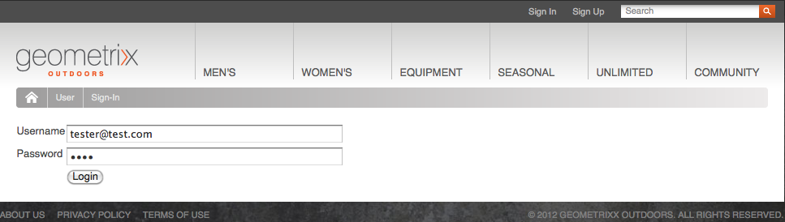
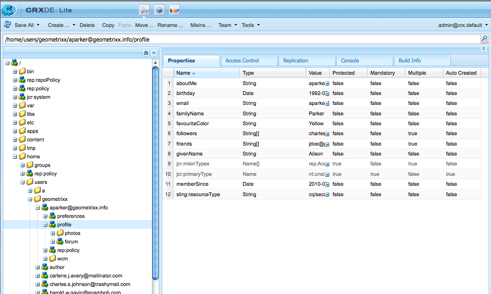

# Identity Management{#identity-management}

Individuele bezoekers van uw website kunnen alleen worden geïdentificeerd wanneer u hun de mogelijkheid biedt zich aan te melden. Er zijn verschillende redenen waarom u een aanmeldingsfunctie wilt opgeven:

* [&#x200B; de bezoekers van de Plaats van AEM Communities &#x200B;](/help/communities/overview.md) worden vereist om binnen aan post inhoud aan de gemeenschap te ondertekenen.
* [Gesloten gebruikersgroepen](/help/sites-administering/cug.md)

  Mogelijk moet u de toegang tot uw website (of gedeelten ervan) beperken tot specifieke bezoekers.

* [&#x200B; Personalization &#x200B;](/help/sites-administering/personalization.md) Toestaan bezoekers om bepaalde aspecten van te vormen hoe zij tot uw website toegang hebben.

Login (en uit) functionaliteit wordt verstrekt door een [&#x200B; rekening met a **Profiel**](#profiles-and-user-accounts), dat extra informatie over de geregistreerde bezoeker (gebruiker) houdt. De eigenlijke registratie- en vergunningsprocedures kunnen verschillen:

* Zelfregistratie vanaf de website

  A [&#x200B; Communautaire Plaats &#x200B;](/help/communities/sites-console.md) kan worden gevormd om bezoekers toe te staan om zich te registreren of login met hun rekeningen van Facebook of van de Twitter.

* Registratieverzoek van de website

  Voor een gesloten gebruikersgroep kunt u bezoekers toestaan om registratie aan te vragen, maar u kunt toestemming afdwingen door middel van een workflow.

* Registreer elk account in de auteursomgeving

  Als u een klein aantal profielen hebt, waarvoor toch toestemming nodig is, kunt u besluiten om elk profiel rechtstreeks te registreren.

Om bezoekers in staat te stellen zich te registreren, kan een reeks componenten en formulieren worden gebruikt om de vereiste identificatiegegevens te verzamelen, dan de extra (vaak facultatieve) profielinformatie. Nadat zij zich hebben geregistreerd, moeten zij ook de gegevens die zij hebben ingediend, kunnen controleren en bijwerken.

Aanvullende functionaliteit kan worden geconfigureerd of ontwikkeld:

* Vorm om het even welke omgekeerde replicatie die wordt vereist.
* Gebruikers toestaan hun profiel te verwijderen door samen met een workflow een formulier te ontwikkelen.

>[!NOTE]
>
>De informatie die in het profiel wordt gespecificeerd kan ook worden gebruikt om de gebruiker van gerichte inhoud via [&#x200B; Segmenten &#x200B;](/help/sites-administering/campaign-segmentation.md) en [&#x200B; Campagnes &#x200B;](/help/sites-classic-ui-authoring/classic-personalization-campaigns.md) te voorzien.

## Registratie Forms {#registration-forms}

A [&#x200B; vorm &#x200B;](/help/sites-authoring/default-components.md#form-component) kan worden gebruikt om de registratieinformatie te verzamelen, dan de nieuwe rekening en het profiel te produceren.

Gebruikers kunnen bijvoorbeeld een nieuw profiel aanvragen met de pagina Geometrixx
`http://localhost:4502/content/geometrixx-outdoors/en/user/register.html`


Na het verzenden van de aanvraag wordt de profielpagina geopend waar de gebruiker persoonlijke gegevens kan opgeven.


De nieuwe rekening is ook zichtbaar in de [&#x200B; console van Gebruikers &#x200B;](/help/sites-administering/security.md).

## Aanmelden {#login}

De login component kan worden gebruikt om de login informatie te verzamelen, dan het login proces te activeren.

Dit voorziet de bezoeker van de standaardgebieden van **Gebruikersnaam** en **Wachtwoord**, van a **Login** knoop om het login proces te activeren wanneer de geloofsbrieven zijn ingegaan.

Bijvoorbeeld, kunnen de gebruikers of login, of een rekening tot stand brengen, gebruikend het **Teken binnen** optie op de toolbar van de Geometrixx, die de pagina gebruikt:

`http://localhost:4502/content/geometrixx-outdoors/en/user/sign-in.html`



## Afmelden {#logging-out}

Aangezien er een login mechanisme is, wordt een logout mechanisme ook vereist. Dit is beschikbaar als **Teken uit** optie in Geometrixx.

## Een profiel weergeven en bijwerken {#viewing-and-updating-a-profile}

Afhankelijk van uw registratieformulier kan de bezoeker gegevens in zijn profiel hebben geregistreerd. Zij moeten dit in een later stadium kunnen bekijken en/of bijwerken. Dit kan met een gelijkaardige vorm worden gedaan; bijvoorbeeld in Geometrixx:

```
http://localhost:4502/content/geometrixx-outdoors/en/user/profile.html
```

Om de details van uw profiel te zien klik **Mijn Profiel** in de hoogste juiste hoek van om het even welke pagina; bijvoorbeeld, met de `admin` rekening:
`http://localhost:4502/home/users/a/admin/profile.form.html/content/geometrixx-outdoors/en/user/profile.html.`

U kunt een ander profiel bekijken gebruikend de [&#x200B; cliëntcontext &#x200B;](/help/sites-administering/client-context.md) (op het auteursmilieu en met voldoende voorrechten):

1. Open een pagina, bijvoorbeeld de pagina Geometrixx:

   `http://localhost:4502/cf#/content/geometrixx/en.html`

1. Klik **Mijn Profiel** in de hoogste juiste hoek. U ziet het profiel van uw huidige account, bijvoorbeeld de beheerder.
1. Pers **controle-alt-C** om de cliëntcontext te openen.
1. In hoogste linkerhoek van de cliëntcontext, klik **Laad een knoop van het Profiel**.

   

1. Selecteer een ander profiel van de drop-down lijst in het dialoogvenster; bijvoorbeeld, **de Parker van de Verrichting**.
1. Klik **OK**.
1. Klik opnieuw op **Mijn Profiel**. Het formulier wordt bijgewerkt met de gegevens van Alison.

   

1. U kunt **gebruiken uitgeeft Profiel** of **Wachtwoord van de Verandering** nu om de details bij te werken.

## Velden toevoegen aan de profieldefinitie {#adding-fields-to-the-profile-definition}

U kunt velden toevoegen aan de profieldefinitie. Als u bijvoorbeeld een veld Favoriete kleur wilt toevoegen aan het profiel Geometrixx:

1. Navigeer vanuit de websiteconsole naar Geometrixx Outdoors Site > Engels > Gebruiker > Mijn profiel.
1. Dubbelklik de **Mijn pagina van het Profiel** om het voor het uitgeven te openen.
1. In het **lusje van Componenten** van sidekick breidt de **sectie van de Vorm** uit.
1. Sleep a **Dropdown Lijst** van sidekick aan de vorm, enkel onder **Ongeveer me** gebied.
1. Dubbelklik de **component van de Lijst 0&rbrace; Dropdown &lbrace;om de dialoog voor configuratie te openen en binnen te gaan:**

   * **Naam van het Element** - `favoriteColor`
   * **Titel** - `Favorite Color`
   * **Punten** - voeg verscheidene kleuren als punten toe

   Klik **O.K.** om te bewaren.

1. Sluit de pagina en terugkeer aan de **console Websites** en activeer de Mijn pagina van het Profiel.

   De volgende keer dat u een profiel weergeeft, kunt u een favoriete kleur selecteren:

   

   Het gebied zal onder de **profiel** sectie van de relevante gebruikersrekening worden bewaard:

   {de gegevens van de Parker van 0} Verbinding in CRXDE 

## Profielstatussen {#profile-states}

Er zijn verscheidene gebruiksgevallen die het weten vereisen of een gebruiker (of eerder hun profiel) in a *specifieke staat* of niet is.

Dit betekent dat een geschikte eigenschap in het gebruikersprofiel moet worden gedefinieerd:

* is zichtbaar en toegankelijk voor de gebruiker
* definieert twee statussen voor elke eigenschap
* Hiermee kunt u schakelen tussen de twee gedefinieerde statussen

Dit wordt gedaan met:

* [Providers](#state-providers)

  De twee statussen van een specifieke eigenschap en de overgangen tussen beide beheren.

* [Workflows](#workflows)

  Handelingen met betrekking tot de staten beheren.

U kunt meerdere statussen definiëren, bijvoorbeeld in Geometrixx:

* zich abonneren (of het afmelden) op berichten op nieuwsbrieven of commentaardraden
* toevoegen en verwijderen van een verbinding met een vriend

### Providers {#state-providers}

Een staatsleverancier beheert de huidige status van het betrokken eigendom, samen met de overgangen tussen de twee mogelijke statussen.

De leveranciers van de staat worden uitgevoerd als componenten, zodat kan voor uw project worden aangepast. In de Geometrixx omvatten deze:

* Onderwerp gebruikersforum/abonneeforum
* Vriend toevoegen/verwijderen

### Workflows {#workflows}

De leveranciers van de staat leiden een profielbezit en zijn staten.

Er is een workflow nodig om de acties met betrekking tot de staten uit te voeren. Wanneer u bijvoorbeeld een abonnement neemt op meldingen, wordt in de workflow de actie voor het feitelijke abonnement afgehandeld. Wanneer u zich niet meer abonneert op meldingen, wordt in de workflow het verwijderen van de gebruiker uit de abonnementenlijst afgehandeld.

## Profielen en gebruikersaccounts {#profiles-and-user-accounts}

De profielen worden opgeslagen in de Inhoudsplaats als deel van [&#x200B; gebruikersrekening &#x200B;](/help/sites-administering/user-group-ac-admin.md).

Het profiel is te vinden onder `/home/users/geometrixx` :

 worden gezien

Bij een standaardinstallatie (auteur of publicatie) heeft iedereen toegang tot de volledige profielgegevens van alle gebruikers. iedereen is a &quot;*Ingebouwde groep die automatisch alle bestaande gebruikers en groepen bevat. De lijst van leden kan niet worden uitgegeven*&quot;.

Deze toegangsrechten worden bepaald door volgende vervangingsACL:

/home: iedereen kan jcr:read rep:glob = &#42;/profile&#42;

Dat maakt het mogelijk:

* forum, opmerkingen of blogberichten om informatie (zoals pictogram of volledige naam) weer te geven vanuit het juiste profiel
* koppelingen naar geometrixe profielpagina&#39;s

Als deze toegang niet geschikt is voor uw installatie, kunt u deze standaardinstellingen wijzigen.

Dit kan worden gedaan gebruikend het **[Controle van de Toegang](/help/sites-administering/user-group-ac-admin.md#access-right-management)** lusje:


## Profielcomponenten {#profile-components}

Er is ook een reeks profielcomponenten beschikbaar waarmee u de profielvereisten voor uw site kunt definiëren.

### Veld voor gecontroleerd wachtwoord {#checked-password-field}

Deze component bevat twee velden voor:

* de invoer van een wachtwoord
* een controle om te bevestigen dat het wachtwoord correct is ingevoerd.

Met standaardinstellingen wordt de component als volgt weergegeven:


### Profiel Avatar Photo {#profile-avatar-photo}

Deze component biedt de gebruiker een mechanisme voor het selecteren en uploaden van een Avatar Photo-bestand.


### Gedetailleerde naam profiel {#profile-detailed-name}

Met deze component kan de gebruiker een gedetailleerde naam invoeren.


### Profiel Geslacht {#profile-gender}

Met deze component kan de gebruiker zijn geslacht invoeren.


