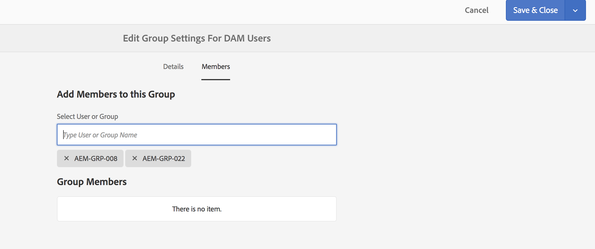

# Adobe IMS-verificatie en [!DNL Admin Console]-ondersteuning voor AEM Managed Services {#adobe-ims-authentication-and-admin-console-support-for-aem-managed-services}

>[!NOTE]
>
>Deze functie is alleen beschikbaar voor klanten van Adobe Managed Services.

## Inleiding {#introduction}

AEM 6.4.3.0 introduceert [!DNL Admin Console] steun voor AEM instanties en Adobe IMS (het Systeem van Identity Management) gebaseerde authentificatie voor **AEM klanten Managed Services**.

AEM aan het instappen aan [!DNL Admin Console] zal AEM klanten van Managed Services toestaan om alle Experience Cloud gebruikers in één console te beheren. Gebruikers en groepen kunnen worden toegewezen aan productprofielen die aan AEM instanties zijn gekoppeld, zodat zij zich kunnen aanmelden bij een specifieke instantie.

## Belangrijkste kenmerken {#key-highlights}

* AEM IMS-verificatieondersteuning is alleen bedoeld voor AEM-auteurs, -beheerders of -ontwikkelaars, niet voor externe eindgebruikers van de site zoals sitebezoekers
* De [!DNL Admin Console] zal AEM klanten van Managed Services als organisaties IMS en hun Instanties als Contexten van het Product vertegenwoordigen. Systeem- en productbeheerders van klanten kunnen de toegang tot instanties beheren
* AEM Managed Services zal de topologieën van de klant met [!DNL Admin Console] synchroniseren. Er zal één geval van AEM Context van het Product van Managed Services per Instantie in [!DNL Admin Console] zijn.
* Productprofielen in [!DNL Admin Console] bepalen welke instanties een gebruiker kan openen
* Federatieve verificatie met behulp van eigen SAML 2-compatibele identiteitsproviders van klanten wordt ondersteund
* Alleen Enterprise- of federatieve id&#39;s (voor Single Sign-On van klant) worden ondersteund, geen persoonlijke Adobe-id&#39;s.
* [!DNL User Management] (in Adobe  [!DNL Admin Console]) blijven eigendom van de beheerders van de klant.

## Architectuur {#architecture}

IMS de Authentificatie werkt door het protocol OAuth tussen AEM en het eindpunt van Adobe IMS te gebruiken. Zodra een gebruiker aan IMS is toegevoegd en een Adobe ID heeft, kan deze zich aanmelden bij AEM Managed Services-instanties met IMS-referenties.

De gebruikerslogin stroom wordt hieronder getoond, zal de gebruiker aan IMS en naar keuze aan klant IDP voor bevestiging van SSO worden opnieuw gericht en dan terug naar AEM.

## {#how-to-set-up} instellen

### Aan boord gaan van organisaties aan [!DNL Admin Console] {#onboarding-organizations-to-admin-console}

De klant die zich aan [!DNL Admin Console] houdt, is een eerste vereiste voor het gebruik van Adobe IMS voor AEM verificatie.

Als eerste stap, zouden de klanten een Organisatie moeten hebben die in Adobe IMS wordt voorzien. Adobe Enterprise-klanten worden vertegenwoordigd als IMS-organisaties in de [Adobe [!DNL Admin Console]](https://helpx.adobe.com/nl/enterprise/using/admin-console.html).

AEM Managed Services-klanten moeten al een organisatie hebben die voorzien is, en als onderdeel van de IMS-provisioning worden de exemplaren van de klant beschikbaar gesteld in [!DNL Admin Console] voor het beheer van gebruikersrechten en toegang.

De overgang naar IMS voor gebruikersverificatie is een gezamenlijke inspanning van AMS en klanten, waarbij elk van hen zijn werkschema&#39;s moet voltooien.

Zodra een klant als IMS Organisatie bestaat en AMS met levering van de klant voor IMS wordt gedaan, is dit de samenvatting van de vereiste configuratiewerkschema&#39;s:

1. De aangewezen Systeembeheerder ontvangt een uitnodiging om zich aan te melden bij [!DNL Admin Console]
1. System Admin eist Domain om de eigendom van het domein te bevestigen (in dit voorbeeld acme.com)
1. Systeembeheer stelt gebruikersmappen in
1. Systeembeheerder configureert de Identiteitsprovider (IDP) in [!DNL Admin Console] voor SSO-installatie.
1. De AEM Admin beheert de lokale groepen, de toestemmingen en de voorrechten zoals gebruikelijk. Zie Synchronisatie van gebruikers en groepen

>[!NOTE]
>
>Zie het artikel [deze pagina](https://helpx.adobe.com/nl/enterprise/using/set-up-identity.html) voor meer informatie over de Adobe Identity Management Basics, inclusief de IDP-configuratie.
>
>Raadpleeg het artikel [deze pagina](https://helpx.adobe.com/nl/enterprise/managing/user-guide.html) voor meer informatie over de Enterprise Administration en [!DNL Admin Console].

### Gebruikers aan boord nemen van [!DNL Admin Console] {#onboarding-users-to-the-admin-console}

Er zijn drie manieren aan boord van gebruikers afhankelijk van de grootte van de klant en hun voorkeur:

1. Handmatig gebruikers en groepen maken in [!DNL Admin Console]
1. Een CSV-bestand met gebruikers uploaden
1. Synchroniseer gebruikers en groepen van de bedrijfs Actieve Folder van de klant.

#### Handmatige toevoeging via [!DNL Admin Console] UI {#manual-addition-through-admin-console-ui}

Gebruikers en groepen kunnen handmatig worden gemaakt in de interface [!DNL Admin Console]. Deze methode kan worden gebruikt als ze niet over een groot aantal gebruikers beschikken om te beheren. Bijvoorbeeld een aantal van minder dan 50 AEM gebruikers.

Gebruikers kunnen ook handmatig worden gemaakt als de klant deze methode al gebruikt voor het beheer van andere Adobe-producten, zoals Analytics-, Target- of Creative Cloud-toepassingen.

#### Bestand uploaden in de [!DNL Admin Console] UI {#file-upload-in-the-admin-console-ui}

Voor een eenvoudige afhandeling van het maken van gebruikers kan een CSV-bestand worden geüpload om gebruikers in bulk toe te voegen:

#### User Sync Tool {#user-sync-tool}

Met het Hulpprogramma voor gebruikerssynchronisatie (UST in het kort) kunnen zakelijke klanten Adobe-gebruikers maken of beheren met Active Directory of andere geteste OpenLDAP-directoryservices. De doelgebruikers zijn de Beheerders van de Identiteit van IT (de Folder van de Onderneming en de Beheerders van het Systeem) die het hulpmiddel zullen kunnen installeren en vormen. Het opensource-programma kan worden aangepast, zodat klanten het kunnen aanpassen aan hun eigen specifieke vereisten.

Wanneer de looppas van de Synchronisatie van de Gebruiker, het een lijst van gebruikers van de Actieve Folder van de organisatie (of een andere compatibele gegevensbron) haalt en het met de lijst van gebruikers binnen [!DNL Admin Console] vergelijkt. Vervolgens wordt de Adobe [!DNL User Management] API aangeroepen, zodat de [!DNL Admin Console] wordt gesynchroniseerd met de directory van de organisatie. De wisselstroom is volledig eenrichtingsverkeer; eventuele bewerkingen in de [!DNL Admin Console] worden niet naar de map uitgeduwd.

Met dit hulpprogramma kan de systeembeheerder gebruikersgroepen in de directory van de klant toewijzen aan productconfiguratie en gebruikersgroepen in de [!DNL Admin Console]. Met de nieuwe UST-versie kunnen ook gebruikersgroepen dynamisch worden gemaakt in de [!DNL Admin Console].

Om Gebruikerssynchronisatie in te stellen, moet de organisatie een set referenties maken op dezelfde manier als de [[!DNL User Management] API](https://www.adobe.io/apis/cloudplatform/usermanagement/docs/setup.html).

De User Sync wordt op deze locatie gedistribueerd via de Adobe Github-repository:

[https://github.com/adobe-apiplatform/user-sync.py/releases/latest](https://github.com/adobe-apiplatform/user-sync.py/releases/latest)

Merk op dat een pre-versieversie 2.4RC1 met de dynamische steun van de groepsverwezenlijking beschikbaar is en hier kan worden gevonden: [https://github.com/adobe-apiplatform/user-sync.py/releases/tag/v2.4rc1](https://github.com/adobe-apiplatform/user-sync.py/releases/tag/v2.4rc1)

De belangrijkste functies voor deze release zijn de mogelijkheid om nieuwe LDAP-groepen dynamisch toe te wijzen voor gebruikerslidmaatschap in de [!DNL Admin Console] en om een dynamische gebruikersgroep te maken.

Meer informatie over de nieuwe groepsfuncties vindt u hier:

[https://github.com/adobe-apiplatform/user-sync.py/blob/v2/docs/en/user-manual/advanced_configuration](https://github.com/adobe-apiplatform/user-sync.py/blob/v2/docs/en/user-manual/advanced_configuration.md#additional-group-options)

>[!NOTE]
>
>Raadpleeg de [documentatiepagina](https://adobe-apiplatform.github.io/user-sync.py/en/) voor meer informatie over het gereedschap Gebruikerssynchronisatie.
>
>
>Het hulpmiddel van de Synchronisatie van de Gebruiker moet als cliëntUMAPI van Adobe I/O registreren gebruikend de beschreven procedure [hier](https://adobe-apiplatform.github.io/umapi-documentation/en/UM_Authentication.html).
>
>De documentatie van de Adobe I/O-console vindt u [hier](https://www.adobe.io/apis/cloudplatform/console.html).
>
>
>De [!DNL User Management] API die door het Hulpmiddel van de Synchronisatie van de Gebruiker wordt gebruikt is behandeld bij deze [plaats](https://www.adobe.io/apis/cloudplatform/umapi-new.html).

>[!NOTE]
>
>De AEM IMS-configuratie wordt afgehandeld door het team van Adobe Managed Services. Nochtans, kan de klantenbeheerder het volgens hun vereisten wijzigen (bijvoorbeeld AutoLidmaatschap van de Groep of de Afbeelding van de Groep). De IMS-client wordt ook geregistreerd door uw Managed Services-team.

## Het gebruik {#how-to-use}

### Producten en gebruikerstoegang beheren in [!DNL Admin Console] {#managing-products-and-user-access-in-admin-console}

Als de productbeheerder van de klant zich aanmeldt bij [!DNL Admin Console], worden meerdere exemplaren van de AEM Managed Services-productcontext weergegeven, zoals hieronder wordt getoond:

In dit voorbeeld heeft de org *AEM-MS-Onboard* 32 instanties die verschillende topologieën en omgevingen omspannen, zoals het werkgebied, Prod, enz.

De instantiedetails kunnen worden gecontroleerd om de instantie te identificeren:

Onder elke instantie van de Context van het Product, zal er een bijbehorend Profiel van het Product zijn. Dit productprofiel wordt gebruikt voor het toewijzen van toegang aan gebruikers en groepen.

Gebruikers en groepen die zijn toegevoegd onder dit productprofiel, kunnen zich aanmelden bij die instantie, zoals in het onderstaande voorbeeld wordt getoond:

### Aanmelden bij AEM {#logging-into-aem}

#### Aanmelden bij lokale beheerder {#local-admin-login}

AEM kunnen lokale aanmeldingen voor Admin-gebruikers blijven ondersteunen, aangezien het aanmeldingsscherm een optie heeft om zich lokaal aan te melden:

#### Op IMS gebaseerde aanmelding {#ims-based-login}

Voor andere gebruikers kan de op IMS gebaseerde aanmelding worden gebruikt zodra IMS in de instantie is geconfigureerd. De gebruiker zal eerst op **Teken binnen met Adobe** knoop zoals hieronder getoond klikken:

Vervolgens worden ze omgeleid naar het IMS-aanmeldingsscherm en voeren ze hun referenties in:

Als een gefedereerde IDP tijdens aanvankelijke [!DNL Admin Console] opstelling wordt gevormd, dan zal de gebruiker aan klant IDP voor SSO worden opnieuw gericht.

IDP is Okta in het volgende voorbeeld:

Nadat de verificatie is voltooid, wordt de gebruiker teruggeleid naar AEM en aangemeld:

### Bestaande gebruikers {#migrating-existing-users} migreren

Voor bestaande AEM instanties die een andere verificatiemethode gebruiken en nu naar IMS worden gemigreerd, moet er een migratiestap zijn.

Bestaande gebruikers in de AEM opslagplaats (lokaal, via LDAP of SAML) kunnen worden gemigreerd om naar IMS te verwijzen als de IDP met behulp van het Hulpprogramma voor gebruikersmigratie.

Dit hulpprogramma wordt door uw AMS-team uitgevoerd als onderdeel van IMS-provisioning.

### Bevoegdheden en ACL&#39;s beheren in AEM {#managing-permissions-and-acls-in-aem}

Toegangsbeheer en toegangsrechten blijven in AEM worden beheerd, dit kan worden bereikt door scheiding van Gebruikersgroepen die afkomstig zijn van IMS (bijvoorbeeld AEM-GRP-008 in het onderstaande voorbeeld) en lokale groepen waar de machtigingen en toegangsbeheer zijn gedefinieerd. De gebruikersgroepen die van IMS worden gesynchroniseerd kunnen aan lokale groepen worden toegewezen en de toestemmingen erven.

In het onderstaande voorbeeld voegen we gesynchroniseerde groepen toe aan de lokale *Dam_Users*-groep.

Hier, is een gebruiker ook toegewezen aan een paar groepen in [!DNL Admin Console]. (Houd er rekening mee dat de gebruikers en groepen kunnen worden gesynchroniseerd via LDAP met het gereedschap voor gebruikerssynchronisatie of lokaal kunnen worden gemaakt. Zie de sectie **Gebruikers aan boord nemen op[!DNL Admin Console]** hierboven).

&amp;ast;Merk op dat gebruikersgroepen slechts gesynchroniseerd worden wanneer de gebruikers aan de instantie, voor klanten die een groot aantal gebruikers en groepen hebben, een nut van de Synchronisatie van de Groep kan door AMS worden in werking gesteld om groepen voor toegangsbeheer en toestemmingenbeheer vooraf te halen zoals hierboven beschreven.

De gebruiker maakt deel uit van de volgende groepen in IMS:

Wanneer de gebruiker zich aanmeldt, worden diens groepslidmaatschappen gesynchroniseerd zoals hieronder weergegeven:

AEM kunnen de gebruikersgroepen die via IMS zijn gesynchroniseerd, als leden worden toegevoegd aan bestaande lokale groepen, bijvoorbeeld DAM-gebruikers.

Zoals hieronder getoond, erft de groep *AEM-GRP_008* de Toestemmingen en Bevoegdheden van Gebruikers DAM. Dit is een effectieve manier om machtigingen voor gesynchroniseerde groepen te beheren en wordt ook veel gebruikt in LDAP-gebaseerde verificatiemethoden.

