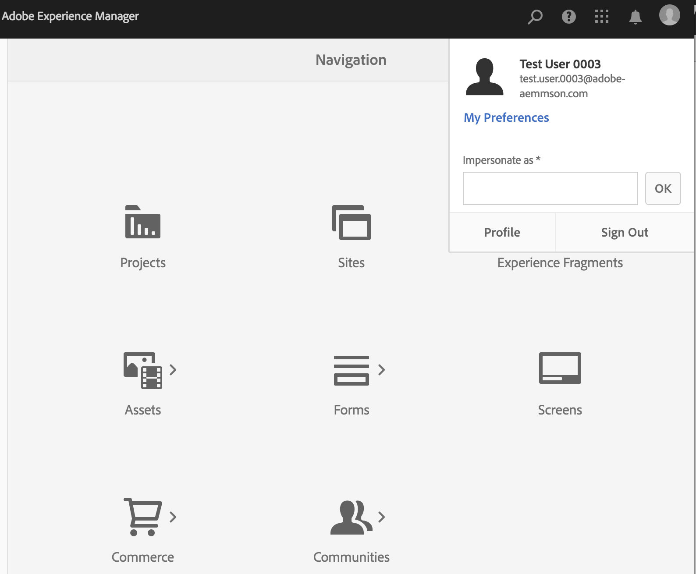

# Ondersteuning voor verificatie en beheerconsole van Adobe IMS voor door AEM beheerde services {#adobe-ims-authentication-and-admin-console-support-for-aem-managed-services}

>[!NOTE]
>
>Deze functie is alleen beschikbaar voor klanten van Adobe Managed Services.

## Inleiding {#introduction}

AEM 6.4.3.0 introduceert ondersteuning voor beheerconsole voor AEM-instanties en verificatie op basis van Adobe IMS (Identity Management System) voor klanten van **AEM Managed Services** .

Met AEM-toegang tot de beheerconsole kunnen klanten van AEM Managed Services alle gebruikers van Experience Cloud in één console beheren. Gebruikers en groepen kunnen worden toegewezen aan productprofielen die aan AEM-instanties zijn gekoppeld, zodat zij zich kunnen aanmelden bij een specifieke instantie.

## Belangrijkste hooglichten {#key-highlights}

* AEM IMS-verificatieondersteuning is alleen bedoeld voor AEM-auteurs, -beheerders of -ontwikkelaars, niet voor externe eindgebruikers van de site van de klant, zoals sitebezoekers
* In de beheerconsole worden klanten van door AEM beheerde services weergegeven als IMS-organisaties en hun instanties als productcontexten. Systeem- en productbeheerders van klanten kunnen de toegang tot instanties beheren
* Met AEM Managed Services worden klanttopologieën gesynchroniseerd met de beheerconsole. In de beheerconsole wordt per instantie één exemplaar van de productcontext van AEM Managed Services weergegeven.
* Productprofielen in Admin Console bepalen welke instanties een gebruiker kan openen
* Federatieve verificatie met behulp van eigen SAML 2-compatibele identiteitsproviders van klanten wordt ondersteund
* Alleen Enterprise- of federatieve id&#39;s (voor Single Sign-On van klant) worden ondersteund, niet persoonlijke Adobe-id&#39;s.
* Gebruikersbeheer (in Adobe Admin Console) blijft eigendom van de beheerders van de klant.

## Architectuur {#architecture}

IMS-verificatie werkt met behulp van het OAuth-protocol tussen AEM en het Adobe IMS-eindpunt. Nadat een gebruiker aan IMS is toegevoegd en over een Adobe-id beschikt, kunnen deze zich aanmelden bij instanties van AEM Managed Services met IMS-referenties.

De gebruikerslogin stroom wordt hieronder getoond, zal de gebruiker aan IMS en facultatief aan klant IDP voor bevestiging van SSO worden opnieuw gericht en dan terug naar AEM.

## Instellen {#how-to-set-up}

### Organisaties aan boord nemen naar beheerconsole {#onboarding-organizations-to-admin-console}

De klant die aan de beheerconsole deelneemt, is een vereiste voor het gebruik van Adobe IMS voor AEM-verificatie.

Als eerste stap moeten klanten beschikken over een organisatie die is ingericht in Adobe IMS. Adobe Enterprise-klanten worden vertegenwoordigd als IMS-organisaties in de [Adobe Admin Console](https://helpx.adobe.com/enterprise/using/admin-console.html).

Klanten met beheerde services van AEM moeten al beschikken over een organisatie en als onderdeel van de IMS-provisioning worden de exemplaren van de klant beschikbaar gesteld in de beheerconsole voor het beheer van gebruikersrechten en toegang.

De overgang naar IMS voor gebruikersverificatie is een gezamenlijke inspanning van AMS en klanten, waarbij elk van hen zijn werkschema&#39;s moet voltooien.

Zodra een klant als IMS Organisatie bestaat en AMS met levering van de klant voor IMS wordt gedaan, is dit de samenvatting van de vereiste configuratiewerkschema&#39;s:

1. De aangewezen systeembeheerder ontvangt een uitnodiging om zich aan te melden bij de beheerconsole
1. System Admin beweert Domain om de eigendom van het domein te bevestigen (in dit voorbeeld acme.com)
1. Systeembeheer stelt gebruikersmappen in
1. Systeembeheerder configureert de Identiteitsprovider (IDP) in de beheerconsole voor SSO-installatie.
1. De AEM-beheerder beheert de lokale groepen, machtigingen en bevoegdheden op de gebruikelijke wijze. Zie Synchronisatie van gebruikers en groepen

>[!NOTE]
>
>Zie het artikel [deze pagina voor meer informatie over de basisbeginselen van Adobe Identity Management, inclusief de IDP-configuratie.](https://helpx.adobe.com/enterprise/using/set-up-identity.html)
>
>Raadpleeg het artikel [op deze pagina](https://helpx.adobe.com/enterprise/managing/user-guide.html)voor meer informatie over de Enterprise Administration en de Admin Console.

### Gebruikers aan boord nemen in de beheerconsole {#onboarding-users-to-the-admin-console}

Er zijn drie manieren aan boord van gebruikers afhankelijk van de grootte van de klant en hun voorkeur:

1. Handmatig gebruikers en groepen maken in Admin Console
1. Een CSV-bestand met gebruikers uploaden
1. Synchroniseer gebruikers en groepen van de bedrijfs Actieve Folder van de klant.

#### Handmatige toevoeging via de interface van de beheerconsole {#manual-addition-through-admin-console-ui}

Gebruikers en groepen kunnen handmatig worden gemaakt in de interface van de beheerconsole. Deze methode kan worden gebruikt als ze niet over een groot aantal gebruikers beschikken om te beheren. Bijvoorbeeld een aantal van minder dan 50 AEM-gebruikers.

Gebruikers kunnen ook handmatig worden gemaakt als de klant deze methode al gebruikt voor het beheer van andere Adobe-producten, zoals Analytics, Target of Creative Cloud.

#### Bestand uploaden in de interface van de beheerconsole {#file-upload-in-the-admin-console-ui}

Voor een eenvoudige afhandeling van het maken van gebruikers kan een CSV-bestand worden geüpload om gebruikers in bulk toe te voegen:

#### Gereedschap Gebruikerssynchronisatie {#user-sync-tool}

Met het hulpprogramma voor gebruikerssynchronisatie (UST in het kort) kunnen zakelijke klanten Adobe-gebruikers maken of beheren met Active Directory of andere geteste OpenLDAP-directoryservices. De doelgebruikers zijn de Beheerders van de Identiteit van IT (de Folder van de Onderneming en de Beheerders van het Systeem) die het hulpmiddel zullen kunnen installeren en vormen. Het opensource-programma kan worden aangepast, zodat klanten het kunnen aanpassen aan hun eigen specifieke vereisten.

Wanneer de looppas van de Synchronisatie van de Gebruiker, het een lijst van gebruikers van de Actieve Folder van de organisatie (of een andere compatibele gegevensbron) haalt en het vergelijkt met de lijst van gebruikers binnen de Console Admin. Vervolgens wordt de Adobe-API voor gebruikersbeheer aangeroepen, zodat de beheerconsole wordt gesynchroniseerd met de directory van de organisatie. De wisselstroom is volledig eenrichtingsverkeer; Eventuele bewerkingen die in de beheerconsole zijn aangebracht, worden niet naar de map doorgestuurd.

Met dit hulpprogramma kan de systeembeheerder gebruikersgroepen in de map van de klant toewijzen aan productconfiguratie en gebruikersgroepen in de beheerconsole. Met de nieuwe UST-versie kunt u ook dynamisch gebruikersgroepen maken in de beheerconsole.

Voor het instellen van Gebruikerssynchronisatie moet de organisatie een set referenties maken op dezelfde manier als voor het gebruik van de [gebruikersbeheerAPI](https://www.adobe.io/apis/cloudplatform/usermanagement/docs/setup.html).

Gebruikerssynchronisatie wordt gedistribueerd via de gegevensopslagruimte van Adobe Github op deze locatie:

[https://github.com/adobe-apiplatform/user-sync.py/releases/latest](https://github.com/adobe-apiplatform/user-sync.py/releases/latest)

Merk op dat een pre-versieversie 2.4RC1 met de dynamische steun van de groepsverwezenlijking beschikbaar is en hier kan worden gevonden: [https://github.com/adobe-apiplatform/user-sync.py/releases/tag/v2.4rc1](https://github.com/adobe-apiplatform/user-sync.py/releases/tag/v2.4rc1)

De belangrijkste functies voor deze release zijn de mogelijkheid om nieuwe LDAP-groepen dynamisch toe te wijzen voor gebruikerslidmaatschap in de beheerconsole en om een dynamische gebruikersgroep te maken.

Meer informatie over de nieuwe groepsfuncties vindt u hier:

[https://github.com/adobe-apiplatform/user-sync.py/blob/v2/docs/en/user-manual/advanced_configuration](https://github.com/adobe-apiplatform/user-sync.py/blob/v2/docs/en/user-manual/advanced_configuration.md#additional-group-options)

>[!NOTE]
>
>Raadpleeg de [documentatiepagina](https://adobe-apiplatform.github.io/user-sync.py/en/)voor meer informatie over het gereedschap Gebruikerssynchronisatie.
>
>
>Het hulpprogramma voor gebruikerssynchronisatie moet zich registreren als een Adobe I/O-client-UMAPI volgens de [hier](https://adobe-apiplatform.github.io/umapi-documentation/en/UM_Authentication.html)beschreven procedure.
>
>De documentatie van de Adobe I/O-console vindt u [hier](https://www.adobe.io/apis/cloudplatform/console.html).
>
>
>De gebruikersbeheer-API die wordt gebruikt door het gereedschap Gebruikerssynchronisatie, wordt op deze [locatie](https://www.adobe.io/apis/cloudplatform/umapi-new.html)behandeld.

>[!NOTE]
>
>De AEM IMS-configuratie wordt afgehandeld door het team van Adobe Managed Services. Nochtans, kan de klantenbeheerder het volgens hun vereisten wijzigen (bijvoorbeeld AutoLidmaatschap van de Groep of de Afbeelding van de Groep). De IMS-client wordt ook geregistreerd door het team voor beheerde services.

## Hoe wordt het gebruikt {#how-to-use}

### Producten en gebruikerstoegang beheren in beheerconsole {#managing-products-and-user-access-in-admin-console}

Wanneer de beheerder van het klantenproduct zich bij Admin Console aanmeldt, zullen zij veelvoudige instanties van de AEM Managed Context van het Product van de Diensten zien zoals hieronder getoond:

In dit voorbeeld heeft de org *AEM-MS-Onboard* 32 instanties die verschillende topologieën en omgevingen zoals het werkgebied, de Prod, enz. bestrijken.

De instantiedetails kunnen worden gecontroleerd om de instantie te identificeren:

Onder elke instantie van de Context van het Product, zal er een bijbehorend Profiel van het Product zijn. Dit productprofiel wordt gebruikt voor het toewijzen van toegang aan gebruikers en groepen.

Gebruikers en groepen die zijn toegevoegd onder dit productprofiel, kunnen zich aanmelden bij die instantie, zoals in het onderstaande voorbeeld wordt getoond:

### Aanmelden bij AEM {#logging-into-aem}

#### Aanmelden bij lokale beheerder {#local-admin-login}

AEM kan lokale aanmeldingen voor Admin-gebruikers blijven ondersteunen, aangezien het aanmeldingsscherm een optie heeft om zich lokaal aan te melden:

#### Op IMS gebaseerde aanmelding {#ims-based-login}

Voor andere gebruikers kan de op IMS gebaseerde aanmelding worden gebruikt zodra IMS op de instantie is geconfigureerd. De gebruiker klikt eerst op de knop **Aanmelden met Adobe** (zie hieronder):

Vervolgens worden ze omgeleid naar het IMS-aanmeldingsscherm en voeren ze hun referenties in:

Als een gefedereerde IDP tijdens aanvankelijke opstelling van de Console Admin wordt gevormd, dan zal de gebruiker aan klant IDP voor SSO worden opnieuw gericht.

IDP is Okta in het volgende voorbeeld:

Nadat de verificatie is voltooid, wordt de gebruiker opnieuw omgeleid naar AEM en aangemeld:

### Bestaande gebruikers migreren {#migrating-existing-users}

Voor bestaande instanties AEM die een andere methode van Authentificatie gebruiken en nu aan IMS worden gemigreerd, moet er een migratiestap zijn.

Bestaande gebruikers in de AEM-opslagplaats (lokaal, via LDAP of SAML) kunnen worden gemigreerd om naar IMS te verwijzen als de IDP met behulp van het User Migration Utility.

Dit hulpprogramma wordt door uw AMS-team uitgevoerd als onderdeel van IMS-provisioning.

### Bevoegdheden en ACL&#39;s beheren in AEM {#managing-permissions-and-acls-in-aem}

Toegangsbeheer en toegangsrechten blijven in AEM worden beheerd, dit kan worden bereikt door scheiding van Gebruikersgroepen die afkomstig zijn van IMS (bijv. AEM-GRP-008 in het onderstaande voorbeeld) en lokale groepen waar de machtigingen en toegangsbeheer zijn gedefinieerd. De gebruikersgroepen die van IMS worden gesynchroniseerd kunnen aan lokale groepen worden toegewezen en de toestemmingen erven.

In het onderstaande voorbeeld voegen we als voorbeeld gesynchroniseerde groepen toe aan de lokale *Dam_Users* -groep.

Hier is een gebruiker ook toegewezen aan een paar groepen in de beheerconsole. (Houd er rekening mee dat gebruikers en groepen kunnen worden gesynchroniseerd via LDAP met het gereedschap voor gebruikerssynchronisatie of lokaal kunnen worden gemaakt. Zie de sectie Gebruikers **aan boord nemen in de beheerconsole** hierboven.)

&amp;ast;Merk op dat gebruikersgroepen slechts gesynchroniseerd worden wanneer de gebruikers aan de instantie, voor klanten die een groot aantal gebruikers en groepen hebben, een nut van de Synchronisatie van de Groep kan door AMS worden in werking gesteld om groepen voor toegangsbeheer en toestemmingenbeheer vooraf te halen zoals hierboven beschreven.

De gebruiker maakt deel uit van de volgende Groepen in IMS:

Wanneer de gebruiker zich aanmeldt, worden hun groepslidmaatschappen gesynchroniseerd, zoals hieronder wordt getoond:

In AEM kunnen de gebruikersgroepen die via IMS zijn gesynchroniseerd, als leden worden toegevoegd aan bestaande lokale groepen, bijvoorbeeld DAM-gebruikers.

Zoals hieronder getoond, erft de groep *AEM-GRP_008* de Toestemmingen en Bevoegdheden van Gebruikers DAM. Dit is een effectieve manier om machtigingen voor gesynchroniseerde groepen te beheren en wordt ook veel gebruikt in LDAP-gebaseerde verificatiemethoden.

