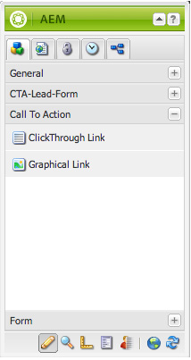

# Landingpagina&#39;s integreren met Adobe Analytics{#integrating-landing-pages-with-adobe-analytics}

AEM heeft de landingspagina-oplossing geïntegreerd met [Adobe Analytics](https://www.omniture.com/en/products/analytics/sitecatalyst) door de volgende vraag-aan-actie (CTA) componenten te gebruiken:

1. Klikken door component
1. Grafische koppelingscomponent

Deze componenten maken bepaalde kenmerken beschikbaar die via Adobe Analytics-variabelen (Verkeer, Conversievariabelen) en succesgebeurtenissen kunnen worden toegewezen om informatie naar Adobe Analytics te verzenden.

## Vereisten {#prerequisites}

Adobe raadt u aan de [bestaande AEM-Adobe Analytics-integratie](/help/sites-administering/adobeanalytics.md) om te begrijpen hoe deze integratie werkt.

## Componenten beschikbaar voor toewijzing {#components-available-for-mapping}

In AEM **Oproep tot actie** componenten - **ClickThroughLink** en **GraphicalLink** - hier in het hulpslot wordt getoond, kan aan variabelen van Adobe Analytics worden in kaart gebracht.

### Onderdelen van bestemmingspagina aan Adobe Analytics toewijzen {#mapping-landing-page-components-to-adobe-analytics}

U kunt landingspaginacomponenten toewijzen aan Adobe Analytics:

1. Nadat u de Adobe Analytics-configuratie hebt gemaakt en een nieuw framework hebt gemaakt, selecteert u de gewenste rapportsuite in het keuzemenu. Hierdoor worden de Adobe Analytics-variabelen opgehaald en weergegeven in de zoekfunctie voor inhoud.
1. De belemmering en laat vallen Vraag aan de componenten van de Actie (CTA) van sidekick in het kaartingsgebied in het midden van de pagina, zoals aangewezen.

<table>
 <tbody>
  <tr>
   <td><strong>Componentnaam</strong></td>
   <td><strong>Kenmerken beschikbaar</strong></td>
   <td><strong>Betekenis van kenmerk</strong></td>
  </tr>
  <tr>
   <td><strong>CTA-klik via koppeling</strong></td>
   <td><i>eventdata.clickLinkLabel</i>   </td>
   <td>Het label op de koppeling of de tekst van de koppeling </td>
  </tr>
  <tr>
   <td>  </td>
   <td><i>eventdata.clickLinkTarget</i>   </td>
   <td>De bestemming waar u wordt genomen wanneer u op de verbinding klikt </td>
  </tr>
  <tr>
   <td>  </td>
   <td><i>eventdata.events.clickthroughLinkClick</i>   </td>
   <td>De gebeurtenis click </td>
  </tr>
  <tr>
   <td><strong>Grafische koppeling CTA</strong></td>
   <td><i>eventdata.clickroughImageLabel</i>   </td>
   <td>De titel van de CTA-afbeelding </td>
  </tr>
  <tr>
   <td>  </td>
   <td><i>eventdata.clickroughImageTarget</i>   </td>
   <td>Het doel waar u naartoe gaat wanneer u klikt op de afbeelding die een koppeling bevat</td>
  </tr>
  <tr>
   <td>  </td>
   <td><i>eventdata.clickroughImageAsset</i>   </td>
   <td>Het pad naar het afbeeldingselement in de repository </td>
  </tr>
  <tr>
   <td>  </td>
   <td><i>eventdata.events.clickStrokeImageClick</i>   </td>
   <td>De gebeurtenis click</td>
  </tr>
 </tbody>
</table>

1. Wijs deze belichte kenmerken toe aan alle Adobe Analytics-variabelen van de zoeker naar inhoud. Het framework is nu gebruiksklaar.
1. U kunt nu een nieuwe bestemmingspagina tot stand brengen of een bestaande landingspagina met bestaande componenten openen CTA en klikken **Cloud Services** tab in **Pagina-eigenschappen** in het zijpaneel (in de interface met geoptimaliseerde aanrakingen selecteert u **Eigenschappen openen** en klik op **Cloud Services**) en configureert u het framework dat u wilt gebruiken met de bestemmingspagina. Selecteer het framework in de vervolgkeuzelijst.

   

1. Nadat u het framework hebt geconfigureerd met de bestemmingspagina, kunt u nu de van instrumenten voorziene componenten gebruiken en worden eventuele klikken op CTA opgenomen in Adobe Analytics.
