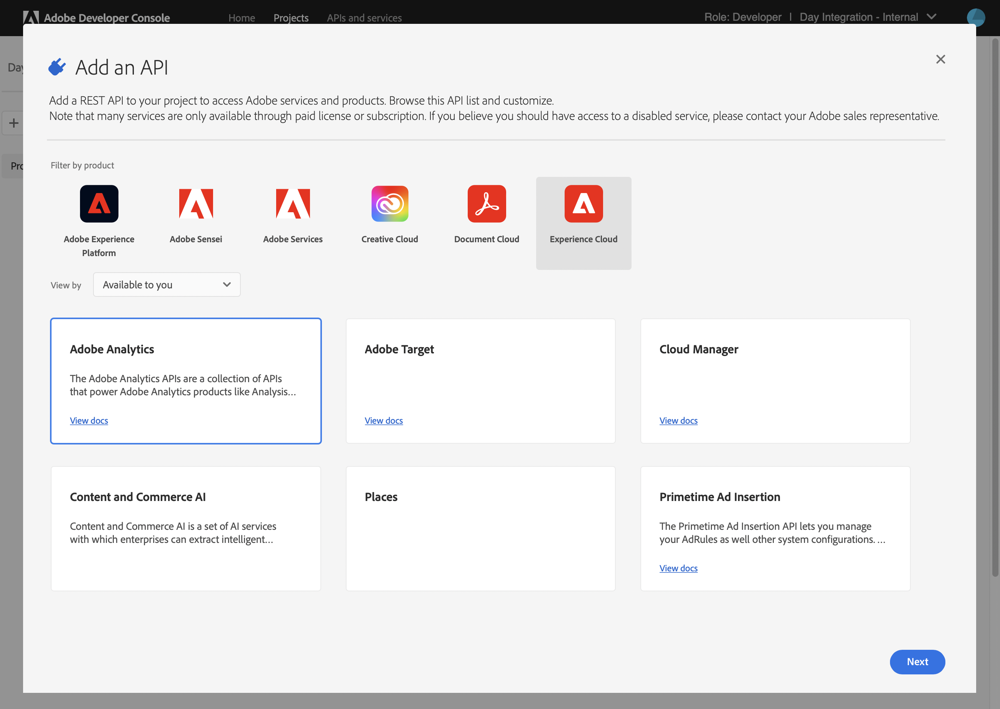

# Integratie met Adobe Analytics met Adobe I/O {#integration-with-adobe-analytics-using-adobe-i-o}

Voor de integratie van AEM met Adobe Analytics via de API voor Analytics Standard is de configuratie van Adobe IMS (Identity Management System) en Adobe I/O vereist.

>[!NOTE]
>
>Ondersteuning voor de Adobe Analytics Standard API 2.0 is nieuw in AEM 6.5.12.0. Deze versie van de API ondersteunt IMS-verificatie.
>
>Het gebruik van de Adobe Analytics Classic API 1.4 in AEM wordt nog steeds ondersteund voor achterwaartse compatibiliteit. De [Analytics Classic API gebruikt verificatie van gebruikersreferenties](/help/sites-administering/adobeanalytics-connect.md).
>
>De API-selectie wordt bepaald door de verificatiemethode die wordt gebruikt voor de integratie van AEM/Analytics.
>
>Nadere informatie is ook beschikbaar onder [Migreren naar de 2.0 API&#39;s](https://developer.adobe.com/analytics-apis/docs/2.0/guides/migration/).

## Vereisten {#prerequisites}

Voordat u met deze procedure begint:

* [Adobe-ondersteuning](https://helpx.adobe.com/nl/contact/enterprise-support.ec.html) moet je account opgeven voor:

   * Adobe-console
   * Adobe I/O
   * Adobe Analytics en
   * Adobe IMS (Identity Management-systeem)

* De systeembeheerder van het Systeem van uw organisatie zou de Admin Console moeten gebruiken om de vereiste ontwikkelaars in uw organisatie aan de relevante productprofielen toe te voegen.

   * Dit voorziet de specifieke ontwikkelaars van toestemmingen om integratie binnen Adobe I/O toe te laten.
   * Zie voor meer informatie [Ontwikkelaars beheren](https://helpx.adobe.com/enterprise/admin-guide.html/enterprise/using/manage-developers.ug.html).

## Een IMS-configuratie configureren - Een openbare sleutel genereren {#configuring-an-ims-configuration-generating-a-public-key}

De eerste fase van de configuratie is het creëren van een Configuratie IMS in AEM en het produceren van de Openbare Sleutel.

1. In AEM opent u de **Gereedschappen** -menu.
1. In de **Beveiliging** sectie selecteren **Adobe IMS-configuraties**.
1. Selecteren **Maken** om de **Configuratie technische account van Adobe IMS**.
1. De vervolgkeuzelijst onder gebruiken **Cloud Configuration**, selecteert u **Adobe Analytics**.
1. Activeren **Nieuw certificaat maken** en voert u een nieuwe alias in.
1. Bevestigen met **Certificaat maken**.

   

1. Selecteren **Downloaden** (of **Openbare sleutel downloaden**) om het bestand naar uw lokale station te downloaden, zodat het klaar is voor gebruik wanneer [Adobe I/O configureren voor Adobe Analytics-integratie met AEM](#configuring-adobe-i-o-for-adobe-analytics-integration-with-aem).

   >[!CAUTION]
   >
   >Zorg dat deze configuratie geopend blijft, dat deze opnieuw nodig is wanneer [De IMS-configuratie voltooien in AEM](#completing-the-ims-configuration-in-aem).

   

## Adobe I/O configureren voor Adobe Analytics-integratie met AEM {#configuring-adobe-i-o-for-adobe-analytics-integration-with-aem}

U moet het Adobe I/O Project (integratie) met Adobe Analytics tot stand brengen dat AEM zal gebruiken, dan de vereiste voorrechten toewijzen.

### Het project maken {#creating-the-project}

Open de Adobe I/O-console om een I/O-project te maken met Adobe Analytics dat AEM gebruiken:

<!--
>[!NOTE]
>
>See also the [Adobe I/O tutorials](https://www.adobe.io/apis/experienceplatform/home/tutorials/alltutorials.html).
-->

1. Open de Adobe I/O console voor Projecten:

   [https://console.adobe.io/projects](https://console.adobe.io/projects)

1. Alle projecten die u hebt, worden weergegeven. Selecteren **Nieuw project maken** - de locatie en het gebruik zijn afhankelijk van:

   * Als u nog geen project hebt, **Nieuw project maken** wordt midden onderaan weergegeven.
      
   * Als u al bestaande projecten hebt, worden deze weergegeven en **Nieuw project maken** is helemaal rechts.
      

1. Selecteren **Toevoegen aan project** gevolgd door **API**:

   

1. Selecteren **Adobe Analytics** vervolgens **Volgende**:

   >[!NOTE]
   >
   >Als je bent geabonneerd op Adobe Analytics, maar deze niet ziet, moet je de knop [Vereisten](#prerequisites).

   

1. Selecteren **Serviceaccount (JWT)** als type van authentificatie, dan ga met **Volgende**:

   

1. **Uw openbare sleutel uploaden** en, indien voltooid, doorgaan met **Volgende**:

   

1. Controleer de referenties en ga verder met **Volgende**:

   

1. Selecteer de vereiste productprofielen en ga verder met **geconfigureerde API opslaan**:

   

1. De configuratie wordt bevestigd.

### Rechten toewijzen aan de integratie {#assigning-privileges-to-the-integration}

U moet nu de vereiste rechten toewijzen aan de integratie:

1. De Adobe openen **Admin Console**:

   * [https://adminconsole.adobe.com](https://adminconsole.adobe.com/)

1. Navigeren naar **Producten** (bovenste werkbalk) selecteert u vervolgens **Adobe Analytics - &lt;*uw huurder*>** (in het linkerdeelvenster).
1. Selecteren **Productprofielen**, dan uw vereiste werkruimte uit de gepresenteerde lijst. Bijvoorbeeld de standaardwerkruimte.
1. Selecteren **API-referenties**, dan de vereiste integratieconfiguratie.
1. Selecteren **Editor** als de **Productrol**; in plaats van **Waarnemer**.

## Details die voor het Project van de Integratie van de Adobe I/O worden opgeslagen {#details-stored-for-the-adobe-io-integration-project}

Van de console van de Projecten van Adobe I/O kunt u een lijst van al uw integratieprojecten zien:

* [https://console.adobe.io/projects](https://console.adobe.io/projects)

Selecteer een specifieke projectingang om verdere details over de configuratie te tonen. Deze omvatten:

* Overzicht van project
* Inzichten
* Credentials
   * Serviceaccount (JWT)
      * Referentiegegevens
      * JWT genereren
* APIS
   * Bijvoorbeeld Adobe Analytics

Een aantal van deze zaken moet u voltooien om de Adobe I/O-integratie voor Adobe Analytics in AEM te voltooien.

## De IMS-configuratie voltooien in AEM {#completing-the-ims-configuration-in-aem}

Terugkeren naar AEM kunt u de configuratie voltooien IMS door vereiste waarden van de integratie van Adobe I/O voor Analytics toe te voegen:

1. Terugkeren naar de [IMS-configuratie geopend in AEM](#configuring-an-ims-configuration-generating-a-public-key).
1. Selecteren **Volgende**.

1. Hier kunt u de [details van de projectconfiguratie in Adobe I/O](#details-stored-for-the-adobe-io-integration-project):

   * **Titel**: Uw tekst.
   * **Autorisatieserver**: Kopieer/plak deze vanuit de `aud` lijn van de **Payload** hieronder, bijvoorbeeld `https://ims-na1.adobelogin.com` in het onderstaande voorbeeld
   * **API-sleutel**: Kopieer deze van de **Credentials** van de [Overzicht van project](#details-stored-for-the-adobe-io-integration-project)
   * **Clientgeheim**: Dit genereren in het dialoogvenster [Het geheime lusje van de Cliënt van de sectie van de Rekening van de Dienst (JWT)](#details-stored-for-the-adobe-io-integration-project)en kopiëren
   * **Payload**: Kopieer deze van de [Het tabblad JWT van de sectie Service Account (JWT) genereren](#details-stored-for-the-adobe-io-integration-project)

   

1. Bevestigen met **Maken**.

1. Uw Adobe Analytics-configuratie wordt weergegeven in de AEM console.

   

## De IMS-configuratie bevestigen {#confirming-the-ims-configuration}

Om te bevestigen dat de configuratie zoals verwacht werkt:

1. Open:

   * `https://localhost<port>/libs/cq/adobeims-configuration/content/configurations.html`

   Bijvoorbeeld:

   * `https://localhost:4502/libs/cq/adobeims-configuration/content/configurations.html`

1. Selecteer uw configuratie.
1. Selecteren **Health controleren** van de werkbalk, gevolgd door **Controleren**.

   

1. Als dit lukt, wordt een bevestigingsbericht weergegeven.

## De Adobe Analytics Cloud-service configureren {#configuring-the-adobe-analytics-cloud-service}

Er kan nu naar de configuratie worden verwezen, zodat een Cloud Service de standaard-API voor Analytics kan gebruiken:

1. Open de **Gereedschappen** -menu. Dan, binnen **Cloud Services** sectie, selecteert u **Oudere Cloud Services**.
1. Omlaag schuiven naar **Adobe Analytics** en selecteert u **Nu configureren**.

   De **Configuratie maken** wordt geopend.

1. Voer een **Titel** en, indien gewenst, een **Naam** (als deze optie leeg blijft, wordt deze gegenereerd op basis van de titel).

   U kunt ook de vereiste sjabloon selecteren (als er meerdere sjablonen beschikbaar zijn).

1. Bevestigen met **Maken**.

   De **Component bewerken** wordt geopend.

1. Voer de gegevens in het dialoogvenster **Analyse-instellingen** tab:

   * **Verificatie**: IMS

   * **IMS-configuratie**: Selecteer de naam van de IMS-configuratie

1. Klikken **Verbinding maken met Analytics** om de verbinding met Adobe Analytics te initialiseren.

   Als de verbinding tot stand is gebracht, wordt het bericht **Verbinding gelukt** wordt weergegeven.

1. Selecteren **OK** op het bericht.

1. Vul indien nodig andere parameters in, gevolgd door **OK** in het dialoogvenster om de configuratie te bevestigen.

1. U kunt nu doorgaan naar [Een analyseframework toevoegen](/help/sites-administering/adobeanalytics-connect.md) om parameters te configureren die naar Adobe Analytics worden verzonden.
