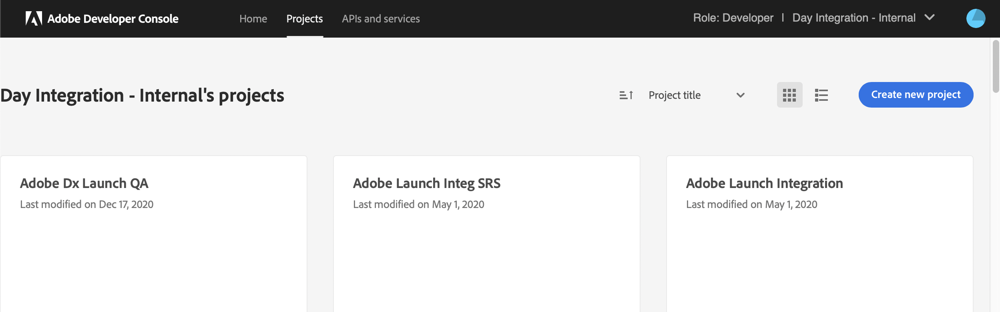

# Integratie met Adobe Analytics met IMS {#integration-with-adobe-analytics-using-ims}

Voor de integratie van AEM met Adobe Analytics via de API Analytics Standard is de configuratie van Adobe IMS (Identity Management System) met de Adobe Developer Console vereist.

>[!NOTE]
>
>Ondersteuning voor de Adobe Analytics Standard API 2.0 is nieuw in AEM 6.5.12.0. Deze versie van de API ondersteunt IMS-verificatie.
>
>Het gebruik van de Adobe Analytics Classic API 1.4 in AEM wordt nog steeds ondersteund voor achterwaartse compatibiliteit. De [Analytics Classic API gebruikt verificatie van gebruikersreferenties](/help/sites-administering/adobeanalytics-connect.md).
>
>De API-selectie wordt bepaald door de verificatiemethode die wordt gebruikt voor de integratie van AEM/Analytics.
>
>Nadere informatie is ook beschikbaar onder [Migreren naar de 2.0 API&#39;s](https://developer.adobe.com/analytics-apis/docs/2.0/guides/migration/).

## Vereisten {#prerequisites}

Voordat u met deze procedure begint:

* [Ondersteuning voor Adobe](https://experienceleague.adobe.com/?support-solution=General&amp;support-tab=home#support) moet je account opgeven voor:

   * Adobe Console
   * Adobe Developer Console
   * Adobe Analytics en
   * Adobe IMS (Identity Management-systeem)

* De systeembeheerder van het Systeem van uw organisatie zou de Admin Console moeten gebruiken om de vereiste ontwikkelaars in uw organisatie aan de relevante productprofielen toe te voegen.

   * Hierdoor beschikken de specifieke ontwikkelaars over machtigingen om integratie in de Adobe Developer-console mogelijk te maken.
   * Zie [Ontwikkelaars beheren](https://helpx.adobe.com/enterprise/using/manage-developers.html).

## Een IMS-configuratie configureren - Een openbare sleutel genereren {#configuring-an-ims-configuration-generating-a-public-key}

De eerste fase van de configuratie is een Configuratie IMS in AEM te creëren en de Openbare Sleutel te produceren.

1. In AEM opent u de **Gereedschappen** -menu.
1. In de **Beveiliging** sectie, selecteert u **Adobe IMS-configuraties**.
1. Selecteren **Maken** om de **Configuratie technische account van Adobe IMS**.
1. De vervolgkeuzelijst onder gebruiken **Cloud Configuration**, selecteert u **Adobe Analytics**.
1. Activeren **Nieuw certificaat maken** en voert u een nieuwe alias in.
1. Bevestigen met **Certificaat maken**.

   

1. Selecteren **Downloaden** (of **Openbare sleutel downloaden**) om het bestand naar uw lokale station te downloaden, zodat het klaar is voor gebruik wanneer [IMS configureren voor Adobe Analytics-integratie met AEM](#configuring-ims-for-adobe-analytics-integration-with-aem).

   >[!CAUTION]
   >
   >Houd deze configuratie open; deze is opnieuw nodig wanneer [De IMS-configuratie voltooien in AEM](#completing-the-ims-configuration-in-aem).

   

## IMS configureren voor Adobe Analytics-integratie met AEM {#configuring-ims-for-adobe-analytics-integration-with-aem}

Maak met de Adobe Developer-console een project (integratie) met Adobe Analytics (voor AEM gebruik) en wijs vervolgens de vereiste rechten toe.

### Het project maken {#creating-the-project}

Open de Adobe Developer-console om een project te maken met Adobe Analytics dat AEM kan gebruiken:

>[!CAUTION]
>
>Adobe biedt momenteel alleen ondersteuning voor de Adobe Developer Console **Serviceaccount (JWT)** referentietype.
>
>Gebruik de **OAuth Server-to-Server** type referentie, dat in de toekomst zal worden gesteund.

1. Open de Adobe Developer-console voor projecten:

   [https://developer.adobe.com/console/projects](https://developer.adobe.com/console/projects)

1. Alle projecten die u hebt, worden weergegeven. Selecteren **Nieuw project maken** - de locatie en het gebruik zijn afhankelijk van het volgende:

   * Als u nog geen project hebt, **Nieuw project maken** is gecentreerd, onder.
     
   * Als u reeds bestaande projecten hebt, zijn deze vermeld en **Nieuw project maken** bevindt zich rechtsboven.
     

1. Selecteren **Toevoegen aan project** gevolgd door **API**:

   

1. Selecteren **Adobe Analytics** vervolgens **Volgende**:

   >[!NOTE]
   >
   >Als je bent geabonneerd op Adobe Analytics, maar deze niet ziet, moet je de knop [Vereisten](#prerequisites).

   

1. Selecteren **Serviceaccount (JWT)** als het type van authentificatie, dan ga met **Volgende**:

   

1. **Uw openbare sleutel uploaden** en, indien voltooid, doorgaan met **Volgende**:

   

1. Controleer de referenties en ga verder met **Volgende**:

   

1. Selecteer de vereiste productprofielen en ga verder met **geconfigureerde API opslaan**:

   

1. De configuratie wordt bevestigd.

### Rechten toewijzen aan de integratie {#assigning-privileges-to-the-integration}

Wijs nu de vereiste rechten toe aan de integratie:

1. De Adobe openen **Admin Console**:

   * [https://adminconsole.adobe.com](https://adminconsole.adobe.com/)

1. Navigeren naar **Producten** (bovenste werkbalk) selecteert u vervolgens **ADOBE ANALYTICS - &lt;*uw huurder*>** (in het linkerdeelvenster).
1. Selecteren **Productprofielen**, dan uw vereiste werkruimte uit de gepresenteerde lijst. Bijvoorbeeld de standaardwerkruimte.
1. Selecteren **API-referenties**, dan de vereiste integratieconfiguratie.
1. Selecteren **Editor** als de **Productrol**; in plaats van **Waarnemer**.

## Gegevens opgeslagen voor het Adobe Developer Console Integration Project {#details-stored-for-the-ims-integration-project}

Van de console van de Projecten van Adobe Developer kunt u een lijst van al uw integratieprojecten zien:

* [https://developer.adobe.com/console/projects](https://developer.adobe.com/console/projects)

Om verdere details over de configuratie te tonen, selecteer een specifieke projectingang. Deze omvatten:

* Overzicht van project
* Inzichten
* Credentials
   * Serviceaccount (JWT)
      * Referentiegegevens
      * JWT genereren
* APIS
   * Bijvoorbeeld Adobe Analytics

Sommige daarvan moet je de integratie voor Adobe Analytics in AEM voltooien.

## De IMS-configuratie voltooien in AEM {#completing-the-ims-configuration-in-aem}

Terugkomend op AEM, kunt u de configuratie voltooien IMS door de vereiste waarden van het integratieproject voor Analytics toe te voegen:

1. Terugkeren naar de [IMS-configuratie geopend in AEM](#configuring-an-ims-configuration-generating-a-public-key).
1. Selecteren **Volgende**.

1. Hier kunt u de [Gegevens opgeslagen voor het Adobe Developer Console Integration Project](#details-stored-for-the-ims-integration-project):

   * **Titel**: Uw tekst.
   * **Autorisatieserver**: Kopieer/plak deze vanuit de `aud` lijn van de **Payload** hieronder, bijvoorbeeld `https://ims-na1.adobelogin.com` in het onderstaande voorbeeld
   * **API-sleutel**: Kopieer deze van de **Credentials** van de [Overzicht van project](#details-stored-for-the-ims-integration-project)
   * **Clientgeheim**: Genereer dit in het dialoogvenster [Het geheime lusje van de Cliënt van de sectie van de Rekening van de Dienst (JWT)](#details-stored-for-the-ims-integration-project)en kopiëren
   * **Payload**: Kopieer deze van de [Het tabblad JWT van de sectie Service Account (JWT) genereren](#details-stored-for-the-ims-integration-project)

   

1. Bevestigen met **Maken**.

1. Uw Adobe Analytics-configuratie wordt weergegeven in de AEM console.

   

## De IMS-configuratie bevestigen {#confirming-the-ims-configuration}

Om te bevestigen dat de configuratie zoals verwacht werkt:

1. Openen:

   * `https://localhost<port>/libs/cq/adobeims-configuration/content/configurations.html`

   Bijvoorbeeld:

   * `https://localhost:4502/libs/cq/adobeims-configuration/content/configurations.html`

1. Selecteer uw configuratie.
1. Selecteren **Health controleren** van de werkbalk, gevolgd door **Controleren**.

   

1. Als dit lukt, wordt een bevestigingsbericht weergegeven.

## De Adobe Analytics Cloud-service configureren {#configuring-the-adobe-analytics-cloud-service}

Er kan nu naar de configuratie worden verwezen, zodat een Cloud Service de standaard-API voor Analytics kan gebruiken:

1. Open de **Gereedschappen** -menu. Dan, binnen **Cloud Servicen** sectie, selecteert u **Oudere Cloud Servicen**.
1. Omlaag schuiven naar **Adobe Analytics** en selecteert u **Nu configureren**.

   De **Configuratie maken** wordt geopend.

1. Voer een **Titel** en, indien gewenst, een **Naam** (als deze parameter leeg wordt gelaten, wordt deze gegenereerd op basis van de titel.)

   U kunt ook de vereiste sjabloon selecteren (als er meerdere sjablonen beschikbaar zijn).

1. Bevestigen met **Maken**.

   De **Component bewerken** wordt geopend.

1. Voer de gegevens in het dialoogvenster **Analyse-instellingen** tab:

   * **Verificatie**: IMS

   * **IMS-configuratie**: selecteer de naam van de IMS-configuratie

1. Als u de verbinding met Adobe Analytics wilt initialiseren, klikt u **Verbinding maken met Analytics**.

   Als de verbinding tot stand is gebracht, wordt het bericht **Verbinding gelukt** wordt weergegeven.

1. Selecteren **OK** op het bericht.

1. Vul indien nodig andere parameters in, gevolgd door **OK** op de dialoogdoos zodat kunt u de configuratie bevestigen.

1. U kunt nu doorgaan naar [Een analyseframework toevoegen](/help/sites-administering/adobeanalytics-connect.md) om parameters te configureren die naar Adobe Analytics worden verzonden.
