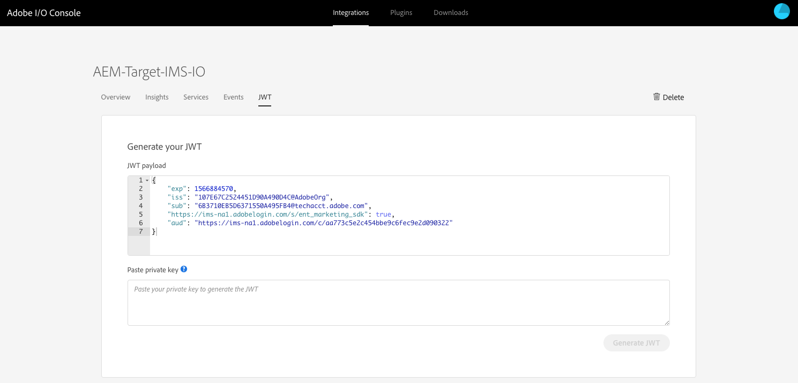

# Integratie met Adobe Target met Adobe I/O{#integration-with-adobe-target-using-adobe-i-o}

Voor de integratie van AEM met Adobe Target via de API voor doelstandaard is de configuratie van Adobe IMS (Identity Management System) en Adobe I/O vereist.

>[!NOTE]
>
>Ondersteuning voor de standaard-API van Adobe Target is nieuw in AEM 6.5. De doel-standaard-API gebruikt IMS-verificatie.
>
>Het gebruik van de Klassieke API van het Doel van Adobe in AEM wordt nog gesteund voor achterwaartse verenigbaarheid. De Klassieke [API van het Doel gebruikt gebruikersgeloofsauthentificatie](/help/sites-administering/target-configuring.md#manually-integrating-with-adobe-target).
>
>De API-selectie wordt aangestuurd door de verificatiemethode die wordt gebruikt voor integratie met AEM/Target.

## Vereisten {#prerequisites}

Voordat u deze procedure start, moet [Adobe Support](https://helpx.adobe.com/contact/enterprise-support.ec.html) uw account instellen voor:

* Adobe-console
* Adobe I/O
* Adobe Target en
* Adobe IMS (Identity Management System)

## Een IMS-configuratie configureren - Een openbare sleutel genereren {#configuring-an-ims-configuration-generating-a-public-key}

De eerste fase van de configuratie is het creëren van een Configuratie IMS in AEM en het produceren van de Openbare Sleutel.

1. Open het menu **Gereedschappen** in AEM.
1. Selecteer in de sectie **Beveiliging** de optie **Adobe IMS Configurations**.
1. Selecteer **Maken** om de **Adobe IMS Technical Account Configuration** te openen.
1. Selecteer **Adobe Target** in het keuzemenu onder **Cloud Configuration**.
1. Activeer **Nieuw certificaat** maken en voer een nieuwe alias in.
1. Bevestig met certificaat **** maken.

   

1. Selecteer **Download** (of **Download Public Key**) om het bestand naar uw lokale station te downloaden, zodat het klaar is voor gebruik wanneer u Adobe I/O voor integratie met AEM configureert.

   >[!CAUTION]
   >
   >Houd deze configuratie open, zal het opnieuw nodig zijn wanneer het [Voltooien van de Configuratie IMS in AEM](#completing-the-ims-configuration-in-aem).

   

## Adobe I/O voor Adobe Target-integratie met AEM configureren {#configuring-adobe-i-o-for-adobe-target-integration-with-aem}

U moet de Adobe I/O-integratie met Adobe Target maken die AEM zal gebruiken en vervolgens de vereiste rechten toewijzen.

### De integratie maken {#creating-the-integration}

Open de Adobe I/O-console om een I/O-integratie met Adobe Target te maken die door AEM wordt gebruikt:

>[!NOTE]
>
>Zie ook de [Adobe I/O-zelfstudies](https://www.adobe.io/apis/experienceplatform/home/tutorials/alltutorials.html).

1. Open de Adobe I/O-console voor integratie:

   * [https://console.adobe.io/integrations](https://console.adobe.io/integrations)

1. Selecteer **Nieuwe integratie**:

   >[!NOTE]
   >
   >Als u al bestaande integraties hebt, worden deze weergegeven en is de knop **Nieuwe integratie** helemaal rechts.

   

1. Selecteer **Toegang tot API** gevolgd door **Doorgaan**:

   

1. Selecteer **Adobe Target** en **ga** verder:

   

1. Voeg de vereiste details voor de integratieconfiguratie toe:

   * **Naam**

      Voer de naam in.

   * **Beschrijving**

      Een beschrijving is optioneel.

   * **Certificaat met openbare sleutel**

      Upload het bestand met de openbare sleutel. zoals geproduceerd onder het [Vormen van een Configuratie IMS - Genererend een Openbare Sleutel](#configuring-an-ims-configuration-generating-a-public-key).

      Nadat het certificaat is geladen, wordt het weergegeven onder **Certificaten**.

   * **Productprofielen**

      Productprofielen zijn gelijk aan Workspaces in Target die AEM kan gebruiken voor het exporteren van inhoud en het maken van aanbiedingen. Standaard is de standaardwerkruimte Doel geselecteerd. Selecteer andere profielen/werkruimten die in AEM beschikbaar moeten worden gemaakt als exportdoelen.
   Bijvoorbeeld:

   

1. Bevestig met **Integratie** maken.
1. De aanmaak wordt bevestigd. U kunt nu **doorgaan met integratiegegevens**. Deze zijn nodig voor het [voltooien van de IMS-configuratie in AEM](#completing-the-ims-configuration-in-aem).

   

### Rechten toewijzen aan de integratie {#assigning-privileges-to-the-integration}

U moet nu de vereiste rechten toewijzen aan de integratie:

1. Open de Adobe **Admin Console**:

   * [https://adminconsole.adobe.com](https://adminconsole.adobe.com/)

1. Navigeer naar **Producten** (bovenste werkbalk) en selecteer vervolgens **Adobe Target - &lt;*uw-huurder-id*>** (in het linkerdeelvenster).
1. Selecteer **Productprofielen** en vervolgens de gewenste werkruimte in de weergegeven lijst. Bijvoorbeeld de standaardwerkruimte.
1. Selecteer **Integraties**, dan de vereiste integratieconfiguratie.
1. Selecteer **Editor** als de **productrol**; in plaats van **waarnemer**.

## Gegevens opgeslagen voor de Adobe I/O-integratie {#details-stored-for-the-adobe-i-o-integration}

Vanuit de Adobe I/O-integratieconsole kunt u een lijst met al uw integratie zien:

* [https://console.adobe.io/integrations](https://console.adobe.io/integrations)

Selecteer **Mening** (rechts van een specifieke integratieingang) om verdere details over de configuratie te tonen. Deze omvatten:

* Overzicht
* Inzichten
* Services
* Gebeurtenissen
* JWT (JSON Web Token)

Bij sommige hiervan moet u de Adobe I/O-integratie voor Doel in AEM voltooien.

1. **Overzicht**:

   

1. **JWT**:

   

## IMS-configuratie voltooien in AEM {#completing-the-ims-configuration-in-aem}

Als u terugkeert naar AEM, kunt u de IMS-configuratie voltooien door de vereiste waarden van de Adobe I/O-integratie voor Target toe te voegen:

1. Ga terug naar de [IMS-configuratie die is geopend in AEM](#configuring-an-ims-configuration-generating-a-public-key).
1. Selecteer **Volgende**.

1. Hier kunt u de [details van Adobe I/O](#details-stored-for-the-adobe-i-o-integration)gebruiken:

   * **Titel**: Uw tekst.
   * **Autorisatieserver**: Kopieer/plak deze vanuit de `"aud"` regel van de **sectie Payload** hieronder, bijvoorbeeld `"https://ims-na1.adobelogin.com"` in het onderstaande voorbeeld.
   * **API-sleutel**: Kopieer dit uit de sectie [Overzicht](#details-stored-for-the-adobe-i-o-integration) van de Adobe I/O-integratie voor Doel
   * **Clientgeheim**: Genereer dit in de sectie [Overzicht](#details-stored-for-the-adobe-i-o-integration) van de Adobe I/O-integratie voor Target en kopieer het
   * **Payload**: Kopieer deze uit de [JWT](#details-stored-for-the-adobe-i-o-integration) -sectie van de Adobe I/O-integratie voor doel
   

1. Bevestig met **Maken**.

1. Uw Adobe Target-configuratie wordt weergegeven in de AEM-console.

   

## De IMS-configuratie bevestigen {#confirming-the-ims-configuration}

Om te bevestigen dat de configuratie zoals verwacht werkt:

1. Openen:

   * `https://localhost<port>/libs/cq/adobeims-configuration/content/configurations.html`
   Bijvoorbeeld:

   * `https://localhost:4502/libs/cq/adobeims-configuration/content/configurations.html`

1. Selecteer uw configuratie.
1. Selecteer **Health** controleren op de werkbalk, gevolgd door **Check**.

   

1. Als dit lukt, wordt het bericht weergegeven:

   

## De Adobe Target Cloud Service configureren {#configuring-the-adobe-target-cloud-service}

Er kan nu naar de configuratie worden verwezen, zodat een Cloud Service de standaard-API van het doel kan gebruiken:

1. Open het menu **Gereedschappen** . Selecteer vervolgens in de sectie **Cloud Services** de optie **Legacy Cloud Services**.
1. Blader omlaag naar **Adobe Target** en selecteer **Nu** configureren.

   Het dialoogvenster **Configuratie** maken wordt geopend.

1. Voer een **titel** en desgewenst een **naam** in (als deze leeg wordt gelaten, wordt deze uit de titel gegenereerd).

   U kunt ook de vereiste sjabloon selecteren (als er meerdere sjablonen beschikbaar zijn).

1. Bevestig met **Maken**.

   Het dialoogvenster Component **** bewerken wordt geopend.

1. Voer de gegevens in op het tabblad **Adobe-doelinstellingen** :

   * **Clientcode**: De Adobe IMS Tenant ID

      >[!CAUTION]
      >
      >De Adobe IMS Tenant ID moet worden ingevoerd in het veld Clientcode.

   * **Verificatie**: IMS
   * **IMS-configuratie**: Selecteer de naam van de IMS-configuratie
   * **API-type**: REST
   * **A4T Analytics Cloud Configuration**: Selecteer de de wolkenconfiguratie van de Analyse die voor de doelstellingen en metriek van de doelactiviteit wordt gebruikt. Dit is nodig als u Adobe Analytics als bron voor rapportage gebruikt wanneer u inhoud als doel instelt. Als u uw wolkenconfiguratie niet ziet, zie nota in het [Vormen van de Cloud van A4T Analytics Configuratie](/help/sites-administering/target-configuring.md#configuring-a-t-analytics-cloud-configuration).
   * **Gebruik nauwkeurige doelwitten**: Dit selectievakje is standaard ingeschakeld. Als deze optie is geselecteerd, wacht de configuratie van de cloudservice tot de context is geladen voordat inhoud wordt geladen. Zie het volgende.
   * **Segmenten synchroniseren vanuit Adobe Target**: Selecteer deze optie als u segmenten die in Doel zijn gedefinieerd, wilt downloaden en in AEM wilt gebruiken. U moet deze optie selecteren wanneer het bezit van het Type API REST is, omdat de gealigneerde segmenten niet worden gesteund en u altijd segmenten van Doel moet gebruiken. (De AEM-term &#39;segment&#39; komt overeen met de doelterm &#39;publiek&#39;.)
   * **Clientbibliotheek**: Selecteer of u de AT.js cliëntbibliotheek, of mbox.js (afgekeurd) wilt.
   * **Tagbeheersysteem gebruiken om clientbibliotheek** te leveren: Gebruik DTM (afgekeurd), Adobe Launch of een ander systeem voor tagbeheer.
   * **Aangepaste AT.js**: Laat leeg als u het vak Tagbeheer hebt ingeschakeld of als u de standaard-AT.js wilt gebruiken. U kunt ook uw aangepaste AT.js uploaden. Wordt alleen weergegeven als u AT.js hebt geselecteerd.
   >[!NOTE]
   >
   >[De configuratie van een Cloud-service voor het gebruik van de Classic-doelAPI](/help/sites-administering/target-configuring.md#manually-integrating-with-adobe-target) is afgekeurd (gebruikt het tabblad Instellingen voor Adobe-aanbevelingen).

   Bijvoorbeeld:

   

1. Klik op **Verbinding maken met doel** om de verbinding met Adobe Target te initialiseren.

   Als de verbinding succesvol is, wordt het bericht **Verbinding succesvol** getoond.

1. Selecteer **OK** in het bericht, gevolgd door **OK** in het dialoogvenster om de configuratie te bevestigen.
1. U kunt nu aan het [Toevoegen van een Kader](/help/sites-administering/target-configuring.md#adding-a-target-framework) van het Doel te werk gaan om parameters te vormen ContextHub of ClientContext die naar Doel zullen worden verzonden. Dit is mogelijk niet vereist voor het exporteren van AEM Experience Fragments naar Target.

