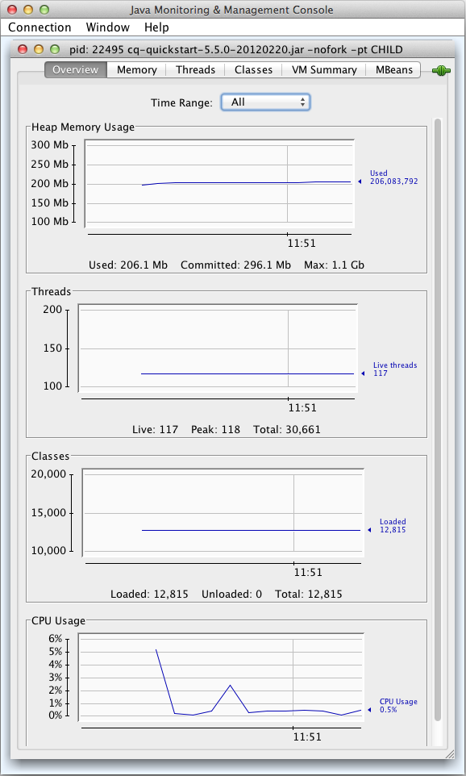

# Serverbronnen controleren met de JMX-console{#monitoring-server-resources-using-the-jmx-console}

Met de JMX-console kunt u services op de CRX-server controleren en beheren. In de volgende secties wordt een overzicht gegeven van de kenmerken en bewerkingen die via het JMX-framework worden weergegeven.

Voor informatie over hoe te om de consolecontroles te gebruiken, zie [De JMX-console gebruiken](#using-the-jmx-console). Voor achtergrondinformatie over JMX raadpleegt u de [JMX-technologie (Java Management Extensions)](https://www.oracle.com/technetwork/java/javase/tech/javamanagement-140525.html) op de website van het Oracle.

Voor informatie over het maken van MBans om uw services te beheren met de JMX Console raadpleegt u [Services integreren met de JMX-console](/help/sites-developing/jmx-integration.md).

## Workflowonderhoud {#workflow-maintenance}

Bewerkingen voor het beheren van actieve, voltooide, geschaalde en mislukte workflowinstanties.

* Domein: com.adobe.granite.workflow
* Type: onderhoud

>[!NOTE]
>
>Zie de [workflowconsole](/help/sites-administering/workflows-administering.md) voor aanvullende werkstroombeheerprogramma&#39;s en beschrijvingen van mogelijke statussen van werkstroominstanties.

### Bewerkingen {#operations}

**listRunningWorkflowsPerModel** Hier wordt het aantal workflowinstanties weergegeven dat wordt uitgevoerd voor elk workflowmodel.

* Argumenten: geen
* Geretourneerde waarde: tabelgegevens met de kolommen Aantal en ModelId.

**listCompletedWorkflowsPerModel** Hier wordt het aantal voltooide workflowexemplaren voor elk workflowmodel weergegeven.

* Argumenten: geen
* Geretourneerde waarde: tabelgegevens met de kolommen Aantal en ModelId.

**returnWorkflowQueueInfo** Hier wordt informatie weergegeven over workflowitems die zijn verwerkt en in de wachtrij voor verwerking staan.

* Argumenten: geen
* Geretourneerde waarde: tabelgegevens met de volgende kolommen:

   * Taken
   * Naam wachtrij
   * Actieve taken
   * Gemiddelde verwerkingstijd
   * Gemiddelde wachttijd
   * Geannuleerde taken
   * Mislukte taken
   * Voltooide taken
   * Verwerkte banen
   * In de wachtrij geplaatste taken

**returnWorkflowJobTopicInfo** Vermeldt verwerkingsinformatie voor werkstroomtaken, ingedeeld op onderwerp.

* Argumenten: geen
* Geretourneerde waarde: tabelgegevens met de volgende kolommen:

   * Onderwerpnaam
   * Gemiddelde verwerkingstijd
   * Gemiddelde wachttijd
   * Geannuleerde taken
   * Mislukte taken
   * Voltooide taken
   * Verwerkte banen

**returnFailedWorkflowCount** Hier wordt het aantal mislukte werkstroominstanties weergegeven. U kunt een workflowmodel opgeven voor het opvragen of ophalen van informatie voor alle workflowmodellen.

* Argumenten:

   * model: De id van het model waarnaar moet worden gezocht. Als u een aantal mislukte workflowinstanties voor alle workflowmodellen wilt zien, geeft u geen waarde op. De id is het pad naar het modelknooppunt, bijvoorbeeld:

     `/conf/global/settings/workflow/models/dam/update_asset/jcr:content/model`

* Geretourneerde waarde: het aantal mislukte werkstroominstanties.

**returnFailedWorkflowCountPerModel** Geeft het aantal werkstroominstanties weer dat is mislukt voor elk workflowmodel.

* Argumenten: geen.
* Geretourneerde waarde: tabelgegevens met de kolommen Aantal en Model-id.

**terminateFailedInstances** Beëindig werkstroominstanties die zijn mislukt. U kunt alle mislukte exemplaren beëindigen of slechts de ontbroken instanties voor een specifiek model. Desgewenst kunt u de exemplaren opnieuw beginnen nadat zij worden geëindigd. U kunt de bewerking ook testen om de resultaten te zien zonder de bewerking daadwerkelijk uit te voeren.

* Argumenten:

   * Start de instantie opnieuw: (Optioneel) Geef een waarde op van `true` om de exemplaren opnieuw te beginnen nadat zij worden geëindigd. De standaardwaarde van `false` veroorzaakt geen herstart van beëindigde werkschemainstanties.
   * Droge uitvoering: (Optioneel) Geef een waarde op van `true` de resultaten van de bewerking te zien zonder de bewerking daadwerkelijk uit te voeren. De standaardwaarde van `false` zorgt dat de bewerking wordt uitgevoerd.
   * Model: (Optioneel) De id van het model waarop de bewerking wordt toegepast. Geef geen model op om de bewerking toe te passen op de mislukte exemplaren van alle workflowmodellen. De id is het pad naar het modelknooppunt, bijvoorbeeld:

     `/conf/global/settings/workflow/models/dam/update_asset/jcr:content/model`

* Geretourneerde waarde: tabelgegevens over de instanties die worden beëindigd, met de volgende kolommen:

   * Initiator
   * InstanceId
   * ModelId
   * Payload
   * StartComment
   * WorkflowTitle

**retryFailedWorkItems** Probeert stappen voor het werkitem uit te voeren die zijn mislukt. U kunt alle mislukte werkitems of alleen de mislukte werkitems voor een specifiek workflowmodel opnieuw proberen. U kunt de bewerking desgewenst testen om de resultaten te zien zonder de bewerking daadwerkelijk uit te voeren.

* Argumenten:

   * Droge uitvoering: (Optioneel) Geef een waarde op van `true` de resultaten van de bewerking te zien zonder de bewerking daadwerkelijk uit te voeren. De standaardwaarde van `false` zorgt dat de bewerking wordt uitgevoerd.
   * Model: (Optioneel) De id van het model waarop de bewerking wordt toegepast. Geef geen model op om de bewerking toe te passen op de mislukte werkitems van alle workflowmodellen. De id is het pad naar het modelknooppunt, bijvoorbeeld:

     `/conf/global/settings/workflow/models/dam/update_asset/jcr:content/model`

* Geretourneerde waarde: tabelgegevens over de mislukte werkitems die opnieuw worden geprobeerd, inclusief de volgende kolommen:

   * Initiator
   * InstanceId
   * ModelId
   * Payload
   * StartComment
   * WorkflowTitle

**PurgeActive** Hiermee worden actieve workflowexemplaren van een bepaalde leeftijd verwijderd. U kunt actieve exemplaren voor alle modellen of slechts de instanties voor een specifiek model leegmaken. U kunt de bewerking desgewenst testen om de resultaten te zien zonder de bewerking daadwerkelijk uit te voeren.

* Argumenten:

   * Model: (Optioneel) De id van het model waarop de bewerking wordt toegepast. Geef geen model op om de bewerking toe te passen op de workflowinstanties van alle workflowmodellen. De id is het pad naar het modelknooppunt, bijvoorbeeld:

     `/conf/global/settings/workflow/models/dam/update_asset/jcr:content/model`
   * Aantal dagen sinds het begin van de werkstroom: de leeftijd van de werkstroominstanties die moeten worden gewist, in dagen.
   * Droge uitvoering: (Optioneel) Geef een waarde op van `true` de resultaten van de bewerking te zien zonder de bewerking daadwerkelijk uit te voeren. De standaardwaarde van `false` zorgt dat de bewerking wordt uitgevoerd.

* Geretourneerde waarde: tabelgegevens over de actieve werkstroominstanties die worden gewist, inclusief de volgende kolommen:

   * Initiator
   * InstanceId
   * ModelId
   * Payload
   * StartComment
   * WorkflowTitle

**countStaleWorkflows** Retourneert het aantal werkstroominstanties dat stabiel is. U kunt het aantal instanties van de schaal voor alle werkschemamodellen of voor een specifiek model terugwinnen.

* Argumenten:

   * Model: (Optioneel) De id van het model waarop de bewerking wordt toegepast. Geef geen model op om de bewerking toe te passen op de workflowinstanties van alle workflowmodellen. De id is het pad naar het modelknooppunt, bijvoorbeeld:

     `/conf/global/settings/workflow/models/dam/update_asset/jcr:content/model`

* Geretourneerde waarde: het aantal instanties van een schaalworkflow.

**startStaleWorkflows** Hiermee worden de instanties van de vaste workflow opnieuw gestart. U kunt alle instanties van de schaal of slechts de instanties van de schaal voor een specifiek model opnieuw beginnen. U kunt de bewerking ook testen om de resultaten te zien zonder de bewerking daadwerkelijk uit te voeren.

* Argumenten:

   * Model: (Optioneel) De id van het model waarop de bewerking wordt toegepast. Geef geen model op om de bewerking toe te passen op de schaalvarianten van alle workflowmodellen. De id is het pad naar het modelknooppunt, bijvoorbeeld:

     `/conf/global/settings/workflow/models/dam/update_asset/jcr:content/model`
   * Droge uitvoering: (Optioneel) Geef een waarde op van `true` de resultaten van de bewerking te zien zonder de bewerking daadwerkelijk uit te voeren. De standaardwaarde van `false` zorgt dat de bewerking wordt uitgevoerd.

* Geretourneerde waarde: een lijst met werkstroominstanties die opnieuw worden gestart.

**fetchModelList** Hier worden alle workflowmodellen weergegeven.

* Argumenten: geen
* Geretourneerde waarde: tabelgegevens die de workflowmodellen identificeren, inclusief de kolommen ModelId en ModelName.

**countRunningWorkflows** Retourneert het aantal werkstroominstanties dat wordt uitgevoerd. U kunt het aantal actieve exemplaren voor alle workflowmodellen of voor een specifiek model ophalen.

* Argumenten:

   * Model: (Optioneel) De id van het model waarvoor het aantal actieve exemplaren wordt geretourneerd. Geef geen model op om het aantal actieve exemplaren van alle workflowmodellen te retourneren. De id is het pad naar het modelknooppunt, bijvoorbeeld:

     `/conf/global/settings/workflow/models/dam/update_asset/jcr:content/model`

* Geretourneerde waarde: het aantal actieve workflowinstanties.

**countCompletedWorkflows** Retourneert het aantal werkstroominstanties dat is voltooid. U kunt het aantal voltooide exemplaren ophalen voor alle workflowmodellen of voor een specifiek model.

* Argumenten:

   * Model: (Optioneel) De id van het model waarvoor het aantal voltooide exemplaren wordt geretourneerd. Geef geen model op om het aantal voltooide exemplaren van alle workflowmodellen te retourneren. De id is het pad naar het modelknooppunt, bijvoorbeeld:

     `/conf/global/settings/workflow/models/dam/update_asset/jcr:content/model`

* Geretourneerde waarde: het aantal voltooide workflowinstanties.

**purgeCompleted** Hiermee verwijdert u records van voltooide workflows van een bepaalde leeftijd uit de opslagplaats. Gebruik deze bewerking regelmatig om de grootte van de opslagplaats te minimaliseren wanneer u veel gebruik maakt van workflows. U kunt voltooide exemplaren voor alle modellen of slechts de instanties voor een specifiek model leegmaken. U kunt de bewerking desgewenst testen om de resultaten te zien zonder de bewerking daadwerkelijk uit te voeren.

* Argumenten:

   * Model: (Optioneel) De id van het model waarop de bewerking wordt toegepast. Geef geen model op om de bewerking toe te passen op de workflowinstanties van alle workflowmodellen. De id is het pad naar het modelknooppunt, bijvoorbeeld:

     `/conf/global/settings/workflow/models/dam/update_asset/jcr:content/model`
   * Aantal dagen sinds de werkstroom is voltooid: Het aantal dagen dat de werkstroominstanties de voltooide status hebben.
   * Droge uitvoering: (Optioneel) Geef een waarde op van `true` de resultaten van de bewerking te zien zonder de bewerking daadwerkelijk uit te voeren. De standaardwaarde van `false` zorgt dat de bewerking wordt uitgevoerd.

* Geretourneerde waarde: tabelgegevens over de voltooide werkstroominstanties die worden gewist, inclusief de volgende kolommen:

   * Initiator
   * InstanceId
   * ModelId
   * Payload
   * StartComment
   * WorkflowTitle

## Bewaarplaats {#repository}

Informatie over de CRX-opslagplaats

* Domein: com.adobe.granite
* Type: gegevensopslagruimte

### Attributen {#attributes}

**Naam** De naam van de implementatie van de JCR-opslagplaats. Alleen-lezen.

**Versie** De versie voor implementatie in de repository. Alleen-lezen.

**HomeDir** De directory waarin de gegevensopslagruimte zich bevindt. De standaardlocatie is &lt;quickstart_jar_location>/crx-quickstart/repository. Alleen-lezen.

**Klantnaam** De naam van de klant aan wie de softwarevergunning wordt uitgegeven. Alleen-lezen.

**LicentieKey** De unieke licentiecode voor deze installatie van de opslagplaats. Alleen-lezen.

**AvailableDiskSpace** De schijfruimte die beschikbaar is voor dit exemplaar van de opslagplaats, in Mbytes. Alleen-lezen.

**MaximumNumberOfOpenFiles** Het aantal bestanden dat tegelijk kan worden geopend. Alleen-lezen.

**SessionTracker** De waarde van de systeemvariabele crx.debug.session. true geeft een foutopsporingssessie aan. false geeft een normale sessie aan. Lezen/schrijven.

**Beschrijvers** Een set sleutelwaardeparen die de eigenschappen van de opslagplaats vertegenwoordigen. Alle eigenschappen zijn alleen-lezen.

<table>
 <tbody>
  <tr>
   <th>Sleutel</th>
   <th>Waarde</th>
  </tr>
  <tr>
   <td>option.node.and.property.with.same.name.supported</td>
   <td>Geeft aan of een knooppunt en een eigenschap van het knooppunt dezelfde naam kunnen hebben. true geeft aan dat dezelfde namen worden ondersteund, false geeft aan dat dit niet wordt ondersteund. </td>
  </tr>
  <tr>
   <td>identifier.stability</td>
   <td>Geeft de stabiliteit van niet-referentieerbare knooppuntid's aan. De volgende waarden zijn mogelijk:
    <ul>
     <li>identifier.stability.indefinite.duration: Identifiers do not change.</li>
     <li>identifier.stability.method.duration: id's kunnen veranderen tussen methodeaanroepen.</li>
     <li>identifier.stability.save.duration: id's worden niet gewijzigd in een cyclus voor opslaan en vernieuwen.</li>
     <li>identifier.stability.session.duration: id's worden niet gewijzigd tijdens een sessie.</li>
    </ul> </td>
  </tr>
  <tr>
   <td>query.xpath.pos.index</td>
   <td>Geeft aan of de JCR 1.0 XPath-querytaal wordt ondersteund. true geeft ondersteuning aan en false geeft geen ondersteuning aan.</td>
  </tr>
  <tr>
   <td>crx.repository.systemid</td>
   <td>De systeem-id, zoals gevonden in het bestand system.id.</td>
  </tr>
  <tr>
   <td>option.query.sql.supported</td>
   <td>Geeft aan of de JCR 1.0 XPath-querytaal wordt ondersteund. true geeft ondersteuning aan en false geeft geen ondersteuning aan.</td>
  </tr>
  <tr>
   <td>jcr.repository.version</td>
   <td>De versie van de implementatie van de repository.</td>
  </tr>
  <tr>
   <td>option.update.primary.node.type.supported</td>
   <td>Geeft aan of het primaire knooppunttype van een knooppunt kan worden gewijzigd. true geeft aan dat u het primaire knooppunttype kunt wijzigen en false geeft aan dat de wijziging niet wordt ondersteund.</td>
  </tr>
  <tr>
   <td>option.node.type.management.supported</td>
   <td>Geeft aan of knooppunttypebeheer wordt ondersteund. true geeft aan dat dit wordt ondersteund en false geeft aan dat dit niet het geval is.</td>
  </tr>
  <tr>
   <td>node.type.management.overrides.supported</td>
   <td>Geeft aan of u de overgenomen eigenschap of onderliggende knooppuntdefinitie van een knooppunttype kunt overschrijven. true geeft aan dat overschrijvingen worden ondersteund en false geeft aan dat er geen overschrijvingen plaatsvinden.</td>
  </tr>
  <tr>
   <td>option.observation.supported</td>
   <td>true geeft aan dat asynchrone waarneming van wijzigingen in de repository wordt ondersteund. De steun van asynchrone observatie laat toepassingen toe om berichten over elke verandering te ontvangen en te antwoorden aangezien zij voorkomen.</td>
  </tr>
  <tr>
   <td>query.jcrscore</td>
   <td><p>true geeft aan dat de pseudo-eigenschap jcr:score beschikbaar is in XPath en SQL-query's die een jcrfn:contains (in XPath) of CONTAINS (in SQL) functie bevatten om een full-text zoekopdracht uit te voeren.</p> </td>
  </tr>
  <tr>
   <td>option.simple.versioning.supported</td>
   <td>true geeft aan dat de gegevensopslagruimte eenvoudige versioning ondersteunt. Met eenvoudige versioning onderhoudt de repository een sequentiële reeks versies van een knooppunt.</td>
  </tr>
  <tr>
   <td>option.workspace.management.supported</td>
   <td>true geeft aan dat de gegevensopslagruimte het maken en verwijderen van werkruimten met behulp van API's ondersteunt.</td>
  </tr>
  <tr>
   <td>option.update.mixin.node.types.supported</td>
   <td>true geeft aan dat de gegevensopslagruimte de toevoeging en verwijdering van mixinknooppunttypen van een bestaand knooppunt ondersteunt.</td>
  </tr>
  <tr>
   <td>node.type.management.primary.item.name.supported</td>
   <td>true geeft aan dat de repository nodedefinities toestaat om een primair item als onderliggend item te bevatten. Een primair item is toegankelijk via de API zonder de naam van het item te kennen.</td>
  </tr>
  <tr>
   <td>level.2.supported</td>
   <td>true geeft aan dat zowel LEVEL_1_SUPPORTED als OPTION_XML_IMPORT_SUPPORTED true zijn.</td>
  </tr>
  <tr>
   <td>write.supported</td>
   <td>true geeft aan dat de repository schrijftoegang biedt met behulp van de API. false geeft alleen-lezen toegang aan.</td>
  </tr>
  <tr>
   <td>node.type.management.update.in.use.supported</td>
   <td>true geeft aan dat u knooppuntdefinities kunt wijzigen die door bestaande knooppunten worden gebruikt.</td>
  </tr>
  <tr>
   <td>jcr.specification.version</td>
   <td>De versie van de JCR-specificatie die de repository implementeert.</td>
  </tr>
  <tr>
   <td>option.journaled.observation.supported</td>
   <td>true geeft aan dat toepassingen waarnemingen door journalisten van de gegevensopslagruimte kunnen uitvoeren. met journalistieke waarnemingen kan een reeks wijzigingsmeldingen voor een bepaalde periode worden verkregen . </td>
  </tr>
  <tr>
   <td>query.languages</td>
   <td>De querytalen die de gegevensopslagruimte ondersteunt. Geen waarde geeft aan dat er geen query wordt ondersteund.</td>
  </tr>
  <tr>
   <td>option.xml.export.supported</td>
   <td>true geeft aan dat de gegevensopslagruimte het exporteren van knooppunten als XML-code ondersteunt.</td>
  </tr>
  <tr>
   <td>node.type.management.multiple.binary.properties.supported</td>
   <td>true geeft aan dat de gegevensopslagruimte de registratie van knooppunttypen met meerdere binaire eigenschappen ondersteunt. false geeft aan dat één binaire eigenschap wordt ondersteund voor een knooppunttype.</td>
  </tr>
  <tr>
   <td>option.access.control.supported</td>
   <td>true geeft aan dat de gegevensopslagruimte toegangsbeheer ondersteunt, voor het instellen en bepalen van gebruikersrechten voor knooppunttoegang.</td>
  </tr>
  <tr>
   <td>option.baselines.supported</td>
   <td>true geeft aan dat de repository zowel configuraties als basislijnen ondersteunt.</td>
  </tr>
  <tr>
   <td>option.shareable.nodes.supported</td>
   <td>true geeft aan dat de gegevensopslagruimte het maken van deelbare knooppunten ondersteunt.</td>
  </tr>
  <tr>
   <td>crx.cluster.id</td>
   <td>De id van de opslagcluster.</td>
  </tr>
  <tr>
   <td>query.stored.queries.supported</td>
   <td>true geeft aan dat de opslagplaats opgeslagen query's ondersteunt.</td>
  </tr>
  <tr>
   <td>query.full.text.search.supported</td>
   <td>true geeft aan dat de gegevensopslagruimte zoeken in volledige tekst ondersteunt.</td>
  </tr>
  <tr>
   <td>node.type.management.inheritance</td>
   <td><p>Geeft het niveau van opslagruimteondersteuning voor overerving van knooppunttypen aan. De volgende waarden zijn mogelijk:</p> <p>node.type.management.inheritance.minimum: de registratie van de types van primaire knoop is beperkt tot die die slechts niet:base als supertype hebben. Registratie van typen mixinknooppunten is beperkt tot knooppunten zonder supertype.</p> <p>node.type.management.inheritance.single: Registratie van typen primaire knooppunten is beperkt tot knooppunten met één supertype. Registratie van typen mixinknooppunten is beperkt tot knooppunten met ten hoogste één supertype.</p> <p><br /> node.type.management.inheritance.multiple: de primaire knooppunttypes kunnen met één of meerdere supertypes worden geregistreerd. Mixinknooptypen kunnen met nul of meer supertypen worden geregistreerd.</p> </td>
  </tr>
  <tr>
   <td>crx.cluster.preferredMaster</td>
   <td>true geeft aan dat dit clusterknooppunt de voorkeursmaster van de cluster is.</td>
  </tr>
  <tr>
   <td>option.transactions.supported</td>
   <td>true geeft aan dat de gegevensopslagruimte transacties ondersteunt.</td>
  </tr>
  <tr>
   <td>jcr.repository.vendor.url</td>
   <td>De URL van de leverancier van de opslagplaats.</td>
  </tr>
  <tr>
   <td>node.type.management.value.constraints.supported</td>
   <td>true geeft aan dat de gegevensopslagruimte waardebeperkingen voor knooppunteigenschappen ondersteunt.</td>
  </tr>
  <tr>
   <td>node.type.management.property.types</td>
   <td>een array van javax.jcr.PropertyType-constanten die de eigenschapstypen vertegenwoordigen die een geregistreerd knooppunttype kan opgeven. Een array met lengte nul geeft aan dat geen eigenschapdefinities kunnen worden opgegeven voor geregistreerde knooppunttypen. Eigenschapstypen zijn STRING, URI, BOOLEAN, LONG, DUBBEL, DECIMAAL, BINARY, DATE, NAME, PAD, WEAKREFERENCE, REFERENCE en UNDEFINED (indien ondersteund)</td>
  </tr>
  <tr>
   <td>node.type.management.orderable.child.nodes.supported</td>
   <td>true geeft aan dat de opslagplaats het behoud van de volgorde van onderliggende knooppunten ondersteunt.</td>
  </tr>
  <tr>
   <td>jcr.repository.vendor</td>
   <td>De naam van de leverancier van de opslagplaats.</td>
  </tr>
  <tr>
   <td>query.joins</td>
   <td><p>Het niveau van steun voor verbindingen in vragen. De volgende waarden zijn mogelijk:</p>
    <ul>
     <li>query.joins.none: geen ondersteuning voor verbindingen. Voor query's kan één kiezer worden gebruikt.</li>
     <li>query.joins.inner: Ondersteuning voor binnenverbindingen.</li>
     <li>query.joins.inner.outer: Ondersteuning voor binnenste en buitenste verbindingen.</li>
    </ul> </td>
  </tr>
  <tr>
   <td>org.apache.jackrabbit.spi.commons.AdditionalEventInfo</td>
   <td> </td>
  </tr>
  <tr>
   <td>query.xpath.doc.order</td>
   <td>true geeft aan dat de opslagplaats de querytaal XPath 1.0 ondersteunt.</td>
  </tr>
  <tr>
   <td>query.jcrpath</td>
   <td> </td>
  </tr>
  <tr>
   <td>option.xml.import.supported</td>
   <td>true geeft aan dat de repository het importeren van XML-code als inhoud ondersteunt.</td>
  </tr>
  <tr>
   <td>node.type.management.same.name.siblings.supported</td>
   <td>true geeft aan dat de gegevensopslagruimte knooppunten op hetzelfde niveau (knooppunten met dezelfde bovenliggende knooppunten) met dezelfde naam ondersteunt.</td>
  </tr>
  <tr>
   <td>node.type.management.residual.definitions.supported</td>
   <td>true geeft aan dat de gegevensopslagruimte naameigenschappen met residuele definities ondersteunt. Als dit wordt ondersteund, kan het kenmerk name van een itemdefinitie een sterretje ("*") zijn.</td>
  </tr>
  <tr>
   <td>node.type.management.autocreated.definitions.supported</td>
   <td>true geeft aan dat de gegevensopslagruimte het automatisch maken van onderliggende items (knooppunten of eigenschappen) van een knooppunt ondersteunt wanneer het knooppunt wordt gemaakt.</td>
  </tr>
  <tr>
   <td>crx.cluster.master</td>
   <td>true geeft aan dat dit opslagruimteknooppunt het hoofdknooppunt van de cluster is.</td>
  </tr>
  <tr>
   <td>level.1.supported</td>
   <td>true geeft aan dat option.xml.export.support true is en query.languages niet-lengte nul is.</td>
  </tr>
  <tr>
   <td>option.unfiled.content.supported</td>
   <td>true geeft aan dat de gegevensopslagruimte niet-gearchiveerde inhoud ondersteunt. knooppunten zonder veld maken geen deel uit van de hiërarchie van de opslagplaats.</td>
  </tr>
  <tr>
   <td>jcr.specification.name</td>
   <td>De naam van de JCR-specificatie die de gegevensopslagruimte implementeert.</td>
  </tr>
  <tr>
   <td>option.versioning.supported</td>
   <td>true geeft aan dat de gegevensopslagruimte volledige versioning ondersteunt.</td>
  </tr>
  <tr>
   <td>jcr.repository.name</td>
   <td>De naam van de gegevensopslagruimte.</td>
  </tr>
  <tr>
   <td>option.locking.supported</td>
   <td>true geeft aan dat de repository het vergrendelen van knooppunten ondersteunt. Door vergrendeling kan de gebruiker tijdelijk voorkomen dat andere gebruikers wijzigingen aanbrengen.</td>
  </tr>
  <tr>
   <td>jcr.repository.version.display</td>
   <td> </td>
  </tr>
  <tr>
   <td>option.activities.supported</td>
   <td>true geeft aan dat de gegevensopslagruimte activiteiten ondersteunt. Activiteiten zijn een set wijzigingen die worden uitgevoerd in een werkruimte die wordt samengevoegd in een andere werkruimte.</td>
  </tr>
  <tr>
   <td>node.type.management.multivalued.properties.supported</td>
   <td>true geeft aan dat de gegevensopslagruimte knoopeigenschappen ondersteunt die nul of meer waarden kunnen hebben.</td>
  </tr>
  <tr>
   <td>option.retention.supported</td>
   <td>true geeft aan dat de opslagplaats het gebruik van externe toepassingen voor retentiebeheer ondersteunt om retentiebeleid toe te passen op inhoud en ondersteuning biedt voor bewaring en vrijgave.</td>
  </tr>
  <tr>
   <td>option.lifecycle.supported</td>
   <td>true geeft aan dat de opslagplaats levenscyclusbeheer ondersteunt.</td>
  </tr>
 </tbody>
</table>

**WorkspaceNames** De namen van de werkruimten in de opslagplaats. Alleen-lezen.

**DataStoreGarbageCollectionDelay** De hoeveelheid tijd in milliseconden die de huisvuilinzameling na het aftasten van elke tiende knoop stroomt. Lezen/schrijven.

**BackupDelay** De hoeveelheid tijd in milliseconden die het back-upproces tussen elke stap van de back-up stroomt. Lezen/schrijven.

**BackupInProgress** De waarde true geeft aan dat een back-upproces wordt uitgevoerd. Alleen-lezen.

**BackupProgress** Voor de huidige reservekopie, het percentage van alle dossiers die zijn gesteund. Alleen-lezen.

**CurrentBackupTarget** Voor de huidige back-up het ZIP-bestand waarin back-upbestanden worden opgeslagen. Als er geen back-up wordt gemaakt, wordt er geen waarde weergegeven. Alleen-lezen.

**BackupIsSuccessful** De waarde true geeft aan dat er geen fouten zijn opgetreden tijdens de huidige back-up of dat er geen back-up wordt gemaakt. false geeft aan dat er een fout is opgetreden tijdens de huidige back-up. Alleen-lezen.

**BackupResult** De status van de huidige back-up. De volgende waarden zijn mogelijk:

* Back-up wordt uitgevoerd: er wordt momenteel een back-up uitgevoerd.
* Back-up geannuleerd: de back-up is geannuleerd.
* Back-up voltooid met fout: er is een fout opgetreden tijdens de back-up. Het foutbericht bevat informatie over de oorzaak.
* Back-up voltooid: de back-up is gelukt.
* Er is tot nu toe geen back-up uitgevoerd: er is geen back-up bezig.

Alleen-lezen.

**TarOptimizationRunningSince** Het tijdstip waarop het huidige TAR-bestandsoptimalisatieproces is gestart. Alleen-lezen.

**TarOptimizationDelay** De hoeveelheid tijd in milliseconden dat het optimalisatieproces van de TAR tussen elke stap van het proces sleept. Lezen/schrijven.

**ClusterProperties** Een set sleutelwaardeparen die clustereigenschappen en -waarden vertegenwoordigen. Elke rij in de tabel vertegenwoordigt een clustereigenschap. Alleen-lezen.

**ClusterNodes** De leden van de repository cluster.

**ClusterId** De id van deze repository cluster. Alleen-lezen.

**ClusterMasterId** De id van het hoofdknooppunt van deze repository cluster. Alleen-lezen.

**ClusterNodeId** De id van dit knooppunt van de opslagcluster. Alleen-lezen.

### Bewerkingen {#operations-1}

**createWorkspace** Maakt een werkruimte in deze opslagplaats.

* Argumenten:

   * name: Een tekenreekswaarde die de naam van de nieuwe werkruimte vertegenwoordigt.

* Geretourneerde waarde: geen

**runDataStoreGarbageCollection** Voert huisvuilinzameling op de knopen van de bewaarplaats uit.

* Argumenten:

   * delete: Een Booleaanse waarde die aangeeft of ongebruikte opslagplaats-items moeten worden verwijderd. De waarde true zorgt ervoor dat ongebruikte knooppunten en eigenschappen worden verwijderd. Bij de waarde false worden alle knooppunten gescand, maar worden geen knooppunten verwijderd.

* Geretourneerde waarde: geen

**stopDataStoreGarbageCollection** Stopt een lopende inzameling van het huisvuil van de gegevensopslag.

* Argumenten: geen
* Geretourneerde waarde: tekenreeksrepresentatie van huidige status

**startBackup** Hiermee maakt u een back-up van gegevens in een ZIP-bestand.

* Argumenten:

   * `target`: (Optioneel) A `String` waarde die de naam vertegenwoordigt van het ZIP-bestand of de map waarin de gegevens in de opslagplaats moeten worden gearchiveerd. Als u een ZIP-bestand wilt gebruiken, neemt u de bestandsnaamextensie ZIP op. Als u een map wilt gebruiken, neemt u geen bestandsnaamextensie op.

     Om een stijgende steun uit te voeren, specificeer de folder die eerder voor de steun werd gebruikt.

     U kunt een absoluut of relatief pad opgeven. Relatieve paden zijn relatief ten opzichte van de bovenliggende map van de map crx-quickstart.

     Wanneer u geen waarde opgeeft, wordt de standaardwaarde `backup-currentdate.zip` wordt gebruikt, waarbij `currentdate` heeft de notatie `yyyyMMdd-HHmm`.

* Geretourneerde waarde: geen

**cancelBackup** Stopt het huidige back-upproces en verwijdert het tijdelijke archief dat het proces voor het archiveren van gegevens heeft gemaakt.

* Argumenten: geen
* Geretourneerde waarde: geen

**blockRepositoryWrites** Blokken veranderen in de gegevens in de opslagplaats. Alle back-uplisteners van de opslagplaats worden op de hoogte gesteld van het blok.

* Argumenten: geen
* Geretourneerde waarde: geen

**unblockRepositoryWrites** Verwijdert het blok uit de repository. Alle back-uplisteners van de opslagplaats worden op de hoogte gesteld van de blokverwijdering.

* Argumenten: geen
* Geretourneerde waarde: geen

**startTarOptimization** Start het TAR-bestandsoptimalisatieproces met de standaardwaarde voor tarOptimizationDelay.

* Argumenten: geen
* Geretourneerde waarde: geen

**stopTarOptimization** Stopt de optimalisatie van TAR-bestanden.

* Argumenten: geen
* Geretourneerde waarde: geen

**tarIndexMerge** Voegt de hoogste indexdossiers van alle reeksen TAR samen. De bovenste indexbestanden zijn bestanden met verschillende hoofdversies. De volgende bestanden worden bijvoorbeeld samengevoegd in het bestand index_3_1.tar: index_1_1.tar, index_2_0.tar, index_3_0.tar. De samengevoegde bestanden worden verwijderd (in het vorige voorbeeld worden index_1_1.tar, index_2_0.tar en index_3_0.tar verwijderd).

* Argumenten:

   * `background`: Een Booleaanse waarde die aangeeft of de bewerking op de achtergrond moet worden uitgevoerd, zodat de webconsole tijdens de uitvoering bruikbaar is. De waarde true voert de bewerking op de achtergrond uit.

* Geretourneerde waarde: geen

**nowClusterMaster** Stelt dit opslagruimteknooppunt in als het hoofdknooppunt van de cluster. Als deze opdracht nog niet het hoofdniveau heeft, wordt de listener van de huidige hoofdinstantie gestopt en wordt een hoofdlistener op het huidige knooppunt gestart. Dit knooppunt wordt vervolgens ingesteld als het hoofdknooppunt en wordt opnieuw opgestart, waardoor alle andere knooppunten in de cluster (dat wil zeggen die welke door de master worden gecontroleerd) verbinding maken met deze instantie.

* Argumenten: geen
* Geretourneerde waarde: geen

**joinCluster** Voegt deze opslagplaats aan een cluster toe als een knoop die door de clustermeester wordt gecontroleerd. Geef een gebruikersnaam en wachtwoord op voor verificatiedoeleinden. De verbinding gebruikt basisauthentificatie. De beveiligingsreferenties zijn base-64 gecodeerd voordat ze naar de server worden verzonden.

* Argumenten:

   * `master`: Een tekenreekswaarde die het IP-adres of de computernaam vertegenwoordigt van de computer waarop het knooppunt van de hoofdopslagplaats wordt uitgevoerd.
   * `username`: De naam die moet worden gebruikt voor verificatie met de cluster.
   * `password`: Het wachtwoord voor verificatie.

* Geretourneerde waarde: geen

**traversalCheck** Hiermee worden inconsistenties in een substructuur die begint bij een bepaald knooppunt, overschreven en optioneel gecorrigeerd. Dit wordt uitvoerig besproken in de documentatie over persistentiemanagers.

**ConsistentCheck** Controleert en stelt naar keuze consistentie in de Datastore vast. Dit wordt uitvoerig besproken in de documentatie op de Datastore.

## Statistieken opslagplaats (TimeSeries) {#repository-statistics-timeseries}

De waarde van het gebied TimeSeries voor elk statistiektype dat `org.apache.jackrabbit.api.stats.RepositoryStatistics` definieert.

* Domein: `com.adobe.granite`
* Type: `TimeSeries`
* Naam: een van de volgende waarden uit de `org.apache.jackrabbit.api.stats.RepositoryStatistics.Type` Enum, klasse:

   * BUNDLE_CACHE_ACCESS_COUNTER
   * BUNDLE_CACHE_MISS_AVERAGE
   * BUNDLE_CACHE_MISS_COUNTER
   * BUNDLE_CACHE_MISS_DURATION
   * BUNDLE_CACHE_SIZE_COUNTER
   * BUNDLE_COUNTER
   * BUNDLE_READ_COUNTER
   * BUNDLE_WRITE_AGE
   * BUNDLE_WRITE_COUNTER
   * BUNDLE_WRITE_DURATION
   * BUNDLE_WS_SIZE_COUNTER
   * QUERY_AVERAGE
   * QUERY_COUNT
   * QUERY_DURATION
   * SESSION_COUNT
   * SESSION_LOGIN_COUNTER
   * SESSION_READ_AVERAGE
   * SESSION_READ_COUNTER
   * SESSION_READ_DURATION
   * SESSION_WRITE_AVERAGE
   * SESSION_WRITE_COUNTER
   * SESSION_WRITE_DURATION

### Attributen {#attributes-1}

De volgende eigenschappen worden verstrekt voor elk statistisch type dat wordt gerapporteerd:

* ValuePerSecond: de gemeten waarde per seconde gedurende de laatste minuut. Alleen-lezen.
* ValuePerMinute: de gemeten waarde per minuut gedurende het laatste uur. Alleen-lezen.
* ValuePerHour: de gemeten waarde per uur gedurende de laatste week. Alleen-lezen.
* ValuePerWeek: de gemeten waarde per week gedurende de laatste drie jaar. Alleen-lezen.

## Query-statistische gegevens opslagplaats {#repository-query-stats}

Statistische informatie over query&#39;s in de gegevensopslagruimte.

* Domein: com.adobe.granite
* Type: QueryState

### Attributen {#attributes-2}

**SlowQueries** Informatie over de gegevensopslagvragen die de langste tijd hebben geduurd om te voltooien. Alleen-lezen.

**SlowQueriesQueueSize** Het maximumaantal vragen om in de lijst te omvatten SlowQueries. Lezen.

**PopularQueries** Informatie over de dataopslag vragen die het meest zijn voorgekomen. Alleen-lezen.

**PopularQueriesQueueSize** Het maximumaantal vragen in de lijst PopularQueries. Lezen.

### Bewerkingen {#operations-2}

**clearSlowQueriesQueue** Verwijdert alle vragen uit de lijst SlowQueries.

* Argumenten: geen
* Geretourneerde waarde: geen

**clearPopularQueriesQueue** Verwijdert alle vragen uit de lijst PopularQueries.

* Argumenten: geen
* Geretourneerde waarde: geen

## Replication Agents {#replication-agents}

Controleer de diensten voor elke replicatieagent. Wanneer u een replicatieagent creeert, verschijnt de dienst automatisch in de console JMX.

* **Domein:** com.adobe.granite.replication
* **Type:** agent
* **Naam:** geen waarde
* **Eigenschappen:** {id=&quot;*Naam*&quot;}, waarbij *Naam* is de waarde van het bezit van de Naam van de agent.

### Attributen {#attributes-3}

**Id** Een waarde van het Koord die het herkenningsteken van de configuratie van de replicatieagent vertegenwoordigt. De veelvoudige agenten kunnen de zelfde configuratie gebruiken. Alleen-lezen.

**Geldig** Een booleaanse waarde die erop wijst of de agent correct wordt gevormd:

* `true`: Geldige configuratie.
* `false` : De configuratie bevat fouten.

Alleen-lezen.

**Ingeschakeld** Een booleaanse waarde die aangeeft of de agent is ingeschakeld:

* `true`: Enabled.
* `false`: Uitgeschakeld.

**QueueBlocked** Een booleaanse waarde die aangeeft of de wachtrij bestaat en wordt geblokkeerd:

* `true`: Geblokkeerd. Er is een automatisch opnieuw proberen in behandeling.
* `false`: Niet geblokkeerd of bestaat niet.

Alleen-lezen.

**QueuePaused** Een booleaanse waarde die aangeeft of de taakwachtrij is gepauzeerd:

* `true`: Gepauzeerd (onderbroken)
* `false`: Niet gepauzeerd of bestaat niet.

Lezen.

**QueueNumEntry** Een int-waarde die het aantal banen in de agentenrij vertegenwoordigt. Alleen-lezen.

**QueueStatusTime** Een Date-waarde die de tijd op de server aangeeft waarop de weergegeven statuswaarden zijn verkregen. De waarde komt overeen met de tijd waarop de pagina is geladen. Alleen-lezen.

**QueueNextRetryTime** Voor geblokkeerde rijen, een waarde van de Datum die erop wijst wanneer het volgende automatische opnieuw probeert voorkomt. Als er geen tijd wordt weergegeven, wordt de wachtrij niet geblokkeerd. Alleen-lezen.

**QueueProcessingSince** Een Date-waarde die aangeeft wanneer de verwerking voor de huidige taak is begonnen. Wanneer er geen tijd wordt weergegeven, wordt de wachtrij geblokkeerd of inactief. Alleen-lezen.

**QueueLastProcessTime** Een datumwaarde die aangeeft wanneer de vorige taak is voltooid. Alleen-lezen.

### Bewerkingen {#operations-3}

**queueForceRetry** Voor geblokkeerde rijen, geeft het opnieuw proberen bevel aan de rij uit.

* Argumenten: geen
* Geretourneerde waarde: geen

**queueClear** Hiermee verwijdert u alle taken uit de wachtrij.

* Argumenten: geen
* Geretourneerde waarde: geen

## Sling Engine {#sling-engine}

Verstrekt statistieken over HTTP- verzoeken zodat u de prestaties van de dienst kunt controleren SlingRequestProcessor.

* Domein: org.apache.sling
* Type: motor
* Eigenschappen: {service=RequestProcessor}

### Attributen {#attributes-4}

**RequestsCount** Het aantal verzoeken die zijn voorgekomen sinds de statistieken het laatst werden teruggesteld.

**MinRequestDurationMsec** De kortste hoeveelheid tijd (in milliseconden) die werd vereist om een verzoek te verwerken aangezien de statistieken het laatst werden teruggesteld.

**MaxRequestDuratioMsec** De langste hoeveelheid tijd (in milliseconden) die werd vereist om een verzoek te verwerken aangezien de statistieken het laatst werden teruggesteld.

**StandardDeviationDurationMsec** De standaardafwijking van de hoeveelheid tijd die werd vereist om verzoeken te verwerken. De standaardafwijking wordt berekend gebruikend alle verzoeken aangezien de statistieken het laatst werden teruggesteld.

**MeanRequestDurationMsec** De gemiddelde hoeveelheid tijd die nodig was om een verzoek te verwerken. Het gemiddelde wordt berekend aan de hand van alle aanvragen sinds de statistieken voor het laatst zijn ingesteld

### Bewerkingen {#operations-4}

**resetStatistics** Stelt alle statistieken in op nul. Herstel de statistieken wanneer u de prestaties van de verzoekverwerking tijdens een specifiek tijdkader moet analyseren.

* Argumenten: geen
* Geretourneerde waarde: geen

**id** De tekenreeksrepresentatie van de pakket-id.

**geïnstalleerd** Een booleaanse waarde die aangeeft of het pakket is geïnstalleerd:

* `true`: geïnstalleerd.
* `false`: Niet geïnstalleerd.

**installedBy** De id van de gebruiker die het pakket als laatste heeft geïnstalleerd.

**installedDate** De datum waarop het pakket voor het laatst is geïnstalleerd.

**size** Een lange waarde die de grootte van het pakket in bytes bevat.


## QuickStart Launcher {#quickstart-launcher}

Informatie over het opstartproces en de QuickStart-starter.

* Domein: com.adobe.granite.quickstart
* Type: Launcher

### Bewerkingen {#operations-5}

**log**

Toont een bericht in het QuickStart venster.

Argumenten:

* p1: A `String` waarde die staat voor het bericht dat moet worden weergegeven.
* Geretourneerde waarde: geen

**startFinished**

Roept de opstartenFinished methode van de serverlancerer. De methode probeert de welkomstpagina in een webbrowser te openen.

* Argumenten: geen
* Geretourneerde waarde: geen

**startProgress**

Hiermee wordt de voltooiingswaarde van het opstartproces van de server ingesteld. De voortgangsbalk in het QuickStart-venster vertegenwoordigt de voltooiingswaarde.

* Argumenten:
   * p1: Een drijvende-kommawaarde die aangeeft hoeveel van het opstartproces is voltooid, als een breuk. De waarde moet liggen tussen nul en één. 0,3 geeft bijvoorbeeld aan dat 30% is voltooid.
* Geretourneerde waarde: geen.

## Services van derden {#third-party-services}

Verschillende serverbronnen van derden installeren MBans die kenmerken en bewerkingen aan de JMX-console beschikbaar maken. De volgende lijst maakt een lijst van de derdemiddelen en verstrekt verbindingen aan meer informatie.

<table>
 <tbody>
  <tr>
   <th>Domein</th>
   <th>Type</th>
   <th>MBean Class</th>
  </tr>
  <tr>
   <td>JMImplementation</td>
   <td>MBeanServerDelegate</td>
   <td><a href="https://docs.oracle.com/javase/8/docs/api/javax/management/MBeanServerDelegate.html">javax.management.MBeanServerDelegate</a></td>
  </tr>
  <tr>
   <td>com.sun.management</td>
   <td>HotSpotDiagnostic</td>
   <td><a href="https://docs.oracle.com/javase/8/docs/jre/api/management/extension/com/sun/management/HotSpotDiagnosticMXBean.html">com.sun.management.HotSpotDiagnosticMXBean</a></td>
  </tr>
  <tr>
   <td>java.lang</td>
   <td>
    <ul>
     <li>ClassLoading</li>
     <li>Compilatie</li>
     <li>GarbageCollector</li>
     <li>Geheugen</li>
     <li>MemoryManager</li>
     <li>MemoryPool</li>
     <li>Besturingssysteem</li>
     <li>Runtime</li>
     <li>Verbindingen</li>
    </ul> </td>
   <td><a href="https://docs.oracle.com/javase/8/docs/api/javax/management/package-summary.html">javax.management</a> package</td>
  </tr>
  <tr>
   <td>java.util.logging</td>
   <td> </td>
   <td><a href="https://docs.oracle.com/javase/8/docs/api/java/util/logging/LoggingMXBean.html">java.util.logging.LoggingMXBean</a></td>
  </tr>
  <tr>
   <td>osgi.core</td>
   <td>
    <ul>
     <li>bundleState</li>
     <li>kader</li>
     <li>packageState</li>
     <li>serviceState</li>
    </ul> </td>
   <td><a href="https://osgi.org/specification/osgi.enterprise/7.0.0/service.jmx.html#d0e42567">org.osgi.jmx.framework</a> package</td>
  </tr>
 </tbody>
</table>

## De JMX-console gebruiken {#using-the-jmx-console}

In de JMX-console wordt informatie weergegeven over verschillende services die op de server worden uitgevoerd:

* Attributen: Service-eigenschappen zoals configuraties of runtime-gegevens. Kenmerken kunnen alleen-lezen of lezen-schrijven zijn.
* Bewerkingen: opdrachten die u op de service kunt aanroepen.

MBeans die met de dienst OSGi worden opgesteld stelt de dienstattributen en verrichtingen aan de console bloot. De MBean bepaalt de attributen en de verrichtingen die worden blootgesteld, en of de attributen read-only of read-write zijn.

De belangrijkste pagina van de console JMX omvat een lijst van de diensten. Elke rij in de lijst vertegenwoordigt de dienst die door een MBean wordt blootgesteld.

1. Open de webconsole en klik op het tabblad JMX. ([http://localhost:4502/system/console/jmx](http://localhost:4502/system/console/jmx))
2. Klik een celwaarde voor de dienst om de attributen en de verrichtingen voor de dienst te zien.
3. Als u een kenmerkwaarde wilt wijzigen, klikt u op de waarde, geeft u de waarde op in het dialoogvenster dat verschijnt en klikt u op Opslaan.
4. Als u een servicebewerking wilt aanroepen, klikt u op de naam van de bewerking, geeft u in het dialoogvenster argumentwaarden op en klikt u op Invoke.

## Externe JMX-toepassingen gebruiken voor bewaking {#using-external-jmx-applications-for-monitoring}

Met CRX kunnen externe toepassingen werken met Beheerde Beans (MBeans) via [Java Management Extensions (JMX)](https://docs.oracle.com/javase/6/docs/technotes/guides/management/overview.html). Algemene consoles zoals [JConsole](https://java.sun.com/developer/technicalArticles/J2SE/jconsole.html) Voor domeinspecifieke controletoepassingen, staat het krijgen en het plaatsen van CRX configuraties en eigenschappen, en de controle van prestaties en middelgebruik toe.

### Het gebruiken van JConsole om met CRX te verbinden {#using-jconsole-to-connect-to-crx}

Ga als volgt te werk om verbinding te maken met CRX met behulp van JConsole:

1. Open een terminalvenster.
1. Voer de volgende opdracht in:

   `jconsole`

JConsole wordt gestart en het JConsole-venster wordt weergegeven.

### Verbinding maken met een lokaal CRX-proces {#connecting-to-a-local-crx-process}

JConsole zal een lijst van lokale processen van de Virtuele Machine van Java tonen. De lijst bevat twee snelstartprocessen. Selecteer het &#39;KINDERproces&#39; in de lijst met lokale processen (meestal het proces met de hogere PID).


### Verbinding maken met een extern CRX-proces {#connecting-to-a-remote-crx-process}

Als u verbinding wilt maken met een extern CRX-proces, moet de JVM die het externe CRX-proces host, zijn ingeschakeld voor het accepteren van externe JMX-verbindingen.

Om externe JMX-verbindingen in te schakelen, moet de volgende systeemeigenschap worden ingesteld bij het starten van de JVM:

`com.sun.management.jmxremote.port=portNum`

In de bovenstaande eigenschap: `portNum` is het havenaantal waardoor u verbindingen wilt toelaten JMX RMI. Ben zeker om een ongebruikt havenaantal te specificeren. Naast het publiceren van een schakelaar RMI voor lokale toegang, publiceert het plaatsen van dit bezit een extra schakelaar RMI in een privé read-only register bij de gespecificeerde haven gebruikend een bekende naam, &quot;jmxrmi&quot;.

Wanneer u de JMX-agent inschakelt voor externe controle, gebruikt deze standaard wachtwoordverificatie op basis van een wachtwoordbestand dat moet worden opgegeven met de volgende systeemeigenschap bij het starten van de Java VM:

`com.sun.management.jmxremote.password.file=pwFilePath`

Zie de [relevante JMX-documentatie](https://docs.oracle.com/javase/6/docs/technotes/guides/management/agent.html) voor gedetailleerde instructies voor het instellen van een wachtwoordbestand.

Voorbeeld:

```shell
$ java
  -Dcom.sun.management.jmxremote.password.file=pwFilePath
  -Dcom.sun.management.jmxremote.port=8463
  -jar ./cq-quickstart.jar
```

### De door CRX verschafte MBeans gebruiken {#using-the-mbeans-provided-by-crx}

Nadat u verbinding hebt gemaakt met het quickstart-proces, biedt JConsole een reeks algemene controlemiddelen voor de JVM waarin CRX wordt uitgevoerd.



Om tot de interne controle en configuratieopties van CRX toegang te hebben, ga naar het lusje MBeans, en van de hiërarchische inhoudsboom op de linkerzijde, selecteer de sectie van Attributen of van Verrichtingen die u geinteresseerd in bent. Bijvoorbeeld de sectie com.adobe.granite/Repository/Operations.

Selecteer in die sectie het gewenste kenmerk of de gewenste bewerking in het linkerdeelvenster.


