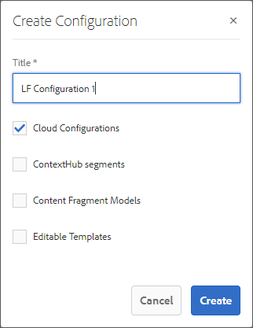
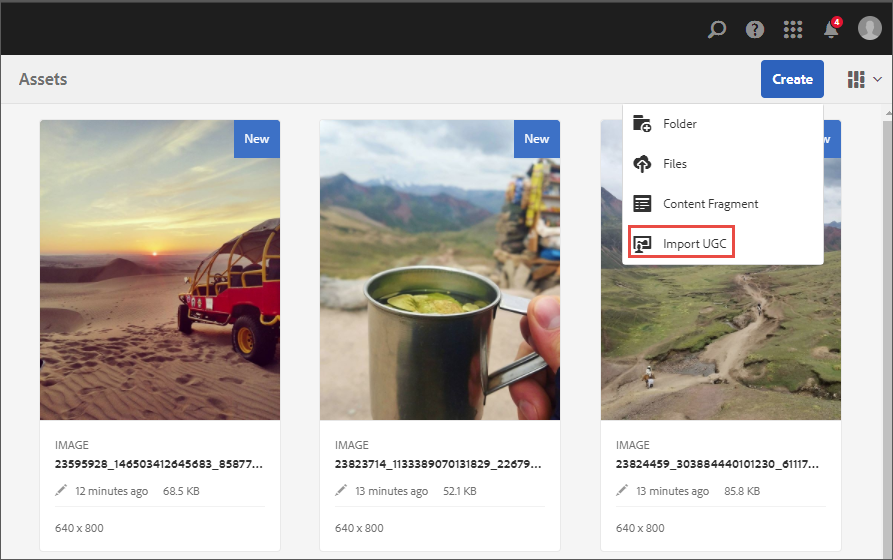

# Integreren met Livefyre{#integrating-with-livefyre}

Leer hoe u de toonaangevende curatiemogelijkheden van Livefy met uw AEM 6.5-exemplaar kunt integreren, zodat u in enkele minuten waardevolle door gebruikers gegenereerde inhoud (UGC) kunt publiceren van sociale netwerken naar uw site.

## Aan de slag {#getting-started}

### Livefyre-pakket installeren voor AEM {#install-livefyre-package-for-aem}

AEM 6.5 wordt geleverd met het Livefyre-functiepakket 1.2.6 vooraf geïnstalleerd. Dit pakket bevat alleen beperkte Livefyre-integratie met AEM Sites en moet worden verwijderd voordat een bijgewerkt pakket kan worden geïnstalleerd. Met het nieuwste pakket kunt u de volledige integratie van Livefyre met AEM ervaren, waaronder Sites, Assets en Commerce.

>[!NOTE]
>
>Sommige eigenschappen van het AEM-LF pakket hangen van Sociaal Kader (SCF) af. Als u het functiepakket Livefyre gebruikt als onderdeel van een site die geen gemeenschappen is, moet u declareren *cq.social.scf* als een afhankelijkheid in de clientlibs van de auteur van de website. Als u het LF eigenschappak als deel van een communautaire website gebruikt, zou deze gebiedsdeel reeds moeten worden verklaard.

1. Klik op de AEM **Gereedschappen** pictogram op de linkerspoorstaaf.
1. Navigeren naar **Implementatie > Pakketten**.
1. Blader in Pakketbeheer totdat u het vooraf geïnstalleerde Livefy-functiepakket ziet en klik vervolgens op de titel van het pakket **cq-social-livefyre-pkg-1.2.6.zip** om de opties uit te breiden.
1. Klikken **Meer > Verwijderen**.

   

1. LiveCycle-pakket downloaden van [Softwaredistributie](https://experience.adobe.com/#/downloads/content/software-distribution/en/aem.html).

1. Installeer het gedownloade pakket via Package Manager. Zie [Werken met pakketten](/help/sites-administering/package-manager.md) voor meer informatie over het gebruik van softwaredistributie en -pakketten in AEM

   

   Uw Livefyre-AEM-pakket is nu geïnstalleerd. Voordat u de integratiefuncties kunt gaan gebruiken, moet u AEM configureren om Livefyre te gebruiken.

   Voor meer informatie en versienota&#39;s op eigenschapspakken, zie [Functiepakketten](https://experienceleague.adobe.com/docs/experience-manager-65/release-notes/home.html).

### Configureer AEM voor gebruik van Livefyre: Een configuratiemap maken {#configure-aem-to-use-livefyre-create-a-configuration-folder}

1. Klik op de AEM **Gereedschappen** pictogram in de linkerspoorstaaf, dan navigeer aan **Algemeen > Configuratiebrowser**.
   * Zie de [Configuratiebrowser](/help/sites-administering/configurations.md) documentatie voor meer informatie.
1. Klikken **Maken** om het dialoogvenster Configuratie maken te openen.
1. Geef uw configuratie een naam en controleer de **Cloudconfiguraties** selectievakje.

   Hiermee maakt u een map onder **Extra > Implementatie > LiveCycle Configuration** met de opgegeven naam.

   

### Configureer AEM voor gebruik van Livefyre: Een LiveCycle-configuratie maken {#configure-aem-to-use-livefyre-create-a-livefyre-configuration}

Configureer AEM om de LiveCyre-licentiereferenties van uw organisatie te gebruiken, zodat communicatie tussen Livefyre en AEM mogelijk is.

1. Klik op de AEM **Gereedschappen** pictogram in de linkerspoorstaaf, dan navigeer aan **Implementatie > LiveCycle Configuration**.
1. Selecteer de configuratiemap waarin u een nieuwe configuratie van de Levensstijl wilt creëren, dan klik **Maken**.

   

   >[!NOTE]
   >
   >Mappen moeten de eigenschappen van Cloud Configurations hebben ingeschakeld voordat LiveCycle-configuraties eraan kunnen worden toegevoegd. Configuratiemappen worden gemaakt en beheerd in de [Configuratiebrowser.](/help/sites-administering/configurations.md)
   >
   >U kunt geen naam voor een configuratie-het wordt van verwijzingen voorzien door de weg van de omslag het binnen is. U kunt slechts één configuratie per map hebben.

1. Selecteer de nieuwe Livefyre-configuratiekaart en klik vervolgens op **Eigenschappen**.

   

1. Voer de Livefyre-gegevens van uw organisatie in en klik op **OK**.

   

   Voor toegang tot deze informatie opent u de Livefyre-studio en navigeert u naar **Instellingen > Integratie-instellingen > Referenties**.

   Uw AEM-instantie is nu geconfigureerd voor gebruik van LiveCycle en u kunt de integratiefuncties gebruiken.

### Integratie van Single Sign-On aanpassen {#customize-single-sign-on-integration}

Het Livefyre voor AEM pakket omvat een out-of-the-box integratie tussen de profielen van AEM Communities en de dienst van SSO van Livefyre.

Wanneer gebruikers zich aanmelden bij uw AEM, worden ze ook aangemeld bij sociale onderdelen van LiveCycle. Wanneer een aangemelde gebruiker een onderdeel van LiveCycle probeert te gebruiken dat verificatie vereist (zoals het uploaden van een foto), initieert de component LiveCyre gebruikersverificatie.

De standaardintegratie voor verificatie is mogelijk niet perfect voor elke site. Om de verificatiestroom in uw sitesjablonen het beste aan te passen, kunt u de standaard LiveCycle Authentication Delegate negeren en aan uw behoeften voldoen. Voer de volgende stappen uit:

1. CRXDE Lite gebruiken, kopiëren */libs/social/integrations/livefyre/components/authorizablecomponent/authclientLib* tot */apps/social/integrations/livefyre/components/authorizablecomponent/authclientLib*.
1. Bewerken en opslaan */apps/social/integrations/livefyre/components/authorizablecomponent/authclientlib/auth.js* om een Livefyre Auth Delegate uit te voeren die aan uw behoeften voldoet.

   Voor meer informatie bij het aanpassen van een Afgevaardigde van de Auth, zie [Identiteitsintegratie](https://answers.livefyre.com/developers/identity-integration/).

   Voor meer informatie over AEM Clientlibs raadpleegt u [Client-Side bibliotheken gebruiken](https://experienceleague.adobe.com/docs/experience-manager-65/developing/introduction/clientlibs.html).

## Livefyre gebruiken met AEM Sites {#use-livefyre-with-aem-sites}

### LiveCycle-componenten aan een pagina toevoegen {#add-livefyre-components-to-a-page}

Voordat u LiveCycle-componenten aan een pagina binnen Sites toevoegt, moet u LiveCycle voor de pagina inschakelen door een LiveCycle-cloudconfiguratie van een bovenliggende pagina over te nemen of door de configuratie rechtstreeks aan de pagina toe te voegen. Raadpleeg uw implementatie voor informatie over het opnemen van cloudservices op uw site.

Nadat LiveCycle is ingeschakeld voor de pagina, moeten containers zijn geconfigureerd om Livefyre-componenten toe te staan. Zie [Componenten configureren in ontwerpmodus](https://experienceleague.adobe.com/docs/experience-manager-65/authoring/siteandpage/default-components-designmode.html) voor instructies over hoe te om verschillende componenten toe te laten.

>[!NOTE]
>
>Toepassingen waarvoor verificatie moet worden gepost, werken pas nadat verificatie is geconfigureerd in Single Sign-On-integratie aanpassen.

1. Van de **Componenten** zijpaneel in ontwerpmodus, selecteer **Livefyre** in het menu om de lijst te beperken tot beschikbare LiveCycle-componenten.

   

1. Selecteer een component LiveCycle en sleep deze naar de gewenste positie op de pagina.
1. Selecteer of u een nieuwe LiveCycle-app wilt maken of een bestaande wilt insluiten.

   Als u een bestaande app insluit, AEM u wordt gevraagd de app te selecteren. Als u een nieuwe app maakt, moet de app worden ingevuld voordat er inhoud wordt weergegeven. De app wordt gemaakt op de livefyre-site en het netwerk dat is geselecteerd toen de cloudconfiguratie van LiveCycle voor de pagina is ingeschakeld.

   Zie voor meer informatie over het invoegen van componenten [Pagina-inhoud bewerken](https://experienceleague.adobe.com/docs/experience-manager-65/authoring/authoring/editing-content.html).

### Een LiveCycle-component voor een AEM pagina bewerken. {#edit-a-livefyre-component-for-an-aem-page}

U kunt een component Livefyre in Studio slechts vormen en uitgeven Livefyre. Van AEM:

1. Klik op de component LiveCycle om te configureren.
1. Klik op de knop **Configureren** pictogram (moersleutel) om het configuratiedialoogvenster te openen.
1. Klikken **Ga naar LiveCyre Studio om deze component te bewerken**.
1. Bewerk de app in LiveCyre Studio.

## Livefyre gebruiken met AEM Assets {#use-livefyre-with-aem-assets}

### Rechten aanvragen en UGC importeren in AEM Assets {#request-rights-and-import-ugc-into-aem-assets}

Met de UGC-importmodule kunt u door Twitter en Instagram door gebruikers gegenereerde inhoud (UGC) vanuit LiveCycle Studio naar AEM Assets importeren. Nadat u de inhoud hebt geselecteerd die u wilt importeren, moet u eerst rechten op de inhoud aanvragen voordat het importeren kan worden voltooid.

>[!NOTE]
>
>Voordat u middelen kunt gebruiken om UGC te importeren, moet u accounts voor sociale accounts en verzoeken om rechten instellen in LiveCycle Studio. Zie [Instellen: Verzoeken om rechten](https://docs.adobe.com/content/help/en/livefyre/using/rights-requests/c-how-requesting-rights-works.html) voor meer informatie .

UGC importeren in AEM Assets:

1. Navigeer vanaf de AEM homepage naar **Middelen > Bestanden**.
1. Klikken **Maken** en klik vervolgens op **UGC importeren.**

   

1. Inhoud zoeken:

   * Klik vanuit LiveCycle op het tabblad UGC-bibliotheek. Gebruik de filters en het onderzoek om inhoud van de Bibliotheek te vinden UGC.
   * Klik in Twitter en Instagram op het tabblad Twitter of Instagram. Gebruik de zoekopdracht of de filters om inhoud te zoeken.

1. Selecteer de elementen die u wilt importeren. De elementen die u selecteert, worden automatisch geteld en opgeslagen onder de **Geselecteerd** tab.
1. **Optioneel**: Klik op de knop **Geselecteerd** en bekijk de geselecteerde UGC-inhoud die u wilt importeren.
1. Klik op **Next**.

   

1. Kies voor aanvragen voor rechten een van de volgende opties voor elk element:

   Voor Instagram:

   * **Rechten handmatig aanvragen** om een bericht te krijgen dat via Instagram kan worden gekopieerd en geplakt en handmatig naar de eigenaars van inhoud kan worden verzonden.
   * **Rechten voor handmatig kenmerkende inhoud** om de rechten voor individuele activa te overschrijven.

   >[!NOTE]
   >
   >Vanwege updates die van invloed zijn op de aggregatie van inhoud van niet-zakelijke gebruikersaccounts, kunnen we geen opmerkingen meer namens u plaatsen of automatisch controleren op antwoorden van de auteur. [Klik hier voor meer informatie](https://developers.facebook.com/blog/post/2018/04/04/facebook-api-platform-product-changes/).

   

   Voor Twitter:

   * **Auteur van bericht** om een bericht te verzenden aan de eigenaar van de inhoud waarin om rechten voor het element wordt verzocht.
   * **Rechten voor handmatig kenmerkende inhoud** om de rechten voor individuele activa te overschrijven.

1. Klikken **Importeren**.

   Als u een Twitter-rechtenaanvraag hebt verzonden, ziet de eigenaar van de inhoud het rechtenaanvraagbericht op zijn account:

   

   >[!NOTE]
   >
   >Twitter heeft limieten voor identieke aanvragen die afkomstig zijn van hetzelfde account. Wanneer het invoeren van meer dan een paar activa, wijzig de berichten individueel om te vermijden die worden gemarkeerd.

1. Klikken **Gereed** in de rechterbovenhoek om de workflow voor het aanvragen van rechten te voltooien.

   U kunt de status zien van een aanvraag voor rechten in behandeling voor een middel in LiveCyre Studio. Als de inhoud in afwachting is van een verzoek om rechten, wordt het element pas in AEM Assets weergegeven als de rechten zijn verleend. Het middel verschijnt automatisch in AEM Assets wanneer een Verzoek van Rechten wordt verleend.

   Voor Instagram moet u het antwoord van de eigenaar van de inhoud volgen en handmatig rechten verlenen als u bepaalde rechten voor de inhoud hebt.

## Livefyre gebruiken met AEM Handel {#use-livefyre-with-aem-commerce}

### Productcatalogi met AEM handel in LiveCyre importeren {#import-product-catalogs-into-livefyre-with-aem-commerce}

AEM gebruikers van Commerce kunnen hun bestaande productcatalogus naadloos integreren in Livefyre om de betrokkenheid van gebruikers in de visualisatie-apps van Livefyre te stimuleren.

Nadat u de productcatalogus hebt geïmporteerd, worden de producten in real-time weergegeven in uw LiveCycle-instantie. Als u items bewerkt of verwijdert in de catalogus AEM Commerce-product, worden de wijzigingen automatisch bijgewerkt in LiveCycle.

1. Zorg ervoor dat u de nieuwste versie van Livefyre voor AEM pakket op uw AEM hebt geïnstalleerd.
1. Navigeer vanaf de AEM homepage naar **AEM Commerce**.
1. Maak een nieuwe verzameling of gebruik een bestaande verzameling.
1. Houd de muisaanwijzer boven de verzameling en klik op **Verzamelingseigenschappen** (potloodpictogram).
1. Controleren **Synchroniseren met LiveCycle**.
1. Invullen **Voorvoegsel van LiveCycle-pagina** om deze verzameling te koppelen aan een specifieke pagina in AEM.

   Het paginavoorvoegsel definieert het hoofdpad in uw omgeving waar het zoeken naar productpagina&#39;s begint. LiveCycle kiest de eerste pagina waaraan een overeenkomstig product is gekoppeld. Voor verschillende pagina&#39;s voor verschillende producten zijn meerdere verzamelingen nodig.

## Ondersteuningsmatrix AEM voor LiveCyre-apps {#aem-support-matrix-for-livefyre-apps}

| Livefyre Apps | AEM 6,1 | AEM 6,2 | AEM 6,3 | AEM 6,4 |
|---|---|---|---|---|
| Carousel | X | X | X | X |
| Chat | X | X | X | X |
| Opmerkingen | X | X | X | X |
| Filmstrip |  | X | X | X |
| LiveBlog | X | X | X | X |
| Kaart | X | X | X | X |
| Mediumwand | X | X | X | X |
| Mozaïek | X | X | X | X |
| Opiniepeiling |  | X | X | X |
| Revisies |  | X | X | X |
| Enkele kaart | X | X | X | X |
| Storiseren 2 |  | X | X | X |
| Trend |  | X | X | X |
| Knop Uploaden |  | X | X | X |
