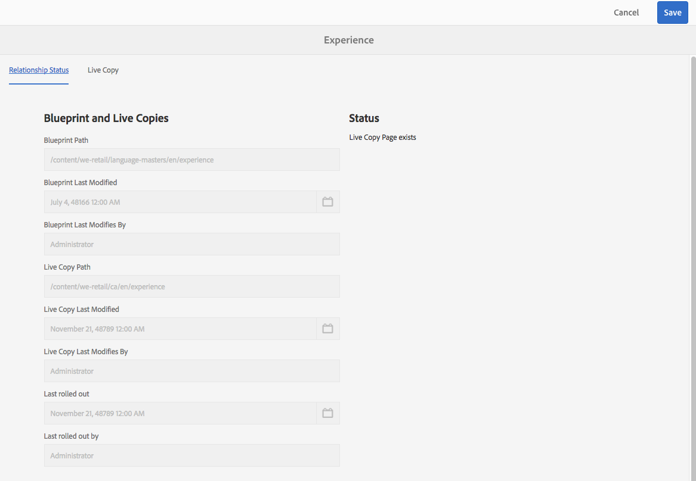

# Live Copy-overzichtsconsole{#live-copy-overview-console}

Met het **Live Copy-overzicht** kunt u:

* Overerving op een site weergeven/beheren:

   * De boomstructuur en de bijbehorende structuur van de live kopie samen met de overervingsstatus weergeven
   * de overervingsstatus wijzigen; onderbreek, hervat bijvoorbeeld
   * Vervagen en eigenschappen van actieve kopieën weergeven

* Uitrollen uitvoeren, acties

## Het Live Copy-overzicht openen {#opening-the-live-copy-overview}

U kunt het Live Copy-overzicht openen via het volgende:

* [Referenties in het zijpaneel van een blauwdrukpagina (Sites-console)](#opening-live-copy-overview-references-for-a-blueprint-page)
* [Eigenschappen van een blauwdrukpagina](#opening-live-copy-overview-properties-of-a-blueprint-page)

### Overzicht van live kopie openen - verwijzingen voor een vervagingspagina {#opening-live-copy-overview-references-for-a-blueprint-page}

Het **Live Copy-overzicht** kan worden geopend vanuit het zijpaneel **References** van de **Sites**-console:

1. In **Sites** console, [navigeer aan uw blauwdrukpagina en selecteer het ](/help/sites-authoring/basic-handling.md#viewing-and-selecting-resources).
1. Open het venster **[Referenties](/help/sites-authoring/basic-handling.md#references)** en selecteer **Actieve kopieën**.

   

   >[!NOTE]
   >
   >U kunt Referenties ook eerst openen en vervolgens de blauwdruk selecteren.

1. Selecteer **Overzicht van actieve kopie** om het overzicht van alle live kopieën met betrekking tot de geselecteerde blauwdruk weer te geven en te gebruiken.
1. Gebruik **Close** om af te sluiten en terug te keren naar de **Sites**-console.

### Overzicht van live kopie openen - eigenschappen van een vervagingspagina {#opening-live-copy-overview-properties-of-a-blueprint-page}

Het **Live Copy-overzicht** kan worden geopend wanneer u eigenschappen van een blauwdrukpagina bekijkt:

1. Open **Eigenschappen** voor de aangewezen blauwdrukpagina.
1. Open het tabblad **Vervagen** - de optie **Live kopie overzicht** wordt weergegeven op de bovenste werkbalk:

   

1. Selecteer **Overzicht van actieve kopie** om het overzicht van alle actieve kopieën met betrekking tot de huidige blauwdruk weer te geven en te gebruiken.

   >[!NOTE]
   >
   >Zie ook het Knowledge Base-artikel [Livecopy status message - Up-to-date/Green/In Sync](https://helpx.adobe.com/experience-manager/kb/livecopy-status-message---up-to-date-green-in-sync.html) voor meer informatie.

1. Gebruik **Close** om af te sluiten en terug te keren naar de **Sites**-console.

## Het gebruiken van het Levende Overzicht van het Exemplaar {#using-the-live-copy-overview}

Het **Live Copy-overzicht** kan ook worden gebruikt om handelingen uit te voeren op de actieve kopie:

1. Open **Live Copy Overview**.
1. Selecteer de vereiste blauwdruk of pagina voor live kopiëren. De werkbalk wordt bijgewerkt en toont de beschikbare acties. De [beschikbare acties](/help/sites-administering/msm.md#terms-used) hangen af van het feit of u een [blauwdruk](#actions-for-a-blueprint-page) of [live kopie](#actions-for-a-live-copy-page) pagina selecteert:

### Handelingen voor een blauwdrukpagina {#actions-for-a-blueprint-page}

Wanneer u een blauwdrukpagina selecteert, zijn de volgende acties beschikbaar:

* Bewerken

   * Open de pagina met de blauwdruk om deze te bewerken.

* [Uitrol](/help/sites-administering/msm.md#rollout-and-synchronize)

   * Voer een rollout uit om wijzigingen van de bron naar de livecopy te duwen.

### Handelingen voor een pagina {#actions-for-a-live-copy-page} van Actieve kopie

Wanneer u een pagina voor live kopiëren selecteert, zijn de volgende acties beschikbaar:

* Bewerken

   * Open de pagina voor live kopiëren voor bewerken.

* [Relationistatiestatus](#relationship-status)

   * Informatie weergeven over de status en overerving.

* [Synchroniseren](/help/sites-administering/msm.md#rollout-and-synchronize)

   * Synchroniseer een live kopie om wijzigingen van de bron naar de livecopy over te brengen.

* [Herstellen](/help/sites-administering/msm-livecopy.md#resetting-a-live-copy-page)

   * Stel een live kopieerpagina opnieuw in om alle overervingsannuleringen te verwijderen en de pagina terug te brengen naar dezelfde status als de bronpagina.

* [Onderbreken](/help/sites-administering/msm.md#suspending-and-cancelling-inheritance-and-synchronization)

   * Hiermee deactiveert u tijdelijk de live relatie tussen een live kopie en de bijbehorende blauwdrukpagina.

* [Hervatten](/help/sites-administering/msm-livecopy.md#resuming-inheritance-for-a-page)

   * Met Hervatten kunt u een geschorste relatie herstellen.

* [Loskoppelen](/help/sites-administering/msm.md#detaching-a-live-copy)

   * Hiermee verwijdert u permanent de live relatie tussen een live kopie en de bijbehorende blauwdrukpagina.

## Relatiestatus {#relationship-status}

De **Relationship Status** console heeft twee lusjes die een waaier van functionaliteit verstrekken:

* [Relatie statusinformatie](#relationship-status-information)
* [Informatie over live kopiëren](#live-copy-information)

### Informatie over verbindingsstatus {#relationship-status-information}

Dit tabblad bevat gedetailleerde informatie over de status van de relatie tussen de blauwdruk en de live kopie:

### Informatie over live kopiëren {#live-copy-information}

Op dit tabblad kunt u de configuratie van de live kopie weergeven en bewerken:

