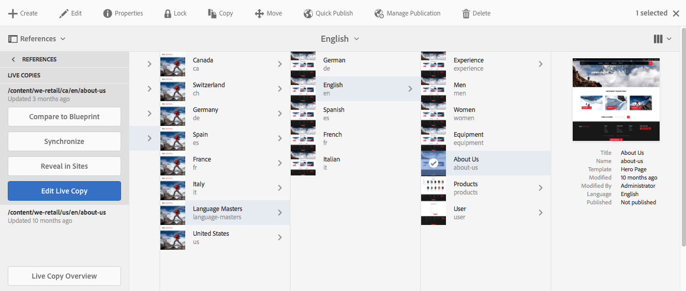

# Console voor live kopiëren{#live-copy-overview-console}

De **Overzicht van live kopiëren** biedt de volgende mogelijkheden:

* Overerving op een site weergeven/beheren:

   * De boomstructuur en de bijbehorende structuur van de live kopie samen met de overervingsstatus weergeven
   * Wijzig de overervingsstatus, bijvoorbeeld de status Opschorten, Hervatten
   * Vervagen en eigenschappen van actieve kopieën weergeven

* Uitrollen uitvoeren, acties

## Het Live Copy-overzicht openen {#opening-the-live-copy-overview}

U kunt het Live Copy-overzicht openen via het volgende:

* [Referenties in het zijpaneel van een blauwdrukpagina (Sites-console)](#opening-live-copy-overview-references-for-a-blueprint-page)
* [Eigenschappen van een blauwdrukpagina](#opening-live-copy-overview-properties-of-a-blueprint-page)

### Overzicht van Live kopie openen - verwijzingen voor een vervagingspagina {#opening-live-copy-overview-references-for-a-blueprint-page}

De **Overzicht van live kopiëren** kan worden geopend vanuit de **Verwijzingen** zijpaneel van **Sites** console:

1. In de **Sites** console, [navigeer naar uw blauwdrukpagina en selecteer deze](/help/sites-authoring/basic-handling.md#viewing-and-selecting-resources).
1. Open de **[Verwijzingen](/help/sites-authoring/basic-handling.md#references)** en selecteert u **Actieve kopieën**.

   

   >[!NOTE]
   >
   >U kunt Referenties ook eerst openen en vervolgens de blauwdruk selecteren.

1. Selecteren **Overzicht van live kopiëren** om het overzicht van alle live kopieën met betrekking tot de geselecteerde blauwdruk weer te geven en te gebruiken.
1. Gebruiken **Sluiten** om te vertrekken en terug te keren naar de **Sites** console.

### Live Copy-overzicht openen - Eigenschappen van een vervagingspagina {#opening-live-copy-overview-properties-of-a-blueprint-page}

De **Overzicht van live kopiëren** kan worden geopend wanneer u de eigenschappen van een pagina met een blauwdruk bekijkt:

1. Openen **Eigenschappen** voor de juiste blauwdrukpagina.
1. Open de **Blauwdruk** tab - the **Overzicht van live kopiëren** Deze optie wordt weergegeven in de bovenste werkbalk:

   

1. Selecteren **Overzicht van live kopiëren** om het overzicht van alle actieve kopieën met betrekking tot de huidige blauwdruk weer te geven en te gebruiken.

   >[!NOTE]
   >
   >Zie ook het artikel in de Knowledge Base voor meer informatie [Livecopy status message - Up-to-date/Green/In Sync](https://helpx.adobe.com/experience-manager/kb/livecopy-status-message---up-to-date-green-in-sync.html).

1. Gebruiken **Sluiten** om te vertrekken en terug te keren naar de **Sites** console.

## Het Live Copy-overzicht gebruiken {#using-the-live-copy-overview}

De **Overzicht van live kopiëren** kan ook worden gebruikt om acties op het levende exemplaar uit te voeren:

1. Open de **Overzicht van live kopiëren**.
1. Selecteer de vereiste blauwdruk of pagina voor live kopiëren. De werkbalk wordt bijgewerkt en toont de beschikbare acties. De [handelingen](/help/sites-administering/msm.md#terms-used) afhankelijk van de vraag of u een [blauwdruk](#actions-for-a-blueprint-page) of [live kopie](#actions-for-a-live-copy-page) pagina:

### Handelingen voor een vervagingspagina {#actions-for-a-blueprint-page}

Wanneer u een blauwdrukpagina selecteert, zijn de volgende acties beschikbaar:

* Bewerken

   * Open de pagina met de blauwdruk om deze te bewerken.

* [Uitrol](/help/sites-administering/msm.md#rollout-and-synchronize)

   * Voer een rollout uit om wijzigingen van de bron naar de livecopy te duwen.

### Handelingen voor een Live Copy-pagina {#actions-for-a-live-copy-page}

Wanneer u een pagina voor live kopiëren selecteert, zijn de volgende acties beschikbaar:

* Bewerken

   * Open de pagina voor live kopiëren voor bewerken.

* [Relatie status](#relationship-status)

   * Informatie weergeven over de status en overerving.

* [Synchroniseren](/help/sites-administering/msm.md#rollout-and-synchronize)

   * Synchroniseer een live kopie om wijzigingen van de bron naar de livecopy over te brengen.

* [Herstellen](/help/sites-administering/msm-livecopy.md#resetting-a-live-copy-page)

   * Stel een live kopieerpagina opnieuw in om alle overervingsannuleringen te verwijderen en de pagina terug te brengen naar dezelfde status als de bronpagina.

* [Onderbreken](/help/sites-administering/msm.md#suspending-and-cancelling-inheritance-and-synchronization)

   * Hiermee deactiveert u tijdelijk de live relatie tussen een live kopie en de bijbehorende blauwdrukpagina.

* [Hervatten](/help/sites-administering/msm-livecopy.md#resuming-inheritance-for-a-page)

   * Met Hervatten kunt u een geschorste relatie herstellen.

* [Loskoppelen](/help/sites-administering/msm.md#detaching-a-live-copy)

   * Hiermee verwijdert u permanent de live relatie tussen een live kopie en de bijbehorende blauwdrukpagina.

## Relatie status {#relationship-status}

De **Relatie status** console heeft twee tabbladen die een reeks functies bieden:

* [Relatie statusinformatie](#relationship-status-information)
* [Informatie over live kopiëren](#live-copy-information)

### Relatie statusinformatie {#relationship-status-information}

Dit tabblad bevat gedetailleerde informatie over de status van de relatie tussen de blauwdruk en de live kopie:

### Informatie over live kopiëren {#live-copy-information}

Op dit tabblad kunt u de configuratie van de live kopie weergeven en bewerken:

