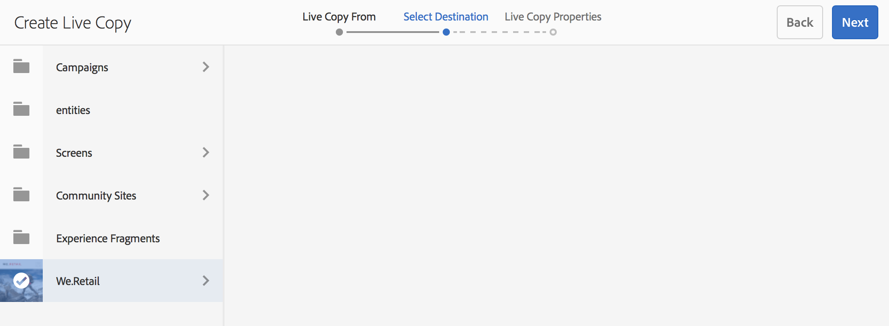
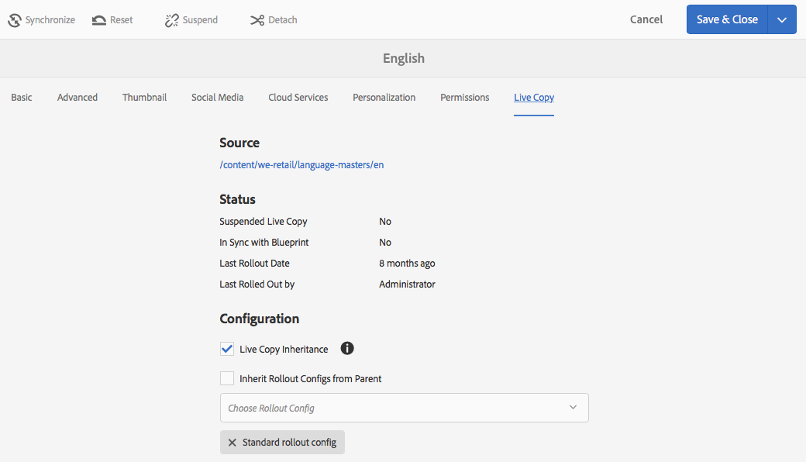
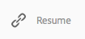
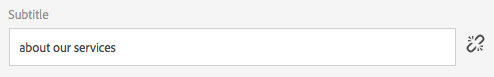

# Actieve kopieën maken en synchroniseren{#creating-and-synchronizing-live-copies}

U kunt een live kopie maken van een pagina- of blauwdrukconfiguratie en vervolgens overerving en synchronisatie beheren.

## Configuraties van blauwdrukken beheren {#managing-blueprint-configurations}

Een blauwdrukconfiguratie identificeert een bestaande website die u als bron voor één of meerdere levende exemplaarpagina&#39;s wilt gebruiken.

>[!NOTE]
>
>Met vervagingsconfiguraties kunt u wijzigingen in de inhoud doorvoeren in live kopieën. Zie [Actieve exemplaren - Bron, Blauwdrukken en Blauwdrukconfiguraties](/help/sites-administering/msm.md#source-blueprints-and-blueprint-configurations).

Wanneer u een blauwdrukconfiguratie creeert, selecteert u een malplaatje dat de interne structuur van de blauwdruk bepaalt. In de standaardsjabloon voor blauwdrukken wordt ervan uitgegaan dat de bronwebsite de volgende kenmerken heeft:

* De website heeft een hoofdpagina.
* De directe onderliggende pagina&#39;s van de hoofdmap zijn taalvertakkingen van de website. Wanneer u een live kopie maakt, worden de talen weergegeven als optionele inhoud die in de kopie moet worden opgenomen.
* De hoofdmap van elke taalvertakking bevat een of meer onderliggende pagina&#39;s. Wanneer u een live kopie maakt, worden onderliggende pagina&#39;s weergegeven als hoofdstukken die u in de live kopie kunt opnemen.

>[!NOTE]
>
>Een andere structuur vereist een andere blauwdruksjabloon.

Nadat u de blauwdrukconfiguratie creeert, vormt u de volgende eigenschappen:

* **Naam**: De naam van de configuratie van de blauwdruk.
* **Bronpad**: Het pad van de hoofdpagina van de site die u als bron (blauwdruk) gebruikt.
* **Beschrijving**. (Optioneel) Een beschrijving van de configuratie van de blauwdruk. De beschrijving wordt weergegeven in de lijst met blauwdrukconfiguraties waaruit u kunt kiezen bij het maken van een site.

Wanneer uw blauwdrukconfiguratie wordt gebruikt, kunt u het met een rollout configuratie associëren die bepaalt hoe de levende exemplaren van de bron/de blauwdruk worden gesynchroniseerd. Zie [De te gebruiken configuraties van de Output specificeren](/help/sites-administering/msm-sync.md#specifying-the-rollout-configurations-to-use).

### Een blauwdrukconfiguratie maken {#creating-a-blueprint-configuration}

Een blauwdrukconfiguratie maken:

1. [Navigeer ](/help/sites-authoring/basic-handling.md#global-navigation) naar het menu  **** Opties en selecteer vervolgens het menu  **** Sites.
1. Selecteer **Blauwdrukken** om de **Blueprint Configurations**-console te openen:

   

1. Selecteer **Maken**.
1. Selecteer de blauwdruksjabloon en **Volgende** om door te gaan.
1. Selecteer de bronpagina die als blauwdruk moet worden gebruikt; dan **Volgende** om verder te gaan.
1. Definiëren:

   * **Titel**: verplichte titel voor de blauwdruk
   * **Omschrijving**: een optionele beschrijving voor meer informatie.

1. **** CreateCreate zal tot de blauwdrukconfiguratie leiden die op uw specificatie wordt gebaseerd.

### Een configuratie van een blauwdruk bewerken of verwijderen {#editing-or-deleting-a-blueprint-configuration}

U kunt een bestaande configuratie van de blauwdruk bewerken of verwijderen:

1. [Navigeer ](/help/sites-authoring/basic-handling.md#global-navigation) naar het menu  **** Opties en selecteer vervolgens het menu  **** Sites.
1. Selecteer **Blauwdrukken** om de **Blueprint Configurations**-console te openen:

   

1. Selecteer de vereiste blauwdrukconfiguratie. De juiste acties worden beschikbaar op de werkbalk:

   * **Eigenschappen**; u kunt dit gebruiken om de eigenschappen van de configuratie te bekijken en dan uit te geven.
   * **Verwijderen**

   

## Een actieve kopie maken {#creating-a-live-copy}

### Een actieve kopie van een pagina maken {#creating-a-live-copy-of-a-page}

U kunt een live kopie van elke pagina of vertakking maken. Wanneer u de live kopie maakt, kunt u de rollout-configuraties opgeven die moeten worden gebruikt voor het synchroniseren van de inhoud:

* De geselecteerde rollout-configuraties zijn van toepassing op de live kopieerpagina en de onderliggende pagina&#39;s.
* Als u geen rollout configuraties specificeert, bepaalt MSM welke rollout configuraties aan gebruik. Zie [Specifying the Rollout Configuration to Use](/help/sites-administering/msm-sync.md#specifying-the-rollout-configurations-to-use).

U kunt een live kopie van elke pagina maken:

* Pagina&#39;s die door [blauwdrukconfiguratie](#creating-a-blueprint-configuration) van verwijzingen worden voorzien.
* En pagina&#39;s die geen verbinding met een configuratie hebben.
* AEM ondersteunt ook het maken van een live kopie op de pagina&#39;s van een andere live kopie.

Het enige verschil is dat de beschikbaarheid van het **bevel Rollout** op de bron/blauwdruk pagina&#39;s afhankelijk is van of de bron door een blauwdrukconfiguratie van verwijzingen wordt voorzien:

* Als u het levende exemplaar van een bronpagina creeert die **is** in een blauwdrukconfiguratie van verwijzingen voorzien, dan zal het bevel van de Uitvoer beschikbaar op de bron/blauwdruk pagina(s) zijn.
* Als u het levende exemplaar van een bronpagina creeert die **niet** in een blauwdrukconfiguratie van verwijzingen wordt voorzien, dan zal het bevel van de Uitvoer niet beschikbaar op de bron/blauwdruk pagina(s) zijn.

Een live kopie maken:

1. Selecteer **Create** in de **Sites**-console en **Live Copy**.

   

1. Selecteer de bronpagina en klik of tik op **Next**. Bijvoorbeeld:

   

1. Geef het doelpad van de live kopie op (open de bovenliggende map/pagina van de live kopie) en klik of tik op **Volgende**.

   

   >[!NOTE]
   >
   >Het doelpad kan zich niet binnen het bronpad bevinden.

1. Enter:

   * a **Titel** voor de pagina.
   * a **Naam**, die in URL wordt gebruikt.

   

1. Gebruik het selectievakje **Subpagina&#39;s uitsluiten**:

   * Geselecteerd: Alleen een live kopie van de geselecteerde pagina maken (oppervlakkige live kopie)
   * Niet geselecteerd: een live kopie maken die alle onderliggende elementen van de geselecteerde pagina bevat (diepe live kopie)

1. (Optioneel) Als u een of meer rollout-configuraties voor de livecopy wilt gebruiken, gebruikt u de vervolgkeuzelijst **Rollout Configs** om deze te selecteren. geselecteerde configuraties worden weergegeven onder de keuzelijst.
1. Klik of tik **Create**. Er wordt een bevestigingsbericht weergegeven. Hiervanaf kunt u **Open** of **Done** selecteren.

### Een live kopie van een site maken op basis van een blauwdrukconfiguratie {#creating-a-live-copy-of-a-site-from-a-blueprint-configuration}

Maak een live kopie met behulp van een blauwdrukconfiguratie om een site te maken op basis van de blauwdrukinhoud (bron). Wanneer u een levend exemplaar van een blauwdrukconfiguratie creeert, selecteert u één of meerdere taaltakken van de blauwdrukbron om te kopiëren, dan selecteert u de hoofdstukken om van de taaltakken te kopiëren. Zie [Een configuratie van de Vervaging maken](/help/sites-administering/msm-livecopy.md#creating-a-blueprint-configuration).

Als u sommige taalvertakkingen of hoofdstukken van het levende exemplaar weglaat, kunt u hen later toevoegen; zie [Een actieve kopie maken in een live kopie (configuratie blauwdruk)](#creating-a-live-copy-inside-a-live-copy-blueprint-configuration).

>[!CAUTION]
>
>Wanneer de bron van de blauwdruk verbindingen en verwijzingen bevat die een paragraaf in een verschillende tak richten, worden de doelstellingen niet bijgewerkt in de levende exemplaarpagina&#39;s, maar blijven gericht aan de originele bestemming.

Geef bij het maken van de site waarden op voor de volgende eigenschappen:

* **Oorspronkelijke talen**: De taalvertakkingen van de blauwdrukbron die in de live kopie moeten worden opgenomen.
* **Oorspronkelijke hoofdstukken**: De onderliggende pagina&#39;s van de blauwdruktaal vertakken zich om in het levende exemplaar te omvatten.
* **Doelpad**: De locatie van de hoofdpagina van de live kopieersite.
* **Titel**: De titel van de hoofdpagina van de live kopieersite.
* **Naam**: (Optioneel) De naam van het JCR-knooppunt dat de hoofdpagina van de live kopie opslaat. De standaardwaarde is gebaseerd op de titel.
* **Eigenaar** van site: (Optioneel)
* **Live kopie**: Selecteer deze optie om een live relatie met de bronsite tot stand te brengen. Als u deze optie niet selecteert, wordt een kopie van de blauwdruk gemaakt, maar wordt deze niet gesynchroniseerd met de bron.
* **Uitrolconfiguratie**: (Optioneel) Selecteer een of meer rollout-configuraties die u wilt gebruiken voor het synchroniseren van de livekopie. Standaard worden de rollout-configuraties overgeërfd van de blauwdruk. Zie [De te gebruiken configuraties van de Uitvoer specificeren](/help/sites-administering/msm-sync.md#specifying-the-rollout-configurations-to-use) voor meer details.

Een live kopie van een site maken op basis van een blauwdrukconfiguratie:

1. Selecteer **Maken** in de **Sites**-console en **Site** in de keuzelijst.
1. Selecteer de blauwdrukconfiguratie die u als bron van de live kopie wilt gebruiken en ga verder met **Next**:

   

1. Met de kiezer **Oorspronkelijke talen** kunt u de taal of talen van de blauwdruksite opgeven die voor de live kopie moet worden gebruikt.

   Standaard zijn alle beschikbare talen geselecteerd. Als u een taal wilt verwijderen, klikt of tikt u op de **X** die naast de taal wordt weergegeven.

   Bijvoorbeeld:

   

1. Met de vervolgkeuzelijst **Eerste hoofdstukken** kunt u de secties van de blauwdruk selecteren die u in de actieve kopie wilt opnemen. Opnieuw zijn alle beschikbare hoofdstukken inbegrepen door gebrek, maar kunnen worden verwijderd.
1. Geef waarden op voor de overige eigenschappen en selecteer **Maken**. Selecteer **Done** in het bevestigingsdialoogvenster om terug te keren naar de **Sites**-console of **Open Site** om de hoofdpagina van de site te openen.

### Een actieve kopie maken in een live kopie (configuratie blauwdruk) {#creating-a-live-copy-inside-a-live-copy-blueprint-configuration}

Wanneer u een levende kopie binnen de bestaande live kopie (gemaakt met behulp van een blauwdrukconfiguratie) maakt, kunt u elke taalkopie of hoofdstukken invoegen die niet waren opgenomen toen de live kopie oorspronkelijk werd gemaakt.

## Uw actieve kopie controleren {#monitoring-your-live-copy}

### De status van een actieve kopie bekijken {#seeing-the-status-of-a-live-copy}

De eigenschappen van een pagina met live kopieën geven de volgende informatie over de live kopie weer:

* **Bron**: De bronpagina van de pagina voor live kopiëren.
* **Status**: De synchronisatiestatus van de live kopie. De status omvat of de live kopie up-to-date is met de bron, en wanneer de laatste synchronisatie heeft plaatsgevonden en wie de synchronisatie heeft uitgevoerd.
* **Configuratie**:

   * Of de pagina nog steeds onderhevig is aan overerving van live-kopieën.
   * Of de configuratie wordt overgeërfd van de ouderpagina.
   * Om het even welke rollout configuraties die het levende exemplaar gebruikt.

De eigenschappen weergeven:

1. Selecteer in de console **Sites** de pagina met de livekopie en open de eigenschappen.
1. Selecteer het tabblad **Live kopie**.

   Bijvoorbeeld:

   

   >[!NOTE]
   >
   >Zie ook het Knowledge Base-artikel [Livecopy status message - Up-to-date/Green/In Sync](https://helpx.adobe.com/experience-manager/kb/livecopy-status-message---up-to-date-green-in-sync.html) voor meer informatie.

### Live kopieën van een vervagingspagina bekijken {#seeing-the-live-copies-of-a-blueprint-page}

De pagina&#39;s van de blauwdruk (die in een blauwdrukconfiguratie van verwijzingen worden voorzien) verstrekken u een lijst van de levende exemplaarpagina&#39;s die de huidige (blauwdruk) pagina als bron gebruiken. Gebruik deze lijst om de live kopieën bij te houden. De lijst wordt weergegeven op het tabblad **Blauwdruk** van de [pagina-eigenschappen](/help/sites-authoring/editing-page-properties.md).

## Uw actieve kopie synchroniseren {#synchronizing-your-live-copy}

### Een blauwdruk {#rolling-out-a-blueprint} uitrollen

Leer een pagina van de blauwdruk uit om inhoudsveranderingen in levende exemplaren te duwen. Een **Rollout** actie voert de rollout configuraties uit die [op trekker ](/help/sites-administering/msm-sync.md#rollout-triggers) gebruiken.

>[!NOTE]
>
>Conflicten kunnen optreden als er nieuwe pagina&#39;s met dezelfde paginanaam worden gemaakt in zowel de vertakking Verblauwdrukken als een afhankelijke vertakking voor live kopieën.
>
>Dergelijke [conflicten moeten worden behandeld en worden opgelost bij rollout](/help/sites-administering/msm-rollout-conflicts.md).

#### Een vervaging uitrollen uit pagina-eigenschappen {#rolling-out-a-blueprint-from-page-properties}

1. Selecteer in de console **Sites** de pagina in de blauwdruk en open de eigenschappen.
1. Open het tabblad **Vervagen**.
1. Selecteer **Uitvoer**.

   

1. Geef de pagina&#39;s en eventuele subpagina&#39;s op en bevestig vervolgens met het vinkje:

   

1. Specificeer als de rollout baan onmiddellijk (**Now**) of op een andere datum/tijd (**Later**) zou moeten worden uitgevoerd.

   

Rollen worden verwerkt als asynchrone taken en kunnen worden gecontroleerd in het [**Async Job Status** dashboard](asynchronous-jobs.md#monitor-the-status-of-asynchronous-operations) op **Global Navigation** -> **Tools** -> **Operations** -> **Jobs**

>[!NOTE]
>
>Voor asynchrone rollout-verwerking is AEM 6.5.3.0 of hoger vereist. In vorige versies werden pagina&#39;s direct en synchroon verwerkt.

#### Een blauwdruk uitrollen vanuit de referentierail {#roll-out-a-blueprint-from-the-reference-rail}

1. Selecteer in de console **Sites** de pagina in de blauwdruk en open het deelvenster **[Referenties](/help/sites-authoring/basic-handling.md#references)** (vanuit de werkbalk).
1. Selecteer de optie **Vervagen** in de lijst om de blauwdrukken weer te geven die aan deze pagina zijn gekoppeld.
1. Selecteer de gewenste blauwdruk in de lijst.
1. Klik of tik **Uitvoer**.
1. U wordt gevraagd de details van de rollout te bevestigen:

   * **Uitrolbereik**:

      Geef op of het bereik alleen voor de geselecteerde pagina is of dat subpagina&#39;s moeten worden opgenomen.

   * **Schema**:

      Specificeer als de rollout baan onmiddellijk (**Now**) of op een recentere datum/tijd (**Later**) zou moeten worden uitgevoerd.

      

1. Nadat u deze details hebt bevestigd, selecteert u **Uitvoer** om de handeling uit te voeren.

Rollen worden verwerkt als asynchrone taken en kunnen worden gecontroleerd in het [**Async Job Status** dashboard](asynchronous-jobs.md#monitor-the-status-of-asynchronous-operations) op **Global Navigation** -> **Tools** -> **Operations** -> **Jobs**

>[!NOTE]
>
>Voor asynchrone rollout-verwerking is AEM 6.5.3.0 of hoger vereist. In vorige versies werden pagina&#39;s direct en synchroon verwerkt, tenzij de optie **Achtergronduitrol** was ingeschakeld.

#### Een blauwdruk uitrollen met het actieve-kopieoverzicht {#roll-out-a-blueprint-from-the-live-copy-overview}

De actie [Rollout is ook beschikbaar bij het Levende Overzicht van het Exemplaar ](/help/sites-administering/msm-livecopy-overview.md#using-the-live-copy-overview), wanneer een pagina van de Vervaging wordt geselecteerd.

1. Open het [Live Copy-overzicht](/help/sites-administering/msm-livecopy-overview.md#using-the-live-copy-overview) en selecteer een vervagingspagina.
1. Selecteer **Uitvoer** van de toolbar.
1. Geef de pagina&#39;s en eventuele subpagina&#39;s op en bevestig vervolgens met het vinkje:

   

1. Specificeer als de rollout baan onmiddellijk (**Now**) of op een andere datum/tijd (**Later**) zou moeten worden uitgevoerd.

   

Rollen worden verwerkt als asynchrone taken en kunnen worden gecontroleerd in het [**Async Job Status** dashboard](asynchronous-jobs.md#monitor-the-status-of-asynchronous-operations) op **Global Navigation** -> **Tools** -> **Operations** -> **Jobs**

>[!NOTE]
>
>Voor asynchrone rollout-verwerking is AEM 6.5.3.0 of hoger vereist. In vorige versies werden pagina&#39;s direct en synchroon verwerkt.

### Een actieve kopie synchroniseren {#synchronizing-a-live-copy}

Synchroniseer een pagina voor live kopieën om wijzigingen in de inhoud van de bron naar de live kopie over te brengen.

#### Een actieve kopie van pagina-eigenschappen synchroniseren {#synchronize-a-live-copy-from-page-properties}

Synchroniseer een live kopie om wijzigingen van de bron naar de livecopy over te brengen.

>[!NOTE]
>
>Het synchroniseren voert de rollout configuraties uit die de [Bij trekker ](/help/sites-administering/msm-sync.md#rollout-triggers) gebruiken.

1. Selecteer in de console **Sites** de pagina met de livekopie en open de eigenschappen.
1. Open het tabblad **Live kopie**.
1. Klik of tik **Synchroniseren**.

   

   Bevestiging wordt aangevraagd. Gebruik **Sync** om door te gaan.

#### Een actieve kopie synchroniseren vanuit het Live Copy-overzicht {#synchronize-a-live-copy-from-the-live-copy-overview}

De actie [Synchroniseren is ook beschikbaar bij het Live Copy-overzicht](/help/sites-administering/msm-livecopy-overview.md#using-the-live-copy-overview) wanneer een Live Copy-pagina is geselecteerd.

1. Open het [Live Copy-overzicht](/help/sites-administering/msm-livecopy-overview.md#using-the-live-copy-overview) en selecteer een Live Copy-pagina.
1. Selecteer **Synchroniseren** op de werkbalk.
1. Bevestig de handeling **Uitvoer** in het dialoogvenster nadat u hebt opgegeven of u het volgende wilt opnemen:

   * **Pagina- en subpagina&#39;s**
   * **Alleen pagina**

   

## Inhoud van actieve kopie wijzigen {#changing-live-copy-content}

Als u inhoud voor live kopieën wilt wijzigen, kunt u:

* Voeg alinea&#39;s toe aan de pagina.
* Bestaande inhoud bijwerken door de overerving van live kopieën voor een pagina of component te verbreken.

>[!NOTE]
>
>Als u handmatig een nieuwe pagina maakt in de live kopie, is deze lokaal bij de live kopie, wat betekent dat er geen bijbehorende bronpagina aan is gekoppeld.
>
>De beste praktijken om een lokale pagina tot stand te brengen die deel van de verhouding uitmaakt zouden het in de bron moeten creëren en (diepe) rollout doen. Hierdoor wordt de pagina lokaal gemaakt als live kopieën.

>[!NOTE]
>
>Conflicten kunnen optreden als er nieuwe pagina&#39;s met dezelfde paginanaam worden gemaakt in zowel de vertakking Verblauwdrukken als een afhankelijke vertakking voor live kopieën.
>
>Dergelijke [conflicten moeten worden behandeld en worden opgelost bij rollout](/help/sites-administering/msm-rollout-conflicts.md).

### Componenten toevoegen aan een Live Copy-pagina {#adding-components-to-a-live-copy-page}

Voeg op elk gewenst moment componenten toe aan een pagina voor live kopieën. De overervingsstatus van de live kopie en het bijbehorende alineasysteem bepaalt niet hoe u componenten kunt toevoegen.

Wanneer de pagina met live kopieën wordt gesynchroniseerd met de bronpagina, blijven de toegevoegde componenten ongewijzigd. Zie ook [De volgorde van componenten op een Live Copy-pagina wijzigen](#changing-the-order-of-components-on-a-live-copy-page).

>[!NOTE]
>
>Wijzigingen die lokaal worden aangebracht in een component die als container is gemarkeerd, worden niet overschreven door de inhoud van de blauwdruk op een rollout. Zie [Beste praktijken MSM](/help/sites-administering/msm-best-practices.md#components-and-container-synchronization) voor meer informatie.

### Overerving voor een pagina {#suspending-inheritance-for-a-page} opschorten

Wanneer u een live kopie maakt, wordt de live kopieerconfiguratie opgeslagen op de hoofdpagina van de gekopieerde pagina&#39;s. Alle onderliggende pagina&#39;s van de hoofdpagina nemen de configuraties van de actieve kopie over. De componenten op de bibliotheekpagina&#39;s erven ook de live kopieerconfiguratie.

U kunt de overerving van live kopieën voor een live kopieerpagina opschorten, zodat u pagina-eigenschappen en -componenten kunt wijzigen. Wanneer u overerving onderbreekt, worden de pagina-eigenschappen en -componenten niet meer gesynchroniseerd met de bron.

>[!NOTE]
>
>U kunt ook [een live kopie](#detaching-a-live-copy) loskoppelen van de blauwdruk om alle verbindingen te verwijderen. De handeling Loskoppelen is permanent en niet-omkeerbaar.

#### Overerving van pagina-eigenschappen opheffen {#suspending-inheritance-from-page-properties}

Overerving op een pagina opschorten:

1. Open de eigenschappen van de live kopieerpagina met de opdracht **Eigenschappen weergeven** van de console **Sites** of met **Pagina-informatie** op de pagina-werkbalk.
1. Klik of tik **Live kopie** tabel.
1. Selecteer **Onderbreken** van de toolbar. Vervolgens kunt u kiezen uit:

   * **Onderbreken**: Alleen huidige pagina
   * **Onderbreken met kinderen**: huidige pagina samen met onderliggende pagina&#39;s

1. Selecteer **Suspend** op de bevestigingsdialoog.

#### Overerving onderbreken vanuit het Live Copy-overzicht {#suspending-inheritance-from-the-live-copy-overview}

De handeling [Stoppen is ook beschikbaar in het Live Copy-overzicht](/help/sites-administering/msm-livecopy-overview.md#using-the-live-copy-overview) wanneer een Live Copy-pagina is geselecteerd.

1. Open het [Live Copy-overzicht](/help/sites-administering/msm-livecopy-overview.md#using-the-live-copy-overview) en selecteer een Live Copy-pagina.
1. Selecteer **Onderbreken** van de toolbar.
1. Selecteer de gewenste optie uit:

   * **Onderbreken**
   * **Opschorting met kinderen**

   

1. Bevestig de handeling **Suspend** in het dialoogvenster **Live kopie onderbreken**:

   

### Herhalingsovererving voor een pagina {#resuming-inheritance-for-a-page}

Het onderbreken van overerving van live-kopieën voor een pagina is een tijdelijke handeling. Als de handeling **Hervatten** eenmaal is opgeschort, kunt u de live relatie herstellen.

Wanneer u overerving weer inschakelt, wordt de pagina niet automatisch gesynchroniseerd met de bron. U kunt een synchronisatie aanvragen, als dit vereist is:

* In het **Hervatten**/**Terugkeren** dialoogvenster; bijvoorbeeld:

   

* In een later stadium, door de synchronisatieactie manueel te selecteren.

>[!CAUTION]
>
>Wanneer u overerving weer inschakelt, wordt de pagina niet automatisch gesynchroniseerd met de bron. U kunt handmatig een synchronisatie aanvragen als dit vereist is; hetzij bij hervatting of later.

#### Overerving hervatten vanuit pagina-eigenschappen {#resuming-inheritance-from-page-properties}

Eenmaal [hanging](#suspending-inheritance-from-page-properties) wordt de handeling **Hervatten** in de werkbalk van de pagina-eigenschappen geplaatst:

Als deze optie is geselecteerd, wordt het dialoogvenster weergegeven. U kunt desgewenst een synchronisatie selecteren en de handeling vervolgens bevestigen.

#### Een Live Copy-pagina hervatten vanuit het Live Copy-overzicht {#resume-a-live-copy-page-from-the-live-copy-overview}

De handeling [Hervatten is ook beschikbaar in het Live Copy-overzicht](/help/sites-administering/msm-livecopy-overview.md#using-the-live-copy-overview) wanneer een Live Copy-pagina is geselecteerd.

1. Open het [Live Copy-overzicht](/help/sites-administering/msm-livecopy-overview.md#using-the-live-copy-overview) en selecteer een Live Copy-pagina die is opgeschort. wordt weergegeven als **INHERITANCE CANCELED**.
1. Selecteer **Hervatten** van de toolbar.
1. Geef aan of u de pagina wilt synchroniseren nadat u de overerving hebt hersteld en bevestig vervolgens de handeling **Hervatten** in het dialoogvenster **Live kopie hervatten**.

### De veranderende Diepte van de Overerving (Ondiep/Diep) {#changing-inheritance-depth-shallow-deep}

Op een bestaande live kopie kunt u de diepte van een pagina wijzigen. d.w.z. of onderliggende pagina&#39;s worden opgenomen.

* Schakelen naar een oppervlakkige live kopie:

   * Zal onmiddellijk effect hebben en is niet omkeerbaar.

      * Onderliggende pagina&#39;s worden expliciet losgekoppeld van de actieve kopie. Verdere wijzigingen op kinderen kunnen niet bewaard worden als ze ongedaan worden gemaakt.

      * Hiermee verwijdert u een afstammeling `LiveRelationships`, zelfs als er `LiveCopies` is genest.

* Schakelen naar een diepe live kopie:

   * Onderliggende pagina&#39;s blijven ongewijzigd.
   * Om het effect van de schakelaar te zien, kunt u uitlooptraject maken, worden om het even welke inhoudswijzigingen toegepast volgens de uitrolconfiguratie.

* Het schakelen naar een oppervlakkige levende kopie, dan terug naar diep:

   * Alle kinderen van (vroeger) ondiepe levende kopie worden behandeld alsof zij manueel waren gecreeerd en daarom worden bewogen gebruikend `[oldname]_msm_moved name`.

De diepte opgeven of wijzigen:

1. Open de eigenschappen van de live kopieerpagina met de opdracht **Eigenschappen weergeven** van de console **Sites** of met **Pagina-informatie** op de pagina-werkbalk.
1. Klik of tik **Live kopie** tabel.
1. Stel in de sectie **Configuratie** de optie **Overerving van actieve kopie** in of wis deze optie afhankelijk van of onderliggende pagina&#39;s worden opgenomen:

   * gecontroleerd - een diepe levende kopie (de kindpagina&#39;s worden omvat)
   * clear - een oppervlakkige live kopie (onderliggende pagina&#39;s zijn uitgesloten)

   >[!CAUTION]
   >
   >Het overschakelen naar een oppervlakkige live kopie heeft onmiddellijk effect en is niet-omkeerbaar.
   >
   >Zie [Actieve kopieën - Compositie](/help/sites-administering/msm.md#live-copies-composition) voor meer informatie.

1. Klik of tik **Save** om uw updates voort te zetten.

### Overerving voor een component {#cancelling-inheritance-for-a-component} annuleren

Annuleer de overerving van de live kopie voor een component zodat de component niet meer wordt gesynchroniseerd met de broncomponent. Indien nodig kunt u overerving later inschakelen.

>[!NOTE]
>
>Wanneer u overerving weer inschakelt, wordt de component niet automatisch gesynchroniseerd met de bron. U kunt handmatig een synchronisatie aanvragen als dit vereist is.

Overerving annuleren om de inhoud van de component te wijzigen of de component te verwijderen:

1. Klik of tik op de component waarvoor u overerving wilt annuleren.

   

1. Klik of tik op het pictogram **Overerving annuleren** op de componentwerkbalk.

   

1. Bevestig in het dialoogvenster Overerving annuleren de handeling met **Yes**.

   De werkbalk van de component wordt bijgewerkt en bevat alle (toepasselijke) bewerkingsopdrachten.

### Overerving opnieuw inschakelen voor een component {#re-enabling-inheritance-for-a-component}

Als u overerving voor een component wilt inschakelen, klikt of tikt u op het pictogram **Overerving opnieuw inschakelen** op de werkbalk van de component.

### De volgorde van componenten op een Live Copy-pagina wijzigen {#changing-the-order-of-components-on-a-live-copy-page}

Als een live kopie componenten bevat die onderdeel zijn van een alineasysteem, worden de volgende regels toegepast bij de overerving van dat alineasysteem:

* De volgorde van componenten in een overgeërfd alineasysteem kan worden gewijzigd, zelfs als overerving is ingesteld.
* Bij rollout wordt de volgorde van de componenten hersteld op basis van de blauwdruk. als er vóór de uitrol nieuwe componenten aan de live kopie zijn toegevoegd , worden deze opnieuw gerangschikt , samen met de componenten waarboven ze zijn toegevoegd .
* Als de overerving van het alineasysteem wordt geannuleerd, wordt de volgorde van componenten niet hersteld bij de rollout en blijft deze zoals in de live kopie.

>[!NOTE]
>
>Bij het omkeren van een geannuleerde overerving op een alineasysteem wordt de volgorde van componenten **niet automatisch hersteld** van de blauwdruk. U kunt handmatig een synchronisatie aanvragen als dit vereist is.

Gebruik de volgende procedure om de overname van het alineasysteem te annuleren.

1. Open de pagina voor live kopiëren.
1. Sleep een bestaande component naar een nieuwe locatie op de pagina.
1. Bevestig in het dialoogvenster **Overerving annuleren** de handeling met **Yes**.

### Eigenschappen van een Live Copy-pagina {#overriding-properties-of-a-live-copy-page} overschrijven

De pagina-eigenschappen van een pagina van Live Copy worden standaard overgeërfd (en kunnen niet worden bewerkt) van de bronpagina.

U kunt overerving voor een eigenschap annuleren wanneer u de eigenschapswaarde voor de live kopie moet wijzigen. Een koppelingspictogram geeft aan dat overerving is ingeschakeld voor de eigenschap.

Wanneer u overerving annuleert, kunt u de waarde van de eigenschap wijzigen. Een pictogram voor verbroken koppelingen geeft aan dat overerving wordt geannuleerd.

U kunt overerving later opnieuw inschakelen voor een eigenschap als dat nodig is.

>[!NOTE]
>
>Wanneer u overerving opnieuw inschakelt, wordt de pagina-eigenschap voor live kopiëren niet automatisch gesynchroniseerd met de eigenschap source. U kunt handmatig een synchronisatie aanvragen als dit vereist is.

1. Open de eigenschappen van de actieve kopieerpagina met behulp van de optie **Eigenschappen weergeven** van de console **Sites** of het pictogram **Pagina-informatie** op de paginakoolbalk.
1. Als u de overerving van een eigenschap wilt annuleren, klikt of tikt u op het koppelingspictogram rechts van de eigenschap.

   

1. Klik of tik in het bevestigingsdialoogvenster **Overerving annuleren** op **Ja**.

### Eigenschappen van een actieve pagina van het Exemplaar terugkeren {#revert-properties-of-a-live-copy-page}

Als u overerving voor een eigenschap wilt inschakelen, klikt of tikt u op het pictogram **Overerving herstellen** dat naast de eigenschap wordt weergegeven.

### Live Copy-pagina {#resetting-a-live-copy-page} opnieuw instellen

Een pagina voor live kopiëren opnieuw instellen op:

* Alle annuleringen van overerving verwijderen en
* Hiermee keert u de pagina terug naar hetzelfde frame als de bronpagina.

Het opnieuw instellen beïnvloedt de wijzigingen die u hebt aangebracht in pagina-eigenschappen, het alineasysteem en de componenten.

#### Een actieve pagina voor kopiëren herstellen vanuit de pagina-eigenschappen {#reset-a-live-copy-page-from-the-page-properties}

1. Selecteer in de console **Sites** de pagina voor live kopiëren en selecteer **Eigenschappen weergeven**.
1. Open het tabblad **Live kopie**.
1. Selecteer **Reset** van de toolbar.

   

1. Bevestig in het dialoogvenster **Actieve kopie herstellen** met **Herstellen**.

#### Een Live Copy-pagina herstellen vanuit het Live Copy-overzicht {#reset-a-live-copy-page-from-the-live-copy-overview}

De handeling [Herstellen is ook beschikbaar in het Live Copy-overzicht](/help/sites-administering/msm-livecopy-overview.md#using-the-live-copy-overview) wanneer een Live Copy-pagina is geselecteerd.

1. Open het [Live Copy-overzicht](/help/sites-administering/msm-livecopy-overview.md#using-the-live-copy-overview) en selecteer een Live Copy-pagina.
1. Selecteer **Reset** van de toolbar.
1. Bevestig de handeling **Reset** in het dialoogvenster **Actieve kopie herstellen**:

   

## Een pagina voor live kopiëren vergelijken met een vervagingspagina {#comparing-a-live-copy-page-with-a-blueprint-page}

Als u de aangebrachte wijzigingen wilt bijhouden, kunt u de pagina met de blauwdruk weergeven in **References** en deze vergelijken met de bijbehorende pagina met de live kopie:

1. In **Sites** console, [navigeer aan een blauwdruk of een levende exemplaarpagina en selecteer het ](/help/sites-authoring/basic-handling.md#viewing-and-selecting-resources).
1. Open het venster **[Referenties](/help/sites-authoring/basic-handling.md#references)** en selecteer:

   * **Vervagen**  (wanneer een pagina voor live kopiëren is geselecteerd)
   * **Actieve kopieën**  (wanneer een pagina met een blauwdruk is geselecteerd)

1. Selecteer vervolgens uw specifieke live kopie:

   * **Vergelijken met vervaging**  (wanneer een pagina voor live kopiëren is geselecteerd)
   * **Vergelijken met Live kopie**  (wanneer een pagina met een blauwdruk is geselecteerd)

   Bijvoorbeeld:

   

1. De twee pagina&#39;s (live kopie en blauwdruk) worden naast elkaar geopend.

   Zie [Paginadiff](/help/sites-authoring/page-diff.md) voor volledige informatie over het gebruik van deze functie.

## Live kopie {#detaching-a-live-copy} ontkoppelen

Met Loskoppelen verwijdert u permanent de live relatie tussen een live kopie en de bron-/blauwdrukpagina. Alle MSM-relevante eigenschappen worden verwijderd uit de live kopie en de live kopieerpagina&#39;s worden een zelfstandige kopie.

>[!CAUTION]
>
>U kunt de live relatie niet meer herstellen nadat u de live kopie hebt losgekoppeld.
>
>Als u de live relatie wilt verwijderen met de optie om deze later opnieuw te installeren, kunt u overerving van live kopieën [annuleren](#suspending-inheritance-for-a-page) voor de pagina.

Er zijn implicaties op waar binnen de boom die u **losmaakt** gebruikt:

* **Koppelen op een hoofdpagina van een LiveCopy**

   Wanneer deze bewerking wordt uitgevoerd op de hoofdpagina van een live kopie, wordt de live relatie tussen alle pagina&#39;s van de blauwdruk en de bijbehorende livecopy verwijderd.

   Verdere wijzigingen aan pagina&#39;s in de blauwdruk (zoals was) **hebben geen invloed op de livecopy (zoals was).**

* **Koppelen op een subpagina van een LiveCopy**

   Wanneer deze bewerking wordt uitgevoerd op een subpagina (of vertakking) binnen een live kopie:

   * de live relatie is verwijderd voor die subpagina (of vertakking)
   * en de (sub)pagina&#39;s in de levende exemplaartak worden behandeld alsof zij manueel waren gecreeerd.

   *De subpagina&#39;s zijn echter* nog steeds onderhevig aan de live relatie van de bovenliggende vertakking, zodat een verdere uitrol van de blauwdrukpagina(&#39;s) beide:

   1. Wijzig de naam van de losgekoppelde pagina(&#39;s):

      * Dit komt omdat MSM hen als manueel gecreëerde pagina&#39;s beschouwt die een conflict veroorzaken aangezien zij de zelfde naam zoals de levenspagina&#39;s hebben het probeert te creëren.
   1. Maak een nieuwe (livecopy-)pagina met de oorspronkelijke naam, die de wijzigingen bevat die zijn aangebracht tijdens de rollout.

   >[!NOTE]
   >
   >Zie [Conflicten bij MSM-uitrol](/help/sites-administering/msm-rollout-conflicts.md) voor meer informatie over dergelijke situaties.

### Een actieve pagina voor kopiëren loskoppelen van de pagina-eigenschappen {#detach-a-live-copy-page-from-the-page-properties}

Een actieve kopie loskoppelen:

1. Selecteer in de console **Sites** de pagina voor live kopiëren en klik of tik **Eigenschappen weergeven**.
1. Open het tabblad **Live kopie**.
1. Selecteer **Loskoppelen** op de werkbalk.

   

1. Er wordt een bevestigingsdialoogvenster weergegeven. Selecteer **Koppeling** om de handeling te voltooien.

### Een Live Copy-pagina loskoppelen van het Live Copy-overzicht {#detach-a-live-copy-page-from-the-live-copy-overview}

De handeling [Loskoppelen is ook beschikbaar in het Live Copy-overzicht](/help/sites-administering/msm-livecopy-overview.md#using-the-live-copy-overview) wanneer een Live Copy-pagina is geselecteerd.

1. Open het [Live Copy-overzicht](/help/sites-administering/msm-livecopy-overview.md#using-the-live-copy-overview) en selecteer een Live Copy-pagina.
1. Selecteer **Losmaken** van de toolbar.
1. Bevestig de handeling **Loskoppelen** in het dialoogvenster **Live kopie loskoppelen**:

   
