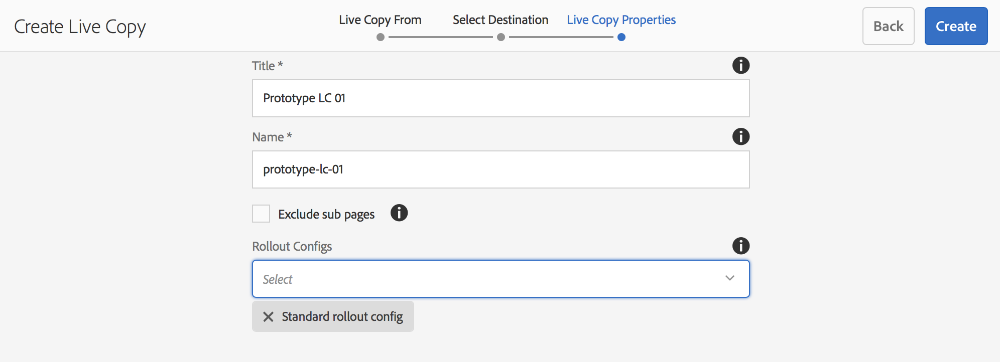
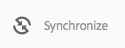

# Actieve kopieën maken en synchroniseren{#creating-and-synchronizing-live-copies}

U kunt een live kopie maken van een pagina- of blauwdrukconfiguratie en vervolgens overerving en synchronisatie beheren.

## Browserconfiguraties beheren {#managing-blueprint-configurations}

Een blauwdrukconfiguratie identificeert een bestaande website die u als bron voor één of meerdere levende exemplaarpagina&#39;s wilt gebruiken.

>[!NOTE]
>
>Met vervagingsconfiguraties kunt u wijzigingen in de inhoud doorvoeren in live kopieën. Zie [Actieve kopieën - Configuratie van bron, blauwdrukken en blauwdruk](/help/sites-administering/msm.md#source-blueprints-and-blueprint-configurations).

Wanneer u een blauwdrukconfiguratie creeert, selecteert u een malplaatje dat de interne structuur van de blauwdruk bepaalt. In de standaardsjabloon voor blauwdrukken wordt ervan uitgegaan dat de bronwebsite de volgende kenmerken heeft:

* De website heeft een hoofdpagina.
* De directe onderliggende pagina&#39;s van de hoofdmap zijn taalvertakkingen van de website. Wanneer u een live kopie maakt, worden de talen weergegeven als optionele inhoud die in de kopie moet worden opgenomen.
* De hoofdmap van elke taalvertakking bevat een of meer onderliggende pagina&#39;s. Wanneer u een live kopie maakt, worden onderliggende pagina&#39;s weergegeven als hoofdstukken die u in de live kopie kunt opnemen.

>[!NOTE]
>
>Een andere structuur vereist een andere blauwdruksjabloon.

Nadat u de blauwdrukconfiguratie creeert, vormt u de volgende eigenschappen:

* **Naam**: De naam van de configuratie van de blauwdruk.
* **Bronpad**: Het pad van de hoofdpagina van de site die u als bron gebruikt (blauwdruk).
* **Beschrijving**. (Optioneel) Een beschrijving van de configuratie van de blauwdruk. De beschrijving wordt weergegeven in de lijst met blauwdrukconfiguraties waaruit u kunt kiezen bij het maken van een site.

Wanneer uw blauwdrukconfiguratie wordt gebruikt, kunt u het met een rollout configuratie associëren die bepaalt hoe de levende exemplaren van de bron/de blauwdruk worden gesynchroniseerd. Zie [De te gebruiken rollout-configuraties opgeven](/help/sites-administering/msm-sync.md#specifying-the-rollout-configurations-to-use).

### Een blauwdrukconfiguratie maken {#creating-a-blueprint-configuration}

Een blauwdrukconfiguratie maken:

1. [Navigeren](/help/sites-authoring/basic-handling.md#global-navigation) aan de **Gereedschappen** en selecteert u vervolgens de **Sites** -menu.
1. Selecteren **Blauwdrukken** om de **Blauwdrukconfiguraties** console:

   

1. Selecteren **Maken**.
1. Selecteer de blauwdruksjabloon en **Volgende** om door te gaan.
1. Selecteer de bronpagina die als blauwdruk moet worden gebruikt; dan **Volgende** om door te gaan.
1. Definiëren:

   * **Titel**: verplichte titel voor de blauwdruk
   * **Beschrijving**: een optionele beschrijving voor meer informatie.

1. **Maken** zal de configuratie van de blauwdruk tot stand brengen die op uw specificatie wordt gebaseerd.

### Een configuratie van een blauwdruk bewerken of verwijderen {#editing-or-deleting-a-blueprint-configuration}

U kunt een bestaande configuratie van de blauwdruk bewerken of verwijderen:

1. [Navigeren](/help/sites-authoring/basic-handling.md#global-navigation) aan de **Gereedschappen** en selecteert u vervolgens de **Sites** -menu.
1. Selecteren **Blauwdrukken** om de **Blauwdrukconfiguraties** console:

   

1. Selecteer de vereiste blauwdrukconfiguratie. De juiste acties worden beschikbaar op de werkbalk:

   * **Eigenschappen**; u kunt dit gebruiken om de eigenschappen van de configuratie te bekijken en dan uit te geven.
   * **Verwijderen**

## Een actieve kopie maken {#creating-a-live-copy}

### Een actieve kopie van een pagina maken {#creating-a-live-copy-of-a-page}

U kunt een live kopie van elke pagina of vertakking maken. Wanneer u de live kopie maakt, kunt u de rollout-configuraties opgeven die moeten worden gebruikt voor het synchroniseren van de inhoud:

* De geselecteerde rollout-configuraties zijn van toepassing op de live kopieerpagina en de onderliggende pagina&#39;s.
* Als u geen rollout configuraties specificeert, bepaalt MSM welke rollout configuraties aan gebruik. Zie [De configuratie voor rollout opgeven die moet worden gebruikt](/help/sites-administering/msm-sync.md#specifying-the-rollout-configurations-to-use).

U kunt een live kopie van elke pagina maken:

* Pagina&#39;s waarnaar wordt verwezen door een [blauwdrukconfiguratie](#creating-a-blueprint-configuration).
* En pagina&#39;s die geen verbinding met een configuratie hebben.
* AEM ondersteunt ook het maken van een live kopie op de pagina&#39;s van een andere live kopie.

Het enige verschil is dat de **Uitrol** bevel op de bron/blauwdruk pagina&#39;s is afhankelijk van of de bron door een blauwdrukconfiguratie van verwijzingen wordt voorzien:

* Als u de live kopie maakt van een bronpagina die **is** die in een blauwdrukconfiguratie van verwijzingen worden voorzien, dan zal het bevel van de Uitvoer op de bron/blauwdruk pagina(s) beschikbaar zijn.
* Als u de live kopie maakt van een bronpagina die **is niet** waarnaar in een blauwdrukconfiguratie wordt verwezen, is de opdracht Uitvoeren niet beschikbaar op de pagina(&#39;s) van de bron/blauwdruk.

Een live kopie maken:

1. In de **Sites** console selecteren **Maken** vervolgens **Live kopie**.

   

1. Selecteer de bronpagina en klik op **Volgende**. Bijvoorbeeld:

   

1. Geef het doelpad van de live kopie op (open de bovenliggende map of pagina van de live kopie) en klik vervolgens op **Volgende**.

   

   >[!NOTE]
   >
   >Het doelpad kan zich niet binnen het bronpad bevinden.

1. Enter:

   * a **Titel** voor de pagina.
   * a **Naam**, die wordt gebruikt in de URL.

   

1. Gebruik de **Subpagina&#39;s uitsluiten** selectievakje:

   * Geselecteerd: alleen een live kopie van de geselecteerde pagina maken (oppervlakkige live kopie)
   * Niet geselecteerd: maak een live kopie die alle onderliggende elementen van de geselecteerde pagina bevat (diepe live kopie)

1. (Optioneel) Als u een of meer rollout-configuraties wilt opgeven die voor de livecopy moeten worden gebruikt, gebruikt u de opdracht **Rollout Configs** vervolgkeuzelijst om ze te selecteren. Geselecteerde configuraties worden onder de keuzelijst weergegeven.
1. Klikken **Maken**. Er wordt een bevestigingsbericht weergegeven. Hier kunt u een van de volgende opties selecteren **Openen** of **Gereed**.

### Een live kopie van een site maken op basis van een blauwdrukconfiguratie {#creating-a-live-copy-of-a-site-from-a-blueprint-configuration}

Maak een live kopie met behulp van een blauwdrukconfiguratie om een site te maken op basis van de blauwdrukinhoud (bron). Wanneer u een levend exemplaar van een blauwdrukconfiguratie creeert, selecteert u één of meerdere taaltakken van de blauwdrukbron om te kopiëren, dan selecteert u de hoofdstukken om van de taaltakken te kopiëren. Zie [Een blauwdrukconfiguratie maken](/help/sites-administering/msm-livecopy.md#creating-a-blueprint-configuration).

Als u sommige taalvertakkingen of hoofdstukken van het levende exemplaar weglaat, kunt u hen later toevoegen; zie [Een actieve kopie maken in een live kopie (configuratie blauwdruk)](#creating-a-live-copy-inside-a-live-copy-blueprint-configuration).

>[!CAUTION]
>
>Wanneer de bron van de blauwdruk verbindingen en verwijzingen bevat die een paragraaf in een verschillende tak richten, worden de doelstellingen niet bijgewerkt in de levende exemplaarpagina&#39;s, maar blijven gericht aan de originele bestemming.

Geef bij het maken van de site waarden op voor de volgende eigenschappen:

* **Oorspronkelijke talen**: De taalvertakkingen van de blauwdrukbron die in de live kopie moeten worden opgenomen.
* **Oorspronkelijke hoofdstukken**: De onderliggende pagina&#39;s van de vertakkingen van de blauwdruktaal die in de live kopie moeten worden opgenomen.
* **Doelpad**: De locatie van de hoofdpagina van de live kopieersite.
* **Titel**: De titel van de hoofdpagina van de live-kopieersite.
* **Naam**: (Optioneel) De naam van het JCR-knooppunt dat de hoofdpagina van de live kopie opslaat. De standaardwaarde is gebaseerd op de titel.
* **Site-eigenaar**: (Optioneel)
* **Live kopie**: Selecteer deze optie om een live relatie met de bronsite tot stand te brengen. Als u deze optie niet selecteert, wordt een kopie van de blauwdruk gemaakt, maar wordt deze niet gesynchroniseerd met de bron.
* **Rollout Configs**: (Optioneel) Selecteer een of meer rollout-configuraties die u wilt gebruiken voor het synchroniseren van de livekopie. Standaard worden de rollout-configuraties overgeërfd van de blauwdruk. Zie [De te gebruiken configuraties voor rollout opgeven](/help/sites-administering/msm-sync.md#specifying-the-rollout-configurations-to-use) voor meer informatie .

Een live kopie van een site maken op basis van een blauwdrukconfiguratie:

1. In de **Sites** console, selecteren **Maken** vervolgens **Site** in de keuzelijst.
1. Selecteer de blauwdrukconfiguratie die u als bron van de live kopie wilt gebruiken en ga verder met **Volgende**:

   

1. Gebruik de **Oorspronkelijke talen** om de talen van de blauwdruksite op te geven die voor de live kopie moeten worden gebruikt.

   Standaard zijn alle beschikbare talen geselecteerd. Als u een taal wilt verwijderen, klikt u op de knop **X** naast de taal.

   Bijvoorbeeld:

   

1. Gebruik de **Oorspronkelijke hoofdstukken** vervolgkeuzelijst om de secties van de blauwdruk te selecteren die u in de actieve kopie wilt opnemen. Opnieuw zijn alle beschikbare hoofdstukken inbegrepen door gebrek, maar kunnen worden verwijderd.
1. Geef waarden op voor de overige eigenschappen en selecteer **Maken**. Selecteer in het bevestigingsdialoogvenster de optie **Gereed** om terug te keren naar de **Sites** console, of **Site openen** om de hoofdpagina van de site te openen.

### Een actieve kopie maken in een live kopie (configuratie blauwdruk) {#creating-a-live-copy-inside-a-live-copy-blueprint-configuration}

Wanneer u een levende kopie binnen de bestaande live kopie (gemaakt met behulp van een blauwdrukconfiguratie) maakt, kunt u elke taalkopie of hoofdstukken invoegen die niet waren opgenomen toen de live kopie oorspronkelijk werd gemaakt.

## Uw Live kopie controleren {#monitoring-your-live-copy}

### De status van een live kopie bekijken {#seeing-the-status-of-a-live-copy}

De eigenschappen van een pagina met live kopieën geven de volgende informatie over de live kopie weer:

* **Bron**: De bronpagina van de pagina voor live kopiëren.
* **Status**: De synchronisatiestatus van de live kopie. De status omvat of de live kopie up-to-date is met de bron, en wanneer de laatste synchronisatie heeft plaatsgevonden en wie de synchronisatie heeft uitgevoerd.
* **Configuratie**:

   * Of de pagina nog steeds onderhevig is aan overerving van live-kopieën.
   * Of de configuratie wordt overgeërfd van de ouderpagina.
   * Om het even welke rollout configuraties die het levende exemplaar gebruikt.

De eigenschappen weergeven:

1. In de **Sites** selecteert u de pagina met live kopieën en opent u de eigenschappen.
1. Selecteer de **Live kopie** tab.

   Bijvoorbeeld:

   

   >[!NOTE]
   >
   >Zie ook het artikel in de Knowledge Base voor meer informatie [Livecopy status message - Up-to-date/Green/In Sync](https://helpx.adobe.com/experience-manager/kb/livecopy-status-message---up-to-date-green-in-sync.html).

### De actieve kopieën van een vervagingspagina bekijken {#seeing-the-live-copies-of-a-blueprint-page}

De pagina&#39;s van de blauwdruk (die in een blauwdrukconfiguratie van verwijzingen worden voorzien) verstrekken u een lijst van de levende exemplaarpagina&#39;s die de huidige (blauwdruk) pagina als bron gebruiken. Gebruik deze lijst om de live kopieën bij te houden. De lijst wordt weergegeven in de **Blauwdruk** tabblad van het [pagina-eigenschappen](/help/sites-authoring/editing-page-properties.md).

## Live kopie synchroniseren {#synchronizing-your-live-copy}

### Een blauwdruk uitrollen {#rolling-out-a-blueprint}

Leer een pagina van de blauwdruk uit om inhoudsveranderingen in levende exemplaren te duwen. A **Uitrol** handeling voert de rollout configuraties uit die gebruiken [Bij rollout](/help/sites-administering/msm-sync.md#rollout-triggers) trigger.

>[!NOTE]
>
>Conflicten kunnen optreden als er nieuwe pagina&#39;s met dezelfde paginanaam worden gemaakt in zowel de vertakking Verblauwdrukken als een afhankelijke vertakking voor live kopieën.
>
>Dergelijke [conflicten moeten bij de uitrol worden afgehandeld en opgelost](/help/sites-administering/msm-rollout-conflicts.md).
>

#### Een vervaging uitrollen uit pagina-eigenschappen {#rolling-out-a-blueprint-from-page-properties}

1. In de **Sites** selecteert u de pagina in de blauwdruk en opent u de eigenschappen.
1. Open de **Blauwdruk** tab.
1. Selecteren **Uitrol**.

   

1. Geef de pagina&#39;s en eventuele subpagina&#39;s op en bevestig vervolgens met het vinkje:

   

1. Opgeven of de rollout-taak onmiddellijk moet worden uitgevoerd (**Nu**) of op een andere datum of tijd (**Later**).

   

Rollouts worden verwerkt als asynchrone taken en kunnen worden gecontroleerd in het dialoogvenster [**Async-taakstatus** dashboard](asynchronous-jobs.md#monitor-the-status-of-asynchronous-operations) om **Algemene navigatie** > **Gereedschappen** > **Bewerkingen** > **Taken**

>[!NOTE]
>
>Voor asynchrone rollout-verwerking is AEM 6.5.3.0 of hoger vereist. In vorige versies werden pagina&#39;s direct en synchroon verwerkt.

#### Een vervaging uitrollen vanuit de referentierail {#roll-out-a-blueprint-from-the-reference-rail}

1. In de **Sites** console, selecteer de pagina in het levende exemplaar en open **[Verwijzingen](/help/sites-authoring/basic-handling.md#references)** van de werkbalk.
1. Selecteer de **Blauwdruk** om de aan deze pagina gekoppelde blauwdrukken weer te geven.
1. Selecteer de gewenste blauwdruk in de lijst.
1. Klikken **Uitrol**.
1. U wordt gevraagd de details van de rollout te bevestigen:

   * **Uitrolbereik**:

     Geef op of het bereik alleen voor de geselecteerde pagina is of dat subpagina&#39;s moeten worden opgenomen.

   * **Schema**:

     Opgeven of de rollout-taak onmiddellijk moet worden uitgevoerd (**Nu**) of op een latere datum of tijd (**Later**).

     

1. Nadat u deze details hebt bevestigd, selecteert u **Uitrol** om de handeling uit te voeren.

Rollouts worden verwerkt als asynchrone taken en kunnen worden gecontroleerd in het dialoogvenster [**Async-taakstatus** dashboard](asynchronous-jobs.md#monitor-the-status-of-asynchronous-operations) om **Algemene navigatie** > **Gereedschappen** > **Bewerkingen** > **Taken**

>[!NOTE]
>
>Voor asynchrone rollout-verwerking is AEM 6.5.3.0 of hoger vereist. In vorige versies werden pagina&#39;s direct en synchroon verwerkt, tenzij de **Achtergronduitlijning** is ingeschakeld.

#### Een vervaging uitrollen met het overzicht van Actieve kopie {#roll-out-a-blueprint-from-the-live-copy-overview}

De [De actie Uitvoeren is ook beschikbaar bij het Live Copy-overzicht](/help/sites-administering/msm-livecopy-overview.md#using-the-live-copy-overview), wanneer er een pagina Vervagen is geselecteerd.

1. Open de [Overzicht van live kopiëren](/help/sites-administering/msm-livecopy-overview.md#using-the-live-copy-overview) en selecteer een vervagingspagina.
1. Selecteren **Uitrol** op de werkbalk.
1. Geef de pagina&#39;s en eventuele subpagina&#39;s op en bevestig vervolgens met het vinkje:

   

1. Opgeven of de rollout-taak onmiddellijk moet worden uitgevoerd (**Nu**) of op een andere datum of tijd (**Later**).

   

Rollouts worden verwerkt als asynchrone taken en kunnen worden gecontroleerd in het dialoogvenster [**Async-taakstatus** dashboard](asynchronous-jobs.md#monitor-the-status-of-asynchronous-operations) om **Algemene navigatie** > **Gereedschappen** > **Bewerkingen** > **Taken**

>[!NOTE]
>
>Voor asynchrone rollout-verwerking is AEM 6.5.3.0 of hoger vereist. In vorige versies werden pagina&#39;s direct en synchroon verwerkt.

### Een actieve kopie synchroniseren {#synchronizing-a-live-copy}

Synchroniseer een pagina voor live kopieën om wijzigingen in de inhoud van de bron naar de live kopie over te brengen.

#### Een actieve kopie van pagina-eigenschappen synchroniseren {#synchronize-a-live-copy-from-page-properties}

Synchroniseer een live kopie om wijzigingen van de bron naar de livecopy over te brengen.

>[!NOTE]
>
>Synchroniseert voert de rollout configuraties uit die gebruiken [Bij rollout](/help/sites-administering/msm-sync.md#rollout-triggers) trigger.

1. In de **Sites** selecteert u de pagina met live kopieën en opent u de eigenschappen.
1. Open de **Live kopie** tab.
1. Klikken **Synchroniseren**.

   

   Bevestiging wordt aangevraagd, gebruik **Sync** om verder te gaan.

#### Een actieve kopie synchroniseren vanuit het overzicht Live kopie {#synchronize-a-live-copy-from-the-live-copy-overview}

De [De actie Synchroniseren is ook beschikbaar via het Live Copy-overzicht](/help/sites-administering/msm-livecopy-overview.md#using-the-live-copy-overview), wanneer u een pagina voor live kopiëren hebt geselecteerd.

1. Open de [Overzicht van live kopiëren](/help/sites-administering/msm-livecopy-overview.md#using-the-live-copy-overview) en selecteer een Live Copy-pagina.
1. Selecteren **Synchroniseren** op de werkbalk.
1. Bevestig de **Uitrol** Handeling in het dialoogvenster nadat u hebt opgegeven of u het volgende wilt opnemen:

   * **Pagina- en subpagina&#39;s**
   * **Alleen pagina**

   

## Live kopie van inhoud wijzigen {#changing-live-copy-content}

Als u inhoud voor live kopieën wilt wijzigen, kunt u:

* Voeg alinea&#39;s toe aan de pagina.
* Bestaande inhoud bijwerken door de overerving van live kopieën voor een pagina of component te verbreken.

>[!NOTE]
>
>Als u handmatig een pagina maakt in de live kopie, is deze lokaal bij de live kopie, wat betekent dat er geen bijbehorende bronpagina aan is gekoppeld.
>
>De beste praktijken om een lokale pagina tot stand te brengen die deel van de verhouding uitmaakt zouden het in de bron moeten creëren en (diepe) rollout doen. Hierdoor wordt de pagina lokaal gemaakt als live kopieën.

>[!NOTE]
>
>Conflicten kunnen optreden als er nieuwe pagina&#39;s met dezelfde paginanaam worden gemaakt in zowel de vertakking Verblauwdrukken als een afhankelijke vertakking voor live kopieën.
>
>Dergelijke [conflicten moeten bij de uitrol worden afgehandeld en opgelost](/help/sites-administering/msm-rollout-conflicts.md).
>

### Componenten toevoegen aan een Live Copy-pagina {#adding-components-to-a-live-copy-page}

Voeg op elk gewenst moment componenten toe aan een pagina voor live kopieën. De overervingsstatus van de live kopie en het bijbehorende alineasysteem bepaalt niet hoe u componenten kunt toevoegen.

Wanneer de pagina met live kopieën wordt gesynchroniseerd met de bronpagina, blijven de toegevoegde componenten ongewijzigd. Zie ook [De volgorde van componenten op een Live Copy-pagina wijzigen](#changing-the-order-of-components-on-a-live-copy-page).

>[!NOTE]
>
>Wijzigingen die lokaal worden aangebracht in een component die als container is gemarkeerd, worden niet overschreven door de inhoud van de blauwdruk op een rollout. Zie [Aanbevolen MSM-procedures](/help/sites-administering/msm-best-practices.md#components-and-container-synchronization) voor meer informatie .

### Overerving voor een pagina onderbreken {#suspending-inheritance-for-a-page}

Wanneer u een live kopie maakt, wordt de live kopieerconfiguratie opgeslagen op de hoofdpagina van de gekopieerde pagina&#39;s. Alle onderliggende pagina&#39;s van de hoofdpagina nemen de configuraties van de actieve kopie over. De componenten op de bibliotheekpagina&#39;s erven ook de live kopieerconfiguratie.

U kunt de overerving van live kopieën voor een live kopieerpagina opschorten, zodat u pagina-eigenschappen en -componenten kunt wijzigen. Wanneer u overerving onderbreekt, worden de pagina-eigenschappen en -componenten niet meer gesynchroniseerd met de bron.

>[!NOTE]
>
>U kunt [een live kopie loskoppelen](#detaching-a-live-copy) van zijn blauwdruk om alle verbindingen te verwijderen. De handeling Loskoppelen is permanent en niet-omkeerbaar.

>[!NOTE]
>
>Als de component als container wordt gemerkt, zijn de annulering en onderbreekt acties niet op zijn kindcomponenten van toepassing. Zie ook [Aanbevolen MSM-procedures](/help/sites-administering/msm-best-practices.md#components-and-container-synchronization) voor aanvullende informatie.

#### Overerving van pagina-eigenschappen onderbreken {#suspending-inheritance-from-page-properties}

Overerving op een pagina opschorten:

1. Open de eigenschappen van de actieve kopieerpagina met de opdracht **Eigenschappen weergeven** de **Sites** console of gebruiken **Pagina-informatie** op de pagina-werkbalk.
1. Klik op de knop **Live kopie** tab.
1. Selecteren **Onderbreken** op de werkbalk. U kunt vervolgens een van de volgende opties selecteren:

   * **Onderbreken**: alleen huidige pagina
   * **Opschorting met kinderen**: huidige pagina samen met eventuele onderliggende pagina&#39;s

1. Selecteren **Onderbreken** in het bevestigingsdialoogvenster.

#### Overerving van het Live Copy-overzicht opschorten {#suspending-inheritance-from-the-live-copy-overview}

De [Handeling voor schorsing is ook beschikbaar in het overzicht Live kopie](/help/sites-administering/msm-livecopy-overview.md#using-the-live-copy-overview), wanneer u een pagina voor live kopiëren hebt geselecteerd.

1. Open de [Overzicht van live kopiëren](/help/sites-administering/msm-livecopy-overview.md#using-the-live-copy-overview) en selecteer een Live Copy-pagina.
1. Selecteren **Onderbreken** op de werkbalk.
1. Selecteer de gewenste optie uit:

   * **Onderbreken**
   * **Opschorting met kinderen**

   

1. Bevestig de **Onderbreken** in de **Live kopie onderbreken** dialoogvenster:

   

### Overerving voor een pagina hervatten {#resuming-inheritance-for-a-page}

Het onderbreken van overerving van live-kopieën voor een pagina is een tijdelijke handeling. Na de schorsing van de **Hervatten** Deze handeling wordt beschikbaar, zodat u de live relatie opnieuw kunt instellen.

Wanneer u overerving weer inschakelt, wordt de pagina niet automatisch gesynchroniseerd met de bron. U kunt een synchronisatie aanvragen, als dit vereist is:

* In de **Hervatten**/**Vorige versie** dialoog; bijvoorbeeld:

  

* In een later stadium, door de synchronisatieactie manueel te selecteren.

>[!CAUTION]
>
>Wanneer u overerving weer inschakelt, wordt de pagina niet automatisch gesynchroniseerd met de bron. U kunt handmatig een synchronisatie aanvragen als dat nodig is. Dit kan gebeuren bij het hervatten of later.

#### Overerving van pagina-eigenschappen hervatten {#resuming-inheritance-from-page-properties}

Eenmaal [opgeschort](#suspending-inheritance-from-page-properties) de **Hervatten** Deze handeling wordt weergegeven op de werkbalk van de pagina-eigenschappen:

Als deze optie is geselecteerd, wordt het dialoogvenster weergegeven. U kunt, indien nodig, een synchronisatie selecteren en de actie vervolgens bevestigen.

#### Een Live Copy-pagina hervatten vanuit het Live Copy-overzicht {#resume-a-live-copy-page-from-the-live-copy-overview}

De [Handeling voor hervatten is ook beschikbaar via het Live Copy-overzicht](/help/sites-administering/msm-livecopy-overview.md#using-the-live-copy-overview), wanneer u een pagina voor live kopiëren hebt geselecteerd.

1. Open de [Overzicht van live kopiëren](/help/sites-administering/msm-livecopy-overview.md#using-the-live-copy-overview) en selecteer een Live Copy-pagina die is opgeschort; deze wordt weergegeven als **OVERERVING GEANNULEERD**.
1. Selecteren **Hervatten** op de werkbalk.
1. Geef aan of u de pagina wilt synchroniseren nadat u de overerving hebt omgekeerd. Bevestig vervolgens de optie **Hervatten** in de **Live kopie hervatten** in.

### Overervingsdiepte wijzigen (Ondiep/Ondiep) {#changing-inheritance-depth-shallow-deep}

Op een bestaande live kopie kunt u de diepte van een pagina wijzigen, dat wil zeggen of onderliggende pagina&#39;s worden opgenomen.

* Schakelen naar een oppervlakkige live kopie:

   * Zal onmiddellijk effect hebben en is niet omkeerbaar.

      * Onderliggende pagina&#39;s worden expliciet losgekoppeld van de actieve kopie. Verdere wijzigingen op kinderen kunnen niet bewaard worden als ze ongedaan worden gemaakt.

      * Hiermee verwijdert u alle afstammingen `LiveRelationships` zelfs als er geneste `LiveCopies`.

* Schakelen naar een diepe live kopie:

   * Onderliggende pagina&#39;s blijven ongewijzigd.
   * Om het effect van de schakelaar te zien, kunt u uitlooptraject maken, worden om het even welke inhoudswijzigingen toegepast volgens de uitrolconfiguratie.

* Het schakelen naar een oppervlakkige levende kopie, dan terug naar diep:

   * Alle kinderen van de (vroegere) ondiepe levende kopie worden behandeld alsof zij manueel waren gecreeerd en daarom worden bewogen gebruikend `[oldname]_msm_moved name`.

U kunt als volgt de diepte opgeven of wijzigen:

1. Open de eigenschappen van de actieve kopieerpagina met de opdracht **Eigenschappen weergeven** de **Sites** console of gebruiken **Pagina-informatie** op de pagina-werkbalk.
1. Klik op de knop **Live kopie** tab.
1. In de **Configuratie** de sectie instellen of wissen **Overerving van Actieve kopie** afhankelijk van of onderliggende pagina&#39;s worden opgenomen:

   * gecontroleerd - een diepe levende kopie (de kindpagina&#39;s worden omvat)
   * clear - een oppervlakkige live kopie (onderliggende pagina&#39;s zijn uitgesloten)

   >[!CAUTION]
   >
   >Het overschakelen naar een oppervlakkige live kopie heeft onmiddellijk effect en is niet-omkeerbaar.
   >
   >Zie [Actieve kopieën - Compositie](/help/sites-administering/msm.md#live-copies-composition) voor meer informatie .

1. Klikken **Opslaan** om uw updates voort te zetten.

### Overerving voor een component annuleren {#cancelling-inheritance-for-a-component}

Annuleer de overerving van de live kopie voor een component zodat de component niet meer wordt gesynchroniseerd met de broncomponent. U kunt overerving indien nodig op een later tijdstip inschakelen.

>[!NOTE]
>
>Als de component als container wordt gemerkt, zijn de annulering en onderbreekt acties niet op zijn kindcomponenten van toepassing. Zie ook [Aanbevolen MSM-procedures](/help/sites-administering/msm-best-practices.md#components-and-container-synchronization) voor aanvullende informatie.

>[!NOTE]
>
>Wanneer u overerving weer inschakelt, wordt de component niet automatisch gesynchroniseerd met de bron. U kunt handmatig een synchronisatie aanvragen als dit vereist is.

Overerving annuleren om de inhoud van de component te wijzigen of de component te verwijderen:

1. Klik op de component waarvoor u overerving wilt annuleren.

   

1. Klik op de componentwerkbalk op de knop **Overerving annuleren** pictogram.

   

1. Bevestig in het dialoogvenster Overerving annuleren de handeling met **Ja**.

   De werkbalk van de component wordt bijgewerkt en bevat alle (toepasselijke) bewerkingsopdrachten.

### Overerving voor een component opnieuw inschakelen {#re-enabling-inheritance-for-a-component}

Als u overerving voor een component wilt inschakelen, klikt u op de knop **Overerving opnieuw inschakelen** op de werkbalk van de component.

### De volgorde van componenten op een Live Copy-pagina wijzigen {#changing-the-order-of-components-on-a-live-copy-page}

Als een live kopie componenten bevat die onderdeel zijn van een alineasysteem, worden de volgende regels toegepast bij de overerving van dat alineasysteem:

* De volgorde van componenten in een overgeërfd alineasysteem kan worden gewijzigd, zelfs als overerving is ingesteld.
* Bij rollout wordt de volgorde van de componenten hersteld op basis van de blauwdruk. als er vóór de uitrol nieuwe componenten aan de live kopie zijn toegevoegd , worden deze opnieuw gerangschikt , samen met de componenten waarboven ze zijn toegevoegd .
* Als de overerving van het alineasysteem wordt geannuleerd, wordt de volgorde van componenten niet hersteld bij de rollout en blijft deze zoals in de live kopie.

>[!NOTE]
>
>Bij het terugkeren van een geannuleerde overerving op een alineasysteem, de volgorde van componenten **wordt niet automatisch hersteld** in de blauwdruk. U kunt handmatig een synchronisatie aanvragen als dit vereist is.

Gebruik de volgende procedure om de overname van het alineasysteem te annuleren.

1. Open de pagina voor live kopiëren.
1. Sleep een bestaande component naar een nieuwe locatie op de pagina.
1. In de **Overerving annuleren** de handeling bevestigen met **Ja**.

### Eigenschappen van een Live Copy-pagina overschrijven {#overriding-properties-of-a-live-copy-page}

De pagina-eigenschappen van een pagina van Live Copy worden standaard overgeërfd (en kunnen niet worden bewerkt) van de bronpagina.

U kunt overerving voor een eigenschap annuleren wanneer u de eigenschapswaarde voor de live kopie moet wijzigen. Een koppelingspictogram geeft aan dat overerving is ingeschakeld voor de eigenschap.

Wanneer u overerving annuleert, kunt u de waarde van de eigenschap wijzigen. Een pictogram voor verbroken koppelingen geeft aan dat overerving wordt geannuleerd.

U kunt overerving voor een eigenschap indien nodig later opnieuw inschakelen.

>[!NOTE]
>
>Wanneer u overerving opnieuw inschakelt, wordt de pagina-eigenschap voor live kopiëren niet automatisch gesynchroniseerd met de eigenschap source. U kunt handmatig een synchronisatie aanvragen als dit vereist is.

1. Open de eigenschappen van de actieve kopieerpagina met behulp van de **Eigenschappen weergeven** van de **Sites** console of **Pagina-informatie** op de werkbalk Pagina.
1. Als u de overerving van een eigenschap wilt annuleren, klikt u op het koppelingspictogram rechts van de eigenschap.

   

1. In de **Overerving annuleren** bevestigingsvenster, klik **Ja**.

### Eigenschappen van een Live Copy-pagina herstellen {#revert-properties-of-a-live-copy-page}

Als u overerving voor een eigenschap wilt inschakelen, klikt u op de knop **Overerving herstellen** wordt weergegeven naast de eigenschap.

### Live Copy-pagina opnieuw instellen {#resetting-a-live-copy-page}

Een pagina voor live kopiëren opnieuw instellen op:

* Alle annuleringen van overerving verwijderen
* Hiermee keert u de pagina terug naar hetzelfde frame als de bronpagina.

Het opnieuw instellen beïnvloedt de wijzigingen die u hebt aangebracht in pagina-eigenschappen, het alineasysteem en de componenten.

#### Een actieve pagina voor kopiëren herstellen vanuit de pagina-eigenschappen {#reset-a-live-copy-page-from-the-page-properties}

1. In de **Sites** console, selecteer de levende exemplaarpagina en selecteer **Eigenschappen weergeven**.
1. Open de **Live kopie** tab.
1. Selecteren **Herstellen** op de werkbalk.

   

1. In de **Live kopie opnieuw instellen** dialoogvenster, bevestigen met **Herstellen**.

#### Een Live Copy-pagina herstellen vanuit het Live Copy-overzicht {#reset-a-live-copy-page-from-the-live-copy-overview}

De [Handeling Herstellen is ook beschikbaar via het Live Copy-overzicht](/help/sites-administering/msm-livecopy-overview.md#using-the-live-copy-overview), wanneer u een pagina voor live kopiëren hebt geselecteerd.

1. Open de [Overzicht van live kopiëren](/help/sites-administering/msm-livecopy-overview.md#using-the-live-copy-overview) en selecteer een Live Copy-pagina.
1. Selecteren **Herstellen** op de werkbalk.
1. Bevestig de **Herstellen** in de **Live kopie opnieuw instellen** dialoogvenster:

   

## Een Live Copy-pagina vergelijken met een vervagingspagina {#comparing-a-live-copy-page-with-a-blueprint-page}

Als u de aangebrachte wijzigingen wilt bijhouden, kunt u de blauwdrukpagina weergeven in **Verwijzingen** en deze vergelijken met de bijbehorende pagina voor live kopiëren:

1. In de **Sites** console, [navigeer naar een blauwdruk- of live kopieerpagina en selecteer deze](/help/sites-authoring/basic-handling.md#viewing-and-selecting-resources).
1. Open de **[Verwijzingen](/help/sites-authoring/basic-handling.md#references)** en selecteer:

   * **Blauwdruk** (wanneer een pagina voor live kopiëren is geselecteerd)
   * **Actieve kopieën** (wanneer een pagina met een blauwdruk is geselecteerd)

1. Selecteer vervolgens uw specifieke live kopie:

   * **Vergelijken met vervaging** (wanneer een pagina voor live kopiëren is geselecteerd)
   * **Vergelijken met Live kopie** (wanneer een pagina met een blauwdruk is geselecteerd)

   Bijvoorbeeld:

   

1. De twee pagina&#39;s (live kopie en blauwdruk) worden naast elkaar geopend.

   Zie voor meer informatie over het gebruik van deze functie [Pagina grijs](/help/sites-authoring/page-diff.md).

## Een actieve kopie ontkoppelen {#detaching-a-live-copy}

Met Loskoppelen verwijdert u permanent de live relatie tussen een live kopie en de bron-/blauwdrukpagina. Alle MSM-relevante eigenschappen worden verwijderd uit de live kopie en de live kopieerpagina&#39;s worden een zelfstandige kopie.

>[!CAUTION]
>
>U kunt de live relatie niet meer herstellen nadat u de live kopie hebt losgekoppeld.
>
>Als u de live relatie wilt verwijderen met de optie om deze later opnieuw te installeren, kunt u [overerving van live kopiëren annuleren](#suspending-inheritance-for-a-page) voor de pagina.

Er zijn implicaties voor waar binnen de boom die u gebruikt **Loskoppelen**:

* **Koppelen op een hoofdpagina van een LiveCopy**

  Wanneer deze bewerking wordt uitgevoerd op de hoofdpagina van een live kopie, wordt de live relatie tussen alle pagina&#39;s van de blauwdruk en de bijbehorende livecopy verwijderd.

  Verdere wijzigingen op pagina&#39;s in de blauwdruk (zoals voorheen) **niet** heeft invloed op de livecopy (zoals voorheen).

* **Koppelen op een subpagina van een LiveCopy**

  Wanneer deze bewerking wordt uitgevoerd op een subpagina (of vertakking) binnen een live kopie:

   * de live relatie is verwijderd voor die subpagina (of vertakking)
   * en de (sub)pagina&#39;s in de levende exemplaartak worden behandeld alsof zij manueel waren gecreeerd.

  *Echter*, zijn de subpagina&#39;s nog steeds onderhevig aan de live relatie van de bovenliggende vertakking, zodat een verdere uitrol van de blauwdrukpagina(&#39;s) beide:

   1. Wijzig de naam van de losgekoppelde pagina(&#39;s):

      * Dit komt omdat MSM hen als manueel gecreëerde pagina&#39;s beschouwt die een conflict veroorzaken aangezien zij de zelfde naam zoals de levenspagina&#39;s hebben het probeert te creëren.

   1. Maak een pagina (livecopy) met de oorspronkelijke naam, die de wijzigingen bevat die u tijdens de rollout hebt aangebracht.

  >[!NOTE]
  >
  >Zie [Conflicten MSM-rollout](/help/sites-administering/msm-rollout-conflicts.md) voor nadere bijzonderheden over dergelijke situaties.

### Een actieve pagina voor kopiëren loskoppelen van de pagina-eigenschappen {#detach-a-live-copy-page-from-the-page-properties}

Een actieve kopie loskoppelen:

1. In de **Sites** console, selecteer de levende exemplaarpagina en klik **Eigenschappen weergeven**.
1. Open de **Live kopie** tab.
1. Selecteer op de werkbalk de optie **Loskoppelen**.

   

1. Er wordt een bevestigingsdialoogvenster weergegeven. Selecteer **Loskoppelen** om de actie te voltooien.

### Een Live Copy-pagina loskoppelen van het Live Copy-overzicht {#detach-a-live-copy-page-from-the-live-copy-overview}

De [De actie Ontkoppelen is ook beschikbaar in het Live Copy-overzicht](/help/sites-administering/msm-livecopy-overview.md#using-the-live-copy-overview), wanneer u een pagina voor live kopiëren hebt geselecteerd.

1. Open de [Overzicht van live kopiëren](/help/sites-administering/msm-livecopy-overview.md#using-the-live-copy-overview) en selecteer een Live Copy-pagina.
1. Selecteren **Loskoppelen** op de werkbalk.
1. Bevestig de **Loskoppelen** in de **Live kopie ontkoppelen** dialoogvenster:

   
