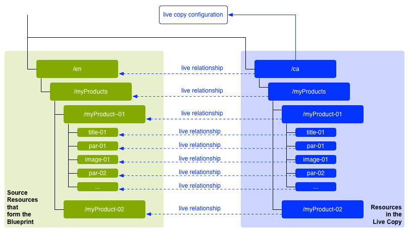

# Inhoud opnieuw gebruiken: Sitebeheer en Live kopiëren{#reusing-content-multi-site-manager-and-live-copy}

Met MSM (Multi Site Manager) kunt u dezelfde site-inhoud op meerdere locaties gebruiken. MSM gebruikt de functie Live Copy om dit te bereiken:

* Met MSM kunt u:

   * Inhoud eenmaal maken en vervolgens
   * Kopieer deze inhoud aan, en hergebruik deze inhoud in, andere gebieden ([&#x200B; levende exemplaren &#x200B;](#live-copies)) van de zelfde of andere plaatsen.

* MSM handhaaft dan de (levende) verhouding tussen uw broninhoud en zijn levende exemplaren zodat:

   * Wanneer u de broninhoud wijzigt, worden de bron- en live kopieën gesynchroniseerd (om deze wijzigingen ook toe te passen op de live kopieën).
   * U kunt de inhoud van de live kopieën aanpassen door de live relatie voor afzonderlijke subpagina&#39;s, componenten of beide los te koppelen. Hierdoor worden wijzigingen in de bron niet meer toegepast op de live kopie.

Op deze en de volgende pagina&#39;s worden de gerelateerde kwesties besproken:

* [Actieve kopieën maken en synchroniseren](/help/sites-administering/msm-livecopy.md)
* [Console voor live kopiëren](/help/sites-administering/msm-livecopy-overview.md)
* [Synchronisatie van actieve kopie configureren](/help/sites-administering/msm-sync.md)
* [Conflicten MSM-rollout](/help/sites-administering/msm-rollout-conflicts.md)
* [Aanbevolen MSM-procedures](/help/sites-administering/msm-best-practices.md)

## Mogelijke scenario&#39;s {#possible-scenarios}

Er zijn vele gebruik-gevallen voor MSM en levende exemplaren, sommige scenario&#39;s omvatten:

* **Multinationals - Globaal aan Lokaal Bedrijf**

  Een typisch gebruiksgeval dat MSM steunt is inhoud in verscheidene multinationale plaatsen van het zelfde-Taal opnieuw te gebruiken. Hierdoor kan de kerninhoud opnieuw worden gebruikt, terwijl nationale variaties mogelijk zijn.

  Bijvoorbeeld, wordt de Engelse sectie van de steekproef van de Plaats van de Verwijzing Wij.Retail gecreeerd voor klanten in de V.S. De meeste inhoud in deze plaats kan ook voor andere plaatsen worden gebruikt Web.Retail die aan Engelstalige klanten van verschillende landen en culturen behandelen. De kerninhoud blijft voor alle sites hetzelfde, terwijl regionale aanpassingen kunnen worden aangebracht.

  De volgende structuur kan voor plaatsen voor de Verenigde Staten, het Verenigd Koninkrijk, Canada, en Australië worden gebruikt:

  ```xml
  /content
      |- we.retail
          |- language-masters
              |- en
      |- we.retail
          |- us
              |- en
      |- we.retail
          |- gb
              |- en
      |- we.retail
          |- ca
              |- en
      |- we.retail
          |- au
              |- en
  ```

  >[!NOTE]
  >
  >MSM vertaalt de inhoud niet. Het wordt gebruikt om de vereiste structuur tot stand te brengen en de inhoud op te stellen.
  >
  >
  >Zie [&#x200B; Vertaal Inhoud voor Meertalige Plaatsen &#x200B;](/help/sites-administering/translation.md) als u zulk een voorbeeld wilt uitbreiden.

* **Nationaal - HoofdBureau aan Regionale Troepen**

  Een bedrijf met een netwerk van dealers zou ook aparte websites voor hun individuele dealers willen, elk een variant van de hoofdsite die door het hoofdkantoor wordt aangeboden. Dit kan het geval zijn voor één enkele onderneming met meerdere regionale kantoren, of voor een nationaal franchisesysteem dat bestaat uit een centrale franchisegever en meerdere lokale franchisehouders.

  Het hoofdkantoor kan de kerninformatie verstrekken, terwijl de regionale entiteiten lokale informatie kunnen toevoegen, zoals contactgegevens, openingstijden en evenementen.

  ```xml
  /content
      |- head-office-Berlin
      |- branch-Hamburg
      |- branch-Stuttgart
      |- branch-Munich
      |- branch-Frankfurt
  ```

* **Veelvoudige Versies**

  U kunt ook MSM gebruiken om versies van een specifieke subvertakking te maken. Bijvoorbeeld, een steunsubsite die details van de verschillende versies van een specifiek product houdt, waar de basisinformatie constant blijft en slechts de bijgewerkte eigenschappen moeten worden veranderd:

  ```xml
  /content
      |- support
          |- product X
              |- v5.0
              |- v4.0
              |- v3.0
              |- v2.0
              |- v1.0
  ```

  >[!NOTE]
  >
  >In dat geval moet u beslissen of u een eenvoudige kopie wilt maken of live kopieën wilt gebruiken.
  >
  >Er is een evenwicht tussen:
  >
  >  * Hoeveel van de kerninhoud moet worden bijgewerkt over de veelvoudige versies.
  >
  >Tegen:
  >
  >  * Hoeveel van de afzonderlijke kopieën moeten worden aangepast.

## MSM van UI {#msm-from-the-ui}

MSM is direct toegankelijk in UI gebruikend diverse opties van de aangewezen console. Als u een inleiding wilt maken, worden de belangrijkste locaties weergegeven:

* **creeer Plaats** (**Plaatsen**)

   * Met MSM kunt u meerdere websites beheren die gemeenschappelijke inhoud delen. Websites worden bijvoorbeeld vaak aangeboden voor een internationaal publiek, zodat de meeste inhoud in alle landen hetzelfde is, met een subset van de inhoud die specifiek is voor elk land afzonderlijk. MSM laat u [&#x200B; levende exemplaren tot stand brengen die automatisch één of meerdere plaatsen bijwerken die op uw bronplaats &#x200B;](/help/sites-administering/msm-livecopy.md#creating-a-live-copy-of-a-site-from-a-blueprint-configuration) worden gebaseerd. Dit helpt u ook een gemeenschappelijke basisstructuur afdwingen, de gemeenschappelijke inhoud over de veelvoudige plaatsen gebruiken, een gemeenschappelijke blik en een mening handhaven, en zich de inspanningen concentreren op het beheren van de inhoud die eigenlijk tussen de plaatsen verschilt.
   * Voor het opgeven van de bron is een vooraf gedefinieerde blauwdrukconfiguratie vereist.
   * Hiermee maakt u een live kopie van de (vooraf gedefinieerde) bron.
   * Het voorziet de gebruiker van de **knoop van de Uitvoer**.

* **creeer Levend Exemplaar** (**Plaatsen**)

   * MSM laat u [&#x200B; een ad hoc (één-van) levende exemplaar van een individuele pagina of subtak van een website &#x200B;](/help/sites-administering/msm-livecopy.md#creating-a-live-copy-of-a-page) tot stand brengen; bijvoorbeeld, die een subtak dupliceren om informatie over een nieuwe/bijgewerkte versie van een product te verstrekken.
   * Hiermee maakt u een live ad-hockopie (geen configuratie voor blauwdrukken vereist).
   * Deze kan worden gebruikt om (direct) een live kopie van elke pagina of vertakking te maken.
   * Vereist **Synchroniseer** (verstrekt niet de **knoop van de Uitvoer**).

* **Eigenschappen van de Mening** (**Plaatsen**)

   * Waar aangewezen, helpt deze optie u [&#x200B; uw levende exemplaar &#x200B;](/help/sites-administering/msm-livecopy.md#monitoring-your-live-copy) controleren door informatie over de verwante **Levende Kop** y of **Vervaging** te verstrekken.

* **Verwijzingen** (**Plaatsen**)

   * Het [&#x200B; spoor van Verwijzingen &#x200B;](/help/sites-authoring/basic-handling.md#references) verstrekt informatie over **Levende Exemplaren** samen met toegang tot aangewezen acties.

* **Levend Overzicht van het Exemplaar** (**Plaatsen**)

   * Deze console laat u [&#x200B; bekijken en uw blauwdruk en zijn levende exemplaren &#x200B;](/help/sites-administering/msm-livecopy-overview.md) beheren.

* **Blauwdrukken** (**Hulpmiddelen** - **Plaatsen**)

   * Deze console laat u [&#x200B; uw configuraties van de blauwdruk &#x200B;](/help/sites-administering/msm-livecopy.md#creating-a-blueprint-configuration) tot stand brengen en beheren.

>[!NOTE]
>
>MSM kan met zowel pagina&#39;s als [&#x200B; de Fragmenten van de Ervaring &#x200B;](/help/sites-authoring/experience-fragments.md) worden gebruikt aangezien deze fragmenten deel van een ervaring (pagina) uitmaken.

>[!NOTE]
>
>Aspecten van functionaliteit MSM worden gebruikt in verscheidene andere (AEM) eigenschappen van Adobe Experience Manager (bijvoorbeeld, Lanceringen, Catalogus); in deze gevallen wordt het levende exemplaar beheerd door die eigenschap.

### Gebruikte termen {#terms-used}

Als inleiding geeft de volgende tabel een overzicht van de belangrijkste termen die worden gebruikt met MSM; deze worden meer in detail besproken in de volgende secties en pagina&#39;s:

<table>
 <tbody>
  <tr>
   <td><strong>Term</strong></td>
   <td><strong>Definitie</strong></td>
   <td><strong>Meer details</strong></td>
  </tr>
  <tr>
   <td><strong>Source</strong></td>
   <td>De originele pagina's.</td>
   <td>Gelijk aan blauwdrukken en/of blauwdrukpagina's.</td>
  </tr>
  <tr>
   <td><strong>Live kopie</strong></td>
   <td>De kopie (van de bron), onderhouden door synchronisatiehandelingen zoals gedefinieerd door de rollout-configuraties. </td>
   <td> </td>
  </tr>
  <tr>
   <td><strong>Configuratie van live kopiëren</strong></td>
   <td>Definitie van de configuratiedetails voor een levende kopie.</td>
   <td> </td>
  </tr>
  <tr>
   <td><strong> Levende Verhouding </strong><br /> </td>
   <td>De efficiënte definitie van de overerving voor een bepaalde bron; de verbindingen tussen de bron en levende exemplaren.<br /> </td>
   <td>Hiermee zorgt u ervoor dat wijzigingen in de bron kunnen worden gesynchroniseerd met de live kopie.</td>
  </tr>
  <tr>
   <td><strong>Blauwdruk</strong></td>
   <td>Gelijk aan Source.</td>
   <td>Deze kan worden gedefinieerd door een configuratie blauwdruk.</td>
  </tr>
  <tr>
   <td><strong>Blauwdrukconfiguratie</strong></td>
   <td>Vooraf gedefinieerde configuratie die een bronpad opgeeft.</td>
   <td>Wanneer in een blauwdrukconfiguratie naar een blauwdrukpagina wordt verwezen, wordt het bevel van de Output beschikbaar.</td>
  </tr>
  <tr>
   <td><strong>Synchronisatie</strong></td>
   <td>De generische termijn voor de synchronisatie van inhoud tussen de bron en de levende exemplaren (door zowel <strong> Uitvoer </strong> als <strong> synchroniseert </strong>).</td>
   <td> </td>
  </tr>
  <tr>
   <td><strong> Uitvoer </strong><br /> </td>
   <td>Synchroniseert van de bron naar de live kopie.<br /> Deze kan worden geactiveerd door een auteur (op een blauwdrukpagina) of door een systeemgebeurtenis (zoals gedefinieerd door de rollout-configuratie).</td>
   <td> </td>
  </tr>
  <tr>
   <td><strong>Rolloutconfiguratie</strong></td>
   <td>Regels die bepalen welke eigenschappen worden gesynchroniseerd, hoe en wanneer.</td>
   <td> </td>
  </tr>
  <tr>
   <td><strong>Synchroniseren</strong></td>
   <td>Een handmatig verzoek om synchronisatie, uitgevoerd vanaf de live kopieerpagina's.</td>
   <td> </td>
  </tr>
  <tr>
   <td><strong>Overerving</strong></td>
   <td>Een pagina/component voor live kopiëren overerft de inhoud van de bronpagina/component wanneer de synchronisatie plaatsvindt.</td>
   <td> </td>
  </tr>
  <tr>
   <td><strong>Onderbreken</strong></td>
   <td>Hiermee verwijdert u tijdelijk de live relatie tussen een live kopie en de bijbehorende blauwdrukpagina.</td>
   <td> </td>
  </tr>
  <tr>
   <td><strong>Loskoppelen</strong></td>
   <td>Hiermee verwijdert u permanent de live relatie tussen een live kopie en de bijbehorende blauwdrukpagina.</td>
   <td> </td>
  </tr>
  <tr>
   <td><strong>Herstellen</strong></td>
   <td><p>Een pagina voor live kopiëren opnieuw instellen op:</p>
    <ul>
     <li>Alle annuleringen van overerving verwijderen en <br /> </li>
     <li>Hiermee keert u de pagina terug naar hetzelfde frame als de bronpagina.</li>
    </ul> <p>Herstellen is van invloed op wijzigingen die u hebt aangebracht in pagina-eigenschappen, het alineasysteem en componenten.</p> </td>
   <td> </td>
  </tr>
  <tr>
   <td><strong>Ondiep</strong></td>
   <td>Een live kopie van één pagina.</td>
   <td> </td>
  </tr>
  <tr>
   <td><strong>Diep</strong></td>
   <td>Een live kopie van een pagina, samen met de onderliggende pagina's.</td>
   <td> </td>
  </tr>
 </tbody>
</table>

>[!NOTE]
>
>Zie [&#x200B; Overzicht van Java™ API &#x200B;](/help/sites-developing/extending-msm.md#overview-of-the-java-api) voor de objecten namen.

## Actieve kopieën {#live-copies}

Een live MSM-kopie is een kopie van specifieke site-inhoud waarvoor een live relatie met de oorspronkelijke bron wordt onderhouden:

* De live kopie neemt de inhoud van de bron over.
* De synchronisatie voert de daadwerkelijke overdracht van inhoud uit wanneer de veranderingen in de bron worden aangebracht.
* Een live kopie kan worden beschouwd als:

   * Ondiep: één pagina
   * Diep: de pagina, samen met de onderliggende pagina&#39;s

* De regel-genoemd rollout van de synchronisatie configuratie-bepaalt welke eigenschappen worden gesynchroniseerd en wanneer de synchronisatie voorkomt.

In het vorige voorbeeld is `/content/we-retail/language-masters/en` de algemene hoofdsite in het Engels. Om de inhoud van deze site opnieuw te gebruiken, worden live kopieën van MSM gemaakt:

* De inhoud onder `/content/we-retail/language-masters/en` is de bron.

* De inhoud onder `/content/we-retail/language-masters/en` wordt gekopieerd onder de knooppunten `/content/we-retail/us/en/` , `/content/we-retail/gb/en` , `/content/we-retail/ca/en` en `/content/we-retail/au/en` . Dit zijn de live kopieën.

* Auteurs kunnen de pagina&#39;s onder `/content/we-retail/language-masters/en` wijzigen.
* Wanneer teweeggebracht, synchroniseert MSM deze veranderingen in de levende exemplaren.

### Actieve kopieën - Compositie {#live-copies-composition}

>[!NOTE]
>
>De diagrammen en beschrijvingen in deze sectie vertegenwoordigen momentopnamen van potentiële levende exemplaren. Ze zijn niet volledig, maar bieden een overzicht om specifieke kenmerken te benadrukken.

Wanneer u in eerste instantie een live kopie maakt, worden de geselecteerde bronpagina&#39;s in de live kopie op een 1:1-basis weergegeven. Hierna kunnen ook nieuwe bronnen (pagina&#39;s en/of alinea&#39;s) rechtstreeks in de live kopie worden gemaakt. Het is dus handig om op de hoogte te zijn van deze variaties en van de invloed die deze op synchronisatie hebben. Mogelijke composities zijn:

* [Live kopiëren met pagina&#39;s die niet live zijn gekopieerd](#live-copy-with-non-live-copy-pages)
* [Geneste actieve kopieën](#nested-live-copies)

De basisvorm van een kopie van het origineel is:

* Live kopiëren pagina&#39;s die de geselecteerde bronpagina&#39;s op een 1:1-basis weerspiegelen.
* Eén configuratiedefinitie.
* Een live relatie gedefinieerd voor elke resource:

   * Verbind het levende exemplaarmiddel met zijn blauwdruk/bron.
   * Wordt gebruikt bij het realiseren van overerving en rollout.

* De veranderingen kunnen [&#x200B; worden gesynchroniseerd &#x200B;](/help/sites-administering/msm-livecopy.md#synchronizing-your-live-copy) volgens vereisten.



#### Live kopiëren met pagina&#39;s die niet live zijn gekopieerd {#live-copy-with-non-live-copy-pages}

Wanneer u een live kopie in AEM maakt, kunt u de live kopie van de vertakking zien en door deze vertakking navigeren. Ook kunt u de normale AEM gebruiken voor de live kopie van de vertakking. Dit betekent dat u (of een proces) bronnen (pagina&#39;s, alinea&#39;s of beide) binnen de actieve kopieervertakking kunt maken. Bijvoorbeeld `myCanadaOnlyProduct` .

* Dergelijke bronnen hebben geen live relatie met de bron-/blauwdrukpagina&#39;s en zijn niet gesynchroniseerd.
* De scenario&#39;s kunnen voorkomen dat MSM als speciale gevallen behandelt. Wanneer u (of een proces) bijvoorbeeld een pagina maakt met dezelfde positie en naam in zowel de vertakking van de bron/blauwdruk als de vertakking van de actieve kopie. Voor dergelijke situaties, zie &lbrace;de Conflicten van de Uitvoer MSM [&#128279;](/help/sites-administering/msm-rollout-conflicts.md) voor meer informatie.


#### Geneste actieve kopieën {#nested-live-copies}

Wanneer u (of een proces) a [&#x200B; pagina binnen een bestaand levend exemplaar &#x200B;](#live-copy-with-non-live-copy-pages) creeert, kan deze nieuwe pagina ook opstelling als levend exemplaar van een verschillende blauwdruk zijn. Dit wordt een geneste live kopie genoemd, waarbij het gedrag van de tweede (binnenste) live kopie op de volgende manier wordt beïnvloed door de eerste (buitenste) live kopie:

* Een uitgebreide rollout die wordt geactiveerd voor de live kopie op hoofdniveau, kan worden voortgezet in de geneste live kopie (bijvoorbeeld als de trigger overeenkomt).
* Alle koppelingen tussen de bronnen worden in de live kopieën herschreven.

  Koppelingen van de tweede naar de eerste blauwdruk worden bijvoorbeeld herschreven als koppelingen van de geneste/tweede live kopie naar de eerste live kopie.


>[!NOTE]
>
>Als u een pagina binnen de actieve kopieervertakking verplaatst/hernoemt, wordt (intern) dit behandeld als een genestelde levende kopie om AEM toe te laten om de verhoudingen te volgen.

#### Gestapelde actieve kopieën {#stacked-live-copies}

Een live kopie wordt een Gestapelde live kopie genoemd wanneer deze wordt gemaakt als het onderliggende element van een oppervlakkige live kopie. Het gedraagt zich op de zelfde manier zoals a [&#x200B; Genestelde Levende Exemplaar &#x200B;](#nested-live-copies).

### Configuraties Source, Blueprints en Blueprint {#source-blueprints-and-blueprint-configurations}

Elke pagina of vertakking van pagina&#39;s kan worden gebruikt als bron van een live kopie.

Nochtans, MSM laat u ook een blauwdrukconfiguratie bepalen die een bronweg specificeert. De voordelen van het gebruik van een blauwdrukconfiguratie zijn dat zij:

* Toestaan de auteur om de **optie van de Uitvoer** op een blauwdruk te gebruiken - aan (uitdrukkelijk) duw wijzigingen aan levende exemplaren die van dit blauwdruk erven.
* Toestaan de auteur om **te gebruiken creeer Plaats**; dit staat de gebruiker toe om talen gemakkelijk te selecteren en de structuur van het levende exemplaar te vormen.
* Definieer een standaardrollout-configuratie voor live kopieën die een relatie hebben met de blauwdruk.

De bron voor een live kopie kan bestaan uit gewone pagina&#39;s of pagina&#39;s die door een blauwdrukconfiguratie worden omringd. Beide zijn geldige gebruiksgevallen.

De bron vormt de blauwdruk voor het levende exemplaar. De blauwdruk wordt gedefinieerd wanneer u:

* [Een blauwdrukconfiguratie maken](/help/sites-administering/msm-livecopy.md#creating-a-blueprint-configuration)

  De configuratie definieert (vooraf) de pagina&#39;s die moeten worden gebruikt om de live kopie te maken.

* [Een actieve kopie van een pagina maken](/help/sites-administering/msm-livecopy.md#creating-a-live-copy-of-a-page)

  De pagina&#39;s die worden gebruikt om de live kopie (de bronpagina&#39;s) te maken, zijn de blauwdrukpagina&#39;s.

  Naar de bronpagina kan door een blauwdrukconfiguratie worden verwezen, of niet.

### Uitvoeren en synchroniseren {#rollout-and-synchronize}

Een rollout is de centrale actie MSM die levende exemplaren met hun bron synchroniseert. U kunt rollouts handmatig uitvoeren of automatisch uitvoeren:

* A [&#x200B; rollout configuratie &#x200B;](#rollout-configurations) kan worden bepaald zodat de specifieke [&#x200B; gebeurtenissen &#x200B;](/help/sites-administering/msm-sync.md#rollout-triggers) een rollout kunnen veroorzaken om automatisch voor te komen.
* Wanneer het ontwerpen van een blauwdrukpagina, kunt u het [&#x200B; bevel van de Uitvoer &#x200B;](/help/sites-administering/msm-livecopy.md#rolling-out-a-blueprint) gebruiken om veranderingen in het levende exemplaar te duwen.

  **het bevel van de Output** is beschikbaar op een blauwdruk pagina die door een blauwdrukconfiguratie van verwijzingen wordt voorzien.

  

* Wanneer het ontwerpen van een levende exemplaarpagina, kunt u [&#x200B; gebruiken synchroniseer &#x200B;](/help/sites-administering/msm-livecopy.md#synchronizing-a-live-copy) bevel om veranderingen van de bron aan het levende exemplaar te trekken.

  Het **synchroniseer** bevel is altijd beschikbaar op de levende exemplaarpagina (ongeacht of de bron/blauwdruk pagina door een blauwdrukconfiguratie wordt omvat).

  

### Uitrolconfiguraties {#rollout-configurations}

Een rollout-configuratie bepaalt wanneer en hoe een live kopie wordt gesynchroniseerd met de broninhoud. Een rollout-configuratie bestaat uit een trigger en een of meer synchronisatiehandelingen:

* **Trekker**

  Een trigger is een gebeurtenis die ervoor zorgt dat de synchronisatie van een live actie plaatsvindt, zoals de activering van een bronpagina. MSM bepaalt de trekkers die u kunt gebruiken.

* **de acties van de Synchronisatie**

  Wordt uitgevoerd op de live kopie om deze te synchroniseren met de bron. Voorbeelden van handelingen zijn het kopiëren van inhoud, het bestellen van onderliggende knooppunten en het activeren van de pagina voor live kopiëren. MSM biedt diverse synchronisatiehandelingen.

  >[!NOTE]
  >
  >U kunt aangepaste handelingen voor uw instantie maken met de Java™ API.

De configuraties van de rollout kunnen worden opnieuw gebruikt, zodat meer dan één levende kopie de zelfde rollout configuratie kan gebruiken. Verscheidene [&#x200B; rollout configuraties &#x200B;](/help/sites-administering/msm-sync.md#installed-rollout-configurations) zijn inbegrepen in een standaardinstallatie.

### Conflicten bij rollout {#rollout-conflicts}

Rollouts kunnen gecompliceerd worden, vooral wanneer de auteurs inhoud in zowel de bron als het levende exemplaar uitgeven, zodat is het nuttig om zich van bewust te zijn hoe AEM handvatten om het even welke [&#x200B; conflicten die tijdens rollout &#x200B;](/help/sites-administering/msm-rollout-conflicts.md) zouden kunnen voorkomen.

### Overerving en synchronisatie opschorten en annuleren {#suspending-and-cancelling-inheritance-and-synchronization}

Elke pagina en component in een live kopie wordt via een live relatie gekoppeld aan de bronpagina en -component ervan. De levende verhouding vormt de synchronisatie van levende exemplaarinhoud van de bron.

U kunt **opschorten** de levende exemplaarovererving voor een levende exemplaarpagina zodat u paginaeigenschappen en componenten kunt veranderen. Wanneer u overerving onderbreekt, worden de pagina-eigenschappen en -componenten niet meer gesynchroniseerd met de bron.

Wanneer het uitgeven van een individuele pagina, kunnen de auteurs **Overerving** voor een component annuleren. Wanneer de overerving wordt geannuleerd, wordt de live relatie onderbroken en vindt de synchronisatie niet plaats voor die component. Het annuleren van overerving en synchronisatie is handig wanneer subsecties van de inhoud moeten worden aangepast.

### Een actieve kopie ontkoppelen {#detaching-a-live-copy}

U kunt [&#x200B; een levend exemplaar &#x200B;](/help/sites-administering/msm-livecopy.md#detaching-a-live-copy) van zijn blauwdruk ook losmaken om alle verbindingen te verwijderen.

>[!CAUTION]
>
>De handeling Loskoppelen is permanent en niet-omkeerbaar.

Met Loskoppelen verwijdert u permanent de live relatie tussen een live kopie en de bijbehorende blauwdrukpagina. Alle MSM-relevante eigenschappen worden verwijderd uit de live kopie en de live kopieerpagina&#39;s worden een zelfstandige kopie.

>[!NOTE]
>
>Zie [&#x200B; Ontstekend Levend Exemplaar &#x200B;](/help/sites-administering/msm-livecopy.md#detaching-a-live-copy) voor volledige details; met inbegrip van het verwante effect op sub- en ouderpagina&#39;s.

## Standaardstappen voor het gebruik van MSM {#standard-steps-for-using-msm}

De volgende stappen beschrijven de standaardprocedure voor het gebruiken van MSM om inhoud opnieuw te gebruiken en veranderingen in levende exemplaren te synchroniseren.

1. De inhoud van de bronsite ontwikkelen.
1. Bepaal de rollout configuratie aan gebruik.

   1. MSM [&#x200B; installeert verscheidene rollout configuraties &#x200B;](/help/sites-administering/msm-sync.md#installed-rollout-configurations) die diverse gebruiksgevallen kunnen tevreden stellen.
   1. Naar keuze kunt u [&#x200B; een rollout configuratie &#x200B;](/help/sites-administering/msm-sync.md#creating-a-rollout-configuration) tot stand brengen indien nodig.

1. Bepaal waar u [&#x200B; de rollout configuraties moet specificeren om &#x200B;](/help/sites-administering/msm-sync.md#specifying-the-rollout-configurations-to-use) te gebruiken en zonodig te vormen.
1. Indien noodzakelijk, [&#x200B; creeer een configuratie van de blauwdruk &#x200B;](/help/sites-administering/msm-livecopy.md#creating-a-blueprint-configuration) die de broninhoud van het levende exemplaar identificeert.
1. [&#x200B; creeer een levende exemplaar &#x200B;](/help/sites-administering/msm-livecopy.md#creating-a-live-copy).
1. Wijzig de broninhoud naar wens. Voer het normale proces voor het controleren en goedkeuren van inhoud uit dat uw organisatie heeft ingesteld.
1. [&#x200B; Broodje uit &#x200B;](/help/sites-administering/msm-livecopy.md#rolling-out-a-blueprint) de blauwdruk, of [&#x200B; synchroniseer het levende exemplaar &#x200B;](/help/sites-administering/msm-livecopy.md#synchronizing-a-live-copy) met de veranderingen.

## MSM aanpassen {#customizing-msm}

MSM verstrekt hulpmiddelen zodat uw implementatie aan de uitzonderlijke ingewikkeldheid kan aanpassen die wanneer het delen van inhoud kan bestaan:

* **de Configuraties van de Uitvoer van de Douane**
  [&#x200B; creeer een rollout configuratie &#x200B;](/help/sites-administering/msm-sync.md#creating-a-rollout-configuration) wanneer de geïnstalleerde rollout configuraties niet aan uw vereisten voldoen. U kunt elke beschikbare uitrolltrigger- en synchronisatiehandeling gebruiken.

* **Acties van de Synchronisatie van de Douane**
  [&#x200B; creeer een actie van de douanesynchronisatie &#x200B;](/help/sites-developing/extending-msm.md#creating-a-new-synchronization-action) wanneer de geïnstalleerde acties niet aan uw specifieke toepassingsvereisten voldoen. MSM biedt een Java™ API voor het maken van aangepaste synchronisatiehandelingen.

## Aanbevolen procedures {#best-practices}

De [&#x200B; MSM Beste praktijken &#x200B;](/help/sites-administering/msm-best-practices.md) pagina bevat belangrijke informatie betreffende uw implementatie.
