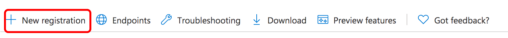

# E-mailmelding configureren{#configuring-email-notification}

AEM stuurt e-mailmeldingen naar gebruikers die:

* Hebt u zich op paginagebeurtenissen geabonneerd, bijvoorbeeld, wijziging of replicatie. De [&#x200B; Inbox van het Bericht &#x200B;](/help/sites-classic-ui-authoring/author-env-inbox.md#subscribing-to-notifications) sectie beschrijft hoe te aan dergelijke gebeurtenissen in te tekenen.

* Hebt u zich geabonneerd op forumgebeurtenissen.
* Een stap in een werkstroom uitvoeren. De [&#x200B; sectie van de Stap van de Deelnemer &#x200B;](/help/sites-developing/workflows-step-ref.md#participant-step) beschrijft hoe te om e-mailbericht in een werkschema teweeg te brengen.

Voorwaarden:

* Voor de gebruiker(s) moet(en) een geldig e-mailadres zijn gedefinieerd in dit profiel.
* De **Dienst van de Post CQ van de Dag** moet behoorlijk worden gevormd.

Wanneer een gebruiker op de hoogte wordt gesteld, ontvangt hij een e-mail in de taal die in zijn profiel wordt bepaald. Elke taal heeft zijn eigen malplaatje dat kan worden aangepast. U kunt nieuwe e-mailsjablonen toevoegen voor nieuwe talen.

>[!NOTE]
>
>Wanneer het werken met AEM, zijn er verscheidene methodes om de configuratiemontages voor dergelijke diensten te beheren; zie [&#x200B; Vormend OSGi &#x200B;](/help/sites-deploying/configuring-osgi.md) voor meer details en de geadviseerde praktijken.

## De e-mailservice configureren {#configuring-the-mail-service}

Voor AEM om e-mail te kunnen verzenden, moet de **Dienst van de Post van CQ van de Dag** behoorlijk worden gevormd. U kunt de configuratie in de console van het Web bekijken. Wanneer het werken met AEM, zijn er verscheidene methodes om de configuratiemontages voor dergelijke diensten te beheren; zie [&#x200B; Vormend OSGi &#x200B;](/help/sites-deploying/configuring-osgi.md) voor meer details en de geadviseerde praktijken.

De volgende beperkingen zijn van toepassing:

* De **SMTP serverhaven** moet 25 of hoger zijn.

* De **SMTP naam van de servergastheer** moet niet leeg zijn.
* Het **&quot;van&quot;adres** moet niet leeg zijn en u moet de standaardwaarde &quot;<noreply@day.com>&quot;veranderen.

Om u te helpen een kwestie met de **Dienst van de Post van de Dag CQ** zuiveren, kunt u op de logboeken van de dienst letten:

`com.day.cq.mailer.DefaultMailService`

De configuratie kijkt als volgt in de console van het Web:


## Het kanaal voor e-mailmeldingen configureren {#configuring-the-email-notification-channel}

Wanneer u zich abonneert op berichten voor pagina- of forumgebeurtenissen, wordt het e-mailadres van het formulier standaard ingesteld op `no-reply@acme.com` . U kunt deze waarde veranderen door de **E-maildienst van het Bericht E-mailKanaal** in de Console van het Web te vormen.

Als u het e-mailadres wilt configureren, voegt u een knooppunt `sling:OsgiConfig` toe aan de gegevensopslagruimte. Gebruik de volgende procedure om het knooppunt rechtstreeks met CRXDE Lite toe te voegen:

1. Voeg in CRXDE Lite een map met de naam `config` onder de toepassingsmap toe.
1. Voeg in de configuratiemap een knooppunt met de naam:

   `com.day.cq.wcm.notification.email.impl.EmailChannel` van type `sling:OsgiConfig`

1. Voeg een eigenschap `String` toe aan het knooppunt met de naam `email.from` . Geef voor de waarde het e-mailadres op dat u wilt gebruiken.

1. Klik **sparen allen**.

Gebruik de volgende procedure om het knooppunt in de bronmappen van het inhoudspakket te definiëren:

1. Maak in uw `jcr_root/apps/*app_name*/config folder` een bestand met de naam `com.day.cq.wcm.notification.email.impl.EmailChannel.xml`

1. Voeg de volgende XML toe om het knooppunt te vertegenwoordigen:

   `<?xml version="1.0" encoding="UTF-8"?> <jcr:root xmlns:sling="https://sling.apache.org/jcr/sling/1.0" xmlns:jcr="https://www.jcp.org/jcr/1.0" jcr:primaryType="sling:OsgiConfig" email.from="name@server.com"/>`
1. Vervang de waarde van het kenmerk `email.from` ( `name@server.com` ) door uw e-mailadres.

1. Sla het bestand op.

## De Workflow Email Notification Service configureren {#configuring-the-workflow-email-notification-service}

Wanneer u e-mailmeldingen over de workflow ontvangt, worden zowel het adres van de e-mail als het URL-voorvoegsel van de host ingesteld op standaardwaarden. U kunt deze waarden veranderen door de **Dienst van het Bericht E-mail van het Bericht van het Werkschema van CQ van de Dag te vormen** in de Console van het Web. Als u dat doet, moet u de wijziging in de opslagplaats voortzetten.

De standaardconfiguratie kijkt als volgt in de Console van het Web:


### E-mailsjablonen voor paginamelding {#email-templates-for-page-notification}

De e-mailsjablonen voor paginaberichten staan hieronder:

`/libs/settings/notification-templates/com.day.cq.wcm.core.page`

De standaard Engelse sjabloon ( `en.txt`) wordt als volgt gedefinieerd:

```xml
subject=[CQ Page Event Notification]: Page Event

header=-------------------------------------------------------------------------------------\n \
Time: ${time}\n \
User: ${userFullName} (${userId})\n \
-------------------------------------------------------------------------------------\n\n

message=The following pages were affected by the event: \n \
 \n \
${modifications} \n \
 \n\n
footer=\n \
-------------------------------------------------------------------------------------\n \
This is an automatically generated message. Please do not reply.
```

#### E-mailsjablonen aanpassen voor paginamelding {#customizing-email-templates-for-page-notification}

U kunt als volgt de Engelse e-mailsjabloon voor paginabeldingen aanpassen:

1. Creeer een bedekking voor [&#x200B; de berichten van de Pagina &#x200B;](/help/sites-deploying/sites-repository-restructuring-in-aem-6-5.md#page-event-notification-e-mail-template)

1. Open het bestand:

   `en.txt`

1. Wijzig het bestand naar wens.
1. Sla de wijzigingen op.

De sjabloon moet de volgende indeling hebben:

```
 subject=<text_1>
 header=<text_2>
 message=<text_3>
 footer=<text_4>
```

Hierbij kan &lt;text_x> bestaan uit een combinatie van statische tekst en dynamische tekenreeksvariabelen. De volgende variabelen kunnen in de e-mailsjabloon voor paginaberichten worden gebruikt:

* `${time}` , de datum en tijd van de gebeurtenis.

* `${userFullName}` , de volledige naam van de gebruiker die de gebeurtenis heeft geactiveerd.

* `${userId}` , de id van de gebruiker die de gebeurtenis heeft geactiveerd.
* In `${modifications}` worden het type paginagebeurtenis en het paginapad in de notatie beschreven:

  &lt;page event type> => &lt;page path>

  Bijvoorbeeld:

  PageModified => /content/geometrixx/nl/products

### E-mailsjablonen voor workflowmelding {#email-templates-for-workflow-notification}

Het e-mailsjabloon voor workflowmeldingen (Engels) bevindt zich op:

`/libs/settings/workflow/notification/email/default/en.txt`

Het wordt als volgt gedefinieerd:

```xml
subject=Workflow notification: ${event.EventType}

header=-------------------------------------------------------------------------------------\n \
Time: ${event.TimeStamp}\n \
Step: ${item.node.title}\n \
User: ${participant.name} (${participant.id})\n \
Workflow: ${model.title}\n \
-------------------------------------------------------------------------------------\n\n

message=Content: ${host.prefix}${payload.path.open}\n

footer=\n \
-------------------------------------------------------------------------------------\n \
View the overview in your ${host.prefix}/aem/inbox\n \
-------------------------------------------------------------------------------------\n \
This is an automatically generated message. Please do not reply.
```

#### E-mailsjablonen aanpassen voor workflowmelding {#customizing-email-templates-for-workflow-notification}

U kunt als volgt de Engelse e-mailsjabloon voor workflowgebeurtenismeldingen aanpassen:

1. Creeer een bedekking voor [&#x200B; berichten van het Werkschema &#x200B;](/help/sites-deploying/all-repository-restructuring-in-aem-6-5.md#workflow-notification-email-templates)

1. Open het bestand:

   `en.txt`

1. Wijzig het bestand naar wens.
1. Sla de wijzigingen op.

De sjabloon moet de volgende indeling hebben:

```
subject=<text_1>
 header=<text_2>
 message=<text_3>
 footer=<text_4>
```

>[!NOTE]
>
>Waar `<text_x>` een combinatie van statische tekst en dynamische tekenreeksvariabelen kan zijn. Elke regel van een `<text_x>` -item moet worden beëindigd met een backslash ( `\` ), behalve de laatste instantie wanneer de afwezigheid van de backslash het einde van de tekenreeksvariabele `<text_x>` aangeeft.
>
>Meer informatie over het malplaatjeformaat kan in [&#x200B; worden gevonden javadocs van Properties.load () &#x200B;](https://docs.oracle.com/javase/8/docs/api/java/util/Properties.html#load-java.io.InputStream-) methode.

De methode `${payload.path.open}` onthult het pad naar de lading van het werkitem. Voor een pagina in Sites zou `payload.path.open` bijvoorbeeld vergelijkbaar zijn met `/bin/wcmcommand?cmd=open&path=…` .; dit is zonder de servernaam, en daarom voegt de malplaatje dit met `${host.prefix}` voor.

De volgende variabelen kunnen binnen het e-mailmalplaatje worden gebruikt:

* `${event.EventType}` , type gebeurtenis
* `${event.TimeStamp}` , datum en tijd van de gebeurtenis
* `${event.User}` , de gebruiker die de gebeurtenis heeft geactiveerd
* `${initiator.home}` , het pad naar het initiatorknooppunt

* `${initiator.name}` , de initiatornaam

* `${initiator.email}` , e-mailadres van de aanvrager
* `${item.id}`, de id van het werkitem
* `${item.node.id}` , id van het knooppunt in het workflowmodel dat aan dit werkitem is gekoppeld
* `${item.node.title}`, titel van het werkitem
* `${participant.email}` , e-mailadres van de deelnemer
* `${participant.name}`, naam van de deelnemer
* `${participant.familyName}`, familienaam van de deelnemer
* `${participant.id}`, id van de deelnemer
* `${participant.language}` , de taal van de deelnemer
* `${instance.id}` , de workflow-id
* `${instance.state}` , de workflowstatus
* `${model.title}` , titel van het workflowmodel
* `${model.id}` , de id van het workflowmodel

* `${model.version}` , de versie van het workflowmodel
* `${payload.data}` , de payload

* `${payload.type}` , het ladingstype
* `${payload.path}` , pad van de lading
* `${host.prefix}` , hostvoorvoegsel, bijvoorbeeld: `http://localhost:4502`

### Een e-mailsjabloon toevoegen voor een nieuwe taal {#adding-an-email-template-for-a-new-language}

Een sjabloon toevoegen voor een nieuwe taal:

1. Creeer een [&#x200B; bekleding &#x200B;](/help/sites-developing/overlays.md) zoals aangewezen.

   * [Paginameldingen](/help/sites-deploying/sites-repository-restructuring-in-aem-6-5.md#page-event-notification-e-mail-template)
   * [Workflowmeldingen](/help/sites-deploying/all-repository-restructuring-in-aem-6-5.md#workflow-notification-email-templates)

1. Voeg een bestand toe `<language-code>.txt`.
1. Pas het bestand aan de taal aan.
1. Sla de wijzigingen op.

>[!NOTE]
>
>De `<language-code>` die als bestandsnaam voor de e-mailsjabloon wordt gebruikt, moet een taalcode in kleine letters zijn die door AEM wordt herkend. AEM is voor taalcodes afhankelijk van ISO-639-1.

## E-mailberichten voor AEM Assets configureren {#assetsconfig}

Wanneer Verzamelingen in AEM Assets worden gedeeld of niet gedeeld, kunnen gebruikers e-mailberichten van AEM ontvangen. Voer de volgende stappen uit om e-mailmeldingen te configureren.

1. Vorm de e-maildienst, zoals hierboven beschreven in [&#x200B; Vormend de Dienst van de Post &#x200B;](/help/sites-administering/notification.md#configuring-the-mail-service).
1. Meld u als beheerder aan bij AEM. Klik **Hulpmiddelen** > **Verrichtingen** > **Console van het Web** om de Configuratie van de Console van het Web te openen.
1. Bewerk **DAM Server van de Inzameling van het Middel van de Dag CQ DAM**. Selecteer **verzenden e-mail**. Klik **sparen**.

## OAuth instellen {#setting-up-oauth}

AEM biedt OAuth2-ondersteuning voor de geïntegreerde Mailer Service, zodat organisaties zich kunnen houden aan de vereisten voor beveiligde e-mail.

U kunt OAuth configureren voor meerdere e-mailproviders, zoals hieronder wordt beschreven.

>[!NOTE]
>
>Deze procedure is een voorbeeld voor een instantie Publish. Als u e-mailmeldingen wilt inschakelen voor een auteur, moet u dezelfde stappen uitvoeren voor de auteur.

### Gmail {#gmail}

1. Uw project maken op `https://console.developers.google.com/projectcreate`
1. Selecteer uw project, dan ga naar **APIs &amp; de Diensten** - **Dashboard - Referenties**
1. Configureer het scherm voor OAuth-instemming naar wens
1. Voeg de volgende twee bereiken toe in het scherm Bijwerken:
   * `https://mail.google.com/`
   * `https://www.googleapis.com//auth/gmail.send`
1. Zodra u het werkingsgebied hebt toegevoegd, ga terug naar **Geloofsbrieven** in het linkerhandmenu, dan ga **Geloofsbrieven** creëren - **identiteitskaart van de Cliënt OAuth** - **Desktop app**
1. Er wordt een nieuw venster geopend met daarin de client-id en het clientgeheim.
1. Sla deze gegevens op.

**de Zijconfiguraties van AEM**

>[!NOTE]
>
>Adobe Managed Service-klanten kunnen met hun Customer Service Engineer samenwerken om deze wijzigingen aan te brengen in productieomgevingen.

Eerst, vorm de Dienst van de Post:

1. Open de AEM-webconsole op `http://serveraddress:serverport/system/console/configMgr`
1. Zoek, dan klik de **Dienst van de Post van 0&rbrace; Dag CQ &lbrace;**
1. Voeg de volgende instellingen toe:
   * SMTP-serverhostnaam: `smtp.gmail.com`
   * SMTP-serverpoort: `25` of `587` , afhankelijk van de vereisten
   * Controle de vakjes voor **SMPT gebruik StarTLS** en **SMTP vereist StarTLS**
   * Controle **OAuth stroom** en klik **sparen**.

Daarna, vorm uw leverancier SMTP OAuth door de hieronder procedure te volgen:

>[!WARNING]
>
>Als, na de voltooiing van deze configuratie, u **&#x200B; van de waarden in de configuratie OSGi &#x200B;** CQ van de Aannemer SMTP OAuth2** ooit verandert, dan moet u opnieuw na deze stappen opnieuw machtigen.
>
>Als deze niet worden uitgevoerd, zal het toegangstoken dat bij `/conf/global/settings/mailer/oauth` wordt opgeslagen ongeldig zijn en de verbinding OAuth2 aan de server SMTP zal ontbreken.

1. Open de AEM-webconsole op `http://serveraddress:serverport/system/console/configMgr`
1. Zoek, dan klik **de Wijze SMTP OAuth2 Leverancier van de Aannemer CQ**

1. Vul de vereiste informatie als volgt in:
   * Autorisatie-URL: `https://accounts.google.com/o/oauth2/auth`
   * Token-URL: `https://accounts.google.com/o/oauth2/token`
   * Bereiken: `https://www.googleapis.com/auth/gmail.send` en `https://mail.google.com/` . U kunt meer dan één werkingsgebied toevoegen door de **+** knoop aan de rechterkant van elk gevormd werkingsgebied te drukken.
   * Client ID and Client Secret: configureer deze velden met de waarden die u hebt opgehaald, zoals beschreven in de bovenstaande alinea.
   * Token-URL vernieuwen: `https://accounts.google.com/o/oauth2/token`
   * Vervaldatum token vernieuwen: nooit
1. Klik **sparen**.

<!-- clarify refresh token expiry, currently not present in the UI -->

Zodra gevormd, zouden de montages als dit moeten kijken:


Activeer nu de OAuth-componenten. U kunt dit doen door:

1. Ga naar de Componentenconsole door naar deze URL te gaan: `http://serveraddress:serverport/system/console/components`
1. De volgende componenten zoeken
   * `com.day.cq.mailer.oauth.servlets.handler.OAuthCodeGenerateServlet`
   * `com.day.cq.mailer.oauth.servlets.handler.OAuthCodeAccessTokenGenerator`
1. Druk het pictogram van het Spel links van de componenten

   

Bevestig ten slotte de configuratie door:

1. Ga naar het adres van de instantie Publiceren en meld u aan als beheerder.
1. Open een nieuw tabblad in de browser en ga naar `http://serveraddress:serverport/services/mailer/oauth2/authorize` . Dit zal u aan de pagina van uw leverancier SMTP, in dit geval Gmail opnieuw richten.
1. Aanmelding en toestemming voor het verlenen van de vereiste machtigingen
1. Na instemming wordt het token opgeslagen in de opslagplaats. U hebt toegang tot de URL onder `accessToken` door deze URL rechtstreeks te openen in uw publicatieexemplaar: `http://serveraddress:serverport/crx/de/index.jsp#/conf/global/settings/mailer/oauth`
1. Het bovenstaande voor elke publicatie-instantie herhalen

<!-- clarify if the ip/server address in the last procedure is that of the publish instance -->

### Microsoft Outlook {#microsoft-outlook}

1. Ga naar [&#x200B; https://portal.azure.com/ &#x200B;](https://portal.azure.com/) en login.
1. Onderzoek naar **Azure Actieve Folder** in de onderzoeksbar en klik het resultaat. Alternatief, kunt u direct aan [&#x200B; https://portal.azure.com/#blade/Microsoft_AAD_IAM/ActiveDirectoryMenuBlade/Overview &#x200B;](https://portal.azure.com/#blade/Microsoft_AAD_IAM/ActiveDirectoryMenuBlade/Overview) doorbladeren
1. Klik op **Registratie van de Toepassing** - **Nieuwe Registratie**

   

1. Vul de informatie volgens uw vereisten in, dan klik **Register**
1. Ga naar pas gecreëerde app, en selecteer **API Toestemmingen**
1. Ga naar **Add Toestemming** - **Toestemming van de Grafiek** - **Gedelegeerde Toestemmingen**
1. Selecteer de hieronder toestemmingen voor uw app, dan klik **toevoegen Toestemming**:
   * `SMTP.Send`
   * `Mail.Read`
   * `Mail.Send`
   * `openid`
   * `offline_access`
1. Ga naar **Authentificatie** - **voeg een platform** toe - **Web**, en in de **Redirect Urls** sectie, voeg volgende URL voor het opnieuw richten van de code OAuth toe, dan druk **&#x200B;**&#x200B;vormt:
   * `http://localhost:4503/services/mailer/oauth2/token`
1. Het bovenstaande voor elke publicatie-instantie herhalen
1. Configureer de instellingen volgens uw vereisten
1. Daarna, ga naar **Certificaten en geheimen**, klik **Nieuw cliëntgeheim** en volg de op het scherm stappen om een geheim tot stand te brengen. Let op dit geheim voor later gebruik
1. Pers **Overzicht** in de linkerhand ruit en kopieer de waarden voor **identiteitskaart van de Toepassing (cliënt)** en **Folder (huurder) identiteitskaart** voor recenter gebruik

Om opnieuw te verpakken, moet u de volgende informatie hebben om OAuth2 voor de dienst van de Aannemer op de kant van AEM te vormen:

* Auth URL, die met huurderidentiteitskaart zal worden geconstrueerd. Het heeft de volgende vorm: `https://login.microsoftonline.com/<tenantID>/oauth2/v2.0/authorize`
* De token-URL, die wordt samengesteld met de huurder-id. Het heeft de volgende vorm: `https://login.microsoftonline.com/<tenantID>/oauth2/v2.0/token`
* Vernieuwen URL, die met huurder identiteitskaart zal worden geconstrueerd. Het heeft de volgende vorm: `https://login.microsoftonline.com/<tenantID>/oauth2/v2.0/token`
* Client-id
* Het clientgeheim

**de Zijconfiguraties van AEM**

Vervolgens integreert u uw OAuth2-instellingen met AEM:

>[!WARNING]
>
>Als, na de voltooiing van deze configuratie, u **&#x200B; van de waarden in de configuratie OSGi &#x200B;** CQ van de Aannemer SMTP OAuth2** ooit verandert, dan moet u opnieuw na deze stappen opnieuw machtigen.
>
>Als deze niet worden uitgevoerd, zal het toegangstoken dat bij `/conf/global/settings/mailer/oauth` wordt opgeslagen ongeldig zijn en de verbinding OAuth2 aan de server SMTP zal ontbreken.

1. Ga naar de webconsole van uw lokale instantie door naar `http://serveraddress:serverport/system/console/configMgr` te bladeren
1. Zoek en klik {de Dienst van de Post van 0} Dag CQ **&#x200B;**
1. Voeg de volgende instellingen toe:
   * SMTP-serverhostnaam: `smtp.office365.com`
   * SMTP-gebruiker: uw gebruikersnaam in e-mailindeling
   * Het adres &#39;Van&#39;: Het e-mailadres dat moet worden gebruikt in het veld &#39;Van:&#39; van berichten die door de mailer worden verzonden
   * SMTP-serverpoort: `25` of `587` afhankelijk van de vereisten
   * Controle de vakjes voor **SMPT gebruik StarTLS** en **SMTP vereist StarTLS**
   * Controle **OAuth stroom** en klik **sparen**.
1. Zoek, dan klik **de Wijze SMTP OAuth2 Leverancier van de Aannemer CQ**
1. Vul de vereiste informatie als volgt in:
   * Vul in Url van de Vergunning, Symbolische Url en verfris Symbolische URL door hen te construeren zoals die bij [&#x200B; het eind van deze procedure &#x200B;](#microsoft-outlook) worden beschreven
   * Clientid en clientgeheim: configureer deze velden met de waarden die u hebt opgehaald zoals hierboven beschreven.
   * Voeg de volgende Scopes aan de configuratie toe:
      * openhartig
      * offline_access
      * `https://outlook.office365.com/Mail.Send`
      * `https://outlook.office365.com/Mail.Read`
      * `https://outlook.office365.com/SMTP.Send`
   * AuthCode Redirect URL: `http://localhost:4503/services/mailer/oauth2/token`
   * Token-URL vernieuwen: deze moet dezelfde waarde hebben als de bovenstaande token-URL
1. Klik **sparen**.

Zodra gevormd, zouden de montages als dit moeten kijken:


Activeer nu de OAuth-componenten. U kunt dit doen door:

1. Ga naar de Componentenconsole door naar deze URL te gaan: `http://serveraddress:serverport/system/console/components`
1. De volgende componenten zoeken
   * `com.day.cq.mailer.oauth.servlets.handler.OAuthCodeGenerateServlet`
   * `com.day.cq.mailer.oauth.servlets.handler.OAuthCodeAccessTokenGenerator`
1. Druk het pictogram van het Spel links van de componenten

 bevat

Bevestig ten slotte de configuratie door:

1. Ga naar het adres van de instantie Publiceren en meld u aan als beheerder.
1. Open een nieuw tabblad in de browser en ga naar `http://serveraddress:serverport/services/mailer/oauth2/authorize` . Dit zal u aan de pagina van uw leverancier SMTP, in dit geval Vooruitzichten opnieuw richten.
1. Aanmelding en toestemming voor het verlenen van de vereiste machtigingen
1. Na instemming wordt het token opgeslagen in de opslagplaats. U hebt toegang tot de URL onder `accessToken` door deze URL rechtstreeks te openen in uw publicatieexemplaar: `http://serveraddress:serverport/crx/de/index.jsp#/conf/global/settings/mailer/oauth`
